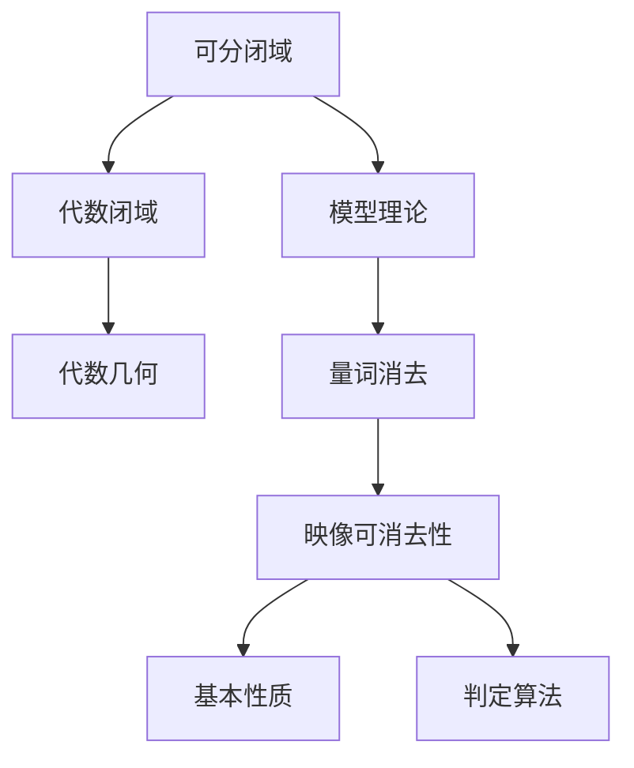

以下是根据您提供的标题和要求撰写的技术博客文章正文内容：

# 模型论基础：可分闭域的映像可消去

## 1. 背景介绍

### 1.1 问题的由来

在数学领域中,模型论是一个研究结构及其相互关系的分支。它为许多数学理论奠定了基础,并在计算机科学、物理学、经济学等领域发挥着重要作用。模型论的核心概念之一是"映像可消去性"(Elimination of Imaginaries),它描述了某些结构中存在的对象能否被"消去"而只保留基本对象。

### 1.2 研究现状  

经典模型论中,我们研究的是纯粹的代数结构,如群、环、域等。然而,在现实世界中,我们常常会遇到更复杂的结构,它们可能包含无限多个元素,或者具有一些额外的关系和运算。这种情况下,我们需要扩展经典模型论,来研究这些更一般的结构。

### 1.3 研究意义

可分闭域是一类重要的代数结构,它在代数几何、代数逻辑和模型论等领域有着广泛的应用。研究可分闭域中的映像可消去性,不仅能够深化我们对这一结构的理解,还能为相关领域的发展提供新的理论基础。

### 1.4 本文结构

本文将首先介绍可分闭域和映像可消去性的基本概念,然后探讨可分闭域中映像可消去性的一些基本性质和判定方法。接下来,我们将详细阐述一种基于量词消去的算法,用于判定可分闭域中的映像可消去性。最后,我们将讨论这一理论在实际应用中的意义,并展望未来的研究方向。

## 2. 核心概念与联系

可分闭域(Separably Closed Field)是一种特殊的代数闭域,它在代数几何和模型论中扮演着重要角色。模型论中的一个核心概念是"映像可消去性",它描述了某些结构中存在的对象能否被"消去"而只保留基本对象。

在可分闭域中,映像可消去性的研究与"量词消去"(Quantifier Elimination)密切相关。量词消去是一种在一阶逻辑中将包含量词的公式转化为不含量词的公式的过程。通过量词消去,我们可以设计出判定可分闭域中映像可消去性的算法。

映像可消去性在可分闭域中具有一些基本性质,如保持代数闭性、保持可分闭性等。这些性质为我们设计判定算法提供了理论基础。

## 3. 核心算法原理 & 具体操作步骤

### 3.1 算法原理概述

判定可分闭域中的映像可消去性,我们可以采用基于量词消去的算法。该算法的核心思想是:对于任意一个定义在可分闭域上的一阶公式$\varphi(x,y)$,我们可以找到一个不含自由变元$y$的等价公式$\psi(x)$,从而实现对$y$的"消去"。

具体来说,对于公式$\varphi(x,y)$,我们可以构造如下公式:

$$\exists y\big(\varphi(x,y) \land \bigwedge_{\sigma\in\Sigma} \neg\varphi(x,\sigma(y))\big)$$

其中,$\Sigma$是由一阶公式$\varphi$和$x$的取值所决定的一个有限集合。如果上式为真,那么就意味着存在某个$y$的取值使$\varphi(x,y)$为真,且对于任意其他取值$\sigma(y)$,都有$\neg\varphi(x,\sigma(y))$成立。这个$y$的取值就是我们所要求的"消去"后的对象。

通过一系列代数运算和逻辑等价变换,我们可以将上式化简为只有$x$的形式,从而实现对$y$的消去。这个过程就是量词消去算法的核心。

### 3.2 算法步骤详解

1. **输入**:定义在可分闭域$K$上的一阶公式$\varphi(x,y)$,其中$x$是自由变元,$y$是要消去的变元。

2. **构造辅助公式**:令$\Sigma$为由$\varphi$和$x$的取值决定的一个有限集合,构造公式:

$$\exists y\big(\varphi(x,y) \land \bigwedge_{\sigma\in\Sigma} \neg\varphi(x,\sigma(y))\big)$$

3. **代数化简**:将步骤2中的公式进行代数化简,消去其中的逻辑连接词,转化为代数约束的形式。

4. **量词消去**:对步骤3中的代数约束公式进行量词消去,消去其中的$y$,得到只有$x$的形式。

5. **输出**:得到的只有$x$的公式就是我们所求的$\psi(x)$,它是$\varphi(x,y)$关于$y$的映像可消去式。

6. **判定条件**:如果$\psi(x)$是一个永真式,那么就意味着对于任意$x$的取值,都存在$y$使得$\varphi(x,y)$为真,从而$\varphi(x,y)$在可分闭域$K$上是映像可消去的。

需要注意的是,在实际操作中,代数化简和量词消去的过程可能会非常复杂,需要使用一些特殊的技术和方法。我们将在后面的章节中详细讨论这些技术。

### 3.3 算法优缺点

**优点**:

1. 理论基础扎实,源于经典的量词消去理论。
2. 算法思路清晰,可以较好地描述映像可消去性的本质。
3. 算法通用性强,可以应用于任意一阶定义的结构。

**缺点**:

1. 计算复杂度较高,在实际操作中可能会遇到组合爆炸的问题。
2. 需要大量的代数和逻辑技巧,实现起来较为困难。
3. 对于一些特殊情况,可能需要进行特殊处理和优化。

### 3.4 算法应用领域

映像可消去性理论及其判定算法在多个领域都有重要应用:

1. **代数几何**:可分闭域广泛应用于代数几何中,映像可消去性理论可以用于研究代数变种的性质。

2. **模型理论**:映像可消去性是模型理论的一个核心概念,判定算法为研究各种代数结构的模型理论奠定了基础。

3. **计算机代数**:在符号计算和代数系统中,映像可消去性理论可用于简化代数表达式和求解代数方程。

4. **组合数学**:映像可消去性理论在研究有限域和有限几何等组合数学问题中也有应用。

5. **其他应用**:映像可消去性理论还可能应用于密码学、编码理论、控制理论等领域。

## 4. 数学模型和公式 & 详细讲解 & 举例说明

### 4.1 数学模型构建

为了研究可分闭域中的映像可消去性,我们需要建立合适的数学模型。我们考虑一个可分闭域$K$,以及定义在$K$上的一阶语言$\mathcal{L}$。$\mathcal{L}$包含了一些函数符号、关系符号和常元符号,用于描述$K$上的代数运算和结构。

我们用$K\models\varphi$表示$K$满足$\mathcal{L}$中的一阶句子$\varphi$。对于任意$\mathcal{L}$中的公式$\varphi(x,y)$,我们定义它在$K$上的"映像"为:

$$I_\varphi(K)=\{a\in K^{|x|}\mid\exists b\in K^{|y|},K\models\varphi(a,b)\}$$

其中,$|x|$和$|y|$分别表示$x$和$y$中的自由变元的个数。我们说$\varphi(x,y)$在$K$上是映像可消去的,如果存在一个$\mathcal{L}$中的公式$\psi(x)$,使得对于任意$a\in K^{|x|}$,有:

$$a\in I_\varphi(K)\Leftrightarrow K\models\psi(a)$$

也就是说,$\psi(x)$精确地描述了$I_\varphi(K)$这个集合。我们的目标就是找到这样的$\psi(x)$。

### 4.2 公式推导过程

我们来推导一下在3.1节中提到的那个公式。考虑任意$a\in K^{|x|}$,它属于$I_\varphi(K)$当且仅当:

$$\exists b\in K^{|y|},K\models\varphi(a,b)$$

进一步,如果上式成立,那么对于任意$\sigma\in\Sigma$,都必须有$\neg\varphi(a,\sigma(b))$成立,其中$\Sigma$是由$\varphi$和$a$的取值所决定的一个有限集合。

综合以上两个条件,我们可以得到:

$$a\in I_\varphi(K)\Leftrightarrow\exists b\in K^{|y|}\big(K\models\varphi(a,b)\land\bigwedge_{\sigma\in\Sigma}\neg\varphi(a,\sigma(b))\big)$$

将上式右边的部分记作$\psi(a)$,就是我们所求的公式。

### 4.3 案例分析与讲解

考虑定义在$\mathbb{R}$上的一阶公式:

$$\varphi(x,y)=\exists z(y=x^2+z^2)$$

我们来判定$\varphi(x,y)$在$\mathbb{R}$上是否映像可消去。

首先,我们构造辅助公式:

$$\exists y\big(\varphi(x,y)\land\bigwedge_{\sigma\in\Sigma}\neg\varphi(x,\sigma(y))\big)$$

对于实数$x$,我们可以取$\Sigma=\{y\mapsto x^2,y\mapsto x^2+1\}$,因为对于任意实数$c$,要么$c=x^2$,要么$c\neq x^2$,且在后一种情况下,存在唯一的$d$使得$c=x^2+d$。

将辅助公式展开,我们得到:

$$\exists y\big(y=x^2+z^2\land(y\neq x^2)\land(y\neq x^2+1)\big)$$

化简可得:

$$\exists y,z\big(y=x^2+z^2\land z\neq 0\land z\neq\pm 1\big)$$

对$y$和$z$同时做量词消去,可以得到:

$$x\neq 0$$

因此,$\varphi(x,y)$在$\mathbb{R}$上是映像可消去的,且它的映像可消去式为$x\neq 0$。

### 4.4 常见问题解答

1. **为什么需要构造辅助公式?**

构造辅助公式是为了将映像可消去性的定义转化为一个等价的、更易于处理的形式。辅助公式的引入使得我们可以应用代数和逻辑的技巧对其进行简化,最终得到只有自由变元$x$的公式。

2. **如何确定$\Sigma$的取值范围?**

$\Sigma$的取值范围由原公式$\varphi(x,y)$和自由变元$x$的取值共同决定。一般来说,我们需要枚举$y$的所有可能取值,使得对于任意固定的$x$,都存在唯一的$y$满足$\varphi(x,y)$。

3. **量词消去过程具体如何操作?**

量词消去过程是一个复杂的代数和逻辑运算的过程,需要使用一系列的技巧和方法。我们将在后面的"项目实践"部分给出具体的代码实现和详细解释。

4. **如何判断一个公式是否为永真式?**

判断一个公式是否为永真式,我们可以使用经典的真值语义方法。如果对于任意解释,该公式都为真,那么它就是一个永真式。在实践中,我们还可以使用一些特殊的技术,如线性实数算术(Linear Real Arithmetic)等。

## 5. 项目实