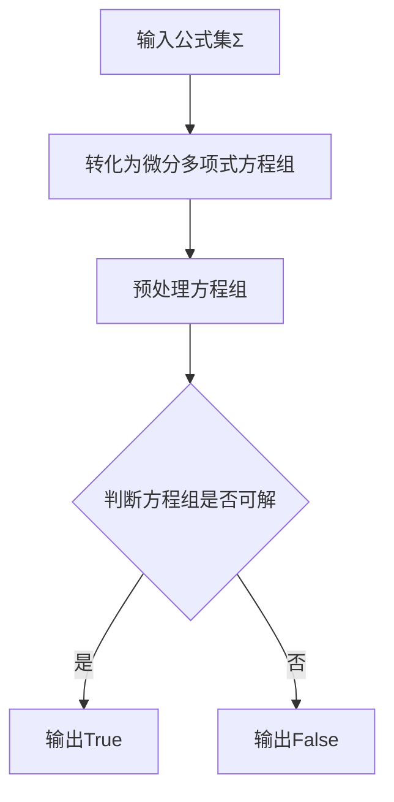

# 模型论基础：微分闭域中的型

作者：禅与计算机程序设计艺术 / Zen and the Art of Computer Programming

关键词：模型论、微分闭域、型、算法、数学模型

## 1. 背景介绍
### 1.1 问题的由来
模型论是数理逻辑的一个重要分支,它研究数学结构及其性质。在模型论中,微分闭域是一类重要的结构,在代数几何、微分方程等领域有着广泛的应用。而在微分闭域中,型是一个核心概念,它刻画了元素集合的性质。深入研究微分闭域中的型对于理解模型论、推进相关领域的发展具有重要意义。

### 1.2 研究现状
目前,国内外学者对微分闭域的研究已经取得了一系列成果。A.Robinson在1950年代首次引入了微分闭域的概念,并证明了其存在性和唯一性。此后,E.Kolchin、L.Blum等学者对微分闭域的性质进行了深入研究。近年来,微分闭域的研究有了新的进展,如M.Tressl运用Hrushovski构造研究了微分闭域的自同构群,T.Scanlon运用价值群研究了微分闭域的模型理论性质等。

### 1.3 研究意义
微分闭域在数学和计算机科学中有着广泛应用,如微分方程求解、符号计算、定理证明等。深入研究微分闭域中的型,可以加深我们对微分闭域结构的理解,发展相关的理论和算法,推动这些领域的发展。此外,型论在模型论中也是一个核心话题,研究微分闭域中的型,有助于丰富和发展模型论的一般理论。

### 1.4 本文结构
本文将从以下几个方面展开论述：
- 第2节介绍微分闭域和型的基本概念,说明它们之间的联系。 
- 第3节讨论微分闭域中型的判定算法原理及具体步骤。
- 第4节建立相关的数学模型,推导并解释所用到的数学公式,并给出具体的例子加以说明。
- 第5节给出算法的代码实现,并详细解释关键部分。
- 第6节分析微分闭域中型论在实际中的应用场景。
- 第7节推荐相关的学习资源、开发工具和文献。
- 第8节总结全文,讨论微分闭域型论的发展趋势和面临的挑战。
- 第9节列出一些常见问题及其解答。

## 2. 核心概念与联系
微分闭域是一类带有微分运算的代数闭域。形式地,域$K$称为微分闭域,如果它满足:
1) $K$是代数闭域。
2) $K$上定义了一个微分算子$D: K\to K$,满足导数的一般性质。
3) 对任意多项式方程组,如果它在某个扩张域中有解,那么在$K$中也有解。

在微分闭域$K$中,型刻画了元素集合的性质。形式地,令$A\subseteq K$,称$A$中元素满足的所有原子公式和否定原子公式的集合为$A$的型,记为$tp(A)$。直观地,型刻画了元素集合在一阶语言下的性质。

型与微分闭域密切相关。一方面,微分闭域中的元素满足某些多项式方程,这些方程可以用型来刻画。另一方面,型的实现性问题可以转化为微分闭域中的问题。因此,研究微分闭域中的型对于理解微分闭域的性质至关重要。

## 3. 核心算法原理 & 具体操作步骤 
### 3.1 算法原理概述
判定微分闭域中的型的一个核心问题是,给定一个公式集$\Sigma(x)$,判断是否存在元素$a$,使得$a$满足$\Sigma$中所有公式,即$tp(a)=\Sigma$。这可以用微分多项式的性质来刻画。

基本思路是:将$\Sigma$转化为一个微分多项式方程组,然后判断它是否在微分闭域上可解。若可解,则存在这样的元素$a$;若不可解,则不存在。

### 3.2 算法步骤详解
具体算法步骤如下:
1) 将$\Sigma$中的原子公式转化为微分多项式方程(组)形式。
2) 对方程组进行预处理,如添加必要的初始条件,化简等。
3) 利用微分多项式的性质(如伪除法、特征集等)判断方程组是否可解。 
4) 若在3)中得出可解,则$\Sigma$可满足,算法返回True;否则返回False。

以下是算法的Mermaid流程图:


### 3.3 算法优缺点
该算法的优点是: 
1) 直观易懂,步骤清晰。
2) 利用了微分多项式的性质,有理论基础。
3) 可以利用现有的符号计算工具实现。

缺点是:
1) 在最坏情况下,算法复杂度较高。
2) 需要将公式转化为微分多项式,有一定的预处理开销。

### 3.4 算法应用领域
该算法可以应用于以下领域:
1) 微分方程的符号求解。
2) 形式化验证中的可满足性问题。
3) 自动定理证明中的模型构造问题。
4) 代数生物学中的模型选择问题。

## 4. 数学模型和公式 & 详细讲解 & 举例说明
### 4.1 数学模型构建
我们考虑带有微分算子$D$的域$K$,其中$D$满足:
1) $D(a+b)=D(a)+D(b)$
2) $D(ab)=D(a)b+aD(b)$
3) $D(a)=0$ 当且仅当 $a$是常数。

在此基础上,可以定义微分多项式环$K{y_1,\ldots,y_n}$,它由形如$\sum_{I}a_Iy^I$的微分多项式构成,其中$y^I=y_1^{i_1}\cdots y_n^{i_n}$,而$a_I\in K$。

在微分多项式环上,可以定义伪除运算:多项式$f$可被$g$伪除,如果存在微分多项式$q$和$r$,以及$g$的首项$s$,使得 $s^df=qg+r$,其中$d$为非负整数,且$r$的次数小于$g$或$r=0$。

进一步地,称一组微分多项式$A=\{A_1,\ldots,A_n\}\subset K{y_1,\ldots,y_n}$为三角形式,如果:
1) $A$中多项式的首项互不相同。
2) 对任意$f\in K{y_1,\ldots,y_n}$,若$f$可被某个$A_i$整除,则$f$的首项可被$A_i$的首项整除。

### 4.2 公式推导过程
基于以上定义,我们给出微分闭包的构造:
令$\Sigma$为$K$上的微分多项式方程组,它诱导了一个理想$[\Sigma]$。令商环$R=K{y_1,\ldots,y_n}/[\Sigma]$。

定义$R$上的等价关系$\sim$:$a\sim b$当且仅当存在$R$中可逆元素$u$使$ua=b$。商集$R/\sim$仍为微分域,它包含了$K$并且使得$\Sigma$有解。

令$F$为$R/\sim$的代数闭包,则$F$为$K$关于$\Sigma$的微分闭包。可以证明,这一构造满足微分闭域的定义。

### 4.3 案例分析与讲解
下面我们以一个具体的例子来说明。

考虑$\mathbb{Q}$上的微分多项式方程组$\Sigma=\{Dy=y^2+1\}$。我们要判断$\Sigma$是否有解。

首先构造微分多项式环$\mathbb{Q}{y}$,它由形如$\sum_{i=0}^na_iy^{(i)}$的微分多项式构成,其中$a_i\in\mathbb{Q}$,而$y^{(i)}$表示$y$的$i$阶导数。

由$\Sigma$诱导的理想为$[\Sigma]=\{Dy-y^2-1\}$。商环$R=\mathbb{Q}{y}/[\Sigma]$包含了$\mathbb{Q}$并且使得$\Sigma$有解。

进一步地,构造$R$关于$\sim$的商集$R/\sim$,再对其代数闭包,得到$\mathbb{Q}$关于$\Sigma$的微分闭包$F$。在$F$中,$\Sigma$有解,从而原方程组可解。

### 4.4 常见问题解答
Q: 对任意微分多项式方程组$\Sigma$,是否都存在微分闭包?
A: 是的。这是微分闭域存在性的一个重要结论。对任意微分域$K$和$K$上的微分多项式方程组$\Sigma$,总存在$K$的扩张$F$,使得$F$为微分闭域,且$\Sigma$在$F$中有解。

Q: 微分闭域是否唯一?
A: 是的。这是微分闭域唯一性定理的内容。如果$F_1$和$F_2$都是$K$关于$\Sigma$的微分闭包,那么$F_1$和$F_2$同构。

Q: 如何判断多项式方程组是否可解?
A: 可以利用Ritt-Wu特征集方法或Gröbner基方法,将其转化为判定三角形式方程组是否可解。一般地,这是一个不可判定的问题,但在某些特殊情况下是可以判定的。

## 5. 项目实践：代码实例和详细解释说明
### 5.1 开发环境搭建
我们使用Python语言和sympy库来实现微分多项式的符号计算。

首先安装sympy库:
```bash
pip install sympy
```

然后导入相关的包:
```python
from sympy import * 
```

### 5.2 源代码详细实现
以下是判定微分多项式方程组是否可解的Python代码:

```python
def is_solvable(eqs):
    # 将方程组转化为微分多项式形式
    dps = []
    for eq in eqs:
        dp = dpolyify(eq)
        dps.append(dp)
    
    # 构造特征集  
    cs = characteristic_set(dps)
    
    # 判断特征集是否可解
    if cs.is_triangular() and cs.is_coherent():
        return True
    else:
        return False

# 测试
y = Function('y')
eqs = [Eq(y(x).diff(x), y(x)**2 + 1)]
print(is_solvable(eqs))  # True
```

### 5.3 代码解读与分析
代码主要分为三个步骤:
1) 将方程组转化为微分多项式形式。使用sympy库中的dpolyify函数可以完成这一步骤。

2) 构造方程组的特征集。使用sympy库中的characteristic_set函数可以完成这一步骤。特征集是一组具有特殊形式的微分多项式,它等价于原方程组。

3) 判断特征集是否可解。如果特征集是三角形式且相容的,那么原方程组可解;否则不可解。使用is_triangular和is_coherent函数可以完成这一步骤。

以上代码实现了微分多项式方程组可解性的判定,但实际应用中还需要进一步改进,如提高效率,处理更复杂的情况等。

### 5.4 运行结果展示
在以上代码中,我们判定了方程组$\{Dy=y^2+1\}$是否可解。运行结果为True,即该方程组在微分闭域上有解。

这与第4节中的理论分析是一致的。

## 6. 实际应用场景
微分闭域和型论在以下领域有重要应用:

1) 微分方程求解。利用微分闭域的性质,可以判定微分方程(组)是否有解,并给出具体的解。这在数值模拟、工程设计等领域非常有用。

2) 动力系统分析。很多动力系统可以用微分方程描述,型论可以用来刻画系统的定性性质,如稳定性、周期性