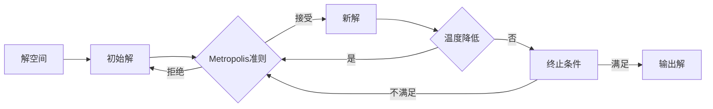

# 模拟退火算法(Simulated Annealing) - 原理与代码实例讲解

关键词：模拟退火算法、优化算法、启发式搜索、Metropolis准则、温度参数、能量函数、状态转移概率、全局最优解、局部最优解

## 1. 背景介绍
### 1.1  问题的由来
在现实世界中,许多问题都可以抽象为在一个复杂的解空间中寻找全局最优解的优化问题。传统的优化算法如梯度下降法,在解决这类问题时容易陷入局部最优,难以跳出并找到全局最优解。模拟退火算法作为一种启发式的随机搜索算法,通过模拟物理中固体退火的过程,以一定的概率接受劣解,从而有效地跳出局部最优,最终趋向全局最优。
### 1.2  研究现状
自1983年Kirkpatrick等人首次提出模拟退火算法以来,其在组合优化、机器学习、人工智能等领域得到了广泛应用。近年来,模拟退火算法及其变体如快速退火算法、量子退火算法等不断涌现,极大地丰富了启发式优化算法的内容。同时,模拟退火算法在解决旅行商问题(TSP)、图着色、函数优化等经典优化问题上展现出了卓越的性能。
### 1.3  研究意义
模拟退火算法作为一种通用的启发式优化算法,对于那些难以用精确算法求解的复杂组合优化和非线性优化问题,能够以相对较低的时间复杂度给出近似最优解,具有重要的理论研究价值。此外,深入理解模拟退火算法的内在机制和编程实现,有助于我们解决实际应用中的优化问题,如生产调度、智能控制、信号处理等。
### 1.4  本文结构
本文将从以下几个方面对模拟退火算法进行深入探讨：第2部分介绍模拟退火算法的核心概念;第3部分详细阐述模拟退火算法的原理和步骤;第4部分建立模拟退火算法的数学模型并推导相关公式;第5部分给出模拟退火算法的代码实现;第6部分讨论模拟退火算法的实际应用;第7部分推荐模拟退火算法的学习资源;第8部分总结全文并展望未来。

## 2. 核心概念与联系
模拟退火算法中有几个核心概念：
- 解空间(Solution Space):问题的所有可行解构成的集合。
- 目标函数(Objective Function):衡量解的质量,希望最小化或最大化的函数。
- 状态(State):当前的解,对应物理系统的微观状态。
- 能量(Energy):状态的目标函数值,对应物理系统的能量。
- 温度(Temperature):控制算法搜索过程,接受劣解的概率随温度降低而减小。
- 状态转移(State Transition):从当前状态到下一状态的转移。
- Metropolis准则:以一定概率接受劣解的准则。

这些概念相互联系,共同构成了模拟退火算法的核心思想。算法从一个初始解出发,不断进行状态转移,根据Metropolis准则决定是否接受新解,并随着温度的降低,最终收敛到全局最优解或近似最优解。



## 3. 核心算法原理 & 具体操作步骤
### 3.1  算法原理概述
模拟退火算法的基本原理是模拟物理中固体材料的退火过程。将优化问题的解空间看作一个巨大的能量函数,每一个状态对应一个能量值。算法从一个初始高温状态出发,根据Metropolis准则以一定概率接受劣解,并随着温度的降低,这种接受劣解的概率也逐渐降低,最终系统稳定在一个低温状态,对应问题的全局最优解或近似最优解。
### 3.2  算法步骤详解
1. 初始化:随机选择一个初始解作为当前解,设定初始温度 $T_0$、终止温度 $T_{min}$ 和降温系数 $\alpha$。
2. 对当前温度 $T$ 进行迭代:
   a. 对当前解进行扰动,得到新解。
   b. 计算新解与当前解的能量差 $\Delta E$。
   c. 若 $\Delta E < 0$,则接受新解作为当前解;否则,以概率 $P=e^{-\Delta E/T}$ 接受新解。
   d. 如达到内循环次数,则进入步骤3;否则回到a。
3. 降温:$T=\alpha T$。
4. 如 $T < T_{min}$ 则终止;否则回到步骤2。
### 3.3  算法优缺点
优点:
- 通用性强,适用于多种类型的优化问题。
- 能跳出局部最优,趋向全局最优。
- 算法简单,易于实现。

缺点:  
- 算法收敛速度较慢,需要合理设置参数。
- 无法保证得到精确的全局最优解。
- 难以处理带约束的优化问题。
### 3.4  算法应用领域
- 组合优化:旅行商问题、图着色、背包问题等。
- 机器学习:神经网络训练、特征选择等。
- 控制工程:PID参数整定、路径规划等。
- 信号处理:滤波器设计、参数估计等。

## 4. 数学模型和公式 & 详细讲解 & 举例说明
### 4.1  数学模型构建
考虑一个离散的解空间 $S$,定义在 $S$ 上的目标函数(能量函数)为 $f:S \rightarrow R$。引入温度参数 $T$,定义两个状态 $i,j \in S$ 之间的转移概率为:

$$
P_{ij}=
\begin{cases}
1, & f(j) \leq f(i)\\
e^{-(f(j)-f(i))/T}, & f(j) > f(i)
\end{cases}
$$

上式表明,若新状态的能量小于等于当前状态,则以概率1接受新状态;否则,以概率 $e^{-(f(j)-f(i))/T}$ 接受新状态,即Metropolis准则。

### 4.2  公式推导过程
对于转移概率公式中的指数项,可以这样理解:$f(j)-f(i)$ 表示从状态 $i$ 到状态 $j$ 的能量差 $\Delta E$。当 $\Delta E>0$ 时,说明新状态能量更高,此时转移概率 $P_{ij}<1$,且 $\Delta E$ 越大,$P_{ij}$ 越小。参数 $T$ 起到调节作用,$T$ 越大,越有可能接受劣解;$T$ 越小,越倾向于只接受优解。

事实上,上述转移概率的形式可以从玻尔兹曼分布中推导出来。在统计物理中,一个粒子处于能量为 $E_i$ 的状态的概率正比于 $e^{-E_i/kT}$,其中 $k$ 为玻尔兹曼常数。考虑两个状态 $i,j$,粒子从状态 $i$ 跃迁到状态 $j$ 的概率为:

$$
P_{ij}=\frac{e^{-E_j/kT}}{e^{-E_i/kT}}=e^{-(E_j-E_i)/kT}
$$

上式与之前给出的转移概率公式形式一致,只是能量 $E$ 对应了目标函数值 $f$,玻尔兹曼常数 $k$ 被省略(可以通过调节温度 $T$ 来抵消)。

### 4.3  案例分析与讲解
下面以旅行商问题(TSP)为例,说明如何应用模拟退火算法进行求解。TSP问题是指,给定 $n$ 个城市和城市之间的距离,求一条最短的经过每个城市一次且仅一次的回路。

将每条回路看作一个状态,状态的能量定义为回路的总距离。初始状态可以随机选择一条回路。每次扰动可以采用两种方式:一是随机交换两个城市的顺序;二是随机选择一个城市插入到另一个位置。新状态的能量与当前状态能量差 $\Delta E$ 即为两条回路总距离之差。根据Metropolis准则决定是否接受新状态。

以下是模拟退火算法解决TSP问题的伪代码:

```
输入:城市坐标、初始温度T0、终止温度Tmin、降温系数α
输出:近似最优回路及其总距离
1. 随机生成一条初始回路,计算其总距离f
2. 当前温度T=T0 
3. while T>Tmin do
4.    for i=1 to L do (L为内循环次数)
5.        在当前回路上随机交换两个城市或随机插入一个城市,得到新回路,计算新总距离f'
6.        Δf=f'-f
7.        if Δf<0 then 接受新回路
8.        else 以概率exp(-Δf/T)接受新回路
9.    end for
10.   T=α*T
11. end while
12. 输出当前回路作为近似最优解
```

### 4.4  常见问题解答
Q:模拟退火算法的参数如何设置?
A:合理的参数设置需要根据具体问题和经验进行调试。一般而言,初始温度 $T_0$ 应足够高,使得绝大多数劣解都能被接受;终止温度 $T_{min}$ 应足够低,使得新解被接受的概率趋于0;降温系数 $\alpha$ 通常取0.8~0.99,值越大降温越慢,搜索时间越长;内循环次数 $L$ 可以与问题规模相关,如取$10n$,其中$n$为问题的维度。

Q:模拟退火算法如何避免过早收敛到局部最优?
A:主要有以下几种策略:
1. 提高初始温度,增加扰动的随机性。
2. 降低降温速率,延长高温搜索阶段。
3. 在温度降低到一定程度后,适当增大温度重新搜索。
4. 引入Taboo表等机制,禁止搜索陷入已访问过的区域。

Q:模拟退火算法能否保证得到全局最优解?
A:严格来说,模拟退火算法只能以一定概率收敛到全局最优解,而无法保证一定得到精确解。但通过合理设置参数,在许多问题上可以得到满意的近似最优解。提高算法的精度往往需要以更长的运行时间为代价。

## 5. 项目实践：代码实例和详细解释说明
下面给出模拟退火算法解决TSP问题的Python代码实现。
### 5.1  开发环境搭建
安装Python和NumPy库:
```bash
pip install numpy
```
### 5.2  源代码详细实现
```python
import numpy as np
import random
import math

# 生成随机城市坐标
def generate_cities(n, max_x, max_y):
    return np.random.randint(0, max_x, (n,2))

# 计算两个城市之间的欧氏距离
def dist(city1, city2):
    return np.sqrt(np.sum((city1 - city2)**2))

# 计算回路总距离
def total_dist(route, cities):
    d = 0
    for i in range(len(route)):
        d += dist(cities[route[i]],cities[route[(i+1)%len(route)]])
    return d

# 模拟退火算法
def simulated_annealing(cities, T0, Tmin, alpha, L):
    n = len(cities)
    route = np.arange(n)
    np.random.shuffle(route)
    f = total_dist(route, cities)
    T = T0
    while T > Tmin:
        for i in range(L):
            # 随机交换两个城市
            if random.random() < 0.5:
                i = random.randint(0,n-1)
                j = random.randint(0,n-1)
                route[i],route[j] = route[j],route[i]
            # 随机插入一个城市
            else: 
                i = random.randint(0,n-1)
                j = random.randint(0,n-1)
                route = np.insert(route,j,route[i])