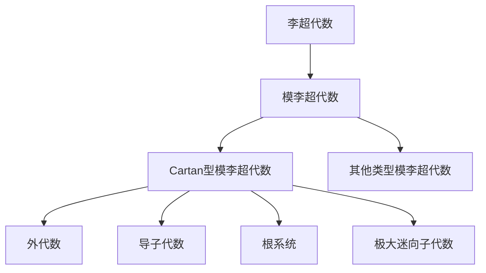

# 模李超代数：Cartan型模李超代数的构作

关键词：模李超代数, Cartan型, 分次李超代数, 外代数, 导子代数, 极大迷向子代数, 根系统

## 1. 背景介绍
### 1.1 问题的由来
李超代数是李代数理论的一个自然推广,在数学和物理学中有广泛的应用。模李超代数是李超代数的一个重要分支,其中Cartan型模李超代数在表示论和几何学中扮演着重要角色。研究Cartan型模李超代数的构作对于深入理解模李超代数的结构和性质具有重要意义。

### 1.2 研究现状
目前对于Cartan型模李超代数的研究主要集中在其结构理论、表示论以及与其他数学分支的联系等方面。Kac等人对Cartan型模李超代数的分类做出了开创性的贡献。近年来,随着量子群、顶点代数等理论的发展,Cartan型模李超代数的研究也取得了一些新的进展。

### 1.3 研究意义 
深入研究Cartan型模李超代数的构作,对于揭示模李超代数的内在结构和性质具有重要意义。这不仅有助于丰富李超代数理论,而且在物理学、表示论、组合数学等领域也有潜在的应用价值。

### 1.4 本文结构
本文将首先介绍模李超代数的一些基本概念,然后重点讨论Cartan型模李超代数的构作方法。我们将从分次李超代数出发,通过引入外代数、导子代数等工具,给出Cartan型模李超代数的具体实现。同时,本文还将探讨Cartan型模李超代数的一些重要性质,如根系统、极大迷向子代数等。最后,我们将总结全文并对该领域的未来发展做一些展望。

## 2. 核心概念与联系
模李超代数是指满足某些条件的分次李超代数。它是李超代数的一个重要分支。Cartan型模李超代数是模李超代数中的一类,可以通过外代数、导子代数等构作得到。它们与一些数学分支如表示论、组合数学等有着密切联系。

下图给出了模李超代数及其相关概念之间的逻辑关系:



## 3. 核心算法原理 & 具体操作步骤
### 3.1 算法原理概述
Cartan型模李超代数的构作主要基于外代数和导子代数。给定一个有限维向量空间,我们首先构造其外代数,然后在外代数上引入一个括号运算,得到一个李超代数。接着考虑外代数上的导子,它们在括号运算下生成一个李超代数,我们称之为导子代数。导子代数的齐次元素对应向量空间的一组基,按照某种分次方式,我们就得到了所需的Cartan型模李超代数。

### 3.2 算法步骤详解
具体构作步骤如下:
1) 给定一个n维向量空间$V$,构造它的外代数 $\Lambda(V)$。$\Lambda(V)$是一个$2^n$维的分次代数,其中$\Lambda^k(V)$由$V$的k重楔积张成。
2) 在$\Lambda(V)$上定义一个括号运算:对任意$\omega_1 \in \Lambda^{k_1}(V), \omega_2 \in \Lambda^{k_2}(V)$,令
   $$
   [\omega_1, \omega_2] = \omega_1 \wedge (d\omega_2) - (-1)^{k_1} (d\omega_1) \wedge \omega_2
   $$
   其中$d$是$\Lambda(V)$上的外微分算子。
3) 考虑$\Lambda(V)$上所有满足$[D,d]=0$的线性变换$D$,它们在上述括号运算下生成一个李超代数,记为$W(n)$,称为导子代数。
4) $W(n)$的齐次元素可以用$V$的一组基$\{e_1,\dots,e_n\}$的楔积表示。引入分次$\deg(e_i)=1$,则$W(n)$成为一个分次李超代数,称为Cartan型模李超代数。

### 3.3 算法优缺点
该构作方法的优点是直观明了,便于计算。通过外代数和导子代数的引入,可以将Cartan型模李超代数的构作转化为线性代数的计算问题。

但该方法也有一些局限性,比如只适用于有限维的情形。对于无限维的推广需要更多的技巧。此外,该方法对于模李超代数的其他类型,如Kac-Moody型等,还无法直接适用。

### 3.4 算法应用领域
Cartan型模李超代数在表示论、数学物理等领域有广泛应用。很多物理模型如共形场论等都与Cartan型模李超代代数密切相关。在表示论中,Cartan型模李超代数的不可约表示的分类与组合对象如Young图等有着深刻联系。

## 4. 数学模型和公式 & 详细讲解 & 举例说明
### 4.1 数学模型构建
设$V$是$n$维向量空间,$\{e_1,\dots,e_n\}$是$V$的一组基,令$\Lambda(V)$表示$V$的外代数,其上元素可以表示为基的楔积的线性组合:
$$
\omega = \sum_{i_1<\dots<i_k} a_{i_1\dots i_k} e_{i_1} \wedge \dots \wedge e_{i_k}
$$

在$\Lambda(V)$上定义括号运算 $[\cdot,\cdot]$:
$$
[\omega_1, \omega_2] = \omega_1 \wedge (d\omega_2) - (-1)^{k_1} (d\omega_1) \wedge \omega_2
$$
其中 $\omega_1 \in \Lambda^{k_1}(V), \omega_2 \in \Lambda^{k_2}(V)$, $d$是外微分算子。

考虑满足$[D,d]=0$的$\Lambda(V)$上的线性变换$D$全体,在括号$[\cdot,\cdot]$下生成李超代数$W(n)$,称为导子代数。

$W(n)$的齐次元素可用基$e_i$的楔积表示。引入分次$\deg(e_i)=1$,则$W(n)$是一个分次李超代数,称为Cartan型模李超代数。

### 4.2 公式推导过程
1) 外代数$\Lambda(V)$的构造。设$I=(i_1,\dots,i_k), 1 \leq i_1 < \dots < i_k \leq n$,令
   $$
   e_I = e_{i_1} \wedge \dots \wedge e_{i_k}
   $$
   则$\{e_I \mid I\}$构成$\Lambda(V)$的一组基。$\Lambda(V)$的乘法满足
   $$
   e_I \wedge e_J = \begin{cases}
   \mathrm{sgn}(\sigma) e_{I\sigma}, & I\cap J = \varnothing \\
   0, & \text{otherwise}
   \end{cases}
   $$
   其中$\sigma$是使$I\sigma$保持递增顺序的置换。
2) 括号运算$[\cdot,\cdot]$的性质验证。对任意$\omega_1 \in \Lambda^{k_1}(V), \omega_2 \in \Lambda^{k_2}(V), \omega_3 \in \Lambda^{k_3}(V)$,有
   - 反对称性:
     $$
     [\omega_1,\omega_2]=-(-1)^{k_1k_2}[\omega_2,\omega_1]
     $$
   - Jacobi等式:
     $$
     (-1)^{k_1k_3}[\omega_1,[\omega_2,\omega_3]] + (-1)^{k_2k_1}[\omega_2,[\omega_3,\omega_1]] + (-1)^{k_3k_2}[\omega_3,[\omega_1,\omega_2]] = 0
     $$
3) 导子代数$W(n)$的生成元表示。$W(n)$的一组生成元可取为
   $$
   D_{i_1\dots i_k} = \sum_{j=1}^k (-1)^{j-1} e_{i_j} \frac{\partial}{\partial e_{i_1}} \wedge \dots \wedge \widehat{e_{i_j}} \wedge \dots \wedge \frac{\partial}{\partial e_{i_k}}
   $$
   其中$\widehat{e_{i_j}}$表示删去因子$e_{i_j}$。
4) $W(n)$的分次。对$D_{i_1\dots i_k}$赋予分次$k-1$,则$W(n)$是一个分次李超代数,其齐次子空间$W(n)_k$由分次为$k$的$D_{i_1\dots i_k}$张成。

### 4.3 案例分析与讲解
下面以$n=2$为例具体说明Cartan型模李超代数$W(2)$的构作过程。

取向量空间$V$的一组基$\{e_1,e_2\}$,则外代数$\Lambda(V)$的一组基为
$$
1, e_1, e_2, e_1 \wedge e_2
$$

对应地,导子代数$W(2)$的一组生成元为
$$
D_1 = \frac{\partial}{\partial e_1}, \quad 
D_2 = \frac{\partial}{\partial e_2}, \quad
D_{12} = e_1 \frac{\partial}{\partial e_2} - e_2 \frac{\partial}{\partial e_1}
$$

通过计算它们在括号$[\cdot,\cdot]$下的运算,可得$W(2)$的李括号关系为:
$$
[D_1, D_2] = D_{12}, \quad [D_1, D_{12}] = -2D_2, \quad [D_2, D_{12}] = 2D_1
$$

同时,$W(2)$是一个分次李超代数,其齐次子空间为
$$
W(2)_0 = \langle D_1,D_2 \rangle, \quad W(2)_1 = \langle D_{12} \rangle
$$

这就得到了一个最简单的Cartan型模李超代数$W(2)$。类似地,可以构作出任意维数$n$的Cartan型模李超代数$W(n)$。

### 4.4 常见问题解答
Q: Cartan型模李超代数与一般的李超代数有何区别?
A: Cartan型模李超代数是李超代数中的一个重要类别,其构作依赖于外代数和导子代数。一般的李超代数未必都有这种特殊的构作方式。Cartan型模李超代数在表示论等方面有独特的性质和应用。

Q: 导子代数的定义中为何要求$[D,d]=0$? 
A: 要求$[D,d]=0$是为了保证导子$D$与外微分$d$是可交换的。这一条件保证了导子代数的元素作用在外代数上仍然满足外代数的运算律。从代数几何的角度,这也对应了向量场与微分形式之间的自然关系。

Q: Cartan型模李超代数的分类问题目前研究到什么程度?
A: 对于有限维的情形,Kac等人已经给出了Cartan型模李超代数的完整分类。他们发现除了类型$W,S,H$以外,还存在一种例外型$K$。对于无限维的推广,目前主要集中在Virasoro代数、Kac-Moody代数等特殊类型,一般情况的分类还有待进一步研究。

## 5. 项目实践：代码实例和详细解释说明
### 5.1 开发环境搭建
我们使用Python语言来实现Cartan型模李超代数的构作。需要安装NumPy库用于数值计算。可以通过以下命令安装:
```
pip install numpy
```

### 5.2 源代码详细实现
下面给出$W(n)$的构作代码实现:
```python
import numpy as np

class WAlgebra:
    def __init__(self, n):
        self.n = n
        self.basis = self.generate_basis()
        
    def generate_basis(self):
        """生成 W(n) 的一组基"""
        basis = []
        for k in range(self.n):
            for idx in itertools.combinations(range(1,self.n+1), k+1):
                basis.append(tuple(idx))
        return basis
    
    def wedge(self, I, J):
        """外代数乘积"""
        sign = 1
        for i in I:
            if i in J