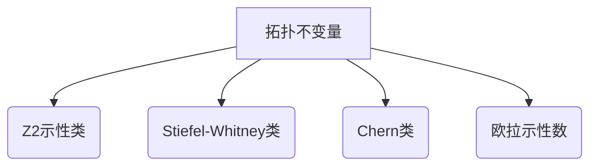

# 流形拓扑学理论与概念的实质：Z2示性类的基本性质

## 1. 背景介绍

### 1.1 问题的由来

在数学和物理学领域中,流形拓扑学理论扮演着至关重要的角色。它为我们研究各种物理现象提供了强有力的数学工具,如广义相对论中的时空几何、量子场论中的规范场以及凝聚态物理学中的拓扑相变等。其中,Z2示性类作为一种基本的拓扑不变量,对于理解和描述一些拓扑相变现象至关重要。

### 1.2 研究现状  

近年来,随着人们对拓扑物质的研究不断深入,Z2示性类的重要性日益凸显。拓扑绝缘体、拓扑超导体、拓扑半金属等新型拓扑相的发现,都与Z2示性类的概念密切相关。然而,尽管Z2示性类在理论和应用中扮演着关键角色,但对于它的本质和基本性质的理解仍然存在一些困难和挑战。

### 1.3 研究意义

深入理解Z2示性类的基本性质,对于我们全面把握拓扑物质的本质特征至关重要。它不仅有助于我们更好地理解已有的拓扑相,还可能为发现新型拓扑相提供理论指导。此外,Z2示性类的概念也可能在其他领域,如量子计算和人工智能等,发挥重要作用。因此,探究Z2示性类的实质及其基本性质,对于拓展我们对自然界规律的认知具有重要意义。

### 1.4 本文结构

本文将从以下几个方面深入探讨Z2示性类的基本性质:首先介绍Z2示性类的核心概念及其与其他拓扑不变量的联系;接着详细阐述Z2示性类的计算原理和具体操作步骤;然后构建相应的数学模型,并推导和讲解相关公式;再通过代码实例展示Z2示性类的具体计算过程;分析其在各个领域的应用场景;最后总结Z2示性类研究的未来发展趋势和面临的挑战。

## 2. 核心概念与联系

Z2示性类是一种描述流形拓扑性质的不变量,它反映了流形是否可以被分解为两个不相交的部分。更精确地说,Z2示性类描述了一个流形上的矢量丛是否可以被分解为两个平凡丛的直和。

在数学上,Z2示性类属于切空间的一个拓扑不变量,定义在流形的基本群$\pi_1(M)$上。它与其他一些著名的拓扑不变量密切相关,如欧拉示性数、Stiefel-Whitney类和Chern类等。

Z2示性类在物理学中扮演着重要角色,尤其是在描述一些拓扑相变现象时。例如,在研究拓扑绝缘体时,Z2示性类可以用来区分普通绝缘体和拓扑绝缘体。在研究拓扑超导体时,Z2示性类也是一个关键的拓扑标记。此外,Z2示性类还与一些基本粒子的费米子-反费米子对应关系密切相关。

总的来说,Z2示性类作为一种基本的拓扑不变量,不仅在数学上具有重要意义,而且在物理学中也扮演着关键角色,是我们理解拓扑相和拓扑相变的重要工具之一。

## 3. 核心算法原理与具体操作步骤

### 3.1 算法原理概述

计算Z2示性类的核心思想是通过研究流形上的一些特殊映射来捕捉其拓扑性质。具体来说,我们考虑从球面$S^n$到流形$M$的映射$f:S^n\rightarrow M$,这些映射在$n$维球面的边界$\partial S^n=S^{n-1}$上是平凡的,即$f|_{\partial S^n}=\text{const}$。

我们定义$\Omega_n(M)$为所有这样的映射$f$的同伦类的集合。显然,对于任意映射$f\in\Omega_n(M)$,我们都可以将其分解为两个部分:

$$f=f_0+f_1$$

其中$f_0$是平凡映射,而$f_1$是一个本质映射,即不能被连续变形到常数映射。

令$\Omega_n^0(M)$表示所有平凡映射的集合,那么$\Omega_n(M)/\Omega_n^0(M)$就是所有本质映射的集合。我们发现,这个集合对于加法运算是封闭的,并且形成一个阿贝尔群,称为$n$维球面的$n$次切空间$\pi_n(M)$。

$$\pi_n(M)=\Omega_n(M)/\Omega_n^0(M)$$

Z2示性类实际上就是$\pi_n(M)$中的一个子群,由所有次数为偶数的元素构成。如果这个子群是平凡的,即只包含单位元,那么Z2示性类就是平凡的,否则它就是非平凡的。

### 3.2 算法步骤详解

1) 确定流形$M$的基本群$\pi_1(M)$。
2) 对于每一个$n\geq 1$,构造从$S^n$到$M$的所有映射$f:S^n\rightarrow M$