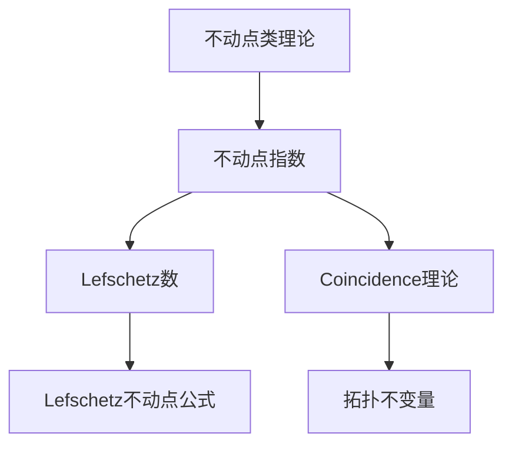

# 流形拓扑学理论与概念的实质：不动点类理论

## 1. 背景介绍

### 1.1 问题的由来

在数学和计算机科学领域中,不动点理论是一个基础且广泛应用的概念。它源于研究函数在某些条件下是否存在不动点的问题。不动点指的是对于一个函数 f,存在一个点 x,使得 f(x) = x。这个简单的定义揭示了许多深奥的数学结构和性质。

不动点理论在拓扑学、分析学、微分几何等纯数学领域有着重要应用,同时也广泛渗透到计算机科学的各个分支,如算法设计、程序验证、并行计算等。它为解决许多复杂的理论和实际问题提供了强有力的工具。

### 1.2 研究现状

经过数学家们几个世纪的不懈努力,不动点理论已经发展成为一个成熟而深邃的理论体系。从早期的不动点定理,到后来的不动点类理论,再到现代流形上的不动点理论,数学家们不断深化和拓展这一领域。

现代不动点类理论是在20世纪60年代兴起的,主要由数学家 Borsuk、Lefschetz、Hopf 等人的工作奠定了基础。他们将不动点理论与代数拓扑学和代数几何学相结合,发展出了一整套精密的理论体系。

### 1.3 研究意义

不动点类理论在纯数学领域具有重要意义,它为研究流形的代数拓扑不变量提供了有力工具。同时,它也在计算机科学中有着广泛的应用,例如:

- 并行计算和分布式系统中的终止探测和一致性问题
- 程序验证和模型检验中的不变式推导
- 计算几何和计算拓扑学中的固定点算法
- 经济学中的一般均衡理论和博弈论
- 数值分析中的迭代方法和近似解计算

不动点类理论将拓扑学、代数几何、函数分析等数学分支融会贯通,展现了数学的统一性和深邃内涵。研究这一理论不仅有助于加深对数学本质的理解,也为计算机科学等应用领域提供了新的解决方案和见解。

### 1.4 本文结构

本文将系统地介绍流形拓扑学中的不动点类理论。我们将从基本概念出发,阐述理论的核心内容,包括不动点指数、Lefschetz数、coincidence理论等。在此基础上,将探讨该理论在计算机科学中的应用,如并行计算、程序验证等领域。最后,我们将展望该理论的发展趋势和面临的挑战。

## 2. 核心概念与联系

不动点类理论的核心概念包括:

1. **不动点** (Fixed Point): 对于一个函数 f: X → X, 如果存在 x ∈ X 使得 f(x) = x, 那么 x 就是 f 的一个不动点。

2. **不动点指数** (Fixed Point Index): 这是描述不动点的一个代数不变量,用于度量一个不动点的"代数权重"。

3. **Lefschetz数** (Lefschetz Number): 对于一个连续映射 f: X → X, 其 Lefschetz 数是所有不动点指数之和。

4. **Coincidence理论**: 研究两个不同映射 f: X → Y 和 g: X → Y 的coincidence点,即满足 f(x) = g(x) 的点 x。

5. **Lefschetz不动点公式**: 将 Lefschetz 数与流形的拓扑不变量(如欧拉数、同伦群等)联系起来的一个著名公式。

这些概念相互关联、环环相扣,构成了不动点类理论的理论框架。其中,不动点指数是整个理论的核心,而 Lefschetz 数和 coincidence 理论则是重要的推广和延伸。

不动点类理论将拓扑学、代数和分析有机地结合在一起,为研究流形的代数拓扑性质提供了强有力的工具。同时,它也为计算机科学中的诸多问题提供了新的解决思路和方法。

## 3. 核心算法原理 & 具体操作步骤

### 3.1 算法原理概述

不动点类理论的核心是计算一个映射的不动点指数。这一指数能够描述不动点的代数权重,并与流形的拓扑不变量密切相关。

计算不动点指数的一般思路是:首先将映射 f 在不动点附近线性化,得到一个线性映射 Df。然后计算 Df 的指数,即它在相应向量空间上的指数。最后,通过一个特殊的构造,将 Df 的指数与 f 在该不动点处的指数联系起来。

这一思路由著名数学家 Lefschetz 在20世纪30年代提出,后经过 Hopf、Dold 等人的深入研究和发展,逐步形成了一整套严密的理论体系。

### 3.2 算法步骤详解

我们以计算一个映射 f: M → M 在孤立不动点 p 处的不动点指数为例,具体步骤如下:

1. **线性化映射**: 在 p 的一个邻域 U 内,将 f 线性化为 Df: T_p M → T_p M,即求 f 在 p 处的导数。

2. **计算Df的指数**: 在 T_p M 上,Df 是一个线性映射,我们可以计算它的指数 ind(Df)。这是一个整数,反映了 Df 在 p 处的代数权重。

3. **构造映射序列**: 构造一个映射序列:
   $$
   \Sigma^n \xrightarrow{i} D^n \xrightarrow{p} D^n/\Sigma^n \xrightarrow{q} \Sigma^{n+1}
   $$
   其中 $\Sigma^n$ 是 n 维球面, $D^n$ 是 n 维闭球,而 p 和 q 是投影映射。

4. **映射序列的同伦**: 证明上述映射序列在同伦意义下等价于 Df。

5. **计算不动点指数**: 由映射序列的性质可知,ind(Df) 必须等于 $q \circ p \circ i$ 的度数,后者可以直接计算得到。

6. **定义不动点指数**: 将 ind(Df) 定义为 f 在 p 处的不动点指数,记为 ind(f, p)。

通过这种代数拓扑的方法,我们就可以为任何映射 f 及其不动点 p 计算出一个整数不动点指数 ind(f, p)。这个指数不仅反映了不动点的代数性质,也与流形的拓扑不变量密切相关,是整个不动点类理论的核心。

### 3.3 算法优缺点

**优点**:

- 严密的数学理论基础,具有坚实的理论支撑
- 能够计算出一个映射的所有不动点指数
- 不动点指数与流形的拓扑不变量密切相关
- 为研究流形的代数拓扑性质提供了有力工具

**缺点**:

- 计算过程较为复杂,需要一定的代数拓扑和代数几何知识
- 对于高维流形和复杂映射,计算量可能很大
- 理论发展需要深厚的数学功底,门槛较高

### 3.4 算法应用领域

不动点指数理论及其推广在数学和计算机科学中有着广泛的应用:

- **拓扑学**: 研究流形的同伦性质、计算欧拉数和其他拓扑不变量
- **代数几何**: 研究代数varietie上的映射和不动点
- **微分几何**: 研究等距映射、极小曲面等几何对象
- **动力系统**: 分析动力系统的周期轨道和不变集
- **并行计算**: 终止探测、一致性问题、资源分配等
- **程序验证**: 不变式推导、模型检验、正确性证明等
- **计算几何**: 固定点算法、配对问题等
- **数值分析**: 非线性方程求解、迭代方法等

总的来说,不动点指数理论为研究映射及其不动点提供了一种有力的代数拓扑工具,在纯数学和应用数学领域都有重要应用价值。

## 4. 数学模型和公式 & 详细讲解 & 举例说明

### 4.1 数学模型构建

不动点类理论的核心是研究映射 f: X → X 的不动点,以及由此导出的一系列代数拓扑不变量。我们将从最一般的设定出发,构建数学模型。

设 X 是一个拓扑空间,f: X → X 是一个连续映射。我们定义 f 的不动点集为:

$$
\text{Fix}(f) = \{x \in X \;|\; f(x) = x\}
$$

对于每一个不动点 x ∈ Fix(f),我们可以赋予它一个代数不变量——不动点指数,记为 ind(f, x)。这是一个整数,反映了不动点在某种意义下的"代数权重"。

进一步,我们定义 f 的 Lefschetz 数为所有不动点指数之和:

$$
L(f) = \sum_{x \in \text{Fix}(f)} \text{ind}(f, x)
$$

Lefschetz 数是一个基本的代数拓扑不变量,与空间 X 的其他拓扑不变量(如欧拉数、同伦群等)存在着内在的代数关系。

为了计算不动点指数,我们需要将映射 f 在每个不动点处线性化,得到相应的线性映射。设 x 是 f 的一个孤立不动点,我们在 x 的一个邻域 U 内将 f 线性化为:

$$
Df_x: T_xX \rightarrow T_xX
$$

其中 $T_xX$ 是 X 在 x 处的切空间。我们可以计算 $Df_x$ 的指数 ind($Df_x$),这是一个反映线性映射代数性质的整数不变量。

### 4.2 公式推导过程

现在,我们来推导不动点指数与线性化映射指数之间的关系。

首先,我们构造一个映射序列:

$$
\Sigma^n \xrightarrow{i} D^n \xrightarrow{p} D^n/\Sigma^n \xrightarrow{q} \Sigma^{n+1}
$$

其中 $\Sigma^n$ 是 n 维球面, $D^n$ 是 n 维闭球,而 p 和 q 是投影映射。可以证明,这个映射序列在同伦意义下等价于线性映射 $Df_x$。

由映射序列的性质可知,ind($Df_x$) 必须等于 $q \circ p \circ i$ 的度数,即:

$$
\text{ind}(Df_x) = \text{deg}(q \circ p \circ i)
$$

而 $q \circ p \circ i$ 的度数可以直接计算得到。

进一步,通过一个代数拓扑的构造,我们可以证明:

$$
\text{ind}(f, x) = \text{ind}(Df_x)
$$

也就是说,映射 f 在不动点 x 处的不动点指数,等于它在 x 处的线性化映射 $Df_x$ 的指数。

这样,我们就建立了不动点指数与线性化映射指数之间的关系,从而为计算不动点指数提供了一种有效的代数拓扑方法。

### 4.3 案例分析与讲解

为了更好地理解不动点指数的计算,我们来看一个具体的例子。

**例子**: 设 M 是一个紧致无边界的 n 维流形,f: M → M 是一个光滑映射。我们要计算 f 在某个孤立不动点 p 处的不动点指数 ind(f, p)。

**步骤 1**: 在 p 的一个邻域 U 内,将 f 线性化为 $Df_p: T_pM → T_pM$。这是一个线性映射,我们可以计算它的指数 ind($Df_p$)。

**步骤 2**: 构造映射序列:

$$
\Sigma^n \xrightarrow{i} D^n \xrightarrow{p} D^n/\Sigma^n \