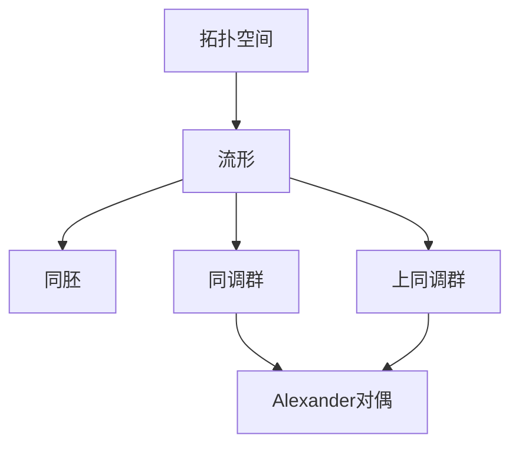

# 流形拓扑学：Alexander对偶定理

关键词：流形、同胚、Alexander对偶、Poincaré对偶、上同调、上同调

## 1. 背景介绍
### 1.1 问题的由来
流形拓扑学是数学拓扑学的一个重要分支,它研究的是流形的拓扑性质。流形是一个局部看起来像欧氏空间的拓扑空间,在流形上可以定义微分、积分等概念。流形拓扑学中的一个核心问题是:如何判断两个流形是否同胚?Alexander对偶定理给出了一个重要的判别方法。

### 1.2 研究现状
Alexander对偶定理最早由J. W. Alexander在1915年提出,后来被 S.Lefschetz等数学家推广到更一般的情形。目前,Alexander对偶已经成为流形拓扑学中的一个经典结果,在许多问题的研究中都发挥着重要作用,如Poincaré对偶定理、Lefschetz固定点定理等。

### 1.3 研究意义
Alexander对偶揭示了流形上同调与上同调之间的内在联系,为研究流形的拓扑不变量提供了有力工具。它不仅在纯数学研究中有重要地位,在物理、工程等应用领域也有广泛应用,如电磁场论、图像分析等。深入理解Alexander对偶,对于拓展流形拓扑学的研究范围,促进数学与其他学科的交叉融合具有重要意义。

### 1.4 本文结构
本文将从流形、同胚等核心概念出发,详细阐述Alexander对偶定理的内容要点、证明思路以及推广形式。同时,通过具体实例说明该定理的应用。在此基础上,讨论Alexander对偶与Poincaré对偶、Lefschetz对偶的联系,并对流形拓扑学的研究前景做出展望。

## 2. 核心概念与联系
流形拓扑学中的核心概念包括:

- 拓扑空间:满足一定公理的点集,是研究拓扑性质的基础。
- 流形:局部同胚于欧氏空间的拓扑空间,可定义微分结构。
- 同胚:保持拓扑结构的连续双射,是判断两个流形是否等价的标准。
- 同调群:描述流形上闭链与边界的关系,是重要的拓扑不变量。
- 上同调群:对偶于同调群,刻画流形上的闭辛流与边界的关系。

这些概念之间有着密切联系:流形是特殊的拓扑空间;同胚是比较流形的工具;同调与上同调是流形的代数拓扑不变量,蕴含着丰富的几何和拓扑信息。Alexander对偶定理则揭示了同调与上同调之间的对偶关系。下图给出了这些概念之间的逻辑关系:



## 3. 核心算法原理 & 具体操作步骤
### 3.1 算法原理概述
Alexander对偶定理描述的是流形上的同调群与上同调群之间的同构关系。具体来说,对于一个n维定向紧致流形M,其第k维同调群$H_k(M)$与第n-k维上同调群$H^{n-k}(M)$之间存在一个自然的同构:

$$
\Phi: H_k(M) \to H^{n-k}(M)
$$

这个同构将同调类映射为其上同调对偶类。从直观上理解,同调类描述的是流形上的"洞",而上同调类则对应于流形上的"闭辛流"。Alexander对偶揭示了这两者之间的对应关系。

### 3.2 算法步骤详解
为构造Alexander对偶同构,主要步骤如下:

1. 在流形M上选取一个三角剖分T,得到一个抽象单纯复形K。
2. 对偶地构造K的胞腔复形K',其中k维胞腔对应于K中的(n-k)维单形。
3. 在K和K'上分别定义链群C_*(K)和上链群C^*(K'),并引入边界算子∂和余边界算子δ。
4. 定义同调群H_*(K)=Ker∂/Im∂和上同调群H^*(K')=Kerδ/Imδ。
5. 构造链群与上链群之间的配对:C_k(K)×C^{n-k}(K')→R,(σ,σ')↦⟨σ,σ'⟩。
6. 证明配对诱导出同调群与上同调群之间的同构:Φ([z])=[z']。

其中,第5步的配对定义中,σ是K中的一个定向k维单形,σ'是K'中对应的(n-k)维胞腔。⟨σ,σ'⟩的值为±1,取决于σ和σ'定向的匹配情况。

### 3.3 算法优缺点
Alexander对偶定理的优点在于:

- 建立了同调与上同调之间的联系,将两个看似独立的概念统一起来。
- 提供了计算流形拓扑不变量的新方法,尤其是在处理对偶空间时十分有效。
- 对推广Poincaré对偶、Lefschetz对偶等结果起到关键作用。

但该定理也存在一些局限:

- 要求流形是定向、紧致的,对非定向流形和非紧流形的情况需要另外讨论。
- 在计算同调和上同调时,需要对流形进行三角剖分,实际操作较为复杂。
- 定理本身只给出了同构的存在性,构造同构时还需要额外的技巧。

### 3.4 算法应用领域
Alexander对偶在流形拓扑学研究中有广泛应用,主要体现在:

- 计算流形的同调群和上同调群,刻画流形的拓扑性质。
- 研究Poincaré对偶、Lefschetz对偶等定理,揭示流形上的对偶关系。
- 分析流形上的微分形式、积分、调和形式等,应用于物理、工程中。
- 结合Morse理论,研究流形的临界点、梯度流等微分拓扑性质。

此外,Alexander对偶思想还被推广到了更一般的拓扑空间,如CW复形、交叉链复形等,在代数拓扑学中有重要地位。

## 4. 数学模型和公式 & 详细讲解 & 举例说明 
### 4.1 数学模型构建
为刻画Alexander对偶,需要在流形上构建合适的代数模型。主要步骤如下:

1. 在n维流形M上引入一个三角剖分T,得到抽象单纯复形K。
2. 定义定向k维单形σ_k的集合,形成k维链群C_k(K)。
3. 定义边界算子∂_k:C_k(K)→C_{k-1}(K),满足∂_{k-1}∘∂_k=0。
4. 定义k维循环群Z_k(K)=Ker∂_k和k维边界群B_k(K)=Im∂_{k+1}。
5. 定义k维同调群H_k(K)=Z_k(K)/B_k(K)。

对偶地,在胞腔复形K'上定义上链群C^k(K'),余边界算子δ^k,循环群Z^k(K'),余边界群B^k(K')和上同调群H^k(K')。

同调群H_k(K)刻画了k维循环在k维边界上的等价类,而上同调群H^k(K')则刻画了k余维循环在k余维余边界上的等价类。Alexander对偶就建立在这两个群之间。

### 4.2 公式推导过程
为证明Alexander对偶,关键是构造同调群到上同调群的同构映射。具体步骤如下:

1. 对链群和上链群定义一个配对:C_k(K)×C^{n-k}(K')→R,(σ_k,σ'^{n-k})↦⟨σ_k,σ'^{n-k}⟩。
2. 证明配对满足:⟨∂σ_{k+1},σ'^{n-k}⟩=⟨σ_{k+1},δσ'^{n-k}⟩。
3. 由此诱导出同调类和上同调类之间的配对:[z_k]×[z'^{n-k}]→R,([z_k],[z'^{n-k}])↦⟨z_k,z'^{n-k}⟩。
4. 证明诱导配对是非退化的,即同构H_k(K)≌H^{n-k}(K')。

其中,第2步的证明用到了Stokes定理在单纯复形上的离散形式:

$$
\sum_{i=0}^{k+1}(-1)^i⟨σ_{k+1},δ_iσ'^{n-k}⟩=\sum_{i=0}^k(-1)^i⟨∂_iσ_{k+1},σ'^{n-k}⟩
$$

这里,δ_i和∂_i分别表示余边界算子和边界算子在第i个面上的限制。

第4步的证明则需要用到Poincaré对偶的初等形式,即k维同调群与(n-k)维同调群之间的同构:

$$
D:H_k(K)→H_{n-k}(K),\quad [z_k]↦[D(z_k)]
$$

其中,D(z_k)是z_k在对偶单纯复形K*中的对偶循环。再结合德拉姆同构H_{n-k}(K)≌H^{n-k}(K'),就得到了Alexander对偶。

### 4.3 案例分析与讲解
下面以一个具体的例子来说明Alexander对偶的应用。

考虑2维球面S^2,它有一个标准的三角剖分,如下图所示:

```
       v_0
      /   \
     /     \
   e_0    e_1
   /         \
  /           \
v_1-----e_2----v_2
```

其中,v_i表示0维单形(顶点),e_i表示1维单形(边)。

对应的胞腔复形如下:

```
       e*_0
      /   \
     /     \
   v*_0   v*_1
   /         \
  /           \
e*_2---------e*_1
```

这里,v*_i表示2维胞腔,e*_i表示1维胞腔。

利用Alexander对偶,我们可以得到:

- H_0(S^2)≌H^2(S^2)≌R
- H_1(S^2)≌H^1(S^2)≌0
- H_2(S^2)≌H^0(S^2)≌R

这表明,2维球面在0维和2维上都有一个"洞",而在1维上没有"洞"。这与我们的直观理解是一致的。

### 4.4 常见问题解答
Q: Alexander对偶对流形有什么要求?
A: 定理要求流形M是紧致、有向的。对于非紧情形,需要考虑带紧支集的同调与上同调;对于非定向流形,则需要在同调和上同调中引入局部系数。

Q: Alexander对偶与Poincaré对偶有何区别?
A: Poincaré对偶建立的是同一流形上不同维数同调群之间的同构,而Alexander对偶则刻画了同调群与上同调群之间的关系。从某种意义上说,Alexander对偶是Poincaré对偶的推广。

Q: 能否举一个Alexander对偶在物理中的应用实例?  
A: 在电磁场论中,真空Maxwell方程组有两个重要的定理,即Gauss定理和Ampère定理,分别描述了电场强度和磁感应强度的散度和旋度。这两个定理在数学上对应于微分形式的Stokes定理,而Alexander对偶则揭示了它们之间的对偶关系。通过Alexander对偶,可以方便地推导出电磁对偶变换等重要结果。

## 5. 项目实践：代码实例和详细解释说明
### 5.1 开发环境搭建
在Python中,我们可以利用SimPy库来模拟单纯复形和胞腔复形,并计算其同调群和上同调群。主要步骤如下:

1. 安装Python和SimPy库。
2. 定义抽象单纯复形类`AbstractSimplex`和胞腔复形类`AbstractCell`。
3. 实现边界算子`boundary()`和余边界算子`coboundary()`。
4. 定义同调群类`HomologyGroup`和上同调群类`CohomologyGroup`。
5. 实现同调群