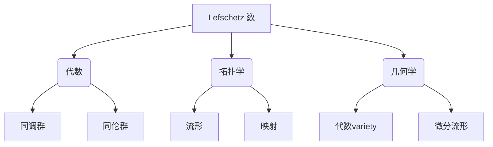

# 流形拓扑学：Lefschetz 数

## 1. 背景介绍

### 1.1 问题的由来

在数学的发展历程中,拓扑学一直是一个极具挑战和深奥内涵的研究领域。作为研究空间几何性质的一个分支,流形拓扑学的核心在于探索流形的代数拓扑不变量及其相互关系。而在流形拓扑学中,Lefschetz 数无疑是一个最为关键和深刻的概念。

Lefschetz 数最初由法国数学家 Solomon Lefschetz 于 20 世纪初提出,用于研究代数几何中的一些基本问题。它描述了一个连续映射在同调群上所引起的迹,从而揭示了映射的拓扑性质。Lefschetz 数的深刻内涵在于,它将代数和拓扑学两个看似独立的数学分支紧密联系在一起,为解决许多棘手的数学难题提供了强有力的工具。

### 1.2 研究现状

自从 Lefschetz 数被引入以来,它在拓扑学、代数几何、微分几何等多个数学分支中都发挥着重要作用。例如,在代数几何中,Lefschetz 数被用于研究代数variety的拓扑性质;在微分几何中,它与指数映射和调和映射等概念密切相关;在代数拓扑学中,Lefschetz 数为计算同调群、同伦群等不变量提供了有力方法。

目前,Lefschetz 数理论已经发展成为一个相当成熟和深入的研究领域。数学家们不断探索 Lefschetz 数在各个分支中的应用,并将其与其他数学概念和工具相结合,以求取得新的突破。同时,Lefschetz 数在物理学、计算机科学等其他学科中也有着广泛的应用,例如在量子计算、拓扑数据分析等领域中都可以看到 Lefschetz 数理论的影子。

### 1.3 研究意义

Lefschetz 数的研究意义主要体现在以下几个方面:

1. **理论意义**:Lefschetz 数理论将代数和拓扑学紧密结合,为解决两个数学分支中的棘手问题提供了新的视角和工具。它极大地推动了这两个领域的发展,并孕育出了众多的新理论和新概念。

2. **应用价值**:Lefschetz 数在物理学、计算机科学等学科中有着广泛的应用。例如,它在量子计算、拓扑数据分析等领域中扮演着重要角色。研究 Lefschetz 数有助于推动这些学科的进步。

3. **数学美学**:Lefschetz 数理论本身就蕴含着极高的数学美学价值。它将抽象的代数结构与几何拓扑性质巧妙地结合,展现出数学的优雅和力量。研究 Lefschetz 数有助于我们欣赏数学的魅力。

4. **思维训练**:Lefschetz 数理论需要运用抽象思维、逻辑推理和几何直觉等多种数学思维能力。研究这一领域有助于培养和锻炼数学家们的思维能力,从而推动数学事业的发展。

### 1.4 本文结构

本文将全面深入地介绍 Lefschetz 数的相关理论。我们将从背景知识出发,逐步探讨 Lefschetz 数的核心概念、算法原理、数学模型,并结合代码实例对其进行实践应用。最后,我们将总结 Lefschetz 数的发展趋势和面临的挑战,并为读者提供学习资源和工具推荐。

通过本文,读者将可以全面掌握 Lefschetz 数的方方面面,并了解其在不同领域中的应用。我们将努力用浅显易懂的语言阐释这一深奥的数学概念,希望能为读者打开通往 Lefschetz 数的大门。

## 2. 核心概念与联系

在深入探讨 Lefschetz 数的细节之前,我们需要先了解一些核心概念,为后续的讨论打下基础。Lefschetz 数理论紧密地联系了代数、拓扑和几何等数学分支,因此我们需要对这些概念有一定的了解。

1. **代数**:Lefschetz 数与代数中的同调群和同伦群等概念密切相关。同调群描述了一个拓扑空间的"洞"的代数结构,而同伦群则描述了空间的形状。Lefschetz 数通过研究映射在同调群或同伦群上的迹,揭示了映射的拓扑性质。

2. **拓扑学**:流形和映射是拓扑学中的核心概念。Lefschetz 数主要研究定义在流形上的连续映射,以及这些映射在同调群或同伦群上的作用。因此,对流形和映射的理解是掌握 Lefschetz 数的基础。

3. **几何学**:Lefschetz 数在代数几何和微分几何中都有重要应用。在代数几何中,Lefschetz 数被用于研究代数variety的拓扑性质;而在微分几何中,它与指数映射和调和映射等概念密切相关。

这些概念相互关联、相互渗透,共同构成了 Lefschetz 数理论的基础框架。只有充分理解它们,才能真正掌握 Lefschetz 数的本质。在接下来的章节中,我们将逐一探讨这些概念,为读者打开通往 Lefschetz 数的大门。

## 3. 核心算法原理与具体操作步骤

### 3.1 算法原理概述

Lefschetz 数的核心算法原理可以概括为:对于一个定义在流形上的连续映射 $f: M \rightarrow M$,我们可以研究它在同调群 $H_*(M)$ 上的作用,即诱导的同调映射 $f_*: H_*(M) \rightarrow H_*(M)$。Lefschetz 数则定义为该映射在同调群上的迹,即:

$$
L(f) = \sum_{k=0}^{\infty} (-1)^k \text{Tr}(f_*|_{H_k(M)})
$$

其中, $H_k(M)$ 表示 $M$ 的 $k$ 维同调群, $\text{Tr}(f_*|_{H_k(M)})$ 表示 $f_*$ 在 $H_k(M)$ 上的迹。

Lefschetz 数的精髓在于,它将映射的代数性质(即在同调群上的作用)与其拓扑性质(即在流形上的作用)联系起来。事实上,Lefschetz 数能够完全确定一个映射的Nielsen 数 -- 一个描述映射的不动点个数的拓扑不变量。

因此,通过计算 Lefschetz 数,我们可以获得映射的丰富的代数和拓扑信息,从而深入理解其性质。这使得 Lefschetz 数成为研究映射的一个强有力的工具。

### 3.2 算法步骤详解

计算 Lefschetz 数的具体步骤如下:

1. **确定流形 $M$ 和映射 $f: M \rightarrow M$**

   首先,我们需要确定研究对象,即一个流形 $M$ 和定义在其上的连续映射 $f$。流形可以是任意维数的,映射也可以是任意的连续映射。

2. **计算流形 $M$ 的同调群 $H_*(M)$**

   接下来,我们需要计算流形 $M$ 的同调群 $H_*(M)$。这可以通过多种方法完成,例如使用单纯同调理论、de Rham 理论等。同调群的计算通常是一个技术性很强的过程,需要使用代数拓扑学中的各种工具。

3. **确定映射 $f$ 在同调群上的作用 $f_*$**

   已知映射 $f$,我们可以根据其性质确定它在同调群 $H_*(M)$ 上的作用 $f_*$。这是一个从 $H_*(M)$ 到自身的群同态,即 $f_*: H_*(M) \rightarrow H_*(M)$。

4. **计算 $f_*$ 在每一个同调群 $H_k(M)$ 上的迹 $\text{Tr}(f_*|_{H_k(M)})$**

   对于每一个 $k$ 维同调群 $H_k(M)$,我们需要计算 $f_*$ 在其上的迹 $\text{Tr}(f_*|_{H_k(M)})$。这通常需要对 $f_*$ 的矩阵表示进行计算。

5. **计算 Lefschetz 数的级数表达式**

   最后,将上一步得到的迹代入 Lefschetz 数的级数表达式:
   
   $$
   L(f) = \sum_{k=0}^{\infty} (-1)^k \text{Tr}(f_*|_{H_k(M)})
   $$
   
   对级数求和即可得到 Lefschetz 数的值。

这个过程看似简单,但实际操作中往往会遇到各种技术上的困难和挑战。例如,同调群的计算本身就是一个艰巨的任务;而确定 $f_*$ 的具体形式,以及计算其迹也需要一定的技巧和经验。因此,掌握 Lefschetz 数算法需要扎实的代数拓扑学和代数几何知识作为基础。

### 3.3 算法优缺点

Lefschetz 数算法的优点主要包括:

1. **信息丰富**:Lefschetz 数能够同时提供映射的代数信息(作用在同调群上)和拓扑信息(不动点个数),因此具有很强的表达能力。

2. **普适性强**:该算法适用于任意连续映射和任意维数的流形,具有很强的普适性。

3. **与其他理论相结合**:Lefschetz 数理论可以与代数拓扑学、代数几何、微分几何等多个数学分支相结合,从而拓展了更广阔的应用前景。

4. **计算简单**:虽然中间过程可能会遇到一些技术性困难,但 Lefschetz 数的最终计算公式本身是一个相对简单的级数表达式。

然而,Lefschetz 数算法也存在一些缺点和局限性:

1. **技术要求高**:为了计算 Lefschetz 数,需要掌握大量的代数拓扑学和代数几何知识作为前提,门槛较高。

2. **计算复杂**:尽管最终公式简单,但中间过程中需要计算同调群、确定 $f_*$ 的形式以及计算迹等步骤,往往是一个相当复杂的过程。

3. **理解困难**:Lefschetz 数将代数和拓扑学紧密结合,其背后的数学思想较为深奥和抽象,需要一定的数学素养才能完全理解。

4. **应用局限**:虽然 Lefschetz 数在数学的多个分支都有应用,但在其他学科领域的应用还相对有限,需要进一步拓展。

总的来说,Lefschetz 数算法是一个极具价值的工具,但也需要付出相当大的努力才能掌握和应用。它展现了数学的深邃魅力,也为我们揭示了自然界的奥秘。

### 3.4 算法应用领域

Lefschetz 数算法及其理论在数学的多个分支中都有广泛的应用,主要包括:

1. **代数几何**

   在代数几何中,Lefschetz 数被用于研究代数variety的拓扑性质,例如确定其Betti数、计算其同伦群等。它为解决代数几何中的一些基本问题提供了有力工具。

2. **微分几何**

   在微分几何领域,Lefschetz 数与指数映射、调和映射等概念密切相关。研究者利用 Lefschetz 数来探索这些映射的性质,从而深入理解流形的几何结构。

3. **代数拓扑学**

   作为代数拓扑学的核心工具之一,Lefschetz 数被广泛应用于计算同调群、同伦群等代数拓扑不变量。它为探索拓扑空间的代数结构提供了强有力的方法。

4. **组合拓扑学**

   在组合拓扑学中,