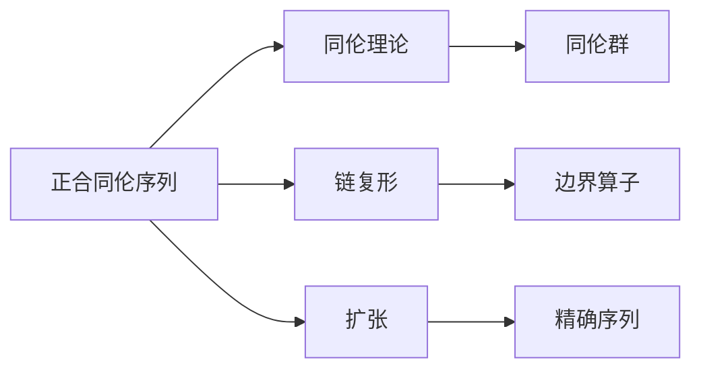
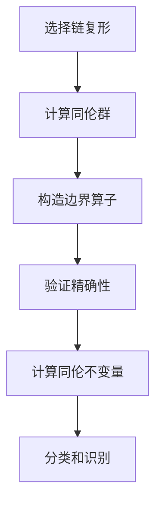

# 流形拓扑学：正合同伦序列

## 1. 背景介绍

### 1.1 问题的由来

在数学中,拓扑学是一门研究空间几何性质的学科,特别关注那些在连续变形下保持不变的性质。流形拓扑学是拓扑学的一个分支,专门研究流形(可微分多样体)的拓扑性质。流形是一种在局部看起来像欧几里得空间的空间,但在全局上可能具有更复杂的结构。

正合同伦序列是流形拓扑学中的一个重要概念,它提供了一种有效的方法来研究流形的同伦性质。同伦是拓扑学中的一个基本概念,描述了两个空间在拓扑意义上是否可以被连续变形到彼此。正合同伦序列允许我们通过研究一系列的同伦群来推断流形的同伦性质。

### 1.2 研究现状

正合同伦序列的理论基础可以追溯到20世纪初,当时数学家们开始系统地研究同伦理论和代数拓扑学。在20世纪50年代和60年代,著名数学家如Eilenberg、Steenrod和Milnor等人对正合同伦序列进行了深入的研究,并建立了完整的理论框架。

近年来,正合同伦序列在数学和其他学科领域都有广泛的应用。例如,它被用于研究流形的同伦不变量、分类流形、计算同伦群等。此外,正合同伦序列也被应用于代数几何、代数拓扑、表示论和量子场论等领域。

### 1.3 研究意义

研究正合同伦序列具有重要的理论和实际意义。在理论层面上,正合同伦序列提供了一种有效的工具来研究流形的同伦性质,并且与其他数学分支如代数拓扑学、代数几何等有着密切的联系。在实际应用中,正合同伦序列被广泛应用于物理学、计算机科学、数据分析等领域,用于解决各种实际问题。

### 1.4 本文结构

本文将全面介绍正合同伦序列的理论基础、核心概念、算法原理和实际应用。文章首先介绍正合同伦序列的背景知识和基本概念,然后详细阐述其核心算法原理和数学模型。接下来,我们将通过具体的代码实例和案例分析,深入探讨正合同伦序列的实际应用。最后,文章总结了正合同伦序列的发展趋势和面临的挑战,并提供了相关的学习资源和工具推荐。

## 2. 核心概念与联系

正合同伦序列是流形拓扑学中的一个核心概念,它与同伦理论、链复形、扩张等概念密切相关。下面我们将介绍正合同伦序列的核心概念及其与其他概念的联系。

1. **同伦理论**:同伦理论是拓扑学的基础,它研究空间在连续变形下保持不变的性质。正合同伦序列提供了一种有效的方法来研究流形的同伦性质。

2. **链复形**:链复形是代数拓扑学中的一个重要概念,它将拓扑空间表示为一系列的链群(向量空间)和边界算子。正合同伦序列可以看作是一种特殊的链复形,其中的同伦群描述了流形的同伦性质。

3. **扩张**:扩张是同伦理论中的一个重要概念,它描述了如何将一个空间嵌入到另一个更大的空间中。正合同伦序列可以看作是一种特殊的扩张,其中每个同伦群都描述了一个特定维度上的同伦性质。

4. **同伦群**:同伦群是同伦理论中的一个核心概念,它描述了空间在某个维度上的同伦性质。正合同伦序列中的每个项都是一个同伦群,描述了流形在不同维度上的同伦性质。

5. **边界算子**:边界算子是链复形中的一个重要概念,它将一个维度的链群映射到下一个维度的链群。正合同伦序列中的每个同伦群都由前一个同伦群的边界算子生成。

6. **精确序列**:精确序列是同伦理论中的一个重要概念,它描述了一系列空间之间的同伦关系。正合同伦序列可以看作是一种特殊的精确序列,其中每个同伦群都与前一个和后一个同伦群之间存在精确的关系。

通过上述核心概念和它们之间的联系,我们可以更好地理解正合同伦序列在流形拓扑学中的重要地位和作用。

## 3. 核心算法原理 & 具体操作步骤

### 3.1 算法原理概述

正合同伦序列的核心算法原理是基于同伦理论和链复形理论。它利用一系列的同伦群和边界算子来描述流形的同伦性质。具体来说,正合同伦序列是一个精确序列,其中每个项都是一个同伦群,描述了流形在不同维度上的同伦性质。相邻的同伦群之间由边界算子连接,边界算子将一个维度的同伦群映射到下一个维度的同伦群。

正合同伦序列的核心思想是利用这种精确序列的结构,从已知的同伦群推断出未知的同伦群。通过研究边界算子的性质和同伦群之间的关系,我们可以计算出流形的同伦不变量,并且分类和识别不同的流形。

### 3.2 算法步骤详解

构建正合同伦序列的具体步骤如下:

1. **选择链复形**:首先,我们需要选择一个合适的链复形来表示给定的流形。常用的选择包括单纯形链复形、de Rham链复形等。

2. **计算同伦群**:对于每个维度,我们计算链复形中的同伦群。同伦群描述了流形在该维度上的同伦性质。

3. **构造边界算子**:计算每个维度的边界算子,它将一个维度的链群映射到下一个维度的链群。边界算子满足$\partial^2 = 0$的性质。

4. **验证精确性**:验证构造的序列是否精确,即每个同伦群的核等于前一个同伦群的像。如果序列不精确,需要进行修正。

5. **计算同伦不变量**:利用正合同伦序列中的同伦群和边界算子,计算流形的同伦不变量,如欧拉特征数、Betti数等。

6. **分类和识别**:根据计算得到的同伦不变量,我们可以对流形进行分类和识别,确定它们是否同伦等价。

以下是一个简单的Mermaid流程图,描述了构建正合同伦序列的核心步骤:

### 3.3 算法优缺点

正合同伦序列作为研究流形同伦性质的有效工具,具有以下优点:

1. **理论基础坚实**:正合同伦序列建立在同伦理论和代数拓扑学的坚实理论基础之上,具有严谨的数学理论支撑。

2. **计算有效性**:利用正合同伦序列,我们可以有效地计算流形的同伦不变量,从而对流形进行分类和识别。

3. **广泛应用**:正合同伦序列在数学、物理学、计算机科学等多个领域都有广泛的应用。

然而,正合同伦序列也存在一些缺点和局限性:

1. **计算复杂度**:对于高维流形或者复杂的拓扑结构,计算正合同伦序列可能会变得非常复杂和耗时。

2. **有限信息**:正合同伦序列只提供了有限的同伦信息,无法完全描述流形的所有拓扑性质。

3. **理论难度**:正合同伦序列的理论基础涉及较为抽象的数学概念,对初学者来说可能存在一定的理解难度。

### 3.4 算法应用领域

正合同伦序列在数学和其他学科领域都有广泛的应用,下面是一些典型的应用场景:

1. **拓扑数据分析(TDA)**:在数据分析领域,正合同伦序列被用于研究数据集的拓扑结构,从而提取有用的信息和模式。

2. **计算机图形学**:正合同伦序列可以用于表示和操作几何模型的拓扑结构,在三维建模、动画和渲染等领域有应用。

3. **量子场论**:正合同伦序列在研究量子场论中的各种拓扑现象和不变量方面发挥着重要作用。

4. **代数几何**:正合同伦序列被用于研究代数曲线和代数曲面的同伦性质,在代数几何中有重要应用。

5. **材料科学**:正合同伦序列可以用于分析和预测材料的拓扑结构和性质,在新材料设计和开发中发挥作用。

6. **生物信息学**:正合同伦序列被应用于分析蛋白质和DNA等生物分子的拓扑结构,有助于理解它们的功能和作用机制。

总的来说,正合同伦序列作为一种强大的数学工具,在许多领域都有着广泛的应用前景和潜力。

## 4. 数学模型和公式 & 详细讲解 & 举例说明

### 4.1 数学模型构建

正合同伦序列的数学模型建立在同伦理论和链复形理论的基础之上。我们首先需要选择一个合适的链复形来表示给定的流形,常用的选择包括单纯形链复形和de Rham链复形。

对于一个n维流形M,我们可以构造一个链复形$C_*(M)$,其中$C_i(M)$表示i维链群,描述了流形在第i维度上的拓扑结构。每个链群$C_i(M)$是一个由i维单纯形(或者de Rham形式)生成的向量空间。

接下来,我们定义边界算子$\partial_i: C_i(M) \rightarrow C_{i-1}(M)$,它将i维链映射到(i-1)维链。边界算子满足$\partial_{i-1} \circ \partial_i = 0$的性质,这就构成了一个链复形。

正合同伦序列是一个精确序列,其中每个项都是一个同伦群$H_i(M)$,描述了流形在第i维度上的同伦性质。相邻的同伦群之间由边界算子连接,形成以下序列:

$$
\cdots \rightarrow H_{i+1}(M) \xrightarrow{\partial_{i+1}} H_i(M) \xrightarrow{\partial_i} H_{i-1}(M) \xrightarrow{\partial_{i-1}} \cdots
$$

其中,每个同伦群$H_i(M)$由前一个同伦群的边界算子生成,即$H_i(M) = \ker(\partial_i) / \text{im}(\partial_{i+1})$。这个序列被称为正合同伦序列,它提供了一种有效的方法来研究流形的同伦性质。

### 4.2 公式推导过程

在正合同伦序列中,同伦群$H_i(M)$的定义是基于边界算子的核和像的关系。具体来说,我们有以下公式:

$$
H_i(M) = \ker(\partial_i) / \text{im}(\partial_{i+1})
$$

其中,$\ker(\partial_i)$表示边界算子$\partial_i$的核,即所有被$\partial_i$映射到0的i维链的集合。$\text{im}(\partial_{i+1})$表示边界算子$\partial_{i+1}$的像,即所有可以被表示为某个(i+1)维链的边界的(i-1)维链的集合。

我们可以推导出$H_i(M)$的元素实际上描述了流形在第i维度上的"洞"或者"空腔"的拓扑结构。具体来说,如果一个i维链属于$\ker(\