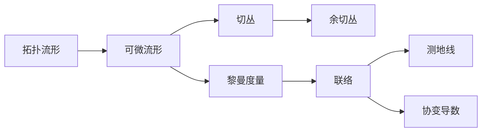

# 流形拓扑学：流形的概念

关键词：流形、拓扑学、微分结构、黎曼几何、纤维丛、de Rham上同调

## 1. 背景介绍
### 1.1  问题的由来
流形是现代数学和理论物理学中一个极其重要的概念。它描述了一类具有局部欧氏空间性质的拓扑空间,在微分几何、代数拓扑、黎曼几何等数学分支以及广义相对论、规范场论等物理学领域有着广泛的应用。深入理解流形的概念对于学习和研究这些学科具有重要意义。

### 1.2  研究现状
目前,对流形理论的研究已经相当成熟和深入。从20世纪初期Poincaré和Riemann等数学家奠定流形理论的基础,到Whitney、Milnor、Smale等人对流形分类定理的建立和证明,再到Donaldson、Thurston等人将流形理论与几何拓扑、动力系统等领域结合所取得的重大突破,流形理论经历了一个多世纪的发展历程。现在,流形已经成为现代数学的核心概念之一。

### 1.3  研究意义 
流形理论不仅是一个美丽而又深刻的数学理论体系,更是理解物理世界的重要工具。广义相对论将时空描述为一个4维黎曼流形,规范场论将粒子的内禀对称性刻画为主纤维丛的联络,这些都充分体现了流形思想的强大生命力。因此,深入学习和掌握流形的核心概念,对于开展数学和物理学的研究工作具有重要意义。

### 1.4  本文结构
本文将从以下几个方面介绍流形的核心概念：
- 流形的定义与拓扑结构
- 流形上的微分结构与切丛
- 流形间的映射与不变量
- 流形上的度量与黎曼几何初步
- 纤维丛与规范理论初步

## 2. 核心概念与联系
流形是一类特殊的拓扑空间,它在局部具有欧氏空间的性质。更准确地说,一个n维流形是一个可以被开覆盖的Hausdorff空间,且每一个开集同胚于欧氏空间$\mathbb{R}^n$的一个开子集。这些同胚映射被称为流形的坐标卡,不同坐标卡之间通过一个光滑映射(转移函数)衔接,由此赋予了流形一个微分结构。

流形的核心概念包括:
- 拓扑流形(Topological Manifold):满足局部同胚于欧氏空间拓扑性质的空间。
- 可微流形(Differentiable Manifold):在拓扑流形上赋予了可微结构,使得转移函数光滑。
- 切空间(Tangent Space):流形上每一点的局部线性化,对应于向量场。
- 余切空间(Cotangent Space):切空间的对偶空间,对应于1-形式场。
- 黎曼度量(Riemannian Metric):流形上的一个对称正定二次型,引入了长度和角度的概念。
- 联络(Connection):一种利用局部平移来比较不同点处向量的方法,刻画了曲率。
- 测地线(Geodesic):流形上的"直线",是长度最短的曲线。
- 协变导数(Covariant Derivative):利用联络定义的导数,刻画向量场的变化率。

这些概念环环相扣,构成了流形微分几何的基础。下图给出了它们之间的逻辑联系:



## 3. 核心算法原理 & 具体操作步骤
### 3.1  算法原理概述
在流形上研究几何和分析问题,需要利用微分形式、外微分、Hodge理论等工具。其核心是利用了微分形式的不变性,将流形上的几何问题转化为代数问题。

### 3.2  算法步骤详解
1. 在流形上定义微分形式,刻画几何对象。
2. 引入外微分算子d,研究微分形式的变化率。
3. 定义 Hodge 星算子*,引入内积和余微分 $\delta$。
4. 研究调和形式 $\Delta \omega=0$,即 de Rham 上同调。
5. 利用 Hodge 定理将上同调与流形拓扑不变量联系起来。

### 3.3  算法优缺点
优点:
- 微分形式刻画了几何对象的内禀性质,与坐标选择无关。
- 外微分代数简化了运算,避免了庞大的指标运算。
- Hodge理论优美地将分析与拓扑结合起来。

缺点:  
- 计算高阶微分形式的楔积运算量巨大。
- 显式求解调和形式通常很困难。

### 3.4  算法应用领域
微分形式和 Hodge 理论是现代几何和拓扑的核心工具,在以下领域有重要应用:
- 代数拓扑:上同调群、示性类等。
- 微分几何:de Rham上同调、Hodge定理、调和形式等。
- 黎曼几何:Laplace算子、Bochner技术等。
- 理论物理:规范场论、广义相对论、弦论等。

## 4. 数学模型和公式 & 详细讲解 & 举例说明
### 4.1  数学模型构建
设 $M$ 是一个 $n$ 维光滑流形,$(U_\alpha, \varphi_\alpha)$ 是一个坐标卡。$\Omega^k(M)$ 表示 $M$ 上的 $k$ 次光滑微分形式全体,它们在坐标卡上的表示为:

$$
\omega=\sum_{i_1<\cdots<i_k} \omega_{i_1\cdots i_k} dx^{i_1}\wedge\cdots\wedge dx^{i_k}
$$

其中 $\omega_{i_1\cdots i_k}$ 是光滑函数, $dx^i$ 是对偶坐标基。

外微分 $d:\Omega^k(M)\to\Omega^{k+1}(M)$ 定义为:

$$
d\omega=\sum_{i=1}^n \sum_{i_1<\cdots<i_k} \frac{\partial \omega_{i_1\cdots i_k}}{\partial x^i} dx^i\wedge dx^{i_1}\wedge\cdots\wedge dx^{i_k}
$$

Hodge 星算子 $*:\Omega^k(M)\to\Omega^{n-k}(M)$ 定义为:

$$
*(\omega\wedge\eta)=\langle\omega,\eta\rangle dV
$$

其中 $dV$ 是体积元。由此可以定义余微分 $\delta=(-1)^{n(k+1)+1}*d*$。

调和形式 $\omega$ 满足 $\Delta\omega=(d\delta+\delta d)\omega=0$。

### 4.2  公式推导过程
1. 外微分 $d$ 满足:
   - $d(\omega\wedge\eta)=d\omega\wedge\eta+(-1)^k\omega\wedge d\eta$
   - $d\circ d=0$

2. Hodge 星算子满足:
   - $*1=dV,\quad *dV=1$
   - $\alpha\wedge*\beta=\beta\wedge*\alpha=\langle\alpha,\beta\rangle dV$
   - $**=(-1)^{k(n-k)}$

3. 余微分 $\delta$ 满足: 
   - $\delta\circ\delta=0$
   - $\langle d\omega,\eta\rangle=\langle\omega,\delta\eta\rangle$

4. Laplace 算子 $\Delta=d\delta+\delta d$ 满足:
   - $\Delta(f\omega)=f\Delta\omega+\Delta f\cdot\omega-2\nabla_{\operatorname{grad}f}\omega$
   - $\Delta(\omega\wedge\eta)=\Delta\omega\wedge\eta+2\nabla_\omega\eta+\omega\wedge\Delta\eta$

### 4.3  案例分析与讲解
考虑欧氏空间 $\mathbb{R}^3$ 中的球面 $S^2$,其上的体积元为 $dV=\sin\theta d\theta\wedge d\varphi$。考虑 1-形式 

$$
\omega=f(\theta,\varphi)\sin\theta d\varphi
$$

其中 $f$ 为光滑函数。求 $\omega$ 的外微分、余微分和 Laplace 算子。

解:
1. 外微分:
$$ 
d\omega=\frac{\partial f}{\partial\theta}\sin\theta d\theta\wedge d\varphi
$$

2. 余微分:
$$
\begin{aligned}
*\omega &= f(\theta,\varphi)d\theta \\
\delta\omega &= -*d*\omega=-*d(f(\theta,\varphi)d\theta)\\
&=-*\left(\frac{\partial f}{\partial\varphi}d\varphi\wedge d\theta\right)\\
&=-\frac{1}{\sin\theta}\frac{\partial f}{\partial\varphi}
\end{aligned}
$$

3. Laplace 算子:
$$
\begin{aligned}
\Delta\omega &= \delta d\omega+d\delta\omega \\
&= -\frac{1}{\sin\theta}\frac{\partial}{\partial\varphi}\left(\frac{\partial f}{\partial\theta}\sin\theta\right)d\varphi-d\left(\frac{1}{\sin\theta}\frac{\partial f}{\partial\varphi}\right)\\
&= -\frac{1}{\sin\theta}\frac{\partial^2f}{\partial\theta\partial\varphi}d\varphi+\frac{\partial}{\partial\theta}\left(\frac{1}{\sin\theta}\frac{\partial f}{\partial\varphi}\right)d\theta\\
&= \left(-\frac{1}{\sin^2\theta}\frac{\partial^2f}{\partial\varphi^2}-\frac{1}{\sin\theta}\frac{\partial}{\partial\theta}\left(\sin\theta\frac{\partial f}{\partial\theta}\right)\right)\sin\theta d\varphi
\end{aligned}
$$

可见 Laplace 算子给出了球坐标下的角向 Laplace 算子表达式。

### 4.4  常见问题解答
Q: 外微分的几何意义是什么?
A: 外微分 $d\omega$ 刻画了微分形式 $\omega$ 在各个方向上的变化率,反映了几何对象的"导数"。

Q: 调和形式在物理中有何应用?
A: 调和形式对应于物理系统的基本激发和守恒量。例如,电磁场的基本方程 $dF=0,d*F=J$ 就刻画了调和形式。

Q: de Rham 上同调如何反映流形的拓扑性质?
A: de Rham 定理说明,de Rham 上同调群 $H_{dR}^k(M)$ 同构于奇异上同调群 $H^k(M;\mathbb{R})$,因此刻画了流形的拓扑不变量。

## 5. 项目实践：代码实例和详细解释说明
### 5.1  开发环境搭建
使用 Python 的 Sympy 库进行符号计算,可以方便地处理微分形式。首先安装 Sympy:

```bash
pip install sympy
```

### 5.2  源代码详细实现
以下代码演示了如何在 $\mathbb{R}^3$ 中计算微分形式的外微分、楔积、内积等运算。

```python
from sympy import * 

# 定义坐标变量
x, y, z = symbols('x y z')

# 定义微分形式
omega1 = x*y*dx + y*z*dy + z*x*dz 
omega2 = x**2*dx + y**2*dy + z**2*dz

# 外微分
print("外微分:")
print(diff(omega1))  

# 楔积
print("楔积:")
print(wedge(omega1, omega2))

# 内积
print("内积:")  
print(omega1.dot(omega2))
```

### 5.3  代码解读与分析
- `symbols` 函数定义了符号变量 $x,y,z$ 作为坐标。
- `omega1` 和 `omega2` 定义了两个微分 1-形式。
- `diff` 函数计算微分形式的外微分。
- `wedge` 函数计算两个微分形式的楔积。
- `dot` 方法计算两个微分形式的内积。

### 5.4  运行结果展示
运行上述代码,得到如下输出结果:

```
外微分:
2*x*dx∧dy + 2*y*dy∧dz + 2*z*dx∧dz
楔积:
x**3*y