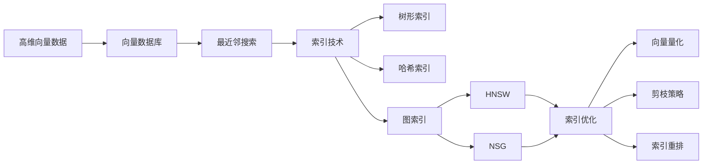

# 深入解析向量数据库的索引技术与优化方法

关键词：向量数据库、索引技术、优化方法、ANN、HNSW、IVF、PQ

## 1. 背景介绍
### 1.1  问题的由来
随着人工智能和大数据技术的快速发展,海量高维数据的存储和检索需求日益增长。传统的关系型数据库难以有效处理高维向量数据,向量数据库应运而生。向量数据库通过对高维向量数据建立索引,实现了高效的相似性搜索和最近邻查询。然而,高维数据的"维度灾难"给向量数据库的索引构建和查询性能带来了巨大挑战。

### 1.2  研究现状
目前,学术界和工业界已经提出了多种向量数据库索引技术,如树形索引、哈希索引、图索引等。其中,基于图的近似最近邻搜索(Graph-based Approximate Nearest Neighbor Search, ANNS)因其高效的索引构建和查询性能而备受关注。代表性的算法包括HNSW(Hierarchical Navigable Small World)、NSG(Navigating Spreading-out Graph)等。此外,一些量化方法如乘积量化(Product Quantization, PQ)也被用于压缩高维向量,加速索引构建和查询。

### 1.3  研究意义
深入研究向量数据库的索引技术与优化方法,对于提升向量数据库的性能、扩展其应用场景具有重要意义。高效的索引结构和查询算法可以大幅提高向量数据的检索效率,节省存储和计算资源。同时,索引技术的创新也将推动人工智能、计算机视觉、自然语言处理等领域的发展。

### 1.4  本文结构
本文将围绕向量数据库的索引技术与优化方法展开深入探讨。第2部分介绍向量数据库的核心概念;第3部分重点分析几种主流的索引算法原理;第4部分给出索引优化的数学模型和公式推导;第5部分通过具体的代码实例演示索引的实现;第6部分讨论向量数据库索引的实际应用场景;第7部分推荐相关的工具和学习资源;第8部分总结全文,展望未来的研究方向。

## 2. 核心概念与联系
向量数据库是一种专门存储和检索高维向量数据的数据库系统。与传统的关系型数据库不同,向量数据库中的数据项是高维实值向量,每个维度表示数据的一个特征属性。向量之间的相似性通过距离度量(如欧氏距离、余弦相似度)来衡量。

向量数据库的核心操作是最近邻(Nearest Neighbor, NN)搜索,即给定一个查询向量,找到数据库中与之最相似的K个向量。为了加速最近邻搜索,需要在向量数据上建立索引。高维向量数据的索引技术主要包括:

1. 树形索引:如KD树、R树等,通过空间划分和分层组织向量。
2. 哈希索引:如LSH(Locality Sensitive Hashing),将相似向量映射到同一个哈希桶。
3. 图索引:如HNSW、NSG,基于图的数据结构对向量进行链接和搜索。

索引的构建过程需要考虑如何平衡时间和空间复杂度,以及如何权衡精确度和召回率。索引的查询则涉及到图遍历、启发式搜索等算法。为进一步提高性能,可以在索引的基础上应用一些优化技术,如向量量化、剪枝、重排等。

下图展示了向量数据库索引技术的发展脉络和相互联系:



## 3. 核心算法原理 & 具体操作步骤
### 3.1  算法原理概述
本节重点介绍两种基于图的索引算法:HNSW和NSG。

HNSW(Hierarchical Navigable Small World)通过构建一个多层次的小世界图来索引高维向量。小世界图具有节点度分布不均匀、平均路径长度较短的特点,有利于快速搜索。HNSW从底层开始,逐层构建索引图。在第l层,每个节点选择M_l个最近邻作为其邻居。不同层之间通过上采样和选边连接。查询时,从顶层开始,利用贪心算法沿着图边导航至底层,直到无法找到更近的节点。

NSG(Navigating Spreading-out Graph)基于HNSW,通过边的"延展性"来构建更稀疏的索引图。NSG引入了一个超参数C,控制每个节点的出边数。在建图时,NSG先选取一个随机节点作为导航点,然后从其他节点出发,沿最近邻方向导航至导航点,并选择沿途的C个节点作为出边邻居。查询过程与HNSW类似,但NSG的图更加稀疏,有利于减少内存占用和加速搜索。

### 3.2  算法步骤详解
以下详细介绍HNSW的索引构建和查询步骤。

索引构建:
1. 初始化最底层图G_0,将所有向量节点加入G_0。
2. 从l=1开始,逐层构建索引图G_l:
   a) 从G_{l-1}中选取部分节点加入G_l,采用随机或启发式策略。
   b) 对于G_l中的每个节点v,从G_{l-1}中选取其M_l个最近邻,作为v在G_l中的邻居。
   c) 在G_l和G_{l-1}之间添加双向连边。
3. 逐层向上构建,直到最顶层图G_L只包含一个节点。

查询过程:
1. 从顶层图G_L开始,初始化当前图G为G_L,候选集C为空。
2. 将查询向量q插入当前图G,找到其最近邻v_c。
3. 将v_c加入候选集C,并将其未访问过的邻居加入一个先进先出队列W。
4. 从W中取出首个元素v,计算其与q的距离d_v。
   - 若d_v大于C中最远节点的距离,丢弃v。
   - 否则,将v加入C,并将其未访问过的邻居加入W。
5. 重复步骤4,直到W为空。记C中距离q最近的节点为v*。
6. 若G不是最底层图,则跳转到与v*连边的下一层图,将当前图G更新为下一层图,转步骤2。
7. 若G是最底层图,则输出候选集C作为最近邻搜索结果。

### 3.3  算法优缺点
HNSW和NSG的优点在于:
1. 索引构建和查询的时间复杂度均为亚线性,优于传统的线性扫描和KD树等方法。
2. 基于图的索引结构更适合高维数据,避免了维度灾难。
3. 多层次结构和导航策略使得搜索可以快速收敛到最近邻。

它们的缺点包括:
1. 构建索引的过程比较耗时,尤其是在大规模数据集上。
2. 索引的参数(如每层的M_l)需要根据数据分布和应用需求进行调优。
3. 为了提高召回率,查询过程仍可能访问较多的节点。

### 3.4  算法应用领域
基于图的向量索引算法在许多领域得到应用,例如:
1. 推荐系统:对用户和物品的向量表示进行最近邻搜索,实现个性化推荐。
2. 图像检索:对图像特征向量建立索引,实现以图搜图。
3. 语义搜索:对词向量进行索引,实现相似词查询和文本匹配。
4. 药物发现:对分子指纹向量建立索引,加速新药筛选。

## 4. 数学模型和公式 & 详细讲解 & 举例说明
### 4.1  数学模型构建
为了刻画向量数据库索引的优化目标,我们构建如下数学模型:

给定一个向量集合 $\mathcal{X} = \lbrace x_1, x_2, \cdots, x_n \rbrace$,其中 $x_i \in \mathbb{R}^d$ 表示一个d维实值向量。定义距离函数 $dist(x,y)$ 度量向量之间的相似性,常见的距离函数包括欧氏距离、余弦距离等。

令 $G=(V,E)$ 表示一个无向图,其中节点集 $V=\mathcal{X}$,边集 $E$ 表示节点之间的相似性关系。我们的目标是构建一个索引图 $G$,使得对于任意查询向量 $q$,可以快速找到其在 $\mathcal{X}$ 中的K个最近邻 $\mathcal{N}_K(q)$。

我们定义索引图的平均出度为 $\bar{d}=\frac{2|E|}{|V|}$,平均搜索路径长度为 $\bar{l}$。则索引优化的目标可以表示为最小化搜索代价 $C$:

$$
\min C = \alpha \cdot \bar{d} + \beta \cdot \bar{l} + \gamma \cdot (1-recall)
$$

其中 $\alpha,\beta,\gamma$ 为权重系数,$recall$ 为搜索的召回率。直观地,我们希望索引图的出度尽可能小,搜索路径尽可能短,同时保证较高的召回率。

### 4.2  公式推导过程
下面我们推导HNSW算法中的一些关键公式。

在第l层图 $G_l$ 的构建过程中,对于节点 $v$,我们选择其在 $G_{l-1}$ 中的M_l个最近邻作为邻居。M_l的大小控制了图的稠密程度,可以通过下式估计:

$$
M_l = M_0 \cdot (\frac{n_l}{n_0})^{-a}
$$

其中 $M_0$ 为最底层图的M值,$n_l$ 为第l层图的节点数,$a$为衰减系数,通常取值在0.5左右。

在查询过程中,我们利用贪心算法不断更新候选集C。假设当前候选集为 $C=\lbrace c_1,c_2,\cdots,c_k \rbrace$,查询向量为q,则下一个待访问节点 $v^*$ 可以通过以下公式选择:

$$
v^* = \arg\min_{v \in N(C)} dist(q,v)
$$

其中 $N(C)$ 表示候选集C中节点的所有未访问邻居的并集。

在实际实现中,我们可以维护一个最大堆来动态更新候选集,堆的大小为K。每次从堆顶取出距离最小的节点进行扩展,直到堆为空或达到预设的搜索深度。

### 4.3  案例分析与讲解
下面我们以一个简单的例子来说明HNSW的索引构建和查询过程。

假设有一个10维向量集合 $\mathcal{X}=\lbrace x_1,x_2,\cdots,x_8 \rbrace$,每个向量的具体值如下:

```
x_1: [0.1, 0.2, 0.3, 0.4, 0.5, 0.6, 0.7, 0.8, 0.9, 1.0]
x_2: [0.2, 0.3, 0.4, 0.5, 0.6, 0.7, 0.8, 0.9, 1.0, 1.1] 
x_3: [0.3, 0.4, 0.5, 0.6, 0.7, 0.8, 0.9, 1.0, 1.1, 1.2]
x_4: [0.4, 0.5, 0.6, 0.7, 0.8, 0.9, 1.0, 1.1, 1.2, 1.3]
x_5: [0.9, 1.0, 1.1, 1.2, 1.3, 1.4, 1.5, 1.6, 1.7, 1.8]
x_6: [1.0, 1.1, 1.2, 1.3, 1.4, 1.5, 1.6, 1.7, 1