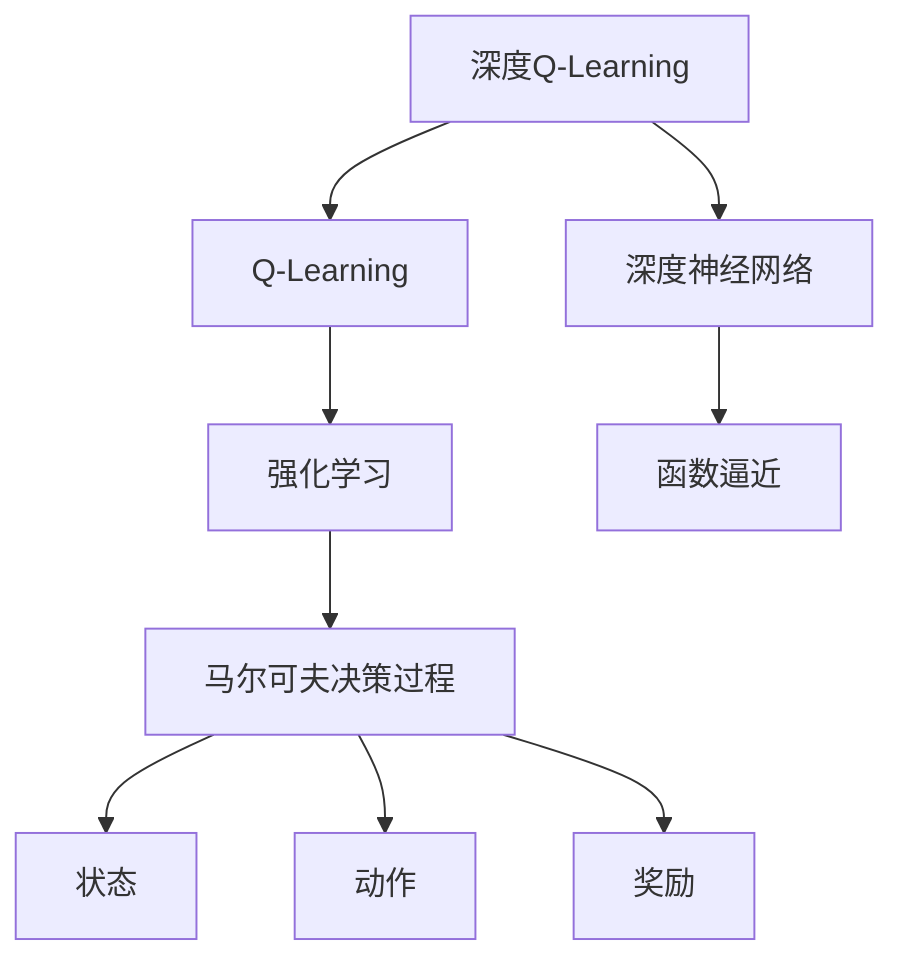

好的,我会严格按照您提供的要求和模板结构,以"深度Q-learning:在新闻推荐中的应用"为主题,撰写一篇专业的技术博客文章。文章将会包含完整的内容,使用Markdown格式,公式采用LaTex格式,并尽最大努力提供核心概念原理和架构的Mermaid流程图。

# 深度 Q-learning:在新闻推荐中的应用

## 1. 背景介绍

### 1.1 问题的由来

在当今信息时代,新闻媒体面临着前所未有的挑战。海量的新闻信息源源不断产生,如何为用户推荐最感兴趣、最贴合个人需求的新闻成为了一个亟待解决的难题。传统的新闻推荐系统主要依赖编辑人员的主观判断和用户历史浏览记录,缺乏个性化和智能化,无法充分满足用户的多样化需求。

### 1.2 研究现状  

为解决这一难题,研究人员开始将人工智能技术应用于新闻推荐领域。其中,深度强化学习(Deep Reinforcement Learning)因其出色的决策优化能力而备受关注。Deep Q-Learning作为强化学习中的一种重要算法,已被成功应用于多个领域,如游戏AI、机器人控制等,展现出优异的性能。

### 1.3 研究意义

将Deep Q-Learning引入新闻推荐系统,可以自动学习用户的偏好,根据用户的历史行为动态调整推荐策略,从而提供个性化、高质量的新闻推荐服务。这不仅能提高用户体验,增强用户粘性,还可以为新闻媒体带来更多商业价值。同时,该技术的成功应用也将推动人工智能在其他推荐系统领域的发展。

### 1.4 本文结构

本文将全面介绍Deep Q-Learning在新闻推荐中的应用。首先阐述核心概念及其联系,然后深入探讨算法原理、数学模型及公式推导,并通过实例分析加以说明。接下来介绍项目实践的代码实现细节。最后总结该技术的实际应用场景、发展趋势和面临的挑战。

## 2. 核心概念与联系

深度Q-Learning将深度神经网络与传统Q-Learning算法相结合,旨在解决复杂环境下的决策优化问题。其核心思想是使用深度神经网络来估计Q值函数,而非查表或者其他函数逼近方式。

在新闻推荐场景中,我们可以将用户的浏览历史、个人特征等作为状态,将推荐新闻的动作作为动作,用户对推荐新闻的反馈(如点击、关注等)作为奖励信号,从而将新闻推荐问题建模为一个马尔可夫决策过程。通过Deep Q-Learning算法,系统可以不断探索和利用,学习到一个最优的新闻推荐策略。

## 3. 核心算法原理及具体操作步骤

### 3.1 算法原理概述  

Deep Q-Learning算法的核心思想是使用一个深度神经网络来估计Q值函数,而不是使用查表或其他函数逼近方式。其算法流程如下:

1. 初始化一个深度神经网络(如卷积神经网络或递归神经网络),用于估计Q值函数。
2. 初始化经验回放池(Experience Replay Pool),用于存储探索过程中的状态-动作-奖励-下一状态转换。
3. 对于每个时间步:
    - 根据当前状态,通过$\epsilon$-贪婪策略选择一个动作。
    - 执行选择的动作,获得奖励和下一状态。
    - 将(状态,动作,奖励,下一状态)转换存入经验回放池。
    - 从经验回放池中随机采样一个批次的转换。
    - 计算Q目标值,使用均方差损失函数更新神经网络参数。
4. 重复第3步,直到收敛或达到最大迭代次数。

### 3.2 算法步骤详解

1. **初始化深度神经网络**

   我们可以使用多层感知机(MLP)、卷积神经网络(CNN)或递归神经网络(RNN)等不同类型的神经网络来估计Q值函数。网络的输入通常是状态的特征向量,输出是每个动作对应的Q值。

2. **初始化经验回放池**

   经验回放池(Experience Replay Pool)是一个固定大小的缓冲区,用于存储探索过程中的状态-动作-奖励-下一状态转换。通过从该池中随机采样,可以打破数据之间的相关性,提高训练的稳定性和效率。

3. **$\epsilon$-贪婪策略选择动作**

   在每个时间步,我们需要根据当前状态选择一个动作。$\epsilon$-贪婪策略是一种常用的动作选择策略,它在exploitation(利用已学习的知识选择当前最优动作)和exploration(探索新的动作以获取更多经验)之间寻求平衡。

   具体来说,以概率$\epsilon$选择一个随机动作(exploration),以概率$1-\epsilon$选择当前状态下Q值最大的动作(exploitation)。$\epsilon$的值通常会随着训练的进行而逐渐减小,以增加exploitation的比重。

4. **存储转换并采样批次数据**

   执行选择的动作后,我们将(状态,动作,奖励,下一状态)转换存入经验回放池。然后从池中随机采样一个批次的转换,用于神经网络的训练更新。

5. **计算Q目标值并更新神经网络**

   对于每个采样的转换,我们需要计算其Q目标值,作为神经网络的监督目标。Q目标值的计算公式如下:

   $$Q_{target} = r + \gamma \max_{a'}Q(s', a'; \theta^-)$$

   其中:
   - $r$是获得的奖励
   - $\gamma$是折现因子,用于权衡未来奖励的重要性
   - $\max_{a'}Q(s', a'; \theta^-)$是下一状态$s'$下,所有可能动作的最大Q值,使用了一个独立的目标网络(Target Network)$\theta^-$进行估计,以提高训练稳定性。

   使用均方差损失函数,我们可以最小化当前Q值与Q目标值之间的差异:

   $$L(\theta) = \mathbb{E}_{(s,a,r,s')\sim D}\left[(Q(s,a;\theta) - Q_{target})^2\right]$$

   其中$D$是经验回放池。通过随机梯度下降等优化算法,更新神经网络参数$\theta$,使得Q值函数逼近Q目标值。

6. **重复迭代直至收敛**

   重复上述步骤,直到算法收敛或达到最大迭代次数。在实际应用中,我们还需要设置其他超参数,如目标网络更新频率、学习率衰减策略等,以提高算法性能。

### 3.3 算法优缺点

**优点:**

- 无需手动设计特征,可以直接从原始数据中自动学习特征表示。
- 通过深度神经网络的强大近似能力,能够处理高维、复杂的状态空间。
- 结合经验回放池,可以提高数据利用效率,加速训练收敛。
- 算法具有很好的通用性,可应用于不同的决策问题领域。

**缺点:**

- 算法收敛性能受到神经网络结构和超参数设置的影响较大。
- 在高维、稀疏的状态空间中,探索效率较低,需要大量的样本数据。
- 算法的可解释性较差,决策过程是一个黑箱操作。
- 在连续动作空间问题中,需要一些改进方法,如Deep Deterministic Policy Gradient等。

### 3.4 算法应用领域

Deep Q-Learning算法不仅可以应用于新闻推荐领域,还可以广泛用于其他决策优化问题,如:

- 游戏AI: Atari游戏、AlphaGo等
- 机器人控制: 机械臂控制、无人驾驶等
- 对话系统: 基于上下文的自动对话
- 广告投放: 个性化广告推荐
- 资源调度: 数据中心资源调度
- 金融交易: 自动化交易决策

## 4. 数学模型和公式详细讲解及举例说明

### 4.1 数学模型构建

在新闻推荐场景中,我们可以将问题建模为一个马尔可夫决策过程(Markov Decision Process, MDP)。MDP通常定义为一个五元组$(S, A, P, R, \gamma)$:

- $S$是状态空间的集合
- $A$是动作空间的集合 
- $P(s'|s,a)$是状态转移概率,表示在状态$s$执行动作$a$后,转移到状态$s'$的概率
- $R(s,a)$是奖励函数,表示在状态$s$执行动作$a$后获得的奖励
- $\gamma \in [0,1)$是折现因子,用于权衡未来奖励的重要性

在新闻推荐中,我们可以将:

- 用户的浏览历史、个人特征等作为状态$s \in S$
- 推荐新闻的动作作为$a \in A$  
- 用户对推荐新闻的反馈(如点击、关注等)作为奖励$R(s,a)$

我们的目标是通过学习,找到一个最优策略$\pi^*$,使得在任意状态$s$下,执行该策略$\pi^*(s)$可以最大化预期的累积奖励:

$$\pi^* = \arg\max_\pi \mathbb{E}\left[\sum_{t=0}^\infty \gamma^t R(s_t, a_t) | a_t = \pi(s_t)\right]$$

Deep Q-Learning通过使用深度神经网络来估计最优Q值函数,从而近似求解最优策略$\pi^*$。

### 4.2 公式推导过程

Q-Learning算法的目标是找到一个最优的Q值函数$Q^*(s,a)$,它表示在状态$s$下执行动作$a$后,可以获得的最大预期累积奖励。根据Bellman方程,最优Q值函数满足:

$$Q^*(s,a) = \mathbb{E}_{s' \sim P}\left[R(s,a) + \gamma \max_{a'} Q^*(s',a')\right]$$

其中$\gamma$是折现因子,$P$是状态转移概率。

为了估计$Q^*(s,a)$,我们可以使用一个参数化的函数$Q(s,a;\theta)$,其中$\theta$是函数参数。在Deep Q-Learning中,这个函数是一个深度神经网络。我们的目标是通过最小化均方差损失函数,使$Q(s,a;\theta)$逼近$Q^*(s,a)$:

$$L(\theta) = \mathbb{E}_{(s,a,r,s')\sim D}\left[\left(Q(s,a;\theta) - y\right)^2\right]$$

其中$D$是经验回放池,包含了(状态,动作,奖励,下一状态)的转换样本;$y$是Q目标值,定义为:

$$y = r + \gamma \max_{a'} Q(s',a';\theta^-)$$

这里引入了一个独立的目标网络$\theta^-$,用于估计下一状态的最大Q值,以提高训练稳定性。目标网络的参数$\theta^-$会定期同步到当前网络的参数$\theta$。

通过随机梯度下降等优化算法,我们可以最小化损失函数$L(\theta)$,从而使$Q(s,a;\theta)$逼近最优Q值函数$Q^*(s,a)$。

### 4.3 案例分析与讲解

假设我们有一个新闻推荐场景,用户$u_1$的状态$s_1$表示为一个特征向量,包括年龄、性别、职业、浏览历史等信息。我们的动作空间$A$是所有可推荐的新闻集合。

在时间步$t=1$,我们的Deep Q-Network输出了每个动作(新闻)对应的Q值:

$$Q(s_1, a_1;\theta) = 0.7, Q(s_1, a_2;\theta) = 0.5, \cdots$$

根据$\epsilon$-贪婪策