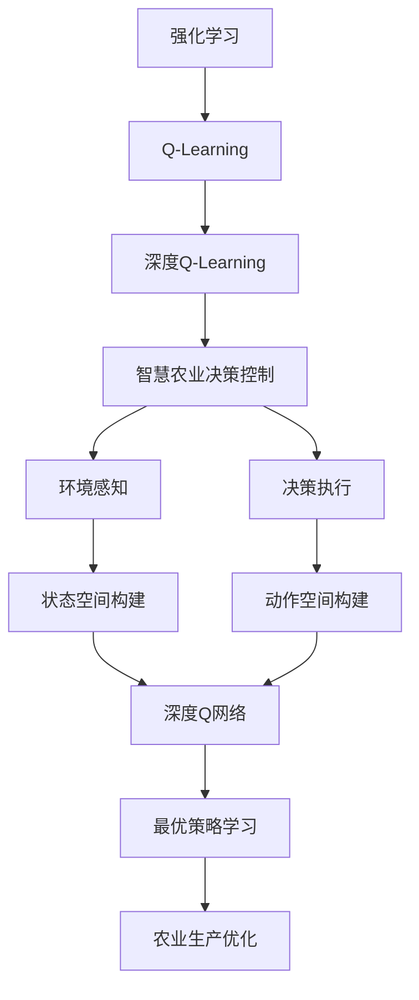

# 深度 Q-learning：在智慧农业中的应用

## 1. 背景介绍

### 1.1 问题的由来

随着世界人口的不断增长和气候变化的加剧,确保粮食安全和可持续农业发展已成为全球关注的重大课题。传统农业生产方式面临着诸多挑战,如资源利用效率低下、环境污染严重、劳动力短缺等。因此,亟需开发新型智能化农业技术,以提高农业生产效率、降低资源消耗、减少环境污染。

智慧农业(Smart Agriculture)是一种集成了物联网(IoT)、大数据分析、人工智能(AI)等先进技术的现代农业生产模式。它通过部署各种传感器和执行器,实时监测农场环境和作物生长状况,并基于AI算法进行智能决策,自动调节农业生产过程,从而实现精准高效的农业生产管理。

在智慧农业系统中,决策控制是一个关键环节。传统的基于规则的决策系统存在局限性,难以处理复杂动态环境下的决策问题。而基于强化学习(Reinforcement Learning)的决策控制方法,能够通过与环境的交互来学习最优决策策略,具有很强的适应性和鲁棒性,因此备受关注。

### 1.2 研究现状

近年来,深度强化学习(Deep Reinforcement Learning)技术的兴起,为解决复杂决策控制问题提供了新的思路。深度Q学习(Deep Q-Learning)作为深度强化学习的一种主要算法,已在多个领域取得了卓越的应用成果,如游戏AI、机器人控制等。

在农业领域,一些学者开始尝试将深度Q学习应用于智慧农业决策系统。例如,有研究将其用于温室环境控制,通过调节温度、湿度、光照等环境因素,实现作物生长的最优化。另有研究将其应用于农场灌溉决策,根据作物需水量、土壤湿度、天气预报等信息,制定最佳的灌溉策略,达到节水增产的目的。

然而,由于农业生产过程的复杂性和多变性,现有的深度Q学习应用研究还存在一些不足,如状态空间和动作空间设计不合理、奖赏函数设计欠缺农业专业知识等,导致学习效率低下、决策效果不佳。因此,如何针对农业生产的特点,改进和优化深度Q学习算法,仍是一个亟待解决的问题。

### 1.3 研究意义

将深度Q学习算法成功应用于智慧农业决策控制系统,具有重要的理论意义和实际应用价值:

- 理论意义:
  - 丰富和发展深度强化学习在农业领域的应用研究
  - 探索深度Q学习算法在处理连续状态、动作空间和复杂环境下的应用
  - 推动人工智能、机器学习等前沿技术在农业领域的创新应用

- 应用价值:
  - 提高农业生产的自动化和智能化水平,实现精准高效的决策控制
  - 优化农业资源利用效率,减少资源浪费,促进可持续农业发展
  - 降低农业生产成本,提高农民收益,保障粮食安全和供给

### 1.4 本文结构

本文将系统介绍将深度Q学习应用于智慧农业决策控制系统的研究工作。

首先阐述深度Q学习的核心概念、算法原理和数学模型,并分析其在农业领域应用的挑战。

其次,详细讲解改进的深度Q学习算法在智慧农业决策中的具体实现,包括状态空间、动作空间、奖赏函数的设计,以及算法流程等。

然后,通过实际案例分析,展示该算法在农场环境控制、作物管理等场景中的应用效果。

最后,总结研究成果,讨论深度Q学习在智慧农业中的发展趋势和面临的挑战,并对未来的研究方向进行展望。

## 2. 核心概念与联系

深度Q学习(Deep Q-Learning)是将深度神经网络引入传统Q学习算法的一种强化学习方法。它融合了深度学习在处理高维数据的优势和Q学习在决策控制中的应用,能够有效解决复杂环境下的决策问题。

在智慧农业决策控制系统中,深度Q学习扮演着关键角色。它通过感知农场环境(如气象、土壤、作物等)构建状态空间,并根据可执行的农业生产操作(如施肥、灌溉、调节温湿度等)构建动作空间。

深度Q网络则作为智能体,通过不断与环境交互,学习状态-动作对应的最优Q值函数,从而得到最佳的决策策略。该策略指导智能体在各种状态下选择合适的动作,实现农业生产的优化管理。

值得注意的是,状态空间、动作空间和奖赏函数的设计对深度Q学习算法的性能至关重要。合理的设计需要将农业专业知识很好地融入,才能保证算法的收敛性和决策效果。

## 3. 核心算法原理 & 具体操作步骤

### 3.1 算法原理概述

深度Q学习算法的核心思想是使用深度神经网络来近似传统Q学习中的Q值函数,从而解决高维状态空间和动作空间下的决策问题。

在Q学习中,智能体与环境交互,获取当前状态$s_t$,执行动作$a_t$,并观测到由环境返回的奖赏$r_t$和新状态$s_{t+1}$。目标是学习一个Q函数$Q(s,a)$,它能够估计在状态$s$下执行动作$a$后,可获得的长期累积奖赏。

传统的Q学习使用表格等数据结构存储Q值,但在高维状态和动作空间下,这种方法将变得低效甚至不可行。深度Q学习通过使用深度神经网络来拟合Q函数,从而克服了这一缺陷。

具体来说,深度Q网络以状态$s$为输入,输出一个Q值向量,其中每个元素对应着在该状态下执行不同动作的Q值估计。在训练过程中,通过不断与环境交互获取数据,并最小化Q值预测与实际Q值之间的差异,来优化网络参数,逐步改善Q函数的近似精度。

### 3.2 算法步骤详解

深度Q学习算法的具体步骤如下:

1. **初始化**
   - 初始化深度Q网络,包括网络结构和参数
   - 初始化经验回放池(Experience Replay)
   - 初始化探索率(Exploration Rate)等超参数

2. **与环境交互**
   - 根据当前状态$s_t$和探索策略(如$\epsilon$-贪婪),选择一个动作$a_t$
   - 在环境中执行动作$a_t$,获得奖赏$r_t$和新状态$s_{t+1}$
   - 将转移记录$(s_t, a_t, r_t, s_{t+1})$存入经验回放池

3. **从经验回放池采样**
   - 从经验回放池中随机采样一个批次的转移记录

4. **计算目标Q值**
   - 对于每个转移记录$(s_t, a_t, r_t, s_{t+1})$:
     - 使用当前Q网络计算$Q(s_t, a_t)$
     - 使用目标Q网络计算$\max_a Q(s_{t+1}, a)$
     - 计算目标Q值: $y_t = r_t + \gamma \max_a Q(s_{t+1}, a)$

5. **更新Q网络**
   - 计算损失函数: $L = \frac{1}{N}\sum_{i=1}^N (y_t^{(i)} - Q(s_t^{(i)}, a_t^{(i)}))^2$
   - 使用优化算法(如梯度下降)最小化损失函数,更新Q网络参数

6. **更新目标Q网络**
   - 每隔一定步骤,将Q网络的参数复制到目标Q网络

7. **更新探索率**
   - 根据策略(如指数衰减),逐步降低探索率

8. **重复2-7步骤,直至算法收敛**

需要注意的是,在实际应用中,还需要对算法进行一些改进和优化,如双重Q学习(Double Q-Learning)、优先经验回放(Prioritized Experience Replay)等,以提高算法的稳定性和效率。

### 3.3 算法优缺点

**优点:**

- 通过深度神经网络拟合Q函数,能够有效处理高维状态空间和动作空间
- 无需人为设计状态特征,可直接从原始数据中自动学习特征表示
- 具有很强的泛化能力,能够应对复杂动态环境
- 算法框架简单,易于实现和扩展

**缺点:**

- 需要大量的环境交互数据进行训练,数据效率较低
- 算法收敛性能受到奖赏函数设计的影响较大
- 存在潜在的不稳定性,如Q值过估计等问题
- 训练过程计算开销较大,需要GPU等硬件加速

### 3.4 算法应用领域

深度Q学习算法已在多个领域取得了成功应用,主要包括:

- **游戏AI**: 如AlphaGo、Atari游戏等,深度Q学习展现出超越人类水平的游戏能力。
- **机器人控制**: 用于机器人的运动规划、操作控制等,实现高效智能化控制。
- **自动驾驶**: 应用于自动驾驶决策系统,确保行车安全和高效。
- **智能系统控制**: 如数据中心冷却系统、电网负载控制等,提高系统效率。
- **金融交易**: 用于自动化交易策略优化,实现量化交易。
- **智能物流**: 应用于路径规划、调度优化等,提高物流效率。

在农业领域,深度Q学习的应用还处于初级阶段,主要集中在温室环境控制、作物管理等方面。本文将重点介绍其在智慧农业决策控制系统中的具体应用。

## 4. 数学模型和公式 & 详细讲解 & 举例说明

### 4.1 数学模型构建

在深度Q学习算法中,我们需要构建一个马尔可夫决策过程(Markov Decision Process, MDP)来对环境进行建模。MDP可以用一个五元组$(S, A, P, R, \gamma)$来表示,其中:

- $S$是状态空间的集合
- $A$是动作空间的集合
- $P(s'|s,a)$是状态转移概率,表示在状态$s$下执行动作$a$后,转移到状态$s'$的概率
- $R(s,a)$是奖赏函数,表示在状态$s$下执行动作$a$后获得的即时奖赏
- $\gamma \in [0,1]$是折现因子,用于权衡即时奖赏和长期累积奖赏的重要性

在智慧农业决策控制系统中,我们需要根据具体的应用场景,合理设计状态空间$S$、动作空间$A$和奖赏函数$R$,以构建出适当的MDP模型。

例如,在温室环境控制场景中,状态空间$S$可以包括温度、湿度、光照强度、二氧化碳浓度等环境参数,以及作物生长状态等;动作空间$A$可以包括调节加热/制冷系统、喷雾加湿/通风除湿、开启/关闭补光灯等操作;奖赏函数$R$可以根据作物生长状况、能源消耗等因素设计,以实现最大化作物产量和最小化能源消耗的目标。

### 4.2 公式推导过程

在深度Q学习算法中,我们的目标是找到一个最优的Q函数$Q^*(s,a)$,它能够估计在状态$s$下执行动作$a$后,可获得的最大化期望累积奖赏。根据贝尔