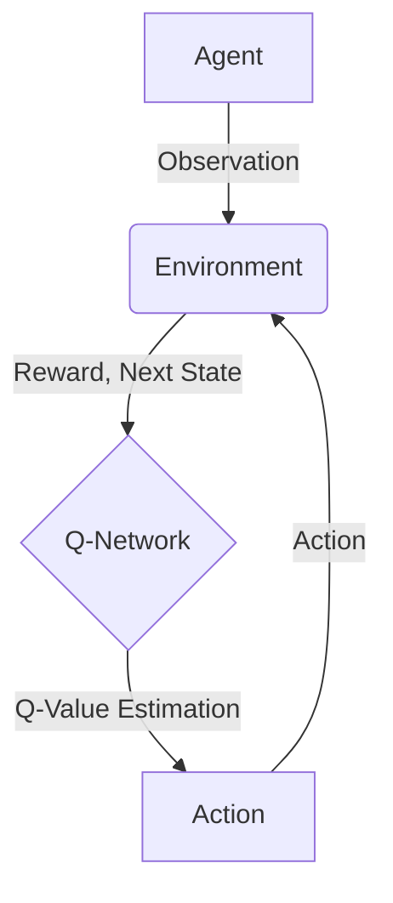

# 深度 Q-learning：未来人工智能法规的挑战

## 1. 背景介绍

### 1.1 问题的由来

随着人工智能(AI)技术的快速发展,越来越多的领域开始采用AI系统来提高效率和决策能力。然而,AI系统的决策过程往往是一个"黑箱",缺乏透明度和可解释性,这可能会导致一些潜在的风险和法律问题。因此,制定有效的AI法规和监管机制,确保AI系统的安全性、公平性和可解释性,已经成为当前亟待解决的重要课题。

### 1.2 研究现状  

目前,一些国家和组织已经开始制定AI相关的法规和伦理准则,如欧盟的《人工智能伦理准则》、美国的《人工智能原则》等。然而,这些准则大多比较笼统,缺乏具体的技术细节和实施路径。同时,AI技术的快速发展也给法规制定带来了新的挑战。

### 1.3 研究意义

制定合理的AI法规不仅可以保护公众利益,规避潜在风险,还能为AI技术的健康发展营造良好的环境。因此,探索如何将AI技术与法律框架有效结合,制定切实可行的AI法规,具有重要的理论和现实意义。

### 1.4 本文结构

本文将重点探讨如何基于深度强化学习算法(Deep Q-learning)构建可解释、可控制的AI决策系统,并讨论在制定AI法规时应该考虑的关键因素和挑战。文章首先介绍深度Q-learning的核心概念和原理,然后详细阐述其在AI决策系统中的应用,包括数学模型、算法实现和案例分析等。最后,本文将总结深度Q-learning在AI法规制定中的作用,并对未来的发展趋势和挑战进行展望。

## 2. 核心概念与联系

深度Q-learning是一种结合了深度神经网络和强化学习的算法,它可以让AI智能体(Agent)通过与环境的交互,自主学习如何做出最优决策。其核心思想是使用神经网络来近似Q函数(Action-Value Function),从而估计在某个状态下采取某个动作所能获得的长期累积奖励。

在上图中,Agent通过观察当前环境状态,将状态输入到Q网络中,Q网络会输出每个可能动作对应的Q值估计。Agent会选择Q值最大的动作执行,并获得相应的奖励和新的环境状态,循环往复。通过不断地与环境交互,Q网络会逐渐学习到一个近似最优的Q函数,从而使Agent的决策策略不断优化。

深度Q-learning的优势在于:

1. **无模型(Model-Free)**: 不需要事先建立环境的数学模型,可以直接从数据中学习。
2. **端到端学习(End-to-End Learning)**: 使用神经网络直接从原始输入(如图像、文本等)中学习,无需人工设计特征。
3. **可解释性(Interpretability)**: Q网络的输出可以解释为在某状态下采取某动作的预期累积奖励,具有一定的可解释性。

这些特性使得深度Q-learning非常适合应用于复杂、动态的决策场景,如自动驾驶、机器人控制等。同时,其可解释性也为制定AI法规提供了一种技术路径。

## 3. 核心算法原理 & 具体操作步骤

### 3.1 算法原理概述

深度Q-learning算法的核心思想是使用神经网络来近似Q函数,通过与环境交互不断更新Q网络的参数,使其逐渐收敛到最优的Q函数。具体来说,算法包括以下几个关键步骤:

1. **初始化Q网络**:使用随机参数初始化一个Q网络,用于估计每个状态-动作对的Q值。
2. **采样交互数据**:Agent与环境交互,采集一系列的状态-动作-奖励-下一状态的转移样本。
3. **更新Q网络**:使用采样到的数据,通过最小化时序差分(Temporal Difference)误差来更新Q网络的参数。
4. **生成决策**:在新的状态下,Agent根据Q网络的输出选择Q值最大的动作执行。
5. **重复训练**:重复执行步骤2-4,直到Q网络收敛到最优Q函数。

### 3.2 算法步骤详解

1. **初始化Q网络**

   我们使用一个深度神经网络作为Q网络,其输入为当前环境状态$s_t$,输出为每个可能动作$a$对应的Q值估计$Q(s_t, a; \theta)$,其中$\theta$为网络参数。初始时,网络参数$\theta$被随机初始化。

2. **采样交互数据**

   Agent与环境交互,在时间步$t$观察到状态$s_t$,根据当前的Q网络选择动作$a_t = \arg\max_a Q(s_t, a; \theta_t)$,执行该动作并获得奖励$r_t$和下一状态$s_{t+1}$,将转移样本$(s_t, a_t, r_t, s_{t+1})$存入经验回放池(Experience Replay Buffer)。

3. **更新Q网络**

   从经验回放池中随机采样一个小批量的转移样本,计算每个样本的时序差分(TD)目标:

   $$y_t = r_t + \gamma \max_{a'} Q(s_{t+1}, a'; \theta_t)$$

   其中$\gamma$是折现因子,用于平衡即时奖励和长期累积奖励。然后,使用均方误差(MSE)损失函数最小化Q网络的预测值与TD目标之间的差距:

   $$L(\theta_t) = \mathbb{E}_{(s_t, a_t, r_t, s_{t+1}) \sim D}\left[(y_t - Q(s_t, a_t; \theta_t))^2\right]$$

   其中$D$是经验回放池。通过梯度下降法更新Q网络的参数$\theta_t$,使损失函数$L(\theta_t)$最小化。

4. **生成决策**

   在新的状态$s_{t+1}$下,Agent根据当前的Q网络选择Q值最大的动作执行:

   $$a_{t+1} = \arg\max_a Q(s_{t+1}, a; \theta_t)$$

5. **重复训练**

   重复执行步骤2-4,直到Q网络收敛到最优Q函数。在训练过程中,我们还可以采用一些技巧来提高算法的性能和稳定性,如经验回放(Experience Replay)、目标网络(Target Network)和$\epsilon$-贪婪探索(Epsilon-Greedy Exploration)等。

### 3.3 算法优缺点

**优点**:

- 无需建立环境模型,可直接从数据中学习,适用范围广泛。
- 端到端学习,无需人工设计特征,可处理原始高维输入。
- Q网络的输出具有一定的可解释性,有助于制定AI法规。

**缺点**:

- 收敛速度较慢,需要大量的训练数据和计算资源。
- 存在不稳定性,需要采用一些技巧(如经验回放、目标网络等)来提高训练稳定性。
- 面临维度灾难问题,在高维连续状态空间下性能会下降。

### 3.4 算法应用领域

深度Q-learning算法可以应用于各种序列决策问题,如:

- 游戏AI(如AlphaGo、Dota2等)
- 机器人控制与规划
- 自动驾驶决策系统
- 资源调度与优化
- 对话系统与自然语言处理
- 金融投资决策
- ...

由于其无模型、端到端学习和可解释性的特点,深度Q-learning在复杂环境下表现出色,并为AI法规的制定提供了一种技术路径。

## 4. 数学模型和公式 & 详细讲解 & 举例说明

### 4.1 数学模型构建

在深度Q-learning中,我们需要构建一个数学模型来描述强化学习过程。我们将环境建模为一个马尔可夫决策过程(Markov Decision Process, MDP),由一个五元组$(S, A, P, R, \gamma)$表示:

- $S$是状态空间,包含所有可能的环境状态。
- $A$是动作空间,包含智能体可以执行的所有动作。
- $P(s' | s, a)$是状态转移概率,表示在状态$s$下执行动作$a$后,转移到状态$s'$的概率。
- $R(s, a, s')$是奖励函数,表示在状态$s$下执行动作$a$并转移到状态$s'$时获得的即时奖励。
- $\gamma \in [0, 1)$是折现因子,用于平衡即时奖励和长期累积奖励。

在MDP中,我们的目标是找到一个最优策略$\pi^*(s)$,使得在任意状态$s$下执行该策略,可以最大化预期的长期累积奖励:

$$\pi^*(s) = \arg\max_\pi \mathbb{E}\left[\sum_{t=0}^\infty \gamma^t R(s_t, a_t, s_{t+1}) | s_0 = s\right]$$

其中$s_t$是时间步$t$的状态,$a_t$是根据策略$\pi$在$s_t$下选择的动作。

为了找到最优策略,我们可以利用Q函数(Action-Value Function)来估计在某个状态下采取某个动作所能获得的长期累积奖励:

$$Q^*(s, a) = \mathbb{E}\left[\sum_{t=0}^\infty \gamma^t R(s_t, a_t, s_{t+1}) | s_0 = s, a_0 = a\right]$$

最优Q函数$Q^*(s, a)$满足贝尔曼最优方程(Bellman Optimality Equation):

$$Q^*(s, a) = \mathbb{E}_{s' \sim P(\cdot|s, a)}\left[R(s, a, s') + \gamma \max_{a'} Q^*(s', a')\right]$$

深度Q-learning算法的目标就是使用神经网络来近似最优的Q函数$Q^*(s, a)$。

### 4.2 公式推导过程

在深度Q-learning算法中,我们使用一个神经网络$Q(s, a; \theta)$来近似Q函数,其中$\theta$是网络参数。为了更新网络参数$\theta$,我们定义了一个损失函数,即Q网络的预测值与TD目标之间的均方误差:

$$L(\theta_t) = \mathbb{E}_{(s_t, a_t, r_t, s_{t+1}) \sim D}\left[(y_t - Q(s_t, a_t; \theta_t))^2\right]$$

其中$y_t$是TD目标,定义为:

$$y_t = r_t + \gamma \max_{a'} Q(s_{t+1}, a'; \theta_t)$$

我们可以将$y_t$展开,得到:

$$\begin{aligned}
y_t &= r_t + \gamma \max_{a'} Q(s_{t+1}, a'; \theta_t) \\
&= r_t + \gamma \max_{a'} \mathbb{E}_{s'' \sim P(\cdot|s_{t+1}, a')}\left[R(s_{t+1}, a', s'') + \gamma \max_{a''} Q(s'', a''; \theta_t)\right] \\
&= r_t + \gamma \mathbb{E}_{s'' \sim P(\cdot|s_{t+1}, \pi(s_{t+1}))}\left[R(s_{t+1}, \pi(s_{t+1}), s'') + \gamma \max_{a''} Q(s'', a''; \theta_t)\right] \\
&= \mathbb{E}\left[R(s_t, a_t, s_{t+1}) + \gamma \max_{a'} Q(s_{t+1}, a'; \theta_t)\right]
\end{aligned}$$

其中$\pi(s)$是当前的贪婪策略,即在状态$s$下选择Q值最大的动作。

我们可以看到,$y_t$实际上是对$Q^*(s_t, a_t)$的一个无偏估计,因此最小化$L(\theta_t)$就相当于使$Q(s_t, a_t; \theta_t)$逼近$Q^*(s_t, a_t)$。通过梯度下降法更新网络参数$\theta_t$,可以使Q网络逐渐收敛到最优Q函数。

### 4.3 案例分析与讲解

为了更好地理解深度Q-learning算法,我们以一个经典的强化学习环境"Cart