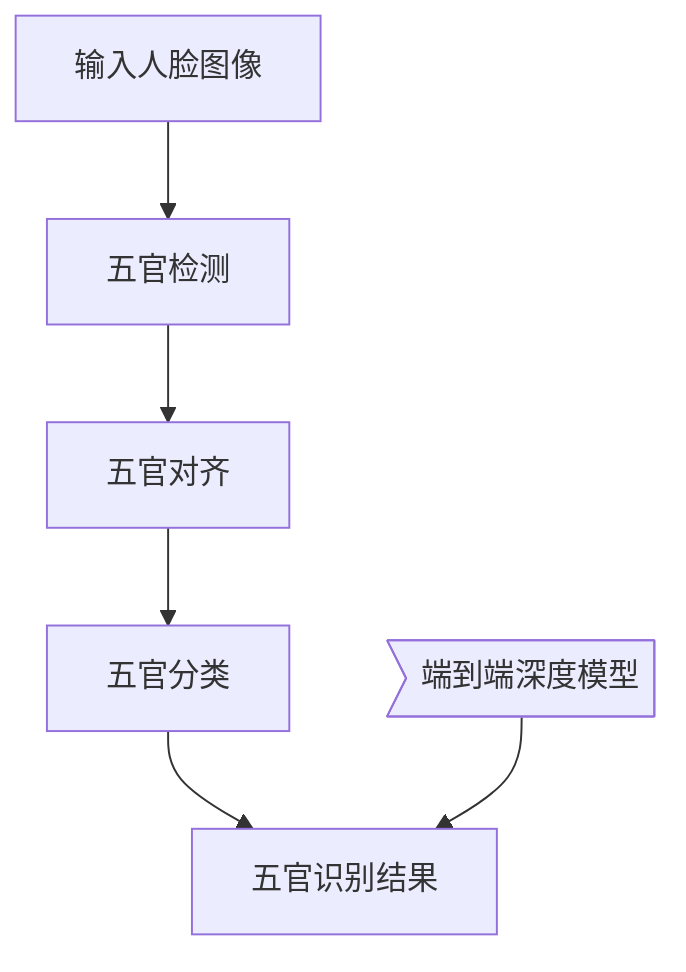

# 深度学习五官识别系统详细设计与具体代码实现

## 1. 背景介绍

### 1.1 问题的由来

人脸识别技术在过去几年中取得了长足的进步,但是对于五官的精确检测和识别仍然是一个具有挑战性的任务。准确识别人脸上的五官(如眼睛、鼻子、嘴巴等)对于多种应用场景都有重要意义,例如:

- 人脸识别和身份验证系统需要精确定位五官位置作为关键特征
- 虚拟现实(VR)和增强现实(AR)应用需要实时跟踪五官动态变化
- 人机交互界面需要捕捉面部微表情以提供更自然的交互体验
- 医疗诊断领域需要检测面部五官异常以辅助诊断

因此,开发一种高精度、鲁棒性强的五官识别系统对于各种应用场景都具有重要价值。

### 1.2 研究现状  

传统的五官识别方法主要基于手工设计的特征提取和机器学习算法,例如Viola-Jones面部检测器、主成分分析(PCA)、形状模型等。这些方法需要大量的人工参与,并且难以处理复杂的变化(如姿态、光照、遮挡等)。

近年来,随着深度学习技术的迅猛发展,基于卷积神经网络(CNN)的五官识别方法取得了突破性进展。CNN能够自动从数据中学习特征表示,并在公开的面部标注数据集上取得了最先进的性能。

一些典型的基于CNN的五官识别模型包括:MTCNN、Dlib、FAN等。这些模型通过端到端的训练,能够直接从像素级别的面部图像输入中预测出五官的位置和类别,显著提高了检测精度和鲁棒性。

### 1.3 研究意义

开发一种高性能的五官识别系统,能够为众多应用场景带来价值,例如:

- 提高人脸识别和身份验证的准确性和安全性
- 为AR/VR应用提供更自然沉浸式的人机交互体验  
- 辅助医疗诊断和面部分析
- 增强机器人、智能家居等人工智能系统的感知能力
- 推动相关技术在安防、娱乐等领域的创新应用

因此,研究和开发一种精确、鲁棒、高效的五官识别算法和系统,对于推动人工智能技术的发展和应用都具有重要意义。

### 1.4 本文结构

本文将详细介绍一种基于深度学习的五官识别系统的设计和实现。文章主要内容安排如下:

- 介绍五官识别的核心概念和深度学习模型
- 阐述核心算法原理和具体操作步骤  
- 推导数学模型并讲解公式细节
- 提供代码实例并进行详细解释
- 分析实际应用场景并给出发展趋势
- 推荐相关学习资源和开发工具
- 总结研究成果并指出未来挑战

## 2. 核心概念与联系

五官识别系统的核心概念主要包括:

1. **五官检测(Facial Landmark Detection)**
   - 定位并标注出人脸图像中五官(眼睛、鼻子、嘴巴等)的关键点位置
   - 是五官识别和人脸分析的基础步骤

2. **五官对齐(Face Alignment)**  
   - 基于检测到的五官关键点
   - 对人脸图像进行几何变换(平移、旋转、缩放等)
   - 将人脸对准统一的标准姿态

3. **五官分类(Facial Component Classification)**
   - 对检测到的五官区域进行语义分类
   - 识别出眼睛、鼻子、嘴巴等不同类型的五官

4. **端到端深度模型(End-to-End Deep Model)**
   - 基于卷积神经网络(CNN)和深度学习技术
   - 将五官检测、对齐和分类集成到统一的端到端模型中
   - 直接从像素级别的人脸图像预测五官位置和类别

这些核心概念相互关联、环环相扣:

- 五官检测是基础,为后续对齐和分类提供输入
- 对齐能够消除姿态变化,提高分类的准确性
- 分类则为最终的五官识别提供语义信息
- 端到端模型将这些步骤集成,实现自动化的高效处理

上述流程反映了五官识别系统的基本工作原理。在后续章节中,我们将详细阐述核心算法、数学模型、代码实现等具体细节。

## 3. 核心算法原理与具体操作步骤

### 3.1 算法原理概述  

五官识别系统的核心算法基于深度卷积神经网络(CNN),能够直接从像素级别的人脸图像输入中预测出五官的位置和类别。算法原理可概括为以下几个关键步骤:

1. **特征提取**
   - CNN的卷积层能够自动学习多尺度的视觉特征
   - 从低级的边缘和纹理,到高级的形状和结构

2. **特征融合**
   - CNN网络中的下采样(Pooling)层逐步融合不同尺度的特征
   - 捕捉不同级别的上下文信息,增强特征表达能力

3. **关键点回归**
   - 全卷积网络(FCN)的输出分支直接预测五官关键点的坐标
   - 通过回归的方式精确定位五官的位置

4. **语义分类** 
   - 另一输出分支对五官区域进行像素级别的语义分类
   - 识别出眼睛、鼻子、嘴巴等不同类型的五官

5. **端到端训练**
   - 将关键点回归和语义分类两个分支集成到同一网络中
   - 在标注的训练数据上进行端到端联合训练
   - 优化两个任务的损失函数,提高整体性能

该算法的优势在于:

- 端到端的设计,避免了传统方法中的复杂流程
- CNN自动学习特征,不需要手工设计
- 同时预测位置和类别,提高了检测的准确性
- 在大规模数据上训练,具有很强的泛化能力

接下来,我们将详细介绍算法的具体操作步骤。

### 3.2 算法步骤详解

五官识别算法的具体步骤如下:

1. **数据预处理**
   - 收集标注的人脸图像数据集,包括五官关键点和语义分割标签
   - 对图像进行标准化,如调整大小、归一化像素值等
   - 将数据划分为训练集、验证集和测试集

2. **模型设计**
   - 设计一个端到端的卷积神经网络模型结构
   - 主干网络为标准的CNN,如VGGNet、ResNet等
   - 输出分支包括关键点回归分支和语义分类分支
   - 可采用多任务损失函数进行联合训练

3. **模型训练**
   - 在训练集上训练设计的CNN模型
   - 采用标准的随机梯度下降优化算法,如SGD、Adam等
   - 可使用数据增强策略(如翻转、旋转等)提高泛化能力
   - 根据验证集上的指标调整超参数和提前停止训练

4. **模型评估**
   - 在保留的测试集上评估训练好的模型
   - 评估指标包括关键点回归的精度、语义分类的mIOU等
   - 与其他五官识别算法进行性能对比和分析

5. **预测和部署**
   - 使用训练好的模型对新的人脸图像进行五官识别
   - 可将模型部署到服务器、移动端或嵌入式设备上
   - 根据应用场景的需求,进行相应的后处理和优化

上述步骤反映了基于深度学习的五官识别算法的典型开发流程。在后续章节中,我们将进一步展开数学模型、代码实现等具体细节。

### 3.3 算法优缺点

基于深度学习的五官识别算法具有以下优点:

1. **准确性高**
   - 通过在大规模数据上训练,能够学习到鲁棒的特征表示
   - 对各种变化(姿态、光照、遮挡等)具有较强的适应能力
   - 在公开数据集上的表现优于传统方法

2. **端到端设计**
   - 避免了传统方法中的复杂流程,如手工特征提取等
   - 直接从像素级别的图像输入预测五官位置和类别
   - 简化了系统的设计和部署

3. **高效性和可扩展性**
   - 基于高度优化的深度学习框架,如TensorFlow、PyTorch等
   - 能够利用GPU/TPU等硬件资源实现高效计算
   - 模型结构可灵活扩展,以适应更复杂的任务需求

4. **联合优化**
   - 将关键点回归和语义分类两个任务集成到同一网络中
   - 两个分支可以互相促进,提高整体性能
   - 避免了传统分阶段方法中的错误传递和累积

然而,该算法也存在一些缺点和局限性:

1. **大规模数据需求**
   - 深度神经网络需要大量标注数据进行有效训练
   - 人工标注五官关键点和语义分割标签的成本较高

2. **黑盒操作**
   - 深度网络内部的特征提取过程较为黑箱
   - 缺乏对模型决策的可解释性和可理解性  

3. **过拟合风险**
   - 存在一定的过拟合风险,特别是在训练数据有偏的情况下
   - 需要采取有效的正则化策略,如权重衰减、dropout等

4. **实时性要求**
   - 对于某些实时应用场景,如AR/VR,可能需要进一步优化
   - 例如模型压缩、移动端部署等,以满足低延迟的需求

总的来说,基于深度学习的五官识别算法展现出了优秀的性能表现,但仍需要持续改进以满足不同应用场景的具体需求。

### 3.4 算法应用领域

高性能的五官识别技术具有广泛的应用前景,主要包括但不限于以下几个领域:

1. **人脸识别和身份验证**
   - 精确的五官位置和类别信息是人脸识别的关键特征
   - 能够显著提高人脸识别系统的准确性和安全性
   - 应用于身份认证、门禁系统、监控系统等

2. **虚拟现实(VR)和增强现实(AR)** 
   - 实时跟踪用户面部五官的动态变化
   - 为VR/AR应用提供自然沉浸式的人机交互体验
   - 应用于游戏、社交、教育、远程协作等场景

3. **人机交互界面**
   - 捕捉用户的面部微表情和五官动态
   - 实现更自然、人性化的人机交互方式
   - 应用于智能家居、车载系统、机器人等领域

4. **医疗诊断和面部分析**
   - 检测面部五官的异常或变化
   - 辅助医生进行疾病诊断和治疗
   - 应用于皮肤病、唇语读取、面部年龄估计等

5. **影视特效和动画制作**
   - 实时捕捉演员的面部动作数据
   - 用于驱动三维角色模型,实现逼真的面部动画
   - 应用于电影、游戏、虚拟直播等娱乐领域

6. **人群分析和行为识别**
   - 在视频监控数据中检测和跟踪人群的面部信息
   - 用于人群计数、行为分析、异常检测等应用
   - 应用于智能交通、安防监控、零售分析等场景

可以看出,五官识别技术在多个领域都有着广阔的应用前景,是推动人工智能技术发展的重要支撑。随着算法性能的不断提高和应用场景的拓展,这项技术必将产生越来越大的价值。

## 4. 数学模型和公式详细