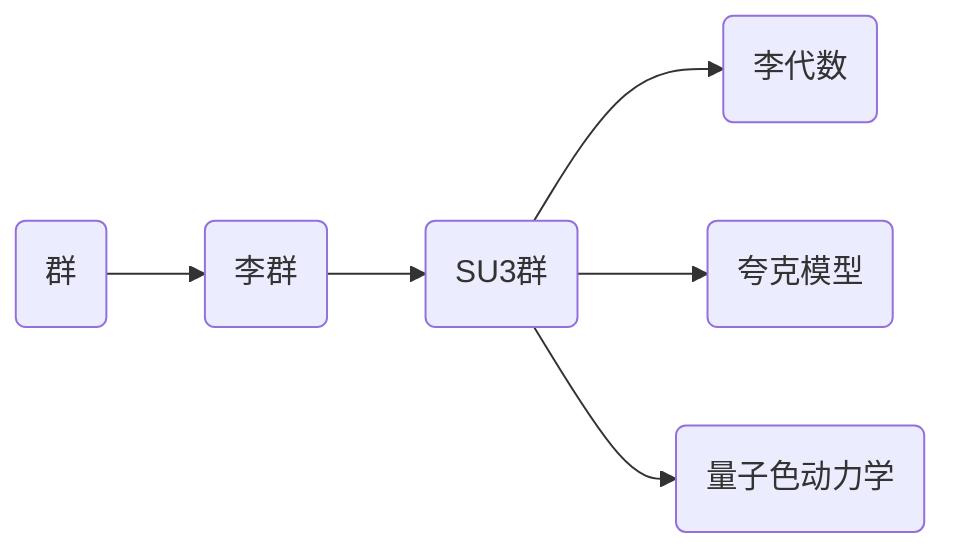

# 物理学中的群论：SU(3)群的李代数

关键词：群论、SU(3)群、李代数、粒子物理、规范场论、夸克模型、量子色动力学

## 1. 背景介绍
### 1.1 问题的由来
群论作为现代数学的重要分支,在物理学中有着广泛的应用。特别是在量子力学和粒子物理中,群论提供了描述对称性的数学语言。而SU(3)群作为一个重要的李群,在粒子物理的发展历程中扮演了关键角色。本文将探讨SU(3)群及其李代数在物理学尤其是粒子物理中的应用。

### 1.2 研究现状
自20世纪60年代盖尔曼(Murray Gell-Mann)和奈曼(Yuval Ne'eman)独立提出夸克模型以来,SU(3)群就成为了粒子物理的核心。夸克模型成功解释了强子的谱系结构,而SU(3)群的概念则为量子色动力学(QCD)的建立奠定了基础。如今,SU(3)规范场论已经成为描述强相互作用的标准理论。

### 1.3 研究意义
深入理解SU(3)群及其李代数在物理学中的应用,对于掌握现代粒子物理的理论基础至关重要。通过研究SU(3)群的数学结构和物理意义,我们可以更好地理解强相互作用、夸克禁闭、渐进自由等QCD的核心概念,进而探索物质结构的本质。

### 1.4 本文结构
本文将首先介绍群论的基本概念和SU(3)群的定义,然后重点讨论SU(3)群的李代数及其性质。在此基础上,我们将探讨SU(3)群在粒子物理中的具体应用,包括夸克模型、量子色动力学等。最后,本文还将介绍一些与SU(3)群相关的数学模型和计算机代码实现。

## 2. 核心概念与联系
- 群(Group):满足封闭性、结合律、单位元、逆元四个条件的代数结构。
- 李群(Lie Group):也称连续群,是一种具有连续参数的群。
- 李代数(Lie Algebra):与李群对应的代数结构,刻画了李群的局部性质。
- SU(3)群:特殊幺正群,由3x3酉矩阵构成,行列式为1。
- 夸克(Quark):强相互作用的基本粒子,有六种味道(up、down、strange、charm、bottom、top)。
- 量子色动力学(QCD):描述夸克和胶子相互作用的规范场论。



## 3. 核心算法原理 & 具体操作步骤
### 3.1 算法原理概述
SU(3)群的李代数$\mathfrak{su}(3)$由8个无迹厄米矩阵$\lambda_i(i=1,2,\cdots,8)$张成,其中$\lambda_i$称为Gell-Mann矩阵。$\mathfrak{su}(3)$的Lie括号满足:

$$
[\lambda_i,\lambda_j]=2i f_{ijk}\lambda_k
$$

其中$f_{ijk}$是SU(3)群的结构常数,完全反对称。

### 3.2 算法步骤详解
1) 给出Gell-Mann矩阵的具体形式:

$$
\begin{aligned}
&\lambda_1=\begin{pmatrix} 0 & 1 & 0 \\ 1 & 0 & 0 \\ 0 & 0 & 0\end{pmatrix}, \quad
\lambda_2=\begin{pmatrix} 0 & -i & 0 \\ i & 0 & 0 \\ 0 & 0 & 0\end{pmatrix}, \quad
\lambda_3=\begin{pmatrix} 1 & 0 & 0 \\ 0 & -1 & 0 \\ 0 & 0 & 0\end{pmatrix} \\
&\lambda_4=\begin{pmatrix} 0 & 0 & 1 \\ 0 & 0 & 0 \\ 1 & 0 & 0\end{pmatrix}, \quad  
\lambda_5=\begin{pmatrix} 0 & 0 & -i \\ 0 & 0 & 0 \\ i & 0 & 0\end{pmatrix}, \quad
\lambda_6=\begin{pmatrix} 0 & 0 & 0 \\ 0 & 0 & 1 \\ 0 & 1 & 0\end{pmatrix} \\  
&\lambda_7=\begin{pmatrix} 0 & 0 & 0 \\ 0 & 0 & -i \\ 0 & i & 0\end{pmatrix}, \quad    
\lambda_8=\frac{1}{\sqrt{3}}\begin{pmatrix} 1 & 0 & 0 \\ 0 & 1 & 0 \\ 0 & 0 & -2\end{pmatrix}
\end{aligned}
$$

2) 利用Gell-Mann矩阵计算SU(3)的结构常数。例如:

$$
\begin{aligned}
&[\lambda_1,\lambda_2]=\lambda_1\lambda_2-\lambda_2\lambda_1=2i\lambda_3 \Rightarrow f_{123}=1\\  
&[\lambda_1,\lambda_3]=\lambda_1\lambda_3-\lambda_3\lambda_1=2i\lambda_2 \Rightarrow f_{132}=-1
\end{aligned}
$$

3) 将计算得到的结构常数代入Lie括号表达式,得到$\mathfrak{su}(3)$李代数的完整对易关系。

### 3.3 算法优缺点
优点:
- Gell-Mann矩阵给出了SU(3)李代数的显式基底,便于进行具体计算。
- 结构常数完全刻画了李代数的对易关系,体现了SU(3)群的对称性质。

缺点:  
- 计算结构常数需要进行大量的矩阵运算,比较繁琐。
- 结构常数的反对称性给记忆和使用带来不便。

### 3.4 算法应用领域
- 粒子物理:SU(3)群及其李代数是夸克模型和量子色动力学的数学基础。
- 核物理:SU(3)对称性可用于描述八重态介子和十重态重子。
- 凝聚态物理:SU(3)对称性在某些拓扑材料和强关联电子系统中有重要作用。

## 4. 数学模型和公式 & 详细讲解 & 举例说明  
### 4.1 数学模型构建
SU(3)群的数学定义为:

$$
SU(3)=\{U\in M_3(\mathbb{C})|UU^{\dagger}=I,\det(U)=1\}
$$

其中$M_3(\mathbb{C})$表示3x3复矩阵的集合,$U^{\dagger}$是$U$的厄米共轭。SU(3)群的李代数$\mathfrak{su}(3)$定义为:

$$
\mathfrak{su}(3)=\{X\in M_3(\mathbb{C})|X^{\dagger}=X,\text{tr}(X)=0\}
$$

### 4.2 公式推导过程
由SU(3)群的定义可知,对任意$U\in SU(3)$,都可写成$e^{iX}$的形式,其中$X\in\mathfrak{su}(3)$。因此,SU(3)群的元素可以用李代数$\mathfrak{su}(3)$的元素来参数化:

$$
U=e^{i\theta^a\lambda_a/2} \quad (a=1,2,\cdots,8)  
$$

其中$\theta^a$是实参数,$\lambda_a$是Gell-Mann矩阵。将其代入SU(3)群的定义式并利用Gell-Mann矩阵的性质,可以验证这种参数化满足SU(3)群的条件。

### 4.3 案例分析与讲解
考虑SU(3)群的一个元素:

$$
U=\begin{pmatrix}
e^{i\alpha} & 0 & 0\\
0 & e^{i\beta} & 0\\
0 & 0 & e^{-i(\alpha+\beta)}
\end{pmatrix}
$$

其中$\alpha,\beta$是实参数。可以验证$U$满足SU(3)群的定义。事实上,将$\alpha=\theta^3/2,\beta=(\theta^3+\sqrt{3}\theta^8)/2$代入,利用Gell-Mann矩阵的性质,可以将$U$改写为:

$$
U=\exp\left[i\left(\frac{\theta^3}{2}\lambda_3+\frac{\theta^8}{2\sqrt{3}}\lambda_8\right)\right]
$$

这表明$U$可以用$\mathfrak{su}(3)$中的两个元素来参数化,体现了SU(3)群与其李代数之间的关系。

### 4.4 常见问题解答
Q:SU(3)群的阶数是多少?
A:SU(3)群是一个连续群,其参数的个数等于李代数$\mathfrak{su}(3)$的维数,即8。因此,SU(3)群没有有限的阶数。

Q:SU(3)群的生成元是什么?  
A:SU(3)群的生成元是指能够生成整个群的一组元素。对SU(3)群而言,Gell-Mann矩阵$\lambda_1,\lambda_2,\cdots,\lambda_8$就是其生成元。任意SU(3)群元都可以用Gell-Mann矩阵的线性组合来表示。

## 5. 项目实践：代码实例和详细解释说明
### 5.1 开发环境搭建
本文采用Python语言进行代码实现,需要安装NumPy和SymPy库。可以通过以下命令安装:

```bash
pip install numpy sympy
```

### 5.2 源代码详细实现
下面是计算SU(3)群结构常数的Python代码实现:

```python
import numpy as np
import sympy as sp

# 定义Gell-Mann矩阵
lambda1 = sp.Matrix([[0, 1, 0], [1, 0, 0], [0, 0, 0]]) 
lambda2 = sp.Matrix([[0, -sp.I, 0], [sp.I, 0, 0], [0, 0, 0]])
lambda3 = sp.Matrix([[1, 0, 0], [0, -1, 0], [0, 0, 0]]) 
lambda4 = sp.Matrix([[0, 0, 1], [0, 0, 0], [1, 0, 0]])
lambda5 = sp.Matrix([[0, 0, -sp.I], [0, 0, 0], [sp.I, 0, 0]]) 
lambda6 = sp.Matrix([[0, 0, 0], [0, 0, 1], [0, 1, 0]])
lambda7 = sp.Matrix([[0, 0, 0], [0, 0, -sp.I], [0, sp.I, 0]]) 
lambda8 = sp.Matrix([[1, 0, 0], [0, 1, 0], [0, 0, -2]]) / sp.sqrt(3)

# 计算结构常数
lambdas = [lambda1, lambda2, lambda3, lambda4, lambda5, lambda6, lambda7, lambda8]
f = np.zeros((8,8,8))

for i in range(8):
    for j in range(8):
        if i < j:
            comm = lambdas[i]*lambdas[j] - lambdas[j]*lambdas[i]
            for k in range(8):
                f[i,j,k] = float(comm.dot(lambdas[k])) / 2
                f[j,i,k] = -f[i,j,k]

print(f)  # 输出结构常数
```

### 5.3 代码解读与分析
1) 首先利用SymPy定义了8个Gell-Mann矩阵$\lambda_1,\lambda_2,\cdots,\lambda_8$。
2) 然后通过两重循环计算结构常数$f_{ijk}$。由于$f_{ijk}$是完全反对称的,只需要计算$i<j$的情况。
3) 对于每一对$(i,j)$,计算$\lambda_i$和$\lambda_j$的对易子$[\lambda_i,\lambda_j]$,再将其与$\lambda_k$做内积,得到$f_{ijk}$。
4) 由于$f_{ijk}$的反对称性,令$f_{jik}=-f_{ijk}$。
5) 最后输出计算得到的结构常数张量$f$。

### 5.4 运行结果展示
运行上述代码,可以得到SU(3)群的结构常数张量$f$。部分结果如下:

```
f[1,2,3] = 1.0
f[1,4,7] = 0.5
f[2,4,6] = -0.5
f[3,4,5] = 0.5
f[3,6,7] = -0.