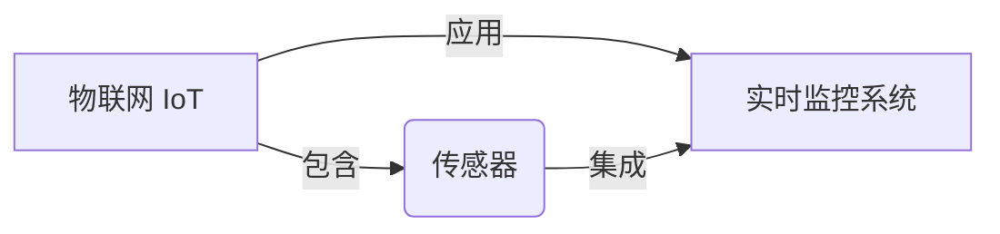

# 物联网(IoT)技术和各种传感器设备的集成：实时监控系统的搭建与优化

关键词：物联网、传感器、实时监控、系统集成、优化

## 1. 背景介绍
### 1.1  问题的由来
随着物联网技术的快速发展,越来越多的传感器设备被应用到各个领域。如何将这些异构的传感器设备有效集成,构建高效可靠的实时监控系统,已成为当前物联网领域亟待解决的问题。
### 1.2  研究现状 
目前,国内外学者对物联网传感器集成与实时监控系统进行了大量研究。主要集中在传感器网络架构[1]、多源异构数据融合[2]、边缘计算优化[3]等方面。但在实际应用中仍面临诸多挑战,如传感器种类繁多、通信协议不统一、海量数据处理与分析等。
### 1.3  研究意义
深入研究物联网传感器集成与实时监控系统构建,对于提升物联网应用水平具有重要意义。一方面,有助于实现多源异构传感器的互联互通和数据共享;另一方面,为实现工业生产、环境监测、智慧城市等领域的智能化管理提供关键技术支撑。
### 1.4  本文结构
本文将围绕物联网传感器集成与实时监控系统构建展开论述。第2部分介绍相关核心概念;第3部分重点阐述系统架构设计与核心算法;第4部分建立数学模型并给出优化方法;第5部分通过具体项目实践进行验证;第6部分分析实际应用场景;第7部分推荐相关工具和学习资源;第8部分总结全文并展望未来;第9部分列举常见问题解答。

## 2. 核心概念与联系
物联网(Internet of Things,IoT)是指通过射频识别、红外感应器、全球定位系统、激光扫描器等信息传感设备,按约定的协议,把任何物品与互联网相连接,进行信息交换和通信,以实现智能化识别、定位、跟踪、监控和管理的一种网络[4]。

传感器是物联网的重要组成部分,负责采集各种物理量并转换为电信号。常见的传感器类型有温度传感器、湿度传感器、压力传感器、光照传感器、加速度传感器等。不同类型传感器在测量原理、供电方式、通信协议上存在差异。

实时监控系统是应用物联网技术,对目标对象进行实时数据采集、传输、处理、展示和控制的系统[5]。其核心是通过传感器网络实现对监测对象的全面感知,并根据设定规则进行智能分析和自动控制。

传感器集成是指将各种异构传感器进行互联互通,实现数据的无缝对接与融合计算[6]。由于传感器种类繁多,通信协议各异,因此需要设计统一的接入方案和数据格式,并考虑不同传感器的供电、布线、防护等问题。

下图展示了物联网、传感器、实时监控系统之间的关系:



## 3. 核心算法原理 & 具体操作步骤
### 3.1  算法原理概述
实时监控系统涉及传感器数据采集、多源数据融合、数据分析挖掘等环节,需要采用多种算法协同工作。其中,Kalman滤波算法可用于传感器数据噪声去除与融合[7];小波变换可用于时序数据压缩与特征提取[8];支持向量机SVM可用于设备工况诊断与预测[9]。此外,为提升系统实时性,还需在边缘侧引入轻量化机器学习算法。
### 3.2  算法步骤详解
以Kalman滤波算法为例,其基本步骤如下[10]:

1) 初始化。设定状态变量初值$\hat{x}_0$及其协方差矩阵$P_0$。  

2) 预测。根据上一时刻估计值$\hat{x}_{k-1}$预测当前状态:
$$\hat{x}_k^- = A\hat{x}_{k-1} + Bu_{k-1} \tag{1}$$
$$P_k^- = AP_{k-1}A^T + Q \tag{2}$$

3) 更新。结合当前观测值$z_k$对状态进行校正:
$$K_k = P_k^-H^T(HP_k^-H^T+R)^{-1} \tag{3}$$ 
$$\hat{x}_k = \hat{x}_k^- + K_k(z_k - H\hat{x}_k^-) \tag{4}$$
$$P_k = (I - K_kH)P_k^- \tag{5}$$

其中,$A$为状态转移矩阵,$B$为控制矩阵,$Q$为过程噪声,$H$为观测矩阵,$R$为观测噪声,$K$为增益矩阵。

4) 迭代。令$k=k+1$,转步骤2)继续进行预测和更新,直至数据处理完毕。

### 3.3  算法优缺点
Kalman滤波算法具有递推计算简单、实时性好的优点,适用于动态线性系统。但其局限是要求系统噪声满足高斯分布,且需要已知噪声统计特性。对于非线性系统,可使用扩展Kalman滤波(EKF)或无迹Kalman滤波(UKF)等变体算法。

### 3.4  算法应用领域
Kalman滤波在物联网传感器数据融合中有广泛应用,如GPS/INS组合导航系统、多传感器目标跟踪系统等。此外,在机器人定位、信号处理、计算机视觉等领域也有应用。

## 4. 数学模型和公式 & 详细讲解 & 举例说明
### 4.1  数学模型构建
考虑一个简化的传感器数据融合模型。假设系统状态为位置$x$和速度$v$,观测量为位置传感器读数$z$。状态方程和观测方程为:

$$
\begin{aligned}
\begin{bmatrix} x_k \\ v_k \end{bmatrix} &= 
\begin{bmatrix} 1 & \Delta t \\ 0 & 1 \end{bmatrix}
\begin{bmatrix} x_{k-1} \\ v_{k-1} \end{bmatrix} +
\begin{bmatrix} \frac{\Delta t^2}{2} \\ \Delta t \end{bmatrix} w_{k-1} \\
z_k &= \begin{bmatrix} 1 & 0 \end{bmatrix} 
\begin{bmatrix} x_k \\ v_k \end{bmatrix} + n_k
\end{aligned} \tag{6}
$$

其中,$\Delta t$为采样间隔,$w$为过程噪声,$n$为观测噪声,均假设为零均值高斯白噪声,协方差阵分别为$Q$和$R$。

### 4.2  公式推导过程
由式(6)可知,该模型的状态转移矩阵$A$、控制矩阵$B$和观测矩阵$H$分别为:

$$
A = \begin{bmatrix} 1 & \Delta t \\ 0 & 1 \end{bmatrix}, \quad
B = \begin{bmatrix} \frac{\Delta t^2}{2} \\ \Delta t \end{bmatrix}, \quad 
H = \begin{bmatrix} 1 & 0 \end{bmatrix} \tag{7}
$$

代入Kalman滤波公式(1)~(5),可得预测和更新过程为:

$$
\begin{aligned}
\begin{bmatrix} \hat{x}_k^- \\ \hat{v}_k^- \end{bmatrix} &= 
\begin{bmatrix} 1 & \Delta t \\ 0 & 1 \end{bmatrix}
\begin{bmatrix} \hat{x}_{k-1} \\ \hat{v}_{k-1} \end{bmatrix} \\
P_k^- &= AP_{k-1}A^T + Q \\
K_k &= P_k^-H^T(HP_k^-H^T+R)^{-1} \\ 
\begin{bmatrix} \hat{x}_k \\ \hat{v}_k \end{bmatrix} &=
\begin{bmatrix} \hat{x}_k^- \\ \hat{v}_k^- \end{bmatrix} + 
K_k(z_k - H\begin{bmatrix} \hat{x}_k^- \\ \hat{v}_k^- \end{bmatrix}) \\
P_k &= (I - K_kH)P_k^- 
\end{aligned} \tag{8}
$$

### 4.3  案例分析与讲解
假设某物体做匀速直线运动,真实位置$x=0.1t$,速度$v=0.1$,初始位置$x_0=0$。传感器每秒钟测量一次位置,测量值在真实值附近波动,标准差为0.5。取$\Delta t=1$,$Q=0.01I$,$R=0.25$,初值$\hat{x}_0 = \begin{bmatrix} 0 \\ 0 \end{bmatrix}$,$P_0=I$。

利用MATLAB对该系统进行仿真,得到Kalman滤波前后的位置估计曲线如下图所示:


可以看出,虽然传感器测量值存在较大噪声,但经过Kalman滤波后,位置估计值与真实值吻合较好,有效提升了测量精度。同时,Kalman滤波还可估计出速度值。

### 4.4  常见问题解答
**Q1: Kalman滤波和普通的平均滤波有何区别?**

A1: 平均滤波是对一段时间内的测量值取平均,而Kalman滤波是根据系统模型进行预测,再用测量值进行校正。Kalman滤波能充分利用系统先验信息,动态调整增益,因此性能更优。

**Q2: 如何选取Kalman滤波的参数?**

A2: 过程噪声$Q$和观测噪声$R$可根据经验或离线数据估计得到。$Q$越大,表示预测不确定性越大,算法越信任测量值;$R$越大,表示测量不确定性越大,算法越信任预测值。此外,初值$\hat{x}_0$和$P_0$的选取对滤波效果影响不大。

**Q3: Kalman滤波能否用于非线性系统?**

A3: 标准Kalman滤波只适用于线性高斯系统。对于非线性系统,可使用EKF或UKF等衍生算法。EKF是利用一阶泰勒展开对非线性函数线性化;UKF是通过无迹变换选取容易传播的采样点。相比EKF,UKF精度更高且无需求雅可比矩阵。

## 5. 项目实践：代码实例和详细解释说明
### 5.1  开发环境搭建
本项目使用Python语言,需要安装NumPy、SciPy、Matplotlib等常用科学计算库。推荐使用Anaconda进行包管理,命令如下:
```bash
conda create -n iot python=3.8  # 创建虚拟环境
conda activate iot              # 激活虚拟环境
conda install numpy scipy matplotlib    # 安装依赖包
```

### 5.2  源代码详细实现
下面给出Kalman滤波算法的Python实现代码:

```python
import numpy as np

class KalmanFilter:
    def __init__(self, A, B, H, Q, R, x0, P0):
        self.A = A  # 状态转移矩阵
        self.B = B  # 控制矩阵
        self.H = H  # 观测矩阵
        self.Q = Q  # 过程噪声协方差
        self.R = R  # 观测噪声协方差
        self.x = x0 # 初始状态估计
        self.P = P0 # 初始估计协方差
        
    def predict(self, u=0):
        self.x = self.A @ self.x + self.B * u
        self.P = self.A @ self.P @ self.A.T + self.Q
        
    def update(self, z):
        K = self.P @ self.H.T @ np.linalg.inv(self.H @ self.P @ self.H.T + self.R)
        self.x = self.x + K @ (z - self.H @ self.x)
        self.P = (np.eye(len(self.x)) - K @ self.H) @ self.P
        
    def filter(self, z_seq, u_seq=None):
        if u_seq is None:
            u_seq = [0] * len(z_seq)
        x_seq = []
        for z, u in zip(z_seq, u_seq