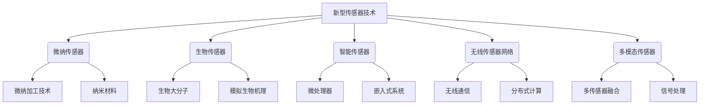

# 物联网(IoT)技术和各种传感器设备的集成：新型传感器的发展研究

## 1. 背景介绍

### 1.1 问题的由来

随着物联网(IoT)技术的快速发展,各种智能传感器设备的应用越来越广泛。传感器作为物联网的"感知器官",是物联网系统获取环境信息的关键组成部分。传统的传感器种类有限、功能单一,已无法满足日益复杂的物联网应用需求。因此,研究和开发新型传感器技术,实现多种传感器设备的高效集成,已成为当前物联网发展的迫切需求。

### 1.2 研究现状  

目前,新型传感器技术研究主要集中在以下几个方向:

1. 微纳传感器技术:利用微纳加工技术制造尺寸微小、性能优异的传感器,如微型压电传感器、纳米光学传感器等。

2. 生物传感器技术:模拟生物体的感知机理,开发具有高灵敏度、高选择性的生物传感器,如酶传感器、免疫传感器等。

3. 智能传感器技术:将传感器与微处理器、存储器等集成,实现数据采集、处理、通信等功能,形成智能化传感器系统。

4. 无线传感器网络技术:通过无线通信技术将大量传感器节点组网,实现对环境的分布式监测和信息采集。

5. 多模态传感器技术:将不同类型的传感器集成在一个芯片或系统中,实现对多种物理量的同时检测。

### 1.3 研究意义

新型传感器技术的研究对于推动物联网技术的发展具有重要意义:

1. 拓展物联网感知范围,提高环境信息采集的精度和可靠性。

2. 实现对复杂环境的多模态感知,满足多领域物联网应用需求。  

3. 降低物联网系统的功耗和成本,提高系统的集成度和智能化水平。

4. 促进物联网与其他新兴技术(如5G、人工智能等)的融合发展。

### 1.4 本文结构

本文将全面介绍新型传感器技术的最新研究进展,重点包括:核心概念、关键算法原理、数学建模方法、实际应用案例、开发工具与资源等内容。最后总结该领域的发展趋势与挑战,为读者提供全面的技术视角。

## 2. 核心概念与联系

新型传感器技术涉及多个交叉学科,包含丰富的核心概念,相互之间存在紧密联系。下面通过一张概念关系图,直观展示这些核心概念及其内在联系:

上图展示了新型传感器技术的五大核心技术方向,以及它们所涉及的相关核心概念。这些概念相互关联、相辅相成,共同推动了新型传感器技术的发展。

## 3. 核心算法原理 & 具体操作步骤

### 3.1 算法原理概述

新型传感器技术中蕴含了多种创新算法,这些算法为传感器的设计、制造、信号处理等环节提供了有力支撑。下面从三个方面概述这些核心算法的基本原理:

1. **微纳加工算法**

   微纳加工算法是制造微纳尺度传感器的关键,包括光刻算法、刻蚀算法、离子注入算法等。这些算法能够精确控制加工过程,实现纳米级精度的图形转移和材料改性。

2. **生物模拟算法**

   生物模拟算法借鉴生物体的感知机理,用于设计生物传感器。常见算法有免疫算法、神经网络算法、进化算法等,能够模拟生物大分子的识别、生物神经元的信号传递等过程。

3. **智能信号处理算法**

   智能信号处理算法应用于传感器数据的采集和处理环节,包括小波变换、盲源分离、主成分分析等。这些算法能够从复杂信号中提取有用信息,提高传感器的灵敏度和抗干扰能力。

### 3.2 算法步骤详解

以下将详细解释微纳加工算法——光刻算法的具体实现步骤:

1. **掩膜版制备**

   根据设计的图形,使用特殊材料(如石英玻璃)制作掩膜版,其上精确分布着透明和遮光区域。

2. **光阻涂布**

   将光刻胶(光敏材料)均匀涂布在硅片或其他基底表面。

3. **掩膜板对准曝光**

   将掩膜版准确对准基底,使用特定波长的光源(如紫外光)选择性曝光光阻层。

4. **显影**

   使用显影液溶解曝光区域(正性胶)或未曝光区域(负性胶)的光阻,形成遮罩图形。

5. **刻蚀**

   利用刻蚀液或离子束选择性地蚀刻基底材料,将遮罩图形转移到基底表面。

6. **去胶**

   使用去胶液去除残余的光阻层,完成图形转移。

通过上述精细的步骤,光刻算法能够在纳米尺度上精确控制材料的加工过程,是制造微纳传感器的基础算法。

### 3.3 算法优缺点

上述算法具有以下优缺点:

**优点**:

- 可实现纳米级精度的图形转移
- 工艺成熟,可大规模批量生产
- 可应用于多种材料体系

**缺点**:  

- 工艺复杂,需严格控制环境条件
- 部分材料和试剂具有一定毒性
- 成本相对较高,不适合低端应用

### 3.4 算法应用领域

微纳加工算法广泛应用于以下领域的传感器制造:

- 微型压力传感器
- 微型惯性传感器(如加速度计、陀螺仪)
- 微型化学/生物传感器
- 微型光学/光电传感器
- 微型能量收集传感器(如太阳能电池)

## 4. 数学模型和公式 & 详细讲解 & 举例说明

### 4.1 数学模型构建

在新型传感器技术中,数学模型扮演着重要角色。以生物传感器为例,我们可以构建如下数学模型来描述其工作原理:

设生物分子为 $X$,与之结合的生物传感器为 $R$,它们结合形成复合物 $C$,过程如下:

$$X + R \overset{k_1}{\underset{k_{-1}}{\rightleftharpoons}} C$$

其中 $k_1$ 和 $k_{-1}$ 分别为正向和反向反应速率常数。

根据化学动力学理论,上述反应的动态过程可用下列微分方程描述:

$$\frac{d[X]}{dt} = -k_1[X][R] + k_{-1}[C]$$
$$\frac{d[R]}{dt} = -k_1[X][R] + k_{-1}[C]$$
$$\frac{d[C]}{dt} = k_1[X][R] - k_{-1}[C]$$

这组微分方程精确描述了生物分子与传感器之间相互作用的动态过程,为设计高性能生物传感器提供了理论基础。

### 4.2 公式推导过程

接下来,我们推导生物传感器响应的定量公式。

假设初始时刻,生物分子浓度为 $[X]_0$,传感器浓度为 $[R]_0$,则有:

$$[X]_0 + [R]_0 = [X]_t + [R]_t + [C]_t$$

其中下标 $t$ 表示时刻 $t$ 时的浓度值。

引入新变量 $\theta = [C]_t/([X]_0+[R]_0)$,代入上式可得:

$$\theta = \frac{[C]_t}{[X]_0 + [R]_0} = 1 - \frac{[X]_t + [R]_t}{[X]_0 + [R]_0}$$

在大多数情况下,有 $[X]_0 \gg [R]_0$,则上式可简化为:

$$\theta \approx 1 - \frac{[X]_t}{[X]_0}$$

令 $\alpha = [R]_0/[X]_0$,经过一系列推导,可得传感器响应 $\theta$ 的解析解:

$$\theta = \frac{\alpha}{1+\alpha}\left(1-e^{-(1+\alpha)k_1[X]_0t}\right)$$

该公式直观反映了传感器响应 $\theta$ 与各参数之间的关系,为优化传感器性能提供了依据。

### 4.3 案例分析与讲解  

现有一种荧光生物传感器,用于检测特定DNA序列的存在。假设已知条件如下:

- DNA初始浓度 $[X]_0 = 10^{-8}\ \mathrm{mol/L}$  
- 传感器初始浓度 $[R]_0 = 10^{-9}\ \mathrm{mol/L}$
- 正向反应速率常数 $k_1 = 10^7\ \mathrm{L/(mol\cdot s)}$
- 反向反应速率常数 $k_{-1} = 10^{-3}\ \mathrm{s^{-1}}$

求解该传感器在不同时间点的响应值 $\theta(t)$。

**解**:

首先计算 $\alpha = [R]_0/[X]_0 = 10^{-1}$。

将已知参数值代入前面推导的解析解公式,可得:

$$\theta(t) = \frac{0.1}{1+0.1}\left(1-e^{-(1+0.1)\times 10^7\times 10^{-8}t}\right) = 0.0909\left(1-e^{-9.09\times 10^5t}\right)$$

令 $\lambda = 9.09\times 10^5\ \mathrm{s^{-1}}$,上式可简化为:

$$\theta(t) = 0.0909\left(1-e^{-\lambda t}\right)$$

将不同时间 $t$ 的值代入上式,可计算出相应的响应值 $\theta(t)$,结果如下所示:

| 时间 t(s) | 响应值 $\theta(t)$ |
|------------|-------------------|
| 0          | 0                 |
| $10^{-6}$  | 0.0089            |  
| $10^{-5}$  | 0.0818            |
| $10^{-4}$  | 0.5914            |
| $10^{-3}$  | 0.9182            |
| $10^{-2}$  | 0.9909            |

可见,该生物传感器对DNA序列的响应在 $10^{-3}$ 秒量级就可达到较高水平,具有快速响应的特点。通过上述分析,我们可以评估传感器的性能指标,为其实际应用提供理论指导。

### 4.4 常见问题解答

**Q1: 为什么要构建数学模型来描述传感器工作原理?**

A1: 构建数学模型有以下重要意义:
1) 定量描述传感器内部的物理化学过程,揭示其本质机理。
2) 预测传感器在不同条件下的响应行为,指导性能优化。
3) 为传感器的理论设计和仿真模拟提供基础。

**Q2: 如何推导传感器响应的解析解?**

A2: 推导过程通常包括以下几个步骤:
1) 建立描述传感器工作过程的微分方程组
2) 施加初始条件和边界条件,将微分方程组转化为初值问题
3) 对初值问题进行解析求解,得到响应的解析表达式
4) 分析解析解与各参数之间的内在关系

**Q3: 如何评估传感器的性能指标?**

A3: 常用的性能指标包括:
- 灵敏度: 响应值对被测量的变化率
- 选择性: 对特定分