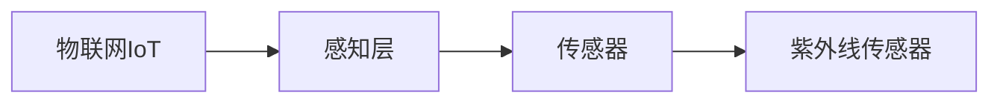
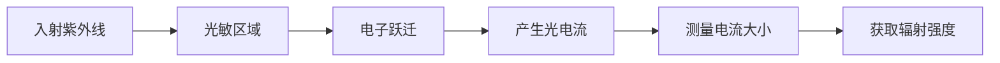

# 物联网(IoT)技术和各种传感器设备的集成：紫外线传感器的应用与发展

## 1. 背景介绍

### 1.1 问题的由来

随着物联网(IoT)技术的快速发展,各种传感器设备的应用越来越广泛。传感器作为物联网系统的"眼睛"和"耳朵",能够感知并采集环境中的各种物理、化学和生物参数,为物联网系统提供关键数据支持。其中,紫外线传感器由于其独特的应用场景和优势,在物联网领域备受关注。

紫外线是电磁波谱中波长介于可见光和X射线之间的一种辐射,根据波长的不同可分为UVA(315-400nm)、UVB(280-315nm)和UVC(100-280nm)三种类型。过量的紫外线辐射对人体和环境都有潜在的危害,如引起皮肤癌、白内障、植物受损等。因此,准确监测和控制紫外线辐射水平对于保护人体健康和环境安全至关重要。

### 1.2 研究现状

目前,国内外已有多种紫外线传感器产品问世,主要分为硅基和非硅基两大类。硅基紫外线传感器利用硅材料对紫外线的光电响应特性进行设计,具有制造工艺成熟、成本较低的优点,但波长响应范围有限。非硅基紫外线传感器则采用氮化镓(GaN)、碳化硅(SiC)等宽禁带半导体材料,可检测更宽的紫外波段,但制造工艺复杂、成本较高。

无论哪种类型的紫外线传感器,其性能指标如响应度、线性度、稳定性等都直接影响着测量的准确性。同时,紫外线传感器与物联网系统的无缝集成也是一个值得关注的问题,需要解决数据传输、供电、防护等一系列技术挑战。

### 1.3 研究意义

紫外线传感器在物联网领域的应用前景广阔,具有重要的理论意义和现实意义:

1. **理论意义**:深入研究紫外线传感器的工作原理、性能优化和集成方法,可以推动物联网感知层技术的发展,为物联网系统提供更加精准、可靠的数据支持。
2. **现实意义**:紫外线监测对于预防皮肤癌、控制农作物生长、监测环境污染等具有重要作用。通过物联网技术实现紫外线数据的实时采集和处理,可以为相关领域提供决策依据,保护人类健康,促进可持续发展。

### 1.4 本文结构

本文将全面介绍物联网技术与紫外线传感器的集成,内容包括:

1. 紫外线传感器的工作原理、分类及性能指标
2. 物联网系统架构及与传感器的集成方法
3. 紫外线数据的采集、传输和处理算法
4. 典型应用场景及未来发展趋势

通过理论与实践相结合,希望能为读者提供紫外线传感器在物联网领域的系统性认知。

## 2. 核心概念与联系

物联网(IoT)和紫外线传感器是本文的两个核心概念,两者紧密相连:

1. **物联网(IoT)**是指通过互联网将所有物品与网络相连,实现物物相连、物人交互的新型网络。
2. **感知层**是物联网体系结构中最基础的层次,负责采集物理世界的各种信息。
3. **传感器**是感知层的核心组成部分,用于感知被测对象的物理、化学或生物参数。
4. **紫外线传感器**是一种特殊的传感器,专门用于检测紫外线辐射强度。

紫外线传感器作为物联网感知层的重要组成部分,能够为物联网系统提供紫外线数据支持,实现对紫外线辐射的实时监测和控制,在环境监测、健康防护、农业种植等领域发挥重要作用。

## 3. 核心算法原理 & 具体操作步骤

### 3.1 算法原理概述

紫外线传感器的工作原理主要基于**光电效应**。当紫外线照射到传感器的光敏区域时,会使半导体材料内的电子从价带跃迁到导带,产生电子-空穴对,从而在外加电路中产生光电流。通过测量这一光电流的大小,可以间接获取入射紫外线辐射的强度信息。

不同类型的紫外线传感器在材料、结构和工作原理上会有所区别,但都遵循上述基本光电转换过程。

### 3.2 算法步骤详解

1. **选择合适的半导体材料**

    不同半导体材料对应的禁带宽度不同,决定了其对特定波长紫外线的响应灵敏度。通常硅基传感器对UVA波段较为敏感,而宽禁带半导体如GaN、SiC等对整个UVA-UVC波段都有响应。

2. **设计光敏结构**

    常见的光敏结构有PN结、PIN结、MSM结等,其工作原理类似于太阳能电池。光敏区的面积、厚度和掺杂浓度都会影响光电转换效率。

3. **滤波和放大电路**

    为提高信噪比,需要在传感器输出端加入滤波电路去除噪声,同时也需要放大电路将微弱的光电流放大到可测量的电平。

4. **AD转换和数字化处理**

    将模拟光电流信号通过AD转换器转化为数字量,便于后续的数字处理,如线性化、温度补偿等算法的实现。

5. **标定和校准**

    通过参考标准光源对传感器进行标定和校准,建立输入辐射强度与输出电流/数字量之间的转换关系,从而提高测量精度。

### 3.3 算法优缺点

**优点:**

1. 原理简单,易于实现
2. 响应速度快,实时性好 
3. 无需复杂的光路设计

**缺点:**  

1. 对温度、湿度等环境因素敏感,需要补偿算法
2. 存在非线性特性,需要线性化处理
3. 受制于材料本身,波长响应范围有限

### 3.4 算法应用领域

紫外线传感器及其测量算法在多个领域均有广泛应用:

1. **环境监测**:监测大气层、水体等环境中的紫外线辐射强度,评估紫外线污染程度。
2. **个人防护**:集成在可穿戴设备中,实时监测人体所受的紫外线辐射剂量,提醒防晒。
3. **农业种植**:监测农作物生长环境中的紫外线水平,为精准种植提供依据。
4. **医疗保健**:用于光疗设备的辐照剂量控制,或者监测手术室的紫外线消毒效果。
5. **军事领域**:用于探测和识别紫外线武器等特殊装备。

## 4. 数学模型和公式 & 详细讲解 & 举例说明

### 4.1 数学模型构建

对于紫外线传感器的光电转换过程,可以建立如下数学模型:

$$I_{ph} = A \cdot P_{opt} \cdot \eta$$

其中:
- $I_{ph}$ 为产生的光电流(A)
- $A$ 为光敏面积 ($m^2$)
- $P_{opt}$ 为入射的光功率密度 ($W/m^2$)
- $\eta$ 为量子效率,代表光电转换效率(0-1)

上式表明,光电流的大小与入射光功率密度成正比,也与光敏区面积和量子效率有关。

对于紫外线传感器而言,由于入射光为单一波长的紫外线,可以将上式进一步展开为:

$$I_{ph} = q \cdot \Phi \cdot \eta = q \cdot \frac{P_{opt} \cdot \lambda}{h \cdot c} \cdot \eta \cdot A$$

其中:
- $q$ 为电子电量 ($1.6 \times 10^{-19}C$)  
- $\Phi$ 为入射光子通量 ($photons/s$)
- $\lambda$ 为入射光波长 ($m$)
- $h$ 为普朗克常数 ($6.63 \times 10^{-34}J \cdot s$)
- $c$ 为光速 ($3 \times 10^8 m/s$)

### 4.2 公式推导过程

推导过程如下:

1) 根据光子能量与频率的关系:

$$E = h \cdot v = \frac{h \cdot c}{\lambda}$$

2) 将光功率密度 $P_{opt}$ 表示为:

$$P_{opt} = \Phi \cdot E = \Phi \cdot \frac{h \cdot c}{\lambda}$$

3) 将上式代入光电流公式:

$$I_{ph} = \eta \cdot q \cdot \Phi = \eta \cdot q \cdot \frac{P_{opt} \cdot \lambda}{h \cdot c} \cdot A$$

由此得到了描述紫外线光电转换过程的完整数学模型公式。

### 4.3 案例分析与讲解

**例1**: 一款UVA传感器的有效光敏面积为 $0.5 cm^2$,量子效率为0.6,如果入射的UVA辐射强度为 $10mW/cm^2$,对应波长为365nm,求产生的光电流大小?

**解**:
首先将单位换算统一:
- $A = 0.5 \times 10^{-4} m^2$  
- $\lambda = 365 \times 10^{-9} m$
- $P_{opt} = 10 \times 10^{-3} W/m^2$

将数值代入公式:

$$I_{ph} = 0.6 \times 1.6 \times 10^{-19} \times \frac{10 \times 10^3 \times 365 \times 10^{-9}}{6.63 \times 10^{-34} \times 3\times 10^8} \times 0.5\times 10^{-4} = 1.83\mu A$$

因此,在该UVA辐射条件下,传感器产生的光电流为1.83微安。

**例2**: 已知某UVC传感器在25℃时,入射UVC辐射为 $0.2mW/cm^2$ (波长253.7nm)时产生的光电流为20nA,求该传感器在该波长下的量子效率?

**解**:
已知条件为:
- $I_{ph} = 20 \times 10^{-9}A$
- $\lambda = 253.7 \times 10^{-9}m$  
- $P_{opt} = 0.2 \times 10^{-3}W/m^2$
- $A$ 未知

将已知条件代入公式,可解得:

$$\eta = \frac{I_{ph}}{q \cdot \frac{P_{opt}\cdot \lambda}{h \cdot c} \cdot A} = \frac{20 \times 10^{-9}}{1.6 \times 10^{-19} \cdot \frac{0.2 \times 10^{-3} \times 253.7 \times 10^{-9}}{6.63 \times 10^{-34} \times 3 \times 10^8} \cdot A} = 0.72$$

因此,该UVC传感器在253.7nm波长下的量子效率约为0.72。

通过以上案例可以看出,基于数学模型不仅可以预测光电流的大小,还可以反解出器件的关键参数,对于传感器的设计和优化都有重要意义。

### 4.4 常见问题解答

1. **为什么光电流与入射光功率密度成正比?**

    这是由光电效应的本质所决定的。入射光子越多,能够激发出的电子也就越多,因此光电流随之增大。

2. **量子效率是如何定义的?有什么影响因素?**  

    量子效率定义为实际产生的电子对数与入射光子数之比,代表了光电转换过程的效率。它受材料本身的性质、器件结构、工艺缺陷等多方面因素的影响。

3. **为什么温度会影响测量结果?如何补偿?**