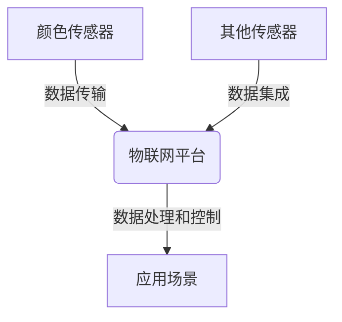

# 物联网(IoT)技术和各种传感器设备的集成：颜色传感器的工作原理

## 1. 背景介绍

### 1.1 问题的由来

随着物联网(IoT)技术的快速发展,各种传感器设备在智能家居、工业自动化、环境监测等领域得到了广泛应用。其中,颜色传感器作为一种重要的传感器类型,可以检测和识别物体的颜色,在很多场景中发挥着关键作用。

### 1.2 研究现状

目前,市面上已经有多种颜色传感器产品,它们基于不同的工作原理,如光电效应、光谱分析等,具有不同的性能指标和适用场景。然而,这些颜色传感器如何与物联网技术相结合,以实现高效、智能的颜色检测和识别,仍然是一个值得深入探讨的课题。

### 1.3 研究意义

通过深入研究颜色传感器的工作原理,并将其与物联网技术相结合,我们可以开发出更加智能、高效的颜色检测和识别系统,为各种应用场景提供强有力的技术支持。这不仅有助于提高生产效率,还可以为人们的生活带来更多便利。

### 1.4 本文结构

本文将首先介绍颜色传感器的核心概念和工作原理,然后详细阐述其算法流程和数学模型,并通过实例代码进行实践演示。最后,我们将探讨颜色传感器在实际应用中的场景,以及未来的发展趋势和挑战。

## 2. 核心概念与联系

颜色传感器是一种能够检测和识别物体颜色的传感器设备。它的工作原理基于光的反射和吸收特性,通过测量物体反射或吸收不同波长的光强度,从而确定物体的颜色。

颜色传感器与物联网技术的结合,可以实现远程监控、数据采集和智能控制等功能。通过将颜色传感器连接到物联网平台,我们可以实时获取颜色数据,并根据预设的条件进行相应的操作,如调整生产线上的产品颜色、监测环境中的颜色变化等。

此外,颜色传感器还可以与其他传感器设备(如温度传感器、压力传感器等)集成,形成一个完整的物联网系统,为各种应用场景提供全方位的数据支持和智能控制。



## 3. 核心算法原理 & 具体操作步骤

### 3.1 算法原理概述

颜色传感器的工作原理主要基于光的反射和吸收特性。当光线照射到物体表面时,不同波长的光会被物体以不同的比例反射或吸收。通过测量反射或吸收的光强度,我们可以确定物体的颜色。

常见的颜色传感器算法包括:

1. **RGB算法**: 基于红(R)、绿(G)、蓝(B)三种颜色的光强度测量,通过它们的比例关系来确定颜色。
2. **XYZ算法**: 基于人眼对颜色的感知,将颜色分解为X、Y、Z三个刺激值,从而确定颜色。
3. **光谱分析算法**: 通过测量整个可见光谱范围内的光强度,并进行光谱分析来确定颜色。

### 3.2 算法步骤详解

以RGB算法为例,其具体步骤如下:

1. **发射光源**: 向待测物体发射红、绿、蓝三种颜色的光源。
2. **光强度测量**: 使用光电传感器测量物体反射的红、绿、蓝三种颜色光的强度,记为$R$、$G$、$B$。
3. **颜色计算**:
   - 将$R$、$G$、$B$值归一化到$[0, 1]$范围内,得到$R'$、$G'$、$B'$。
   - 计算颜色的RGB值:$RGB = (R' \times 255, G' \times 255, B' \times 255)$。
4. **颜色识别**: 将计算得到的RGB值与预定义的颜色值进行比对,确定物体的颜色。

### 3.3 算法优缺点

**优点**:

- 原理简单,易于实现。
- 计算效率高,适合实时应用。
- 可以通过调整光源和传感器的配置来适应不同的应用场景。

**缺点**:

- 受环境光线影响较大,需要进行校准。
- 对于某些特殊颜色(如金属颜色)的识别精度较低。
- 无法区分相似颜色的细微差异。

### 3.4 算法应用领域

RGB算法广泛应用于以下领域:

- 工业自动化(如颜色分拣、质量检测等)
- 农业种植(如果蔬颜色监测等)
- 医疗诊断(如皮肤颜色分析等)
- 艺术设计(如颜色匹配等)

## 4. 数学模型和公式 & 详细讲解 & 举例说明

### 4.1 数学模型构建

在RGB算法中,我们可以将颜色表示为一个三维向量$(R, G, B)$,其中$R$、$G$、$B$分别表示红、绿、蓝三种颜色的强度值。

我们定义一个颜色空间$C$,它是一个三维实数空间:

$$C = \{ (R, G, B) | R, G, B \in [0, 1] \}$$

对于任意一个颜色向量$(R, G, B) \in C$,我们可以将其归一化到$[0, 1]$范围内,得到$(R', G', B')$:

$$R' = \frac{R}{\max(R, G, B)}, G' = \frac{G}{\max(R, G, B)}, B' = \frac{B}{\max(R, G, B)}$$

然后,我们可以将$(R', G', B')$映射到$[0, 255]$范围内,得到RGB值:

$$RGB = (R' \times 255, G' \times 255, B' \times 255)$$

### 4.2 公式推导过程

我们来推导一下上述公式的来源。

假设我们测量到的原始光强度值为$(R_0, G_0, B_0)$,我们希望将它们归一化到$[0, 1]$范围内。

首先,我们需要找到$(R_0, G_0, B_0)$中的最大值$M$:

$$M = \max(R_0, G_0, B_0)$$

然后,我们将$(R_0, G_0, B_0)$分别除以$M$,得到归一化后的值$(R', G', B')$:

$$R' = \frac{R_0}{M}, G' = \frac{G_0}{M}, B' = \frac{B_0}{M}$$

由于$M$是$(R_0, G_0, B_0)$中的最大值,因此$R'$、$G'$、$B'$都在$[0, 1]$范围内。

为了将$(R', G', B')$映射到$[0, 255]$范围内,我们只需要将它们乘以$255$即可:

$$RGB = (R' \times 255, G' \times 255, B' \times 255)$$

这样,我们就得到了RGB值,它可以用于表示颜色。

### 4.3 案例分析与讲解

假设我们测量到一个物体的原始光强度值为$(180, 120, 90)$,我们来计算它的RGB值。

1. 首先,找到最大值$M$:

   $$M = \max(180, 120, 90) = 180$$

2. 将$(180, 120, 90)$归一化到$[0, 1]$范围内:

   $$R' = \frac{180}{180} = 1, G' = \frac{120}{180} = \frac{2}{3}, B' = \frac{90}{180} = \frac{1}{2}$$

3. 将$(R', G', B')$映射到$[0, 255]$范围内:

   $$RGB = (1 \times 255, \frac{2}{3} \times 255, \frac{1}{2} \times 255) = (255, 170, 127)$$

因此,该物体的RGB值为$(255, 170, 127)$,它对应的颜色是一种橙红色。

### 4.4 常见问题解答

**Q1: 为什么需要将光强度值归一化到$[0, 1]$范围内?**

A1: 将光强度值归一化到$[0, 1]$范围内,可以消除不同传感器之间的量程差异,使得计算结果具有一致性和可比性。此外,归一化后的值更容易进行后续的运算和处理。

**Q2: 如何确定一个颜色属于哪一种预定义的颜色?**

A2: 我们可以事先定义一个颜色映射表,将常见颜色的RGB值存储在其中。当计算出一个新的RGB值时,我们可以与映射表中的值进行比对,找到最接近的颜色作为识别结果。

**Q3: RGB算法是否适用于所有场景?**

A3: RGB算法适用于大多数常见场景,但对于某些特殊颜色(如金属颜色、荧光颜色等)的识别精度可能较低。在这种情况下,我们可以考虑使用其他算法,如光谱分析算法。

## 5. 项目实践:代码实例和详细解释说明

### 5.1 开发环境搭建

在实现颜色传感器算法之前,我们需要准备以下开发环境:

- 硬件:
  - 颜色传感器模块(如TCS3200、TCS34725等)
  - 单片机或微控制器(如Arduino、Raspberry Pi等)
- 软件:
  - 集成开发环境(IDE),如Arduino IDE、Visual Studio Code等
  - 相关库和驱动程序

### 5.2 源代码详细实现

下面是一个基于Arduino平台,使用TCS34725颜色传感器模块实现RGB算法的示例代码:

```cpp
#include <Wire.h>
#include "Adafruit_TCS34725.h"

Adafruit_TCS34725 tcs = Adafruit_TCS34725(TCS34725_INTEGRATIONTIME_50MS, TCS34725_GAIN_4X);

void setup() {
  Serial.begin(9600);
  tcs.begin();
}

void loop() {
  uint16_t r, g, b, c;
  tcs.getRawData(&r, &g, &b, &c);

  // 归一化到[0, 1]范围内
  float r_norm = (float)r / c;
  float g_norm = (float)g / c;
  float b_norm = (float)b / c;

  // 计算RGB值
  uint8_t R = r_norm * 255;
  uint8_t G = g_norm * 255;
  uint8_t B = b_norm * 255;

  Serial.print("RGB值: ");
  Serial.print(R, HEX); Serial.print(", ");
  Serial.print(G, HEX); Serial.print(", ");
  Serial.println(B, HEX);

  delay(1000);
}
```

代码解释:

1. 首先,我们包含必要的库文件,并初始化TCS34725颜色传感器模块。
2. 在`setup()`函数中,我们初始化串口通信和颜色传感器模块。
3. 在`loop()`函数中,我们读取传感器的原始数据,包括红、绿、蓝三种颜色的光强度值和总光强度值。
4. 将红、绿、蓝三种颜色的光强度值分别除以总光强度值,得到归一化后的值。
5. 将归一化后的值乘以255,得到RGB值。
6. 通过串口输出RGB值。
7. 每隔1秒钟重复上述过程。

### 5.3 代码解读与分析

在上述代码中,我们使用了Adafruit_TCS34725库来控制TCS34725颜色传感器模块。

首先,我们读取传感器的原始数据,包括红、绿、蓝三种颜色的光强度值(`r`、`g`、`b`)和总光强度值(`c`)。

然后,我们将`r`、`g`、`b`分别除以`c`,得到归一化后的值`r_norm`、`g_norm`、`b_norm`。这一步是为了消除不同光照条件下的影响,使得计算结果具有一致性和可比性。

接下来,我们将`r_norm`、`g_norm`、`b_norm`乘以255,得到RGB值`R`、`G`、`B`。这一步是将归一化后的值映射到[0, 255]范围内,以便于后续的处理和显示。

最后,我们通过串口输