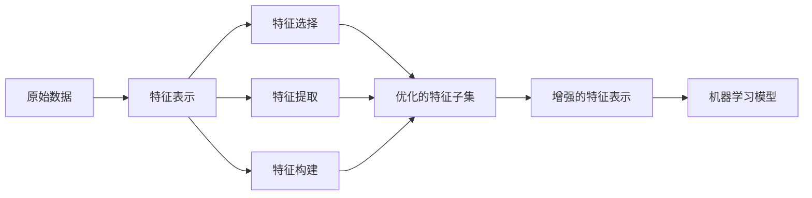

# 特征工程 (Feature Engineering) 原理与代码实例讲解

## 1. 背景介绍

### 1.1 问题的由来
在机器学习和数据挖掘领域,原始数据通常无法直接用于训练模型。这是因为原始数据可能存在噪声、冗余、缺失值等问题,导致数据质量较差。此外,原始特征可能无法很好地反映样本的内在特性,难以被模型有效地利用。因此,需要对原始数据进行预处理和特征变换,从而得到质量更高、信息更丰富的特征表示,这就是特征工程的由来。

### 1.2 研究现状
目前,特征工程已经成为机器学习pipeline中不可或缺的一部分。各种特征工程技术被广泛应用于学术研究和工业界,极大地提升了模型性能。比如,归一化、标准化能够消除特征量纲差异;特征选择能够去除冗余和无关特征;特征提取如PCA能够将原始高维特征压缩为低维表示。近年来,自动化特征工程成为新的研究热点,旨在减少人工设计特征的成本。

### 1.3 研究意义 
高质量的特征是机器学习取得良好效果的前提。因此,深入理解特征工程的原理,掌握其方法和技巧,对于数据科学家和机器学习工程师来说非常重要。系统性地学习特征工程知识,有助于我们从海量数据中挖掘出有价值的信息,为算法建模提供优质的"燃料",从而训练出更加强大的模型。此外,对特征工程原理的研究,也为自动化、智能化特征工程系统的设计提供理论基础。

### 1.4 本文结构
本文将全面介绍特征工程的相关知识。第2节阐述特征工程的核心概念;第3节讲解常见的特征工程算法原理和步骤;第4节给出特征工程相关的数学模型和公式;第5节通过代码实例演示特征工程的具体实现;第6节分析特征工程的实际应用场景;第7节推荐相关学习资源;第8节对全文进行总结并探讨特征工程的发展趋势与挑战;第9节列出特征工程的常见问题解答。

## 2. 核心概念与联系

特征工程的核心概念包括:

- 特征(Feature):指数据的属性或性质,用于刻画样本的特点,是机器学习算法的输入。
- 特征表示(Feature Representation):将原始形式的特征数据转化为更容易被模型学习和使用的形式,如向量化、归一化等。
- 特征选择(Feature Selection):从原有特征集合中选择出信息量大、区分度高的特征子集,降低特征维度。
- 特征提取(Feature Extraction):在原始特征的基础上创造出新的、更有判别力的特征表示。
- 特征构建(Feature Construction):利用领域知识,根据已有特征生成高阶组合特征。

这些概念之间的联系可以用下图表示:



从上图可以看出,特征工程的起点是原始数据,终点是优质的特征输入给机器学习模型。其中,特征表示是基础,特征选择、提取、构建在此基础上对特征进行优化组合,最终输出高质量的特征用于建模。可见,特征工程各个环节紧密相连,共同服务于从数据到模型这一目标。

## 3. 核心算法原理 & 具体操作步骤

### 3.1 算法原理概述
特征工程的核心算法可以分为数据预处理、特征选择、特征提取、特征构建几大类。它们分别解决数据异质性、冗余、可解释性、判别性等问题。这些算法从不同角度对特征进行变换和优化,最终得到适合建模的特征表示。

### 3.2 算法步骤详解

#### 3.2.1 数据预处理
- 缺失值处理:删除缺失样本,或者填充缺失值(均值、中位数、众数、knn等)
- 异常值检测:统计方法(3-sigma)、距离方法(knn)、聚类方法(dbscan)
- 数据归一化:线性归一化、对数归一化、反正切归一化
- 数据标准化:z-score标准化、鲁棒标准化

#### 3.2.2 特征选择  
- 过滤法(Filter):方差选择法、相关系数法、卡方检验、互信息法
- 包裹法(Wrapper):递归特征消除法、顺序特征选择法
- 嵌入法(Embedding):L1正则化、决策树、梯度提升树

#### 3.2.3 特征提取
- PCA:中心化->协方差矩阵->特征值分解->降维
- LDA:类内/类间散度矩阵->广义特征值问题->投影矩阵
- 流形学习:等度量映射、局部线性嵌入、拉普拉斯特征映射

#### 3.2.4 特征构建
- 多项式特征:基于原始特征的高阶多项式组合
- 特征交叉:不同类型特征的笛卡尔积
- 特征升维:引入辅助特征,提升数据维度
- 领域驱动:利用专家知识构建高阶组合特征

### 3.3 算法优缺点

- 数据预处理:能提高数据质量,但可能引入噪声
- 特征选择:降低冗余,提高可解释性,但可能丢失信息  
- 特征提取:减少数据维度,提取主要信息,但transformers可能难以解释
- 特征构建:增加了判别信息,但人工成本高,可能过拟合

### 3.4 算法应用领域
特征工程几乎应用于机器学习的各个领域,如计算机视觉、自然语言处理、语音识别、推荐系统等。不同领域的数据特点不一样,需要采取不同的特征工程策略。比如,图像特征工程常用卷积、池化等操作,文本特征工程常用tfidf、word2vec等方法。

## 4. 数学模型和公式 & 详细讲解 & 举例说明

### 4.1 数学模型构建

#### 4.1.1 特征选择模型
以过滤法-方差选择为例。假设特征$X$有$n$个样本观测值${x_1,x_2,...,x_n}$,方差定义为:

$$Var(X)=\frac{1}{n}\sum_{i=1}^n(x_i-\overline{X})^2$$

其中$\overline{X}=\frac{1}{n}\sum_{i=1}^nx_i$为均值。方差度量了特征的分散程度,方差越大,说明特征值分布越分散,包含的信息越多。因此,可以通过方差大小来选择特征。

#### 4.1.2 特征提取模型
以PCA为例。假设数据矩阵$X\in \mathbb{R}^{m\times n}$,其中$m$为样本数,$n$为特征维度。PCA分解步骤如下:

1) 中心化:$X^{'}=X-\frac{1}{m}\boldsymbol{1}\boldsymbol{1}^TX$,其中$\boldsymbol{1}$为全1向量

2) 计算协方差矩阵:$C=\frac{1}{m}X^{'T}X^{'}$

3) 特征值分解:$C=U\Sigma U^T$,其中$U$为特征向量矩阵,$\Sigma$为特征值对角阵

4) 降维处理:取前$k$个最大特征值对应的特征向量$U_k=[u_1,u_2,...,u_k]$,得到降维后的矩阵$Z=X^{'}U_k \in \mathbb{R}^{m\times k}$

PCA本质上是寻找数据的最大方差方向,将数据投影到这些方向上,实现降维和特征提取。

### 4.2 公式推导过程

#### 4.2.1 方差公式推导
方差公式可以从均方误差的角度推导。样本$x_i$到均值$\overline{X}$的距离平方为$(x_i-\overline{X})^2$,对所有样本求均值有:

$$\frac{1}{n}\sum_{i=1}^n(x_i-\overline{X})^2=\frac{1}{n}\sum_{i=1}^n(x_i^2-2x_i\overline{X}+\overline{X}^2)$$

$$=\frac{1}{n}\sum_{i=1}^nx_i^2-\frac{2}{n}\overline{X}\sum_{i=1}^nx_i+\overline{X}^2$$

由于$\overline{X}=\frac{1}{n}\sum_{i=1}^nx_i$,代入上式化简即得方差公式。

#### 4.2.2 PCA公式推导
PCA优化目标是最大化投影后的方差:

$$\underset{U}{max} \quad tr(U^TX^{'T}X^{'}U) \quad s.t. \quad U^TU=I$$

其中$tr$为矩阵的迹,$I$为单位阵。利用拉格朗日乘子法,引入乘子$\Lambda$,得到:

$$ L(U,\Lambda)=tr(U^TX^{'T}X^{'}U)-tr(\Lambda(U^TU-I))$$

对$U$求导可得:

$$ \frac{\partial L}{\partial U}=2X^{'T}X^{'}U-2\Lambda U=0$$

$$ \Rightarrow X^{'T}X^{'}U=\Lambda U$$

这就是特征值分解的形式。由于$X^{'T}X^{'}$是实对称矩阵,因此$U$的列向量即为$X^{'T}X^{'}$的特征向量,对角阵$\Lambda$的元素为对应的特征值。取前$k$个最大特征值对应的特征向量作为$U_k$,就得到了PCA的降维矩阵。

### 4.3 案例分析与讲解
下面以一个简单的二维数据集为例,直观展示PCA的降维效果:

```python
from sklearn.datasets import make_blobs
from sklearn.decomposition import PCA
import matplotlib.pyplot as plt

# 生成示例数据
X, _ = make_blobs(n_samples=100, centers=3, n_features=2, random_state=2)  

# PCA降维
pca = PCA(n_components=1)
X_pca = pca.fit_transform(X)

# 可视化
fig, (ax1, ax2) = plt.subplots(1, 2, figsize=(8,4))
ax1.scatter(X[:,0], X[:,1])
ax1.set_title("Original Data")
ax1.set_xlabel("x1")
ax1.set_ylabel("x2")
ax2.scatter(X_pca, np.zeros_like(X_pca))
ax2.set_title("PCA Projection")
ax2.set_xlabel("Principal Component")
plt.tight_layout()
plt.show()
```

上述代码首先生成一个包含3类的二维数据集,然后用PCA将其降到一维。从可视化结果可以看出,PCA学习到了数据的主要变化方向,并将数据投影到这个方向上,实现了降维和特征提取。

### 4.4 常见问题解答

#### 4.4.1 如何选择PCA的降维维度?
主要有以下几种策略:
- 根据累积方差贡献率(explained variance ratio)设置阈值,如95%
- 根据特征值大小设置阈值,如1.0
- 交叉验证选择使下游任务性能最优的维度
- 直接指定降维到的目标维度数

#### 4.4.2 PCA对数据尺度敏感吗?
PCA的结果会受到数据尺度的影响。若不同维度特征的尺度差异很大,可能导致PCA偏重某些特征。因此,在做PCA之前,通常需要对数据进行标准化预处理,使各维度特征的均值为0,方差为1。这样能够消除尺度差异带来的影响。

## 5. 项目实践：代码实例和详细解释说明

下面以一个Kaggle竞赛数据集为例,演示特征工程的完整代码实现。

### 5.1 开发环境搭建
```python
# 加载相关库
import numpy as np
import pandas as pd
import matplotlib.pyplot as plt
from sklearn.model_selection import train_test_split
from sklearn.preprocessing import MinMaxScaler, StandardScaler, PolynomialFeatures
from sklearn.feature_selection import VarianceThreshold, SelectKBest, f_classif
from sklearn.decomposition import PCA
from sklearn.linear_model import Log