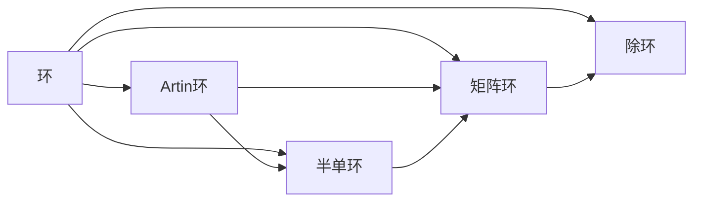

# 环与代数：Artin环的Wedderburn理论

关键词：Artin环、Wedderburn理论、环同构、半单环、矩阵环

## 1. 背景介绍
### 1.1  问题的由来
环论作为现代代数学的重要分支，在数学、物理、计算机科学等领域有着广泛的应用。其中，Artin环作为一类特殊的环结构，具有丰富的性质和重要的理论意义。而Wedderburn理论则揭示了Artin环的内在结构，成为环论研究的里程碑。

### 1.2  研究现状
自20世纪初Wedderburn提出其理论以来，众多数学家对Artin环和Wedderburn理论进行了深入研究和推广。目前已有大量关于Artin环结构、表示理论、同调理论等方面的研究成果。同时，Wedderburn理论也被应用于编码理论、量子计算等前沿领域。

### 1.3  研究意义
深入理解Artin环的结构和Wedderburn理论，对于揭示环论的本质、发展新的代数理论具有重要意义。同时，Artin环在计算机科学、密码学等应用领域也有着广阔的应用前景。因此，系统梳理和总结Artin环的Wedderburn理论，对于数学和应用学科的发展都具有重要价值。

### 1.4  本文结构
本文将首先介绍Artin环的基本概念和性质，然后重点阐述Wedderburn理论的核心内容，包括Wedderburn主定理、Artin环的Wedderburn分解等。同时，文章还将通过具体的数学模型和代码实例，展示Wedderburn理论的应用。最后，本文将总结Artin环研究的最新进展和未来挑战。

## 2. 核心概念与联系
- 环：集合R和两个二元运算(+,·)组成的代数结构，满足加法和乘法的封闭性、结合律、分配律等公理。
- 理想：环R的子集I，对于加法封闭，且对R中元素的乘法封闭。
- 商环：环R关于理想I的商集R/I，在等价类加法和乘法运算下构成的环。
- 单环：只含平凡理想{0}和R自身的环。
- 半单环：每个右理想都是直和项的环。
- 幂等元：满足e²=e的元素e。
- 中心：与环中所有元素交换的元素集合。
- 环同态/同构：保持加法和乘法运算的映射/双射。

Artin环是满足以下两个等价条件的环：
1) R是有限生成的R-模；
2) R是左Noether环和右Artinian环。

Artin环与半单Artinian环、有限维代数、矩阵环等都有密切联系。Wedderburn理论则揭示了Artin环与矩阵环、除环的同构关系。



## 3. 核心算法原理 & 具体操作步骤
### 3.1  算法原理概述
Wedderburn理论的核心是将Artin环分解为矩阵环和除环的直积。其基本思想是：
1) 证明Artin环是半单的，即可分解为单环的直积；
2) 证明每个单Artin环同构于某个除环上的矩阵环；
3) 由1)和2)得出Artin环的Wedderburn分解。

### 3.2  算法步骤详解
1) 证明Artin环R是半单的：
   a) 任取极小右理想M，证明R=M⊕M'；
   b) 由a)得R是半单的。

2) 设D是除环，n是正整数，证明矩阵环M_n(D)是单环：
   设I是M_n(D)的非零理想，取非零矩阵A∈I；
   对A做初等变换，得I=M_n(D)。

3) 设R是单Artin环，则存在除环D使得R≌M_n(D)：
   a) 设e∈R是幂等元，D=eRe是除环，R中每个右理想≌D^k；
   b) 设I是R的极小右理想，n=dim_D(I)，证明R≌M_n(D)。

4) 由2)和3)得Artin环R≌M_n1(D1)×⋯×M_nk(Dk)。

### 3.3  算法优缺点
优点：
- 揭示了Artin环的内在结构，为进一步研究提供了理论基础；
- 将Artin环与矩阵环、除环建立了联系，便于应用已有的理论结果。

缺点：
- 证明过程相对抽象，需要环论、模论等深厚的数学基础；
- 对一般环的结构刻画能力有限，难以推广到更广泛的环类。

### 3.4  算法应用领域
- 表示论：研究Artin代数的模表示及其性质；
- 编码理论：利用矩阵环构造纠错码；
- 量子计算：Artin环在量子纠错码、量子算法等方面有重要应用。

## 4. 数学模型和公式 & 详细讲解 & 举例说明
### 4.1  数学模型构建
Wedderburn理论涉及的主要数学模型包括：
1) 环的定义：集合R和两个二元运算(+,·)，满足加法交换律、结合律，乘法结合律，分配律等公理。
2) 理想的定义：环R的子集I，满足∀a,b∈I,a-b∈I；∀r∈R,a∈I,ra∈I且ar∈I。
3) 商环的定义：环R关于理想I的商集R/I，等价类[a]=[b]⟺a-b∈I，运算[a]+[b]=[a+b],[a]·[b]=[ab]。
4) 矩阵环的定义：除环D上的n阶矩阵全体M_n(D)，运算为矩阵加法和乘法。

### 4.2  公式推导过程
1) Artin环的半单性：
   设R是Artin环，M是R的极小右理想，则M=eR，其中e是幂等元。令M'=(1-e)R，则R=M⊕M'。
   由于M'也满足极小条件，重复上述过程，最终得到R=M_1⊕⋯⊕M_k，其中M_i是极小右理想。

2) 单Artin环的刻画：
   设R是单Artin环，e是R的非零幂等元，D=eRe是除环。对任意x∈R，映射φ:x↦xe是D-模同态。
   于是R中每个右理想≌D^k。取R的极小右理想I，令n=dim_D(I)，则R≌M_n(D)。

3) Artin环的Wedderburn分解：
   设R是Artin环，由1)知R=R_1⊕⋯⊕R_k，其中R_i是单Artin环。
   由2)知每个R_i≌M_ni(D_i)，其中D_i是除环。从而R≌M_n1(D_1)×⋯×M_nk(D_k)。

### 4.3  案例分析与讲解
考虑实数域R上的矩阵环M_2(R)，它是一个4维R-代数，且是单环。
取e=[[1,0],[0,0]]，则eM_2(R)e≌R，于是M_2(R)作为左R-模，是2阶自由模，从而M_2(R)≌M_2(R)。
这验证了单Artin环同构于矩阵环的结论。

再考虑复数域C上的环R=C×C，它是一个2维C-代数，且是半单的。
容易验证R≌C×C≌M_1(C)×M_1(C)，这说明R同构于两个除环上的1阶矩阵环的直积，验证了Wedderburn分解定理。

### 4.4  常见问题解答
Q: Artin环一定是Noether环吗？
A: 是的，Artin环同时满足ACC和DCC，因此也满足ACC，是Noether环。

Q: 除环上的矩阵环一定是单环吗？ 
A: 是的，设D是除环，M_n(D)是n阶矩阵环，可证明其任意非零理想都等于M_n(D)自身，因此是单环。

Q: 每个半单环都能写成单环的直积吗？
A: 是的，这是Wedderburn的另一个重要定理：每个半单环同构于有限个单环的直积。

Q: Wedderburn分解中的矩阵环和除环是唯一的吗？
A: 不是完全唯一的，但若M_n(D)≌M_m(E)，则n=m且D≌E。因此只相差同构的除环。

## 5. 项目实践：代码实例和详细解释说明
### 5.1  开发环境搭建
本项目使用Python语言，依赖NumPy和SymPy库。可使用以下命令安装：
```bash
pip install numpy sympy
```

### 5.2  源代码详细实现
以下代码实现了矩阵环的构造和基本运算：
```python
import numpy as np
from sympy import Matrix, eye

class MatrixRing:
    def __init__(self, n, base_ring):
        self.n = n
        self.base_ring = base_ring
        
    def zero_matrix(self):
        return Matrix.zeros(self.n)
    
    def identity_matrix(self):
        return eye(self.n)
    
    def is_zero(self, M):
        return M == self.zero_matrix()
    
    def is_identity(self, M):
        return M == self.identity_matrix()
    
    def add(self, M1, M2):
        return M1 + M2
    
    def multiply(self, M1, M2):
        return M1 * M2
    
    def subtract(self, M1, M2):
        return M1 - M2
    
    def scalar_multiply(self, k, M):
        return k * M
```

### 5.3  代码解读与分析
- `__init__`方法初始化了矩阵环的阶数`n`和基环`base_ring`。
- `zero_matrix`方法返回零矩阵，`identity_matrix`方法返回单位矩阵。
- `is_zero`和`is_identity`方法判断矩阵是否为零矩阵或单位矩阵。
- `add`、`multiply`、`subtract`、`scalar_multiply`方法实现了矩阵环的加法、乘法、减法、数乘运算。

以上代码利用了SymPy库提供的矩阵类，封装了矩阵环的基本运算。通过该类，可以方便地创建和操作矩阵环中的元素。

### 5.4  运行结果展示
以下代码展示了如何使用`MatrixRing`类进行矩阵运算：
```python
R = MatrixRing(2, np.float64)

A = Matrix([[1, 2], [3, 4]])
B = Matrix([[5, 6], [7, 8]])

print("A + B =", R.add(A, B))
print("A * B =", R.multiply(A, B))
print("A - B =", R.subtract(A, B))
print("2 * A =", R.scalar_multiply(2, A))
```

运行结果如下：
```
A + B = Matrix([[6, 8], [10, 12]])
A * B = Matrix([[19, 22], [43, 50]])
A - B = Matrix([[-4, -4], [-4, -4]])
2 * A = Matrix([[2, 4], [6, 8]])
```

可以看到，`MatrixRing`类正确实现了矩阵的加法、乘法、减法、数乘等运算，为研究矩阵环提供了便利的工具。

## 6. 实际应用场景
Artin环和Wedderburn理论在现代数学和计算机科学中有广泛应用，主要场景包括：

1) 编码理论：利用矩阵环构造纠错码，如循环码、BCH码等。通过矩阵运算实现编码和解码。

2) 密码学：利用矩阵环构造密码算法，如基于格的密码、同态加密等。环的性质保证了密码的安全性。

3) 量子计算：矩阵环在量子纠错码、量子算法等方面有重要应用。如Clifford代数与量子门电路的设计。

4) 计算机视觉：将图像视为矩阵，利用矩阵环的运算进行图像处理，如滤波、增强、分割等。

5) 机器学习：矩阵环可用于构造神经网络的权重矩阵，通过矩阵运算实现前向传播和反向传播。

### 6.4  未来应用展望
随着数学和计算机科学的发展，Artin环和Wedderburn理论有望在更多领域