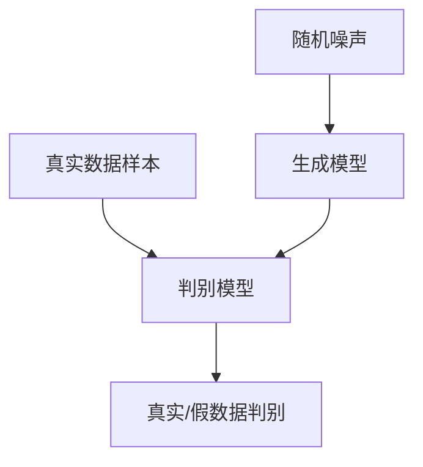

以下是标题为《生成对抗网络GAN原理与代码实例讲解》的技术博客文章正文内容：

# 生成对抗网络GAN原理与代码实例讲解

## 1. 背景介绍

### 1.1 问题的由来

在机器学习和人工智能领域中,生成模型是一个长期存在的挑战性问题。传统的生成模型如高斯混合模型、隐马尔可夫模型等,都存在一些局限性,难以捕捉复杂数据分布的细微结构。因此,如何设计出能够学习复杂数据分布的生成模型,成为了人工智能领域的一个重要研究课题。

### 1.2 研究现状 

近年来,受到深度学习技术的快速发展的推动,生成对抗网络(Generative Adversarial Networks, GAN)作为一种全新的生成模型框架应运而生。自2014年由Ian Goodfellow等人在论文"Generative Adversarial Networks"中首次提出以来,GAN就引起了学术界和工业界的广泛关注。

### 1.3 研究意义

GAN可以被视为一种新型的生成模型,它不需要对数据分布作出任何显式假设,而是通过对抗训练的方式直接从数据中学习潜在的分布。GAN展现出了强大的生成能力,可以生成逼真的图像、语音、视频等高维数据,在计算机视觉、自然语言处理、多媒体等领域具有广泛的应用前景。

### 1.4 本文结构

本文将全面介绍GAN的基本原理、核心算法、数学模型以及实际应用。首先阐述GAN的核心思想和基本框架;然后详细讲解GAN的训练过程、损失函数、优化算法等;接着对GAN的数学模型进行推导,并结合实例进行说明;再给出GAN的代码实现细节,并分析运行结果;最后总结GAN的应用场景,展望其未来发展趋势和面临的挑战。

## 2. 核心概念与联系

生成对抗网络(GAN)的核心思想是将模型的训练过程视为一个由生成模型和判别模型组成的minimax博弈。具体来说:

- **生成模型(Generator)**: 它从一个潜在的随机噪声分布中采样,并将这些噪声输入到一个多层感知机(MLP)或卷积神经网络(CNN)中,生成尽可能逼真的样本数据,以欺骗判别模型。
- **判别模型(Discriminator)**: 它接收真实数据样本和生成模型产生的假数据样本作为输入,并输出一个概率分数,表示输入数据是真实样本还是生成样本。

生成模型和判别模型相互对抗,目标是找到一个纳什均衡:生成模型希望生成的样本可以尽可能欺骗判别模型;而判别模型则希望能够很好地区分真实数据和生成数据。通过这种对抗训练,生成模型会不断优化参数,最终学习到潜在的真实数据分布。

GAN属于无监督学习范畴,但与传统的生成模型如高斯混合模型等有着本质的区别。GAN不需要对数据分布作任何显式建模,而是直接从数据中学习,具有很强的拟合能力。同时,GAN也可以与其他深度学习模型相结合,例如将GAN生成的样本用于数据增广,提高监督学习模型的性能。

## 3. 核心算法原理与具体操作步骤

### 3.1 算法原理概述

GAN的训练过程可以概括为生成模型和判别模型之间的一个minimax博弈过程。具体来说,生成模型G将从一个潜在的随机噪声分布 $p_z(z)$ 中采样,并将噪声 $z$ 输入到一个有着可学习参数 $\theta_g$ 的映射函数 $G(z;\theta_g)$ 中,生成一个样本 $G(z;\theta_g)$。而判别模型D则是一个二分类器,它将真实数据样本 $x$ 和生成数据样本 $G(z;\theta_g)$ 作为输入,通过一个有着可学习参数 $\theta_d$ 的判别函数 $D(x;\theta_d)$ 输出一个概率分数,表示输入数据为真实样本的概率。

生成模型G和判别模型D的目标是一个minimax值函数:

$$\underset{G}{\operatorname{min}} \; \underset{D}{\operatorname{max}} \; V(G, D) = \mathbb{E}_{x \sim p_{\text{data}}(x)}\big[\log D(x)\big] + \mathbb{E}_{z \sim p_z(z)}\big[\log \big(1 - D(G(z))\big)\big]$$

直观上,生成模型G希望生成的样本可以尽可能欺骗判别模型D,即最小化 $\log(1-D(G(z)))$;而判别模型D则希望能够很好地区分真实数据和生成数据,即最大化 $\log D(x)$ 和 $\log(1-D(G(z)))$。通过这种对抗训练,生成模型G会不断优化参数 $\theta_g$,最终学习到真实数据分布 $p_{\text{data}}(x)$。

### 3.2 算法步骤详解

1. **初始化生成模型G和判别模型D的参数**

   - 生成模型G的参数 $\theta_g$ 通常使用随机初始化或预训练模型的参数值。
   - 判别模型D的参数 $\theta_d$ 也通常使用随机初始化。

2. **对判别模型D进行训练**
   
   - 从真实数据集中采样一个批次的真实数据样本 $\{x^{(1)}, x^{(2)}, \ldots, x^{(m)}\}$。
   - 从潜在随机噪声分布 $p_z(z)$ 中采样一个批次的噪声样本 $\{z^{(1)}, z^{(2)}, \ldots, z^{(m)}\}$。
   - 通过生成模型G将噪声样本映射为生成数据样本 $\{G(z^{(1)}), G(z^{(2)}), \ldots, G(z^{(m)})\}$。
   - 将真实数据样本和生成数据样本输入到判别模型D中,计算判别模型的损失函数:

     $$\ell_D = -\frac{1}{m}\sum_{i=1}^m\Big[\log D(x^{(i)}) + \log\big(1 - D(G(z^{(i)}))\big)\Big]$$

   - 对判别模型D的参数 $\theta_d$ 进行梯度下降优化,以最小化损失函数 $\ell_D$。

3. **对生成模型G进行训练**

   - 从潜在随机噪声分布 $p_z(z)$ 中采样一个批次的噪声样本 $\{z^{(1)}, z^{(2)}, \ldots, z^{(m)}\}$。
   - 通过生成模型G将噪声样本映射为生成数据样本 $\{G(z^{(1)}), G(z^{(2)}), \ldots, G(z^{(m)})\}$。
   - 将生成数据样本输入到判别模型D中,计算生成模型的损失函数:

     $$\ell_G = -\frac{1}{m}\sum_{i=1}^m\log D(G(z^{(i)}))$$

   - 对生成模型G的参数 $\theta_g$ 进行梯度下降优化,以最小化损失函数 $\ell_G$。

4. **重复步骤2和步骤3,直到模型收敛**

在实际操作中,通常会交替地训练判别模型D和生成模型G,即每次更新一个模型的参数后,再固定该模型的参数,更新另一个模型的参数。这种训练方式可以有效提高模型的收敛性能。

### 3.3 算法优缺点

**优点:**

1. **无需显式建模**: GAN不需要对数据分布作任何显式假设,可以直接从数据中学习复杂的分布。
2. **生成质量好**: GAN生成的样本质量通常较高,在图像、语音、视频等领域可以生成逼真的数据。
3. **可扩展性强**: GAN框架可以与其他深度学习模型相结合,在各种任务中发挥作用。
4. **理论支持**: GAN有着坚实的理论基础,是一种具有吸引力的生成模型范式。

**缺点:**

1. **训练不稳定**: GAN的训练过程容易出现模式崩溃、梯度消失等问题,训练较为不稳定。
2. **评估困难**: 目前还缺乏有效的评价指标来衡量GAN生成样本的质量和多样性。
3. **收敛慢**: GAN的训练通常需要大量的迭代次数,收敛较为缓慢。
4. **模式丢失**: GAN有时会忽略数据分布中的一些细微模式,导致生成样本缺乏多样性。

### 3.4 算法应用领域

GAN由于其强大的生成能力,在多个领域都有着广泛的应用前景:

1. **计算机视觉**: 图像生成、图像超分辨率重建、图像翻译、图像修复等。
2. **自然语言处理**: 文本生成、机器翻译、对话系统等。
3. **音频处理**: 语音合成、音乐生成、声音增强等。
4. **视频处理**: 视频生成、视频插帧、视频上色等。
5. **数据增广**: 通过GAN生成样本,扩充训练数据集,提高监督学习模型的性能。
6. **半监督学习**: 利用GAN生成的样本作为标签数据,提高半监督学习的性能。
7. **隐私保护**: 通过GAN生成的样本替代真实数据,实现数据隐私保护。

## 4. 数学模型和公式详细讲解举例说明

### 4.1 数学模型构建

GAN的数学模型可以形式化为一个minimax博弈问题,生成模型G和判别模型D的目标是找到一个纳什均衡,使得以下值函数达到最小:

$$\underset{G}{\operatorname{min}} \; \underset{D}{\operatorname{max}} \; V(G, D) = \mathbb{E}_{x \sim p_{\text{data}}(x)}\big[\log D(x)\big] + \mathbb{E}_{z \sim p_z(z)}\big[\log \big(1 - D(G(z))\big)\big]$$

其中:

- $p_{\text{data}}(x)$ 表示真实数据样本 $x$ 的分布。
- $p_z(z)$ 表示生成模型G的输入噪声 $z$ 的分布,通常取为高斯分布或均匀分布。
- $G(z;\theta_g)$ 表示生成模型G,它将噪声 $z$ 映射为生成数据样本,其参数为 $\theta_g$。
- $D(x;\theta_d)$ 表示判别模型D,它将真实数据样本 $x$ 或生成数据样本 $G(z)$ 作为输入,输出一个概率分数表示输入为真实样本的可能性,其参数为 $\theta_d$。

直观上,判别模型D希望最大化 $\log D(x)$ 和 $\log(1-D(G(z)))$,即正确识别真实样本和生成样本;而生成模型G则希望最小化 $\log(1-D(G(z)))$,即欺骗判别模型D,使其无法区分生成样本和真实样本。

在理想情况下,当G和D达到纳什均衡时,生成模型G学习到的分布 $p_g(x)$ 将与真实数据分布 $p_{\text{data}}(x)$ 完全一致,此时判别模型D将无法区分真实样本和生成样本,对所有 $x$ 有 $D(x)=\frac{1}{2}$。

### 4.2 公式推导过程

我们可以通过一些数学推导,揭示GAN目标函数的本质含义。首先,根据对数的性质,我们可以将GAN的值函数化简为:

$$\begin{aligned}
V(G, D) &= \mathbb{E}_{x \sim p_{\text{data}}(x)}\big[\log D(x)\big] + \mathbb{E}_{z \sim p_z(z)}\big[\log \big(1 - D(G(z))\big)\big] \\
&= \mathbb{E}_{x