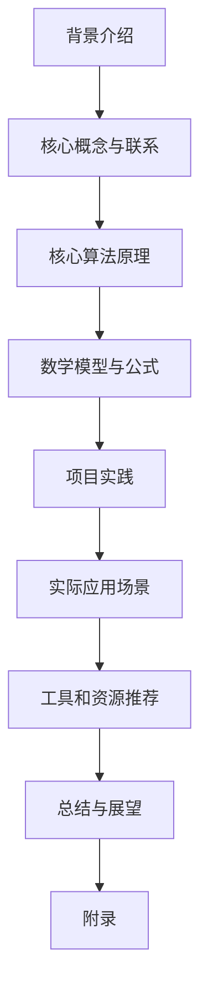

# 监控AI代理工作流：性能指标与分析

## 1. 背景介绍

### 1.1 问题的由来

在当今快节奏的数字世界中,AI代理已经无处不在,从智能助理到自动驾驶汽车,再到复杂的工业自动化系统。随着AI系统的广泛应用,确保其高效、可靠和安全的运行变得至关重要。然而,由于AI系统的复杂性和不确定性,监控和分析其性能并非易事。

传统的监控方法通常关注硬件和软件资源的利用率,如CPU、内存和网络流量等,但这些指标往往无法全面反映AI代理的实际运行状况。AI系统的性能取决于多个因素,包括模型精度、推理延迟、资源利用效率等,需要更加全面和专门的监控指标和分析方法。

### 1.2 研究现状

近年来,AI监控和分析已成为研究的热点领域。学术界和业界都在积极探索新的方法和工具,以更好地监控和优化AI系统的性能。一些主要的研究方向包括:

1. **AI性能指标**: 定义和标准化用于衡量AI系统性能的关键指标,如模型精度、推理延迟、资源利用率等。
2. **在线监控**: 开发实时监控AI代理运行状态的工具和框架,以便及时发现和解决性能问题。
3. **异常检测**: 研究基于机器学习的异常检测算法,自动识别AI系统中的异常行为和性能下降。
4. **可解释性**: 提高AI系统的可解释性,使其决策过程和性能表现更加透明和可解释。
5. **基准测试**: 建立标准化的基准测试套件,用于评估和比较不同AI系统的性能。

尽管取得了一些进展,但AI监控和分析仍然面临着诸多挑战,如指标的复杂性、数据的高维度、实时性要求等,需要进一步的研究和创新。

### 1.3 研究意义

有效监控和分析AI代理的工作流程对于确保系统的稳定性、安全性和高效运行至关重要。通过深入研究这一领域,我们可以:

1. **提高AI系统的可靠性**: 及时发现和解决性能问题,减少系统故障和中断。
2. **优化资源利用**: 通过监控和分析,优化AI系统的资源分配和利用效率。
3. **增强安全性**: 检测和防范AI系统中的异常行为和安全漏洞。
4. **促进可解释性**: 更好地理解AI决策过程,提高系统的透明度和可解释性。
5. **推动创新**: 研究成果有助于开发新的监控和分析工具,推动AI技术的进步。

因此,深入研究AI代理工作流的监控和分析具有重要的理论和实践意义。

### 1.4 本文结构

本文将全面探讨AI代理工作流的监控和分析方法。文章首先介绍核心概念和相关技术,然后深入阐述关键算法原理和数学模型。接下来,我们将通过实际案例和代码示例,展示如何在实践中应用这些方法。最后,我们将讨论实际应用场景、未来发展趋势和面临的挑战。

文章的主要内容结构如下:

## 2. 核心概念与联系

在探讨AI代理工作流监控和分析的具体方法之前,我们需要先了解一些核心概念和相关技术。

### 2.1 AI代理工作流

AI代理工作流指的是AI系统在执行特定任务时所经历的一系列过程和阶段。典型的AI代理工作流包括:

1. **数据采集**: 从各种来源收集和整理训练数据。
2. **数据预处理**: 对原始数据进行清洗、标注和转换,以满足模型训练的要求。
3. **模型训练**: 使用机器学习算法在训练数据上训练AI模型。
4. **模型评估**: 在测试数据上评估模型的性能和准确性。
5. **模型部署**: 将训练好的模型部署到生产环境中,用于实际应用。
6. **模型推理**: AI代理根据输入数据进行推理,生成输出结果。
7. **结果反馈**: 将推理结果反馈给用户或下游系统,并收集反馈数据。

监控和分析AI代理的工作流需要全面考虑上述各个阶段的性能指标和行为模式。

### 2.2 AI性能指标

AI性能指标是衡量AI系统运行状况的关键标准。常见的AI性能指标包括:

1. **模型精度**: 反映模型预测结果与实际值之间的偏差,如准确率、精确率、召回率等。
2. **推理延迟**: 指AI代理从接收输入到生成输出的时间延迟。
3. **资源利用率**: 包括CPU、GPU、内存和网络带宽等硬件资源的利用情况。
4. **吞吐量**: 指AI系统在单位时间内能够处理的请求或任务数量。
5. **可用性**: 反映AI系统的稳定性和可靠性,通常用系统正常运行时间占总时间的比例来衡量。
6. **成本效率**: 考虑AI系统的性能和成本之间的权衡,以确保在可接受的成本范围内获得最佳性能。

不同的AI应用场景对各项指标的重视程度也不尽相同。例如,对于自动驾驶系统,推理延迟和可用性是最为关键的指标;而对于推荐系统,模型精度和吞吐量可能更为重要。

### 2.3 监控和分析技术

监控和分析AI代理工作流需要综合运用多种技术和工具,包括:

1. **日志记录**: 在AI系统的各个组件中记录详细的运行日志,以便后续分析和故障排查。
2. **指标收集**: 使用监控代理或嵌入式探针收集关键性能指标数据。
3. **可视化**: 将收集到的监控数据以图表、仪表盘等形式可视化,方便人工分析和理解。
4. **异常检测**: 基于机器学习算法自动检测AI系统中的异常行为和性能下降。
5. **追踪系统**: 跟踪AI工作流中的请求和任务,了解其在各个阶段的执行情况。
6. **自动扩缩容**: 根据实时监控数据,自动调整AI系统的资源分配,以优化性能和成本。
7. **可解释AI**: 提高AI模型和决策过程的可解释性,有助于更好地理解和分析系统行为。

这些技术和工具通常需要紧密集成,才能形成完整的AI监控和分析解决方案。

## 3. 核心算法原理与具体操作步骤

### 3.1 算法原理概述

监控和分析AI代理工作流的核心算法主要包括以下几个方面:

1. **异常检测算法**: 基于机器学习的异常检测算法,可以自动识别AI系统中的异常行为和性能下降。常见的异常检测算法包括基于统计的方法、基于深度学习的方法等。

2. **时序数据分析算法**: AI系统产生的监控数据通常是时序数据,需要使用时序数据分析算法来发现潜在的模式和趋势。常见的时序数据分析算法包括时序模式挖掘、异常值检测、趋势预测等。

3. **在线学习算法**: 为了适应AI系统的动态变化,需要使用在线学习算法持续更新异常检测模型和性能基线。常见的在线学习算法包括增量学习、迁移学习等。

4. **资源优化算法**: 根据实时监控数据,使用资源优化算法自动调整AI系统的资源分配,以提高性能和成本效率。常见的资源优化算法包括约束优化、强化学习等。

5. **可解释AI算法**: 提高AI模型和决策过程的可解释性,有助于更好地理解和分析系统行为。常见的可解释AI算法包括模型可解释性技术、注意力机制等。

这些算法通常需要结合具体的AI系统架构和应用场景进行定制和优化,以获得最佳的监控和分析效果。

### 3.2 算法步骤详解

以异常检测算法为例,我们将详细介绍其具体的操作步骤:

1. **数据预处理**:
   - 从AI系统中收集原始监控数据,包括模型精度、推理延迟、资源利用率等指标。
   - 对原始数据进行清洗和标准化,处理缺失值和异常值。
   - 根据需要对数据进行特征提取和编码,以便后续的异常检测模型训练。

2. **建立正常行为基线**:
   - 使用AI系统的历史监控数据,建立正常行为的基线模型。
   - 常见的基线模型包括高斯分布模型、核密度估计模型等。

3. **异常检测模型训练**:
   - 选择合适的异常检测算法,如基于统计的方法(如孤立森林)或基于深度学习的方法(如自编码器)。
   - 使用带有标签的训练数据(正常数据和已知异常数据)训练异常检测模型。
   - 通过交叉验证和调参,优化模型的性能。

4. **在线异常检测**:
   - 将训练好的异常检测模型部署到生产环境中。
   - 实时监控AI系统的运行状态,并将新的监控数据输入异常检测模型。
   - 模型会输出每个数据点的异常分数,根据设定的阈值判断是否为异常。

5. **异常警报和响应**:
   - 当检测到异常时,立即触发警报,通知相关人员。
   - 根据异常的严重程度和类型,采取相应的响应措施,如重启组件、扩容资源等。
   - 收集异常数据,用于后续的根因分析和模型优化。

6. **模型更新和优化**:
   - 定期使用新的正常数据和异常数据,重新训练异常检测模型。
   - 采用在线学习或迁移学习等技术,使模型能够适应AI系统的动态变化。
   - 根据新的需求和反馈,调整模型的参数和阈值设置。

上述步骤可以通过自动化的流程和工具来实现,以确保AI系统的持续监控和异常检测。同时,也需要人工专家参与,对异常情况进行分析和处理。

### 3.3 算法优缺点

异常检测算法在监控和分析AI代理工作流中具有以下优点:

1. **自动化**: 可以自动识别AI系统中的异常行为,减少人工监控的工作量。
2. **实时性**: 能够实时检测异常,并及时采取响应措施,提高系统的可用性和稳定性。
3. **适应性**: 通过在线学习和模型更新,算法可以适应AI系统的动态变化。
4. **高维数据处理**: 能够有效处理AI系统产生的高维监控数据。

但同时,异常检测算法也存在一些缺点和挑战:

1. **噪声和误报**: 由于监控数据的复杂性和噪声,算法可能产生误报或漏报。
2. **标签数据缺乏**: 训练异常检测模型需要大量的标签数据,而获取高质量的异常数据往往困难。
3. **模型解释性差**: 一些复杂的异常检测模型(如深度学习模型)缺乏解释性,难以理解其决策过程。
4. **计算资源需求高**: 对于大规模的AI系统,异常检测算法可能需要大量的计算资源。

因此,在实际应用中,需要权衡算法的优缺点,并结合具体场景进行优化和调整。

### 3.4 算法应用领域

异常检测算法在监控和分析AI代理工作流中有广泛的应用场景,包括但不限于:

1. **自动驾驶系统**: 监控自动驾驶汽车的传感器数据、决策模块等,及时发现异常情况,确保行车安全。

2. **金融风控系统**: 