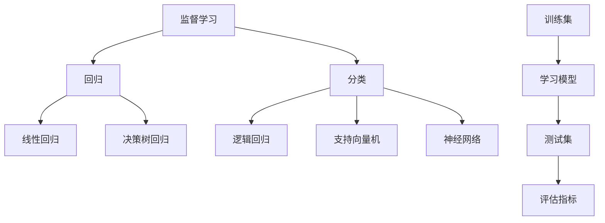

# 监督学习 (Supervised Learning)

## 1. 背景介绍

### 1.1 问题的由来

在当今的数据时代,我们被海量的数据所包围。无论是企业日志、社交媒体信息、金融交易记录还是医疗健康数据,数据都在以前所未有的规模和速度积累。然而,原始数据本身并不直接具有价值,关键在于如何从这些海量数据中提取有用的信息和知识。监督学习(Supervised Learning)作为机器学习的一个重要分支,为解决这一问题提供了有力的工具。

### 1.2 研究现状

监督学习已经在多个领域取得了卓越的成就,例如计算机视觉、自然语言处理、推荐系统等。经典的监督学习算法包括线性回归、逻辑回归、决策树、支持向量机、神经网络等。近年来,随着深度学习的兴起,基于神经网络的监督学习模型在多个领域创造了新的state-of-the-art记录。

### 1.3 研究意义

监督学习为我们提供了一种从数据中自动学习和建模的方法,而无需人工编写复杂的规则。它能够发现数据中隐藏的模式和规律,并将其应用于预测和决策。监督学习在众多领域具有广泛的应用前景,如计算机视觉、自然语言处理、医疗诊断、金融风险评估等。因此,深入研究监督学习的原理和方法对于推动人工智能的发展至关重要。

### 1.4 本文结构

本文将全面介绍监督学习的核心概念、算法原理、数学模型、实践案例等内容。我们将从基本概念出发,逐步深入探讨监督学习的各个方面。在理论部分,将重点阐述经典算法的原理和数学基础;在实践部分,将提供详细的代码示例,帮助读者更好地掌握监督学习的实现细节。此外,本文还将分享实际应用场景、工具资源推荐以及未来发展趋势和挑战,为读者提供全面的监督学习知识框架。

## 2. 核心概念与联系

监督学习(Supervised Learning)是机器学习中一个核心概念,其基本思想是利用已知的输入数据和相应的标签(或称为监督信号),学习一个从输入到输出的映射函数。这个映射函数可以用于对新的未知数据进行预测或决策。

监督学习问题可以分为两大类:回归(Regression)和分类(Classification)。回归问题是指预测一个连续的数值输出,如房价预测、销量预测等;而分类问题则是将输入数据划分到有限的类别中,如垃圾邮件分类、图像识别等。

监督学习算法通过学习已知数据的内在规律,建立输入和输出之间的映射关系模型。常见的监督学习算法包括线性回归、逻辑回归、决策树、支持向量机、神经网络等。这些算法基于不同的原理和假设,具有各自的优缺点和适用场景。

为了评估监督学习模型的性能,我们通常将数据集划分为训练集(Training Set)和测试集(Test Set)。模型在训练集上进行学习,在测试集上评估其泛化能力。常用的评估指标包括准确率(Accuracy)、精确率(Precision)、召回率(Recall)、F1分数(F1 Score)等。

监督学习与其他机器学习paradigm有着密切的联系。例如,无监督学习(Unsupervised Learning)则是从未标记的数据中发现隐藏的模式和结构;强化学习(Reinforcement Learning)则是通过与环境的交互,学习如何获得最大化的累积奖励。这些不同的学习范式往往会相互借鉴和结合,以解决更加复杂的问题。

## 3. 核心算法原理 & 具体操作步骤

### 3.1 算法原理概述

监督学习算法的核心思想是从已知的输入数据及其对应的标签(监督信号)中学习一个映射函数,使得该函数能够对新的未知数据做出准确的预测或分类。不同的算法基于不同的原理和假设,采用不同的学习策略来构建这个映射函数。

以线性回归为例,它假设输入数据和输出目标之间存在线性关系,通过最小化预测值和真实值之间的均方误差,求解出最佳的线性模型参数。逻辑回归则采用对数几率(logit)函数将线性模型的输出映射到0到1之间,用于二分类问题。决策树算法则是基于信息熵的概念,递归地将数据划分为更小的子集,构建一个决策树模型。

支持向量机(SVM)的核心思想是在高维空间中寻找一个超平面,将不同类别的数据点分开,且两类数据点到超平面的距离最大化。神经网络则是一种模仿生物神经元的数学模型,通过多层非线性变换来拟合复杂的映射函数。

总的来说,监督学习算法的目标是学习出一个具有良好泛化能力的模型,使得对新数据的预测或分类尽可能准确。不同算法采用不同的学习策略,适用于不同的数据特征和任务需求。

### 3.2 算法步骤详解

以线性回归为例,其算法步骤可总结为以下几个关键步骤:

1. **数据预处理**: 对原始数据进行清洗、标准化等预处理,确保数据质量和格式的一致性。

2. **构建模型**: 假设输出目标 $y$ 和输入特征 $\boldsymbol{x}$ 之间存在线性关系,即 $y = \boldsymbol{w}^T\boldsymbol{x} + b$,其中 $\boldsymbol{w}$ 为权重向量, $b$ 为偏置项。

3. **定义损失函数**: 使用均方误差(Mean Squared Error, MSE)作为损失函数,即 $\text{MSE} = \frac{1}{n}\sum_{i=1}^{n}(y_i - \hat{y}_i)^2$,其中 $y_i$ 为真实值, $\hat{y}_i$ 为预测值。

4. **优化求解**: 通过梯度下降等优化算法,求解能够最小化损失函数的最优参数 $\boldsymbol{w}^*$ 和 $b^*$。

5. **模型评估**: 在测试集上评估模型的性能,计算均方根误差(Root Mean Squared Error, RMSE)等评估指标。

6. **模型调整**: 根据评估结果,通过特征工程、正则化等方法优化模型,提高其泛化能力。

以上步骤同样适用于其他监督学习算法,只是具体的模型形式、损失函数和优化方法可能有所不同。例如,对于逻辑回归,我们通常使用交叉熵损失函数,并采用梯度下降或者quasi-Newton方法进行优化。

### 3.3 算法优缺点

每种监督学习算法都有其适用场景和局限性,具体如下:

**线性模型(如线性回归、逻辑回归)**:
- 优点: 模型简单、可解释性强、训练速度快;
- 缺点: 只能学习线性模式,对非线性问题表现较差;

**决策树**:
- 优点: 可解释性强、无需特征缩放、能够自动处理缺失值;
- 缺点: 容易过拟合、对数据的微小变化敏感;

**支持向量机(SVM)**:
- 优点: 泛化能力强、可以通过核技巧处理非线性问题;
- 缺点: 对参数选择敏感、计算开销大、可解释性较差;

**神经网络**:
- 优点: 能够拟合任意复杂的非线性映射、具有强大的表达能力;
- 缺点: 可解释性差、训练过程不透明、容易过拟合;

总的来说,线性模型和决策树更加简单直观,适合小规模数据和低维特征;而支持向量机和神经网络则更加强大和通用,能够处理大规模高维数据,但同时也需要更多的计算资源和调参技巧。在实际应用中,我们需要根据具体问题的特点选择合适的算法。

### 3.4 算法应用领域

监督学习算法在众多领域得到了广泛应用,包括但不限于:

- **计算机视觉**: 图像分类、目标检测、人脸识别等;
- **自然语言处理**: 文本分类、机器翻译、语音识别等;
- **推荐系统**: 个性化推荐、内容过滤等;
- **金融**: 信用评分、欺诈检测、风险管理等;
- **医疗健康**: 疾病诊断、药物发现、医疗影像分析等;
- **工业**: 故障检测、质量控制、预测性维护等;
- **其他**: 垃圾邮件过滤、广告点击率预测、客户流失预测等。

总的来说,只要存在大量的历史数据和明确的监督信号,监督学习算法就能够发挥其强大的建模和预测能力。随着数据的不断积累和算法的不断优化,监督学习在更多领域将大放异彩。

## 4. 数学模型和公式 & 详细讲解 & 举例说明

### 4.1 数学模型构建

监督学习的数学模型通常可以表示为一个从输入特征映射到输出标签的函数:

$$
f: \mathcal{X} \rightarrow \mathcal{Y}
$$

其中, $\mathcal{X}$ 表示输入特征空间, $\mathcal{Y}$ 表示输出标签空间。对于回归问题, $\mathcal{Y}$ 通常是实数域 $\mathbb{R}$;对于分类问题, $\mathcal{Y}$ 则是有限的类别集合。

给定一个由输入特征和对应标签组成的训练数据集 $\mathcal{D} = \{(\boldsymbol{x}_i, y_i)\}_{i=1}^{n}$,监督学习算法的目标是从 $\mathcal{D}$ 中学习一个最优的映射函数 $f^*$,使得对于任意新的输入 $\boldsymbol{x}$,模型的预测值 $f^*(\boldsymbol{x})$ 能够尽可能接近真实的标签值 $y$。

不同的监督学习算法对映射函数 $f$ 的形式有不同的假设和参数化方式。例如,线性回归假设 $f$ 是一个线性函数:

$$
f(\boldsymbol{x}) = \boldsymbol{w}^T\boldsymbol{x} + b
$$

其中 $\boldsymbol{w}$ 为权重向量, $b$ 为偏置项。逻辑回归则使用 Sigmoid 函数将线性函数的输出映射到 $(0, 1)$ 区间,用于二分类问题:

$$
f(\boldsymbol{x}) = \sigma(\boldsymbol{w}^T\boldsymbol{x} + b) = \frac{1}{1 + e^{-(\boldsymbol{w}^T\boldsymbol{x} + b)}}
$$

而神经网络则通过多层非线性变换来构建复杂的映射函数,例如对于一个三层全连接神经网络,其映射函数可表示为:

$$
f(\boldsymbol{x}) = \boldsymbol{W}_3^T\sigma(\boldsymbol{W}_2^T\sigma(\boldsymbol{W}_1^T\boldsymbol{x} + \boldsymbol{b}_1) + \boldsymbol{b}_2) + \boldsymbol{b}_3
$$

其中 $\boldsymbol{W}_i$ 和 $\boldsymbol{b}_i$ 分别表示第 $i$ 层的权重矩阵和偏置向量, $\sigma$ 为非线性激活函数(如 ReLU、Sigmoid 等)。

### 4.2 公式推导过程

在监督学习中,我们通常需要优化一个目标函数(如损失函数或代价函数),以求解模型的最优参数。这个过程往往需要涉及复杂的数学推导,尤其是在处理高维数据和非线性模型时。以下我们以线性回归