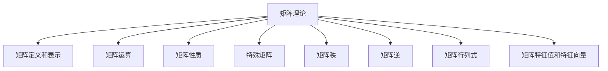

# 矩阵理论与应用：定义与例子

## 1. 背景介绍

### 1.1 问题的由来

矩阵是一种强大的数学工具,广泛应用于各个领域。它们在线性代数、工程、物理、经济学和计算机科学等诸多领域扮演着重要角色。矩阵理论为我们提供了一种紧凑且富有表现力的方式来表示和操作数据,从而简化了复杂问题的建模和求解过程。

### 1.2 研究现状  

矩阵理论自18世纪末就已经出现,并在19世纪得到了进一步的发展。随着计算机的出现和计算能力的不断提高,矩阵理论的应用范围也在不断扩大。目前,矩阵理论在线性代数、数值分析、优化理论、图论、量子力学等领域都有着广泛的应用。

### 1.3 研究意义

掌握矩阵理论对于解决实际问题至关重要。它为我们提供了一种有效的工具来表示和操作数据,从而简化了复杂问题的建模和求解过程。此外,矩阵理论还为许多其他数学领域奠定了基础,如线性代数、微分方程和概率论等。

### 1.4 本文结构

本文将首先介绍矩阵的基本概念和定义,然后探讨矩阵的各种运算和性质。接下来,我们将重点讨论矩阵在不同领域的应用,包括线性方程组的求解、特征值和特征向量的计算、图像处理和数据分析等。最后,我们将总结矩阵理论的发展趋势和未来挑战。

## 2. 核心概念与联系

矩阵是一种二维数组,由行和列组成。它可以用来表示和操作数据,是线性代数的基础。矩阵的核心概念包括:

1. **矩阵的定义和表示**
2. **矩阵的运算**:加法、数乘、矩阵乘法等
3. **矩阵的性质**:可交换性、结合性、分配率等
4. **特殊矩阵**:单位矩阵、对角矩阵、三角矩阵等
5. **矩阵的秩**
6. **矩阵的逆**
7. **矩阵的行列式**
8. **矩阵的特征值和特征向量**

这些概念相互关联,构成了矩阵理论的核心内容。掌握这些概念对于理解和应用矩阵理论至关重要。

## 3. 核心算法原理 & 具体操作步骤

### 3.1 算法原理概述

矩阵理论中有许多重要的算法,如求解线性方程组、计算矩阵的逆、求特征值和特征向量等。这些算法的原理基于矩阵的基本运算和性质,如加法、乘法、转置、行列式计算等。

例如,求解线性方程组 $Ax=b$ 的算法原理是基于矩阵的逆运算。如果 $A$ 是可逆矩阵,则方程组有唯一解 $x=A^{-1}b$。计算 $A$ 的逆矩阵是该算法的关键步骤。

再如,计算矩阵的特征值和特征向量的算法原理是基于矩阵的特征方程 $\det(A-\lambda I)=0$。求解该方程的根即可得到特征值,而对应的特征向量可以通过解方程 $(A-\lambda I)x=0$ 获得。

### 3.2 算法步骤详解

以求解线性方程组 $Ax=b$ 为例,我们可以使用高斯消元法(Gaussian Elimination)或者LU分解法(LU Decomposition)等算法。这些算法的步骤如下:

**高斯消元法步骤:**

1. 将增广矩阵 $[A|b]$ 化为上三角形式
2. 利用回代法求解上三角形方程组,得到解 $x$

**LU分解法步骤:**

1. 对矩阵 $A$ 进行LU分解,得到下三角矩阵 $L$ 和上三角矩阵 $U$,使得 $A=LU$
2. 先解方程 $Ly=b$ 得到 $y$
3. 再解方程 $Ux=y$ 得到解 $x$

这些算法的时间复杂度通常为 $O(n^3)$,其中 $n$ 是矩阵的阶数。

### 3.3 算法优缺点

上述算法具有以下优缺点:

**优点:**

- 算法原理简单,易于理解和实现
- 可以解决一般的线性方程组问题
- LU分解法对于病态矩阵(ill-conditioned matrix)有更好的数值稳定性

**缺点:**

- 对于大规模矩阵,算法效率较低
- 对于特殊结构的矩阵(如稀疏矩阵),通用算法的效率不高
- 算法的数值稳定性受矩阵条件数的影响

### 3.4 算法应用领域

线性方程组的求解算法在许多领域都有广泛应用,如:

- 工程计算:结构分析、电路设计、流体动力学等
- 图像处理:图像去噪、图像压缩、图像重建等
- 数据分析:主成分分析、线性回归、奇异值分解等
- 量子计算:模拟量子系统、量子优化等
- 密码学:密钥交换、数字签名等

## 4. 数学模型和公式 & 详细讲解 & 举例说明

### 4.1 数学模型构建

矩阵理论为许多实际问题提供了数学模型。以线性方程组为例,我们可以用矩阵方程 $Ax=b$ 来表示,其中 $A$ 是系数矩阵, $x$ 是未知数向量, $b$ 是常数项向量。

例如,考虑以下线性方程组:

$$
\begin{cases}
2x_1 + 3x_2 = 5\\
4x_1 + 6x_2 = 10
\end{cases}
$$

可以写成矩阵形式:

$$
\begin{bmatrix}
2 & 3\\
4 & 6
\end{bmatrix}
\begin{bmatrix}
x_1\\
x_2
\end{bmatrix}
=
\begin{bmatrix}
5\\
10
\end{bmatrix}
$$

即 $Ax=b$, 其中 $A=\begin{bmatrix}2 & 3\\4 & 6\end{bmatrix}$, $x=\begin{bmatrix}x_1\\x_2\end{bmatrix}$, $b=\begin{bmatrix}5\\10\end{bmatrix}$。

### 4.2 公式推导过程

矩阵理论中有许多重要公式,如矩阵乘法的结合律、矩阵行列式的性质、特征值方程等。这些公式的推导过程通常基于矩阵的基本运算和性质。

以矩阵乘法的结合律为例,我们有:

$$
(AB)C = A(BC)
$$

其中 $A$、$B$、$C$ 都是矩阵,且矩阵乘法满足结合律。

**证明过程:**

令 $A$ 是 $m\times n$ 矩阵, $B$ 是 $n\times p$ 矩阵, $C$ 是 $p\times q$ 矩阵。

考虑 $(AB)C$ 和 $A(BC)$ 的第 $i$ 行第 $j$ 列元素:

$$
\begin{align*}
[(AB)C]_{ij} &= \sum_{k=1}^p (AB)_{ik}C_{kj} \\
             &= \sum_{k=1}^p \left(\sum_{r=1}^n A_{ir}B_{rk}\right)C_{kj} \\
             &= \sum_{r=1}^n \sum_{k=1}^p A_{ir}B_{rk}C_{kj} \\
             &= \sum_{r=1}^n A_{ir}(BC)_{rj} \\
             &= [A(BC)]_{ij}
\end{align*}
$$

因此,$(AB)C = A(BC)$,矩阵乘法满足结合律。

### 4.3 案例分析与讲解

矩阵理论在许多领域都有重要应用,如图像处理、信号处理、机器学习等。下面我们以图像处理为例,讲解矩阵在实际问题中的应用。

在图像处理中,我们通常将图像表示为一个矩阵,其中每个元素对应图像上的一个像素。例如,一个 $3\times 3$ 的灰度图像矩阵可以表示为:

$$
I = \begin{bmatrix}
120 & 150 & 180\\
100 & 130 & 160\\
80 & 110 & 140
\end{bmatrix}
$$

其中,每个元素的值表示对应像素的灰度值(0-255)。

**图像平滑**

图像平滑是一种常用的图像预处理技术,可以减少图像噪声、模糊细节等。它的原理是用邻域像素的加权平均值来替换中心像素的值。

常用的平滑算子有均值滤波器和高斯滤波器等。以 $3\times 3$ 的均值滤波器为例,其滤波器矩阵为:

$$
H = \frac{1}{9}\begin{bmatrix}
1 & 1 & 1\\
1 & 1 & 1\\
1 & 1 & 1
\end{bmatrix}
$$

对图像 $I$ 进行均值滤波,可以用矩阵卷积运算表示为:

$$
I' = H * I
$$

其中 $*$ 表示卷积运算,结果 $I'$ 是一个新的平滑后的图像矩阵。

**图像锐化**

图像锐化是另一种常用的图像增强技术,可以使图像细节更加清晰。它的原理是计算像素值与其邻域像素值的差值,并将差值加到原像素值上。

常用的锐化算子有拉普拉斯算子、Prewitt算子等。以 $3\times 3$ 的拉普拉斯算子为例,其算子矩阵为:

$$
H = \begin{bmatrix}
0 & 1 & 0\\
1 & -4 & 1\\
0 & 1 & 0
\end{bmatrix}
$$

对图像 $I$ 进行锐化,可以用矩阵卷积运算表示为:

$$
I' = I + c(H * I)
$$

其中 $c$ 是一个常数,用于控制锐化程度。结果 $I'$ 是一个新的锐化后的图像矩阵。

通过上述例子,我们可以看到矩阵在图像处理中的重要应用。矩阵卷积运算是图像滤波、增强等基本操作的数学表示,为图像处理算法提供了理论基础。

### 4.4 常见问题解答

**1. 什么是矩阵的秩?如何计算?**

矩阵的秩是指矩阵中线性无关的行(列)向量的最大个数。计算矩阵秩的方法有:

- 高斯消元法:将矩阵化为阶梯形式,非零行(列)的个数即为秩
- 基于矩阵的特征值:非零特征值的个数即为秩

**2. 如何判断一个矩阵是否可逆?**

一个矩阵可逆的充要条件是:

- 行列式不为零,即 $\det(A) \neq 0$
- 秩等于矩阵的阶数
- 存在另一个矩阵 $B$,使得 $AB=BA=I$(单位矩阵)

**3. 特征值和特征向量有什么作用?**

特征值和特征向量描述了矩阵对向量的变换性质,在许多领域都有重要应用:

- 线性动力系统的稳定性分析
- 主成分分析(PCA)
- 图像压缩
- 量子力学中的算符表示

**4. 矩阵分解有哪些常见方法?**

矩阵分解是将一个矩阵分解为几个特殊矩阵的乘积,常见的分解方法有:

- LU分解:下三角矩阵与上三角矩阵的乘积
- QR分解:正交矩阵与上三角矩阵的乘积
- 特征值分