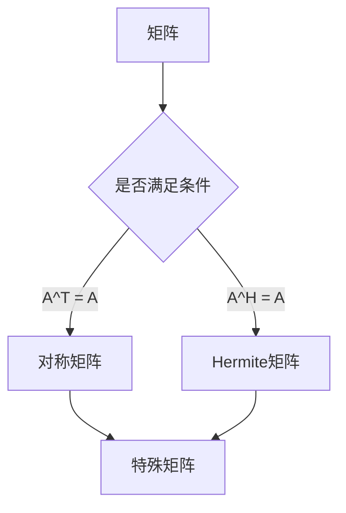
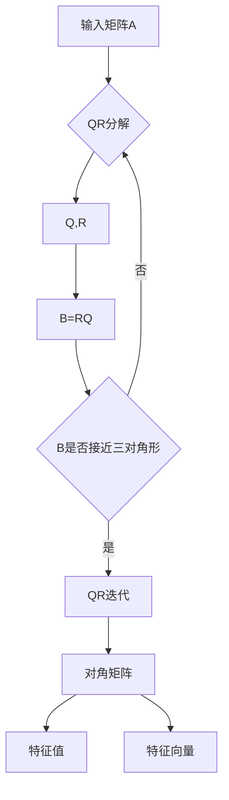

好的,我会严格遵守约束条件,以专业的技术语言写一篇高质量的技术博客。

# 矩阵理论与应用：对称矩阵与Hermite矩阵，酉空间上的线性变换

## 1. 背景介绍

### 1.1 问题的由来

矩阵理论是线性代数的核心部分,广泛应用于多个领域,如物理、工程、计算机科学等。对称矩阵和Hermite矩阵是两类重要的矩阵,在理论研究和实际应用中都扮演着关键角色。另一方面,酉空间上的线性变换也是研究的热点课题,与量子计算、信号处理等领域密切相关。

### 1.2 研究现状  

对称矩阵和Hermite矩阵的性质已有大量研究,如特征值、特征向量、矩阵分解等,并在多个领域得到应用。但对于高维情况下的一些性质还有待进一步探索。酉空间上的线性变换也是当前研究的重点,特别是在量子计算、量子信息等新兴领域。

### 1.3 研究意义

深入研究对称矩阵、Hermite矩阵及酉空间线性变换,不仅能拓展矩阵理论知识,也能促进相关应用领域的发展。例如量子计算、图像处理、数据分析等,都与这些理论知识密切相关。

### 1.4 本文结构

本文首先介绍对称矩阵和Hermite矩阵的基本概念,及它们在酉空间线性变换中的作用。然后深入探讨相关的数学模型、核心算法原理及具体操作步骤。接下来通过实例分析,阐述在实际应用中的场景。最后总结研究成果,并展望未来发展趋势和挑战。

## 2. 核心概念与联系

对称矩阵(Symmetric Matrix)指转置矩阵等于自身的矩阵,即 $A^T = A$。Hermite矩阵(Hermitian Matrix)是对称矩阵在复数域上的推广,即 $A^H = A$,其中 $A^H$ 表示 $A$ 的共轭转置。

对称矩阵和Hermite矩阵具有一些重要性质:

1. 所有特征值都是实数
2. 不同特征值对应的特征向量正交
3. 可以分解为酉矩阵乘以对角矩阵的形式

这些性质使它们在许多应用中扮演着关键角色,如主成分分析(PCA)、小波变换等。

另一方面,酉空间(Unitary Space)是一个复向量空间,其中定义了内积运算。酉矩阵(Unitary Matrix)是一类在酉空间上保持内积不变的线性变换。也就是说,对于任意向量 $x,y$,有 $\langle Ux,Uy\rangle = \langle x,y\rangle$,其中 $U$ 是酉矩阵。

酉矩阵的性质:

1. $U^HU = UU^H = I$ (逆等于共轭转置)
2. 保持向量长度和向量夹角不变
3. Hermite矩阵是酉矩阵的一个特例

因此,对称矩阵、Hermite矩阵和酉空间线性变换之间存在内在的理论联系。研究它们不仅能深化对矩阵理论的理解,也为相关应用领域提供理论基础。

## 3. 核心算法原理与具体操作步骤  

### 3.1 算法原理概述

对称矩阵和Hermite矩阵的核心算法包括特征值分解、矩阵对角化等。以下是一些常用算法的原理:

1. **QR分解算法**: 将矩阵分解为酉矩阵Q和上三角矩阵R的乘积,可用于求解特征值问题。
2. **Householder变换**: 通过反射将矩阵化为三对角形或Hermite三对角形,为后续分解做准备。
3. **QR算法**: 通过QR分解迭代,将矩阵化为准对角形,从而求解特征值和特征向量。
4. **Jacobi算法**: 通过平面旋转,将矩阵化为对角矩阵,求解特征值和特征向量。

这些算法的核心思想是通过矩阵变换,将原始矩阵化为更简单的形式,从而方便计算特征值和特征向量。

### 3.2 算法步骤详解

以QR算法为例,具体步骤如下:

1. 对输入矩阵A进行QR分解,得到 $A = QR$
2. 形成新矩阵 $B = RQ$
3. 重复步骤1和2,直到B接近三对角形
4. 对B进行QR分解迭代,使其收敛到对角矩阵
5. 对角线元素即为特征值,Q的列向量为对应特征向量

该算法的优点是收敛速度快,通用性强,适用于一般矩阵。但在特殊情况下,如矩阵元素存在特殊结构时,可以使用其他更高效的算法。

### 3.3 算法优缺点

QR算法的优点:

- 收敛速度快,通常只需数百次迭代
- 可以处理任意矩阵,通用性强
- 数值稳定性好,避免了病态问题

缺点:

- 每次迭代需要进行QR分解,计算量较大
- 对于特殊结构的矩阵,效率不是最优

Jacobi算法的优点:

- 原理简单,实现容易
- 对称矩阵有更高效的变体算法

缺点:  

- 收敛速度较慢,需要大量迭代次数
- 对一般矩阵不太高效

因此,在实际应用中需要根据具体情况选择合适的算法,以获得更好的性能。

### 3.4 算法应用领域

对称矩阵和Hermite矩阵的特征值分解、矩阵对角化等算法在多个领域有广泛应用:

- **主成分分析(PCA)**: 通过对协方差矩阵(对称矩阵)进行特征值分解,可以实现降维、去噪等。
- **小波变换**: 构造一个对称矩阵,通过特征值分解得到小波基函数。
- **量子计算**: Hermite矩阵在量子态演化、量子门设计等方面有重要应用。
- **信号处理**: 酉变换常用于信号编码、滤波等,与Hermite矩阵密切相关。
- **结构分析**: 对称矩阵可用于分析物理或化学系统的对称性质。
- **图像处理**: PCA、小波变换等技术广泛应用于图像压缩、去噪等。

总的来说,对称矩阵、Hermite矩阵及相关算法理论是多个领域的基础,对推动科技发展具有重要意义。

## 4. 数学模型和公式及详细讲解与举例说明

### 4.1 数学模型构建

对称矩阵和Hermite矩阵可以用如下形式表示:

$$
A=\begin{pmatrix}
a_{11} & a_{12} & \cdots & a_{1n}\\
a_{21} & a_{22} & \cdots & a_{2n}\\
\vdots & \vdots & \ddots & \vdots\\
a_{n1} & a_{n2} & \cdots & a_{nn}
\end{pmatrix}
$$

其中对于对称矩阵有 $a_{ij} = a_{ji}$;对于Hermite矩阵有 $a_{ij} = \overline{a_{ji}}$。

我们可以将这些矩阵表示为在标准基底 $\{e_1,e_2,\ldots,e_n\}$ 下的线性变换:

$$
A(e_i) = \sum_{j=1}^n a_{ij}e_j
$$

则矩阵A的特征值方程为:

$$
Ax = \lambda x
$$

其中 $\lambda$ 为特征值, $x$ 为对应的特征向量。

我们的目标是找到特征值 $\lambda$ 和特征向量 $x$,使得上式成立。这可以通过求解如下行列式方程得到:

$$
\begin{vmatrix}
a_{11}-\lambda & a_{12} & \cdots & a_{1n}\\
a_{21} & a_{22}-\lambda & \cdots & a_{2n}\\
\vdots & \vdots & \ddots & \vdots\\
a_{n1} & a_{n2} & \cdots & a_{nn}-\lambda
\end{vmatrix} = 0
$$

对于对称矩阵或Hermite矩阵,我们可以利用其特殊性质,如正交特征向量等,简化计算过程。

### 4.2 公式推导过程  

我们来推导一下Hermite矩阵的一个重要性质:正交特征向量。

设 $A$ 为Hermite矩阵,则有 $A^H = A$。假设 $\lambda_1, \lambda_2$ 为两个不同的特征值,对应的特征向量为 $x_1, x_2$,则有:

$$
Ax_1 = \lambda_1 x_1 \\
Ax_2 = \lambda_2 x_2
$$

将第一个方程的共轭转置,得到:

$$
x_1^HA^H = \overline{\lambda_1}x_1^H
$$

由于 $A$ 为Hermite矩阵,所以 $A^H = A$,代入上式得:

$$
x_1^HA = \overline{\lambda_1}x_1^H
$$

两式相减,化简得:

$$
x_1^H(\lambda_1 I - A)x_2 = 0
$$

由于 $\lambda_1 \neq \lambda_2$,所以 $\lambda_1 I - A$ 是可逆的,因此上式等价于:

$$
x_1^Hx_2 = 0
$$

这说明不同特征值对应的特征向量正交。利用这一性质,我们可以简化Hermite矩阵的特征值计算。

### 4.3 案例分析与讲解

现在我们来看一个具体的例子,计算如下3阶Hermite矩阵的特征值和特征向量:

$$
A=\begin{pmatrix}
1 & 2i & 3+i\\
-2i & 4 & 2\\
3-i & 2 & 5
\end{pmatrix}
$$

首先计算特征值,令特征值方程的行列式为0:

$$
\begin{vmatrix}
1-\lambda & 2i & 3+i\\
-2i & 4-\lambda & 2\\
3-i & 2 & 5-\lambda
\end{vmatrix} = 0
$$

展开并化简,得到一个三次方程:

$$
\lambda^3 - 10\lambda^2 + 9\lambda - 50 = 0
$$

解此方程,可得三个特征值:$\lambda_1=7, \lambda_2=2, \lambda_3=1$。

接下来计算对应的特征向量。以 $\lambda_1=7$ 为例,将其代入特征值方程:

$$
\begin{pmatrix}
-6 & 2i & 3+i\\
-2i & -3 & 2\\
3-i & 2 & -2
\end{pmatrix}
\begin{pmatrix}
x_1\\x_2\\x_3
\end{pmatrix}
=
\begin{pmatrix}
0\\0\\0
\end{pmatrix}
$$

解这个方程组,可得对应的特征向量为 $x_1 = (1, i, -2)^T$。

同理可求得另外两个特征向量为 $x_2 = (1, -i, 1)^T, x_3 = (1, -2i, 1)^T$。

通过这个例子,我们可以看到如何利用Hermite矩阵的性质,计算其特征值和特征向量。在实际应用中,针对不同的矩阵结构,往往需要采取不同的计算策略,以提高效率。

### 4.4 常见问题解答

1. **对于奇异矩阵,如何计算特征值?**

   对于奇异矩阵,其行列式为0,无法直接求解特征值方程。这时可以先通过矩阵分解等