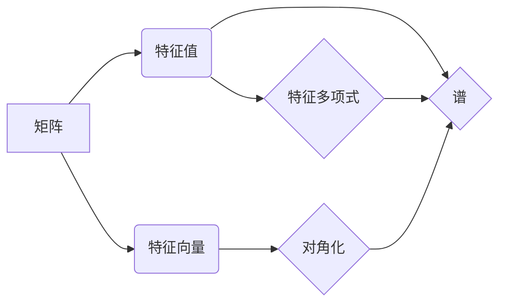

# 矩阵理论与应用：特征值的连续性结果与矩阵的谱变化

关键词：矩阵理论、特征值、连续性、谱变化、矩阵扰动

## 1. 背景介绍
### 1.1  问题的由来
矩阵理论是数学和计算机科学中一个基础而重要的分支,在许多领域都有广泛的应用。矩阵的特征值问题一直是矩阵理论研究的核心内容之一。特征值的性质,尤其是特征值随矩阵元素变化的连续性,对于深入理解矩阵的性质、揭示矩阵数值计算的内在规律具有重要意义。

### 1.2  研究现状
国内外学者对矩阵特征值的连续性进行了大量卓有成效的研究。20世纪初,Rellich证明了埃尔米特矩阵的特征值和特征向量都是矩阵元素的连续函数。后来,Hoffman和Wielandt、Kato等人进一步研究了一般矩阵特征值的连续性。国内学者如王联、张景中、姚振汉等也做出了重要贡献。目前对于简单特征值矩阵,已经建立了比较完善的理论。但对于重特征值、亏损矩阵等情形,许多问题尚待进一步研究。

### 1.3  研究意义
研究矩阵特征值的连续性,对于理解矩阵扰动理论、指导实际矩阵计算具有重要意义:

1. 理论意义:揭示矩阵特征值随元素变化的内在规律,深化对矩阵性质的认识。
2. 应用价值:指导实际矩阵特征值计算中的误差分析与算法设计,提高数值计算的精度和效率。
3. 推广拓展:为研究矩阵函数、广义特征值等问题奠定基础。

### 1.4  本文结构
本文将围绕矩阵特征值的连续性这一主题,系统阐述相关理论结果及其应用。全文结构如下:

1. 介绍矩阵特征值问题的背景及研究意义 
2. 给出相关的核心概念,揭示其内在联系
3. 介绍求解矩阵特征值的主要算法原理及步骤
4. 建立矩阵特征值连续性的数学模型,推导相关公式,并举例说明
5. 通过具体代码实例,演示算法的实现与应用
6. 探讨矩阵特征值连续性理论在实际问题中的应用场景
7. 推荐相关的学习资源、开发工具与文献
8. 总结全文,展望矩阵特征值连续性研究的发展趋势与挑战
9. 归纳一些常见问题,给出解答

## 2. 核心概念与联系
在讨论矩阵特征值连续性之前,我们先回顾一些基本概念。设 $A$ 是 $n$ 阶复矩阵, $\lambda$ 是 $A$ 的一个特征值, $x$ 是对应于 $\lambda$ 的一个特征向量,则有:

$$Ax=\lambda x \tag{1}$$

由此可引出矩阵 $A$ 的特征多项式:

$$p_A(\lambda)=\det(\lambda I-A) \tag{2}$$

其中 $I$ 是 $n$ 阶单位矩阵。 $p_A(\lambda)$ 的根就是 $A$ 的全部特征值。如果记 $A$ 的 $n$ 个特征值为 $\lambda_1,\lambda_2,\cdots,\lambda_n$,则有:

$$p_A(\lambda)=(\lambda-\lambda_1)(\lambda-\lambda_2)\cdots(\lambda-\lambda_n) \tag{3}$$

由此可见,矩阵的特征多项式与其特征值密切相关。事实上,许多关于矩阵特征值的性质都可以通过研究特征多项式得到。

对角化是矩阵理论中的一个重要概念。若存在可逆矩阵 $P$,使得 $P^{-1}AP$ 为对角矩阵,则称 $A$ 可对角化。事实上, $A$ 可对角化的充要条件是 $A$ 有 $n$ 个线性无关的特征向量。

设 $A$ 可对角化,则存在可逆矩阵 $P$,使得:

$$P^{-1}AP=\text{diag}(\lambda_1,\lambda_2,\cdots,\lambda_n) \tag{4}$$

其中 $\lambda_1,\lambda_2,\cdots,\lambda_n$ 为 $A$ 的特征值。由此可见,对角化使得矩阵的特征值问题变得直观而简单。

谱(spectrum)是矩阵特征值的另一种称呼。矩阵 $A$ 的谱 $\sigma(A)$ 定义为其所有特征值构成的集合:

$$\sigma(A)=\{\lambda_1,\lambda_2,\cdots,\lambda_n\} \tag{5}$$

谱半径 $\rho(A)$ 是指 $A$ 的特征值的模的最大值:

$$\rho(A)=\max_{1\leq i\leq n} |\lambda_i| \tag{6}$$

谱半径在矩阵的收敛性、稳定性等问题中有重要作用。

总之,矩阵的特征值、特征多项式、对角化、谱等概念紧密相连,构成了矩阵特征值理论的核心内容。深入理解这些概念的内在联系,是研究矩阵特征值连续性的基础。

## 3. 核心算法原理 & 具体操作步骤
### 3.1  算法原理概述
求解矩阵特征值的算法有很多,如 Jacobi 算法、QR 算法、幂法、反幂法等。这里我们重点介绍幂法和反幂法的基本原理。

幂法的基本思想是:对于矩阵 $A$ 的一个特征值 $\lambda$ 及其对应的特征向量 $x$,有:

$$Ax=\lambda x \Rightarrow A^kx=\lambda^k x \tag{7}$$

可见,反复作用 $A$ 于 $x$,将得到主特征值(模最大的特征值)的特征向量。

反幂法则利用矩阵的逆来近似最小特征值。若 $\mu$ 不是 $A$ 的特征值,则:

$$(A-\mu I)^{-1}x=\frac{1}{\lambda-\mu}x \tag{8}$$

可见,选取合适的 $\mu$,反复作用 $(A-\mu I)^{-1}$,将得到模最小特征值的特征向量。

### 3.2  算法步骤详解
下面以幂法为例,详细说明其计算步骤:

1. 取单位向量 $x_0$ 作为初始向量
2. 对 $k=1,2,\cdots$ 反复进行:
   1. 计算 $y_k=Ax_{k-1}$ 
   2. 取 $\lambda_k=\|y_k\|_\infty$
   3. $x_k=y_k/\lambda_k$
3. 直到 $\|x_k-x_{k-1}\|$ 或 $|\lambda_k-\lambda_{k-1}|$ 小于给定阈值

其中 $\lambda_k$ 就是矩阵 $A$ 的主特征值的近似值, $x_k$ 就是相应的特征向量的近似。

反幂法的步骤类似,只需将步骤 2.1 换成求解线性方程组 $(A-\mu_k I)y_k=x_{k-1}$,其中 $\mu_k$ 可取为 $\lambda_{k-1}$ 的近似值。

### 3.3  算法优缺点
幂法的优点是原理简单,易于实现;缺点是只能求模最大的特征值,收敛速度受特征值之比的影响。

反幂法的优点是可求模最小的特征值,且不受其他特征值的影响;缺点是每一步都需要求解线性方程组,计算量较大。

### 3.4  算法应用领域
幂法和反幂法是求解矩阵特征值的基本算法,在许多实际问题中都有应用,如:

1. 计算矩阵的谱半径、谱范数等
2. 主成分分析(PCA)提取数据的主要特征
3. PageRank 算法计算网页的重要性排名
4. 量子化学中求解薛定谔方程的本征值

此外,幂法和反幂法的思想还可以推广到更一般的矩阵特征值问题和非线性特征值问题中。

## 4. 数学模型和公式 & 详细讲解 & 举例说明
### 4.1  数学模型构建
设 $A(\varepsilon)$ 是 $n$ 阶矩阵, $A(0)=A$,且当 $\varepsilon\to 0$ 时, $A(\varepsilon)\to A$。如何刻画 $A(\varepsilon)$ 的特征值 $\lambda_i(\varepsilon)$ 随 $\varepsilon$ 的变化趋势?这就是矩阵特征值连续性问题的数学模型。

为了研究 $\lambda_i(\varepsilon)$ 的性质,我们引入矩阵值函数的概念。设 $f(z)$ 在 $\mathbb{C}$ 上解析,定义矩阵值函数 $f(A)$ 为:

$$f(A)=\frac{1}{2\pi i}\oint_\Gamma f(z)(zI-A)^{-1}dz \tag{9}$$

其中 $\Gamma$ 为包含 $A$ 的所有特征值的简单闭曲线。

### 4.2  公式推导过程
下面我们利用矩阵值函数,推导矩阵特征值的一阶和二阶导数公式。

设 $\lambda$ 是 $A$ 的一个单特征值, $\Gamma$ 是包含 $\lambda$ 而不包含其他特征值的简单闭曲线。记 $P_\lambda$ 为 $\lambda$ 对应的特征投影矩阵:

$$P_\lambda=\frac{1}{2\pi i}\oint_\Gamma (zI-A)^{-1}dz \tag{10}$$

利用 $P_\lambda$ 的性质,可得 $\lambda$ 关于 $\varepsilon$ 的一阶导数为:

$$\lambda'(0)=\frac{1}{2\pi i}\oint_\Gamma z\cdot \text{tr}\big((zI-A)^{-1}A'(0)\big)dz \tag{11}$$

进一步,可得二阶导数为:

$$\lambda''(0)=\frac{1}{2\pi i}\oint_\Gamma z\cdot \text{tr}\big((zI-A)^{-2}(A'(0))^2+(zI-A)^{-1}A''(0)\big)dz \tag{12}$$

若 $\lambda$ 是 $r$ 重特征值,则需要将上述公式中的 $\text{tr}$ 替换为 $\text{tr}_{P_\lambda}$,即在 $P_\lambda$ 的值域上取迹。

### 4.3  案例分析与讲解
下面我们通过一个具体的例子来说明上述结果。考虑矩阵:

$$A(\varepsilon)=\begin{pmatrix}
1 & \varepsilon \\
0 & 2
\end{pmatrix} \tag{13}$$

显然, $A(0)$ 有两个单特征值 $\lambda_1=1$ 和 $\lambda_2=2$。利用公式 $(11)$ 易得:

$$\lambda_1'(0)=\frac{1}{2\pi i}\oint_{\Gamma_1} \frac{z}{z-2}dz=0 \tag{14}$$

$$\lambda_2'(0)=\frac{1}{2\pi i}\oint_{\Gamma_2} \frac{z}{z-1}dz=1 \tag{15}$$

其中 $\Gamma_1$ 和 $\Gamma_2$ 分别为包含 $\lambda_1$ 和 $\lambda_2$ 的闭曲线。

进一步利用公式 $(12)$ 可得:

$$\lambda_1''(0)=\frac{1}{2\pi i}\oint_{\Gamma_1} \frac{z}{(z-2)^2}dz=\frac{1}{2} \tag{16}$$

$$\lambda_2''(0)=0 \tag{17}$$

由此可见,在 $\varepsilon=0$ 附近, $\lambda_1(\varepsilon)$ 有如下的二阶泰勒展开式:

$$\lambda_1(\varepsilon)=1+\frac{1}{2}\varepsilon^2+o(\varepsilon^2) \tag{18}$$

而 $\lambda_2