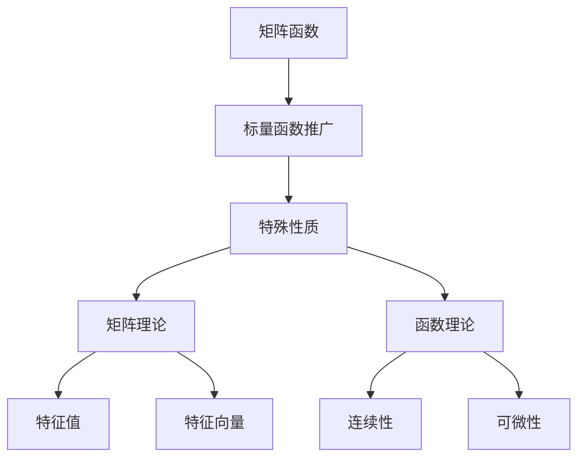
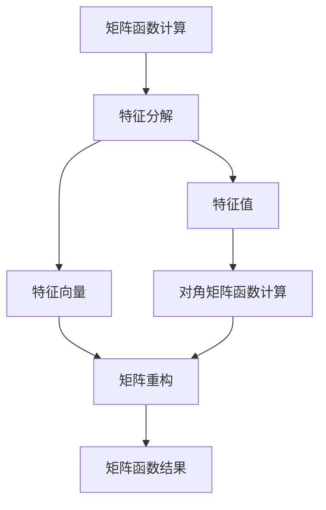

# 矩阵理论与应用：矩阵函数

## 1. 背景介绍

### 1.1 问题的由来

在数学、物理学、工程学和计算机科学等诸多领域中,矩阵无疑扮演着重要的角色。矩阵不仅是线性代数的基础,同时也广泛应用于各种科学计算和数据处理任务。然而,传统的矩阵运算往往局限于标量值之间的运算,而在实际应用中,我们常常需要对矩阵进行更复杂的操作,例如对矩阵的元素进行函数计算。

### 1.2 研究现状

矩阵函数的概念最早可以追溯到19世纪,当时数学家们开始探索将标量函数推广到矩阵的可能性。随着计算机的发展,矩阵函数在科学计算和数值分析领域得到了广泛应用。近年来,随着机器学习、深度学习等领域的蓬勃发展,矩阵函数在这些领域也扮演着越来越重要的角色。

### 1.3 研究意义

矩阵函数的研究对于推进科学计算和数值分析领域的发展具有重要意义。通过对矩阵函数的深入研究,我们可以更好地理解和处理复杂的数据结构,从而提高计算效率和精度。此外,矩阵函数在机器学习、深度学习等领域也有着广泛的应用前景,对于推动这些领域的发展也具有重要意义。

### 1.4 本文结构

本文将全面介绍矩阵函数的理论基础、数学模型、算法实现以及实际应用。首先,我们将介绍矩阵函数的核心概念和与其他数学概念的联系。接下来,我们将深入探讨矩阵函数的核心算法原理和具体操作步骤。然后,我们将构建矩阵函数的数学模型,并详细推导相关公式。在此基础上,我们将提供代码实例,并对其进行详细解释和说明。最后,我们将探讨矩阵函数在实际应用中的场景,介绍相关工具和资源,并对未来的发展趋势和挑战进行总结和展望。

## 2. 核心概念与联系

矩阵函数是指将一个标量函数推广到矩阵上的操作。具体来说,给定一个矩阵 $A$ 和一个标量函数 $f(x)$,我们希望找到一个矩阵函数 $F(A)$,使得它满足某些特定的性质。矩阵函数的定义和性质与标量函数有许多相似之处,但也存在一些独特的特征。

矩阵函数与标量函数之间存在着密切的联系。事实上,许多常见的标量函数都可以推广到矩阵上,例如指数函数、对数函数、三角函数等。这种推广不仅保留了标量函数的许多性质,同时也引入了一些新的特征。

矩阵函数的研究离不开矩阵理论和函数理论的支持。矩阵理论为我们提供了处理矩阵的工具,例如特征值和特征向量的概念。函数理论则为我们提供了研究函数性质的理论基础,例如连续性和可微性等。

通过将这些理论相结合,我们可以更好地理解和操作矩阵函数。例如,我们可以利用矩阵的特征值和特征向量来计算矩阵函数的值,或者利用函数理论来研究矩阵函数的性质。

## 3. 核心算法原理 & 具体操作步骤

### 3.1 算法原理概述

矩阵函数的计算通常依赖于矩阵的特征分解。具体来说,对于一个可对角化的矩阵 $A$,我们可以将其分解为:

$$A = PDP^{-1}$$

其中 $P$ 是由矩阵 $A$ 的特征向量构成的矩阵,而 $D$ 是一个对角矩阵,对角线元素为矩阵 $A$ 的特征值。

利用这种分解,我们可以将矩阵函数 $F(A)$ 表示为:

$$F(A) = PF(D)P^{-1}$$

其中 $F(D)$ 是一个对角矩阵,对角线元素为 $F$ 对应特征值的函数值。

这种方法的关键在于能够计算出矩阵的特征值和特征向量,并且能够对对角矩阵进行函数计算。对于一些特殊的矩阵函数,例如指数函数和对数函数,我们可以直接利用已知的公式进行计算。而对于更一般的情况,我们需要采用数值方法来近似计算矩阵函数的值。

### 3.2 算法步骤详解

1. **计算矩阵的特征值和特征向量**

   第一步是计算矩阵 $A$ 的特征值和特征向量。这可以通过求解特征方程 $det(A - \lambda I) = 0$ 来获得特征值,然后利用 $(A - \lambda_i I)v_i = 0$ 来求解对应的特征向量 $v_i$。

2. **构造特征向量矩阵和对角矩阵**

   将所有特征向量按列排列,构造矩阵 $P$,其中第 $i$ 列为 $v_i$。同时,将特征值排列成对角矩阵 $D$,对角线元素为 $\lambda_i$。

3. **计算对角矩阵函数**

   对于对角矩阵 $D$,我们可以直接对其对角线元素应用标量函数 $f$,得到 $F(D)$,其对角线元素为 $f(\lambda_i)$。

4. **重构矩阵函数**

   利用公式 $F(A) = PF(D)P^{-1}$,我们可以重构出矩阵函数 $F(A)$ 的值。

这种基于特征分解的算法适用于可对角化的矩阵。对于不可对角化的矩阵,我们需要采用其他的数值方法,例如基于泰勒级数展开的算法或者基于分数线性矩阵函数的算法。

### 3.3 算法优缺点

**优点:**

- 理论基础扎实,具有良好的数学性质。
- 对于可对角化的矩阵,计算过程直观且高效。
- 适用于许多常见的矩阵函数,例如指数函数、对数函数等。

**缺点:**

- 对于不可对角化的矩阵,该算法不直接适用,需要采用其他数值方法。
- 计算过程中需要求解特征值和特征向量,对于大型矩阵来说,这可能是一个计算量很大的步骤。
- 当矩阵的特征值存在重根时,可能会引入一些数值不稳定性。

### 3.4 算法应用领域

基于特征分解的矩阵函数计算算法在许多领域都有广泛的应用,例如:

- **物理学和工程学:** 在量子力学、电路理论、控制理论等领域,矩阵函数常常被用于描述系统的动力学行为。
- **数值分析:** 矩阵函数在求解常微分方程、计算矩阵指数和对数等数值分析问题中扮演着重要角色。
- **机器学习和深度学习:** 在深度神经网络中,激活函数通常被推广到矩阵上,从而引入了矩阵函数的概念。
- **图论和网络科学:** 在研究网络结构和动态过程时,矩阵函数常被用于描述网络的演化和传播行为。

总的来说,矩阵函数为我们提供了一种处理矩阵数据的强大工具,在各个领域都有着广泛的应用前景。

## 4. 数学模型和公式 & 详细讲解 & 举例说明

### 4.1 数学模型构建

在构建矩阵函数的数学模型时,我们需要考虑以下几个关键因素:

1. **函数的定义域和值域**

   对于标量函数 $f(x)$,我们需要明确它的定义域,即 $x$ 取值的范围。同样地,对于矩阵函数 $F(A)$,我们也需要确定矩阵 $A$ 的取值范围,通常是一个矩阵空间。

2. **函数的性质**

   我们希望矩阵函数能够保留标量函数的一些基本性质,例如连续性、可微性等。同时,我们也需要考虑矩阵函数独有的一些性质,例如与矩阵运算的相容性。

3. **函数的计算方法**

   为了实际计算矩阵函数的值,我们需要建立一种有效的计算模型。前面介绍的基于特征分解的算法就是一种常见的计算模型。

基于上述因素,我们可以构建矩阵函数的数学模型。具体来说,对于一个标量函数 $f(x)$,我们定义它的矩阵函数 $F(A)$ 为:

$$F(A) = Pf(D)P^{-1}$$

其中 $A = PDP^{-1}$ 是矩阵 $A$ 的特征分解,而 $f(D)$ 是对角矩阵,对角线元素为 $f(\lambda_i)$,其中 $\lambda_i$ 是矩阵 $A$ 的特征值。

这种定义保证了矩阵函数与标量函数之间的一致性,同时也满足了一些基本的性质,例如:

- 如果 $f(x)$ 是连续的,那么 $F(A)$ 也是连续的。
- 如果 $f(x)$ 是可微的,那么 $F(A)$ 也是可微的。
- $F(A)$ 与矩阵运算相容,例如 $F(AB) = F(A)F(B)$。

当然,这只是一种最基本的矩阵函数模型。在实际应用中,我们可能需要对这种模型进行一些扩展和修改,以满足特定的需求。

### 4.2 公式推导过程

接下来,我们将详细推导矩阵函数的一些基本公式,以加深对其数学本质的理解。

**1. 矩阵函数的特征值公式**

对于一个矩阵函数 $F(A)$,我们可以推导出它的特征值与矩阵 $A$ 的特征值之间的关系。

设 $\lambda$ 是矩阵 $A$ 的一个特征值,对应的特征向量为 $v$,那么我们有:

$$Av = \lambda v$$

将两边同时应用矩阵函数 $F$,可得:

$$F(A)F(v) = F(\lambda v) = F(\lambda)F(v)$$

由于 $F(v)$ 也是 $F(A)$ 的特征向量,对应的特征值为 $F(\lambda)$,因此我们得到了矩阵函数的特征值公式:

$$\lambda_F = F(\lambda)$$

其中 $\lambda_F$ 是矩阵函数 $F(A)$ 的特征值,而 $\lambda$ 是矩阵 $A$ 的对应特征值。

**2. 矩阵函数的基本运算法则**

矩阵函数也满足一些基本的运算法则,例如:

- $F(A + B) = F(A) + F(B)$
- $F(kA) = kF(A)$
- $F(AB) = F(A)F(B)$ (如果 $AB = BA$)

这些法则的推导过程类似于标量函数的情况,利用了矩阵函数定义的一致性。

**3. 矩阵函数的微分公式**

对于可微的矩阵函数 $F(A)$,我们可以推导出它的微分公式。设 $A$ 是一个对称矩阵,那么:

$$\frac{dF(A)}{dA} = PF'(D)P^T$$

其中 $F'(D)$ 是一个对角矩阵,对角线元素为 $f'(\lambda_i)$,