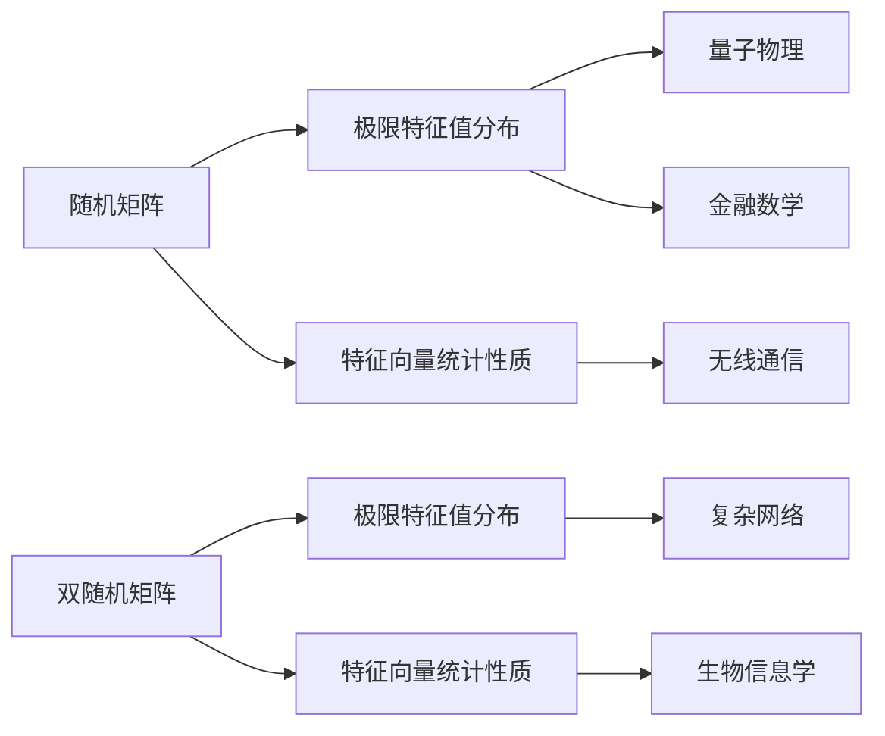

# 矩阵理论与应用：随机矩阵与双随机矩阵

关键词：随机矩阵、双随机矩阵、特征值分布、极限定理、应用

## 1. 背景介绍 
### 1.1 问题的由来
随机矩阵理论起源于20世纪50年代物理学家 Wigner 和 Dyson 等人对原子核能级分布的研究。他们发现，原子核能级的统计性质可以用随机矩阵来描述。随后，随机矩阵理论在多个领域得到广泛应用，如量子物理、金融数学、无线通信等。

双随机矩阵是随机矩阵的一个重要分支，其矩阵元素不仅是随机变量，连矩阵的大小也是随机的。双随机矩阵在复杂网络、生物信息学等领域有着重要应用。

### 1.2 研究现状
目前，随机矩阵理论已经发展成为一个相对成熟的数学分支。人们对高维随机矩阵的特征值分布、特征向量的统计性质等有了深入的认识。一系列重要的极限定理，如 Wigner 半圆律、Marchenko-Pastur 定律等被相继证明。

双随机矩阵的研究起步较晚，但发展迅速。近年来，双随机矩阵的极限特征值分布、特征向量的统计性质等问题受到广泛关注。一些重要的极限定理，如圆律、棱形律等相继被证明。

### 1.3 研究意义
随机矩阵和双随机矩阵理论不仅具有重要的理论意义，在实际应用中也发挥着关键作用。深入研究随机矩阵和双随机矩阵的性质，对于理解和分析复杂系统的行为至关重要。同时，随机矩阵和双随机矩阵的极限定理是解决实际问题的有力工具。

### 1.4 本文结构
本文将系统介绍随机矩阵与双随机矩阵的基本概念、理论基础和应用。第2节介绍随机矩阵与双随机矩阵的核心概念。第3节讨论随机矩阵和双随机矩阵的经典极限定理及证明思路。第4节给出几个重要极限定理的数学模型和详细证明。第5节通过具体代码实例，展示如何用计算机模拟验证这些极限定理。第6节介绍随机矩阵和双随机矩阵在复杂网络、量子物理等领域的应用。第7节推荐相关学习资源和工具。第8节总结全文并展望随机矩阵和双随机矩阵理论的发展前景与挑战。

## 2. 核心概念与联系

随机矩阵，是指矩阵元素为随机变量的矩阵。根据元素分布的不同，常见的随机矩阵有 Wigner 矩阵、Wishart 矩阵、Manova 矩阵等。研究随机矩阵的核心问题是其特征值和特征向量的统计性质，尤其是大维随机矩阵的极限性质。

双随机矩阵，是指不仅矩阵元素是随机的，矩阵的大小也是随机变量的随机矩阵。双随机矩阵可以看作是随机矩阵和随机过程的结合。研究双随机矩阵的主要问题也是其极限特征值分布和特征向量的统计性质。

随机矩阵和双随机矩阵密切相关，很多研究思路和方法可以相互借鉴。同时，二者在应用领域也有交叉，比如在复杂网络的谱分析中，既涉及随机矩阵也涉及双随机矩阵。深入理解两类矩阵的联系，有助于解决交叉领域的问题。

下图展示了随机矩阵、双随机矩阵及其应用之间的关系：



## 3. 核心算法原理 & 具体操作步骤
### 3.1 算法原理概述
研究随机矩阵和双随机矩阵的核心是求解其极限特征值分布。经典的求解思路是将特征值的经验谱分布看作一个随机测度，利用随机测度的弱收敛理论，证明其弱收敛到确定的概率测度。

### 3.2 算法步骤详解
以 Wigner 矩阵为例，求解其极限特征值分布的主要步骤如下：

1. 写出 Wigner 矩阵特征值的经验谱分布 $\mu_n$：

$$\mu_n=\frac{1}{n}\sum_{i=1}^n \delta_{\lambda_i}$$

其中 $\lambda_i$ 是 Wigner 矩阵的特征值，$\delta_{\lambda_i}$ 是 $\lambda_i$ 处的 Dirac 测度。

2. 证明当矩阵大小 $n\to\infty$ 时，$\mu_n$ 弱收敛到 Wigner 半圆律 $\mu$：

$$\mu(dx)=\frac{1}{2\pi}\sqrt{4-x^2}1_{[-2,2]}(x)dx$$

其中 $1_{[-2,2]}$ 为示性函数。

3. 证明弱收敛的关键是计算 $\mu_n$ 的矩（即特征值的幂和）并证明其收敛。利用图方法、矩方法等组合技巧，可以显式计算 $\mu_n$ 的矩。

4. 进一步可以证明，$\mu_n$ 的矩收敛到 $\mu$ 的矩。再利用矩方法的逆定理，即可证明 $\mu_n$ 弱收敛到 $\mu$。

对于双随机矩阵，求解极限特征值分布的思路与随机矩阵类似，但需要额外考虑矩阵大小的随机性。一般需要先考虑矩阵大小为 $n$ 的条件分布，再让 $n\to\infty$。

### 3.3 算法优缺点
上述求解随机矩阵和双随机矩阵极限特征值分布的方法，优点是直观、易于理解，且适用于多种类型的随机矩阵。

但该方法也存在一些局限性。其一，显式计算随机矩阵的矩并证明其收敛，对于某些随机矩阵可能比较困难。其二，对于结构更复杂的随机矩阵，图方法、矩方法等组合技巧可能无法直接适用。

### 3.4 算法应用领域
求解随机矩阵和双随机矩阵极限特征值分布的算法，在多个领域有重要应用。

在量子物理中，Wigner 矩阵的特征值分布可以用来描述重原子核能级的统计性质。在金融数学中，Wishart 矩阵的特征值分布与投资组合的风险分析密切相关。在无线通信中，信道容量与信道矩阵的特征值分布有关，而信道矩阵通常可以建模为随机矩阵。

双随机矩阵的极限特征值分布在复杂网络分析中有重要应用。许多实际复杂网络的邻接矩阵可以看作双随机矩阵，其特征值分布反映了网络的结构特征。在生物信息学中，基因调控网络、蛋白质相互作用网络等的研究也涉及双随机矩阵。

## 4. 数学模型和公式 & 详细讲解 & 举例说明
### 4.1 数学模型构建
考虑一个 $n\times n$ 的实对称随机矩阵 $X_n$，其元素 $x_{ij}$ 满足：

1. $\{x_{ij}, i\leq j\}$ 相互独立；
2. $x_{ij}$ 服从均值为0、方差为 $\frac{1}{n}$ 的分布，且有界的所有矩存在。

这样的随机矩阵称为 Wigner 矩阵。Wigner 矩阵的特征值 $\lambda_1,\ldots,\lambda_n$ 的经验谱分布定义为：

$$\mu_n=\frac{1}{n}\sum_{i=1}^n \delta_{\lambda_i}$$

其中 $\delta_{\lambda_i}$ 是 $\lambda_i$ 处的 Dirac 测度。

### 4.2 公式推导过程
Wigner 半圆律指出，当 $n\to\infty$ 时，$\mu_n$ 弱收敛到以下概率测度：

$$\mu(dx)=\frac{1}{2\pi}\sqrt{4-x^2}1_{[-2,2]}(x)dx$$

其中 $1_{[-2,2]}$ 为示性函数。

为证明 Wigner 半圆律，关键是计算 $\mu_n$ 的矩并证明其收敛。$\mu_n$ 的 $k$ 阶矩定义为：

$$m_k(\mu_n)=\int x^k\mu_n(dx)=\frac{1}{n}\sum_{i=1}^n \lambda_i^k=\frac{1}{n}\mathrm{Tr}(X_n^k)$$

利用图方法可以显式计算 $m_k(\mu_n)$。当 $n\to\infty$ 时，$m_k(\mu_n)$ 收敛到 $\mu$ 的 $k$ 阶矩：

$$m_k(\mu)=\int x^k\mu(dx)=\frac{1}{k+1}\binom{2k}{k}$$

再利用矩方法的逆定理，即可证明 $\mu_n$ 弱收敛到 $\mu$。

### 4.3 案例分析与讲解
考虑一个 $500\times 500$ 的 Wigner 矩阵 $X_{500}$，其元素服从标准正态分布 $N(0,\frac{1}{500})$。利用 Python 的 Numpy 库，可以生成这样的随机矩阵：

```python
import numpy as np

n = 500
X = np.zeros((n, n))
for i in range(n):
    for j in range(i, n):
        X[i][j] = X[j][i] = np.random.normal(0, 1/np.sqrt(n))
```

计算 $X_{500}$ 的特征值，并画出其经验谱分布的直方图：

```python
eigenvalues = np.linalg.eigvalsh(X)

plt.hist(eigenvalues, bins=50, density=True)
x = np.linspace(-2, 2, 100)
y = 1/(2*np.pi) * np.sqrt(4-x**2)
plt.plot(x, y, color='r')
plt.show()
```

可以看到，$X_{500}$ 的经验谱分布已经非常接近 Wigner 半圆律。这直观地验证了 Wigner 半圆律。

### 4.4 常见问题解答
Q: Wigner 半圆律对矩阵元素的分布有什么要求？

A: Wigner 半圆律要求矩阵元素独立同分布，均值为0，方差为 $\frac{1}{n}$，且有界的所有矩存在。但具体的分布形式并不重要，可以是正态分布、均匀分布等。

Q: 除了 Wigner 矩阵，还有哪些随机矩阵有类似的极限特征值分布？

A: Wishart 矩阵的极限特征值分布满足 Marchenko-Pastur 定律；Manova 矩阵的极限特征值分布满足 Tracy-Widom 定律。不同类型的随机矩阵有不同的极限特征值分布。

Q: 随机矩阵的维度一定要趋于无穷大吗？

A: 严格来说，极限特征值分布是在矩阵维度趋于无穷时的渐近性质。但在实际应用中，只要矩阵维度足够大，极限特征值分布就已经能很好地描述有限维随机矩阵的特征值分布。

## 5. 项目实践：代码实例和详细解释说明
### 5.1 开发环境搭建
本节代码实例使用 Python 语言。推荐使用 Jupyter Notebook 作为开发环境。需要安装以下库：

- Numpy：矩阵运算
- Matplotlib：绘图
- Scipy：数学函数

可以通过以下命令安装：

```
pip install numpy matplotlib scipy
```

### 5.2 源代码详细实现
下面的代码模拟 Wigner 矩阵的特征值分布，并与理论的 Wigner 半圆律