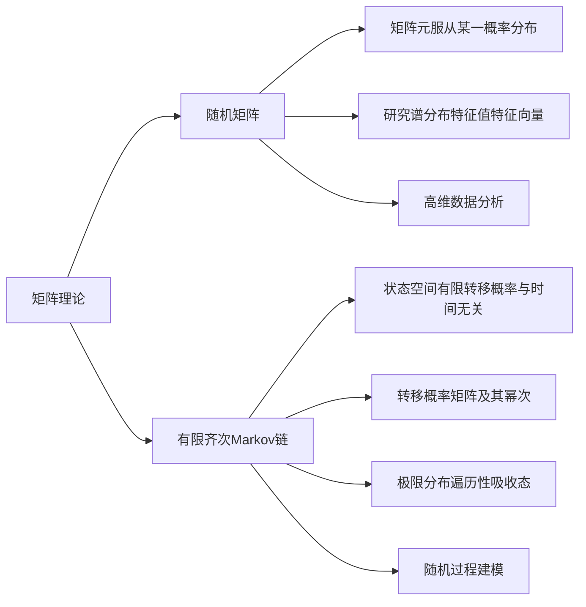

# 矩阵理论与应用：随机矩阵与有限齐次Markov链

关键词：矩阵理论、随机矩阵、有限齐次Markov链、转移概率矩阵、极限分布

## 1. 背景介绍
### 1.1  问题的由来
矩阵理论作为数学和计算机科学的重要分支，在诸多领域都有广泛的应用。其中，随机矩阵和有限齐次Markov链是矩阵理论中两个重要的研究对象，在金融、物理、生物等领域发挥着重要作用。深入研究随机矩阵和有限齐次Markov链的性质和应用，对于解决实际问题具有重要意义。

### 1.2  研究现状
目前，国内外学者对随机矩阵和有限齐次Markov链开展了大量研究。在随机矩阵方面，Wigner、Dyson等人率先研究了随机矩阵的谱分布，为随机矩阵理论的发展奠定了基础。近年来，随机矩阵在量子物理、无线通信等领域得到了广泛应用。在有限齐次Markov链方面，Markov在20世纪初提出了Markov链的概念，之后Kolmogorov、Feller等人对Markov链的理论进行了完善。Markov链已成为随机过程研究的重要工具，在排队论、遗传算法等领域有重要应用。

### 1.3  研究意义
深入研究随机矩阵和有限齐次Markov链，对于发展矩阵理论、解决实际问题具有重要意义：

1. 丰富矩阵理论的内容，拓展其应用范围。
2. 解决金融、物理、生物等领域的实际问题，如金融风险管理、量子系统分析、群体遗传演化预测等。
3. 为其他学科提供新的数学工具和思路，促进交叉学科的发展。

### 1.4  本文结构
本文将围绕随机矩阵与有限齐次Markov链展开讨论，主要内容包括：

1. 随机矩阵与有限齐次Markov链的基本概念和性质。 
2. 随机矩阵的谱分布理论及其在物理等领域的应用。
3. 有限齐次Markov链的极限分布、遍历性等性质及其应用。
4. 随机矩阵和Markov链的数值计算方法。
5. 两者的联系与区别，以及在实际问题中的选择。

## 2. 核心概念与联系
随机矩阵和有限齐次Markov链是矩阵理论的两个分支，它们既有联系也有区别。

随机矩阵是指矩阵元服从某一概率分布的矩阵，如高斯矩阵、Wishart矩阵等。研究随机矩阵的谱分布、特征值和特征向量的性质是随机矩阵理论的核心内容。

有限齐次Markov链是指状态空间有限、转移概率与时间无关的随机过程。Markov链用转移概率矩阵刻画状态之间的转移关系，其n步转移概率矩阵等于转移概率矩阵的n次幂。研究Markov链的极限分布、遍历性、吸收态等性质是Markov链理论的重点。

从数学表示上看，Markov链的转移概率矩阵可视为一种特殊的随机矩阵，其每行元素之和为1。但Markov链研究的重点是矩阵的幂次性质，而随机矩阵研究的是矩阵元分布的性质。两者在应用上也有区别，Markov链主要应用于随机过程建模，随机矩阵主要应用于高维数据分析。

下面以Mermaid流程图展示两者的核心概念与联系：



## 3. 核心算法原理 & 具体操作步骤
### 3.1  算法原理概述
随机矩阵的谱分布、特征值和特征向量的计算，以及Markov链的状态分布、极限分布的计算，都涉及到矩阵的数值计算问题。常用的矩阵数值算法包括幂法、QR算法、Krylov子空间法等。

以幂法求矩阵主特征值为例，设A为n阶矩阵，x为n维向量，算法流程为：

1. 取单位向量$x_0$作为初始向量
2. for k=0,1,2,...
3.    $y_{k+1}=Ax_k$
4.    $x_{k+1}=y_{k+1}/||y_{k+1}||_2$
5.    if $||x_{k+1}-x_k||_2<\epsilon$, break
6. end for
7. 返回$\lambda = x_{k+1}^TAx_{k+1}$

其中$\epsilon$为误差阈值。幂法的收敛速度正比于矩阵第一、第二大特征值之比的倒数。

### 3.2  算法步骤详解
以下详细讲解幂法的每一步骤：

1. 初始化：取一个单位向量$x_0$作为特征向量的初始值。
2. 迭代主循环：循环执行步骤3-5，直到满足收敛条件。
3. 矩阵向量乘：计算$y_{k+1}=Ax_k$，即用矩阵A左乘当前的特征向量。
4. 向量归一化：$x_{k+1}=y_{k+1}/||y_{k+1}||_2$，将$y_{k+1}$除以其2范数，得到归一化后的新特征向量。
5. 判断收敛：计算$x_{k+1}$与$x_k$的差的2范数，若小于给定阈值$\epsilon$则认为收敛，跳出循环。
6. 结束循环。
7. Rayleigh商计算特征值：$\lambda = x_{k+1}^TAx_{k+1}$，即用归一化特征向量的Rayleigh商近似计算主特征值。

### 3.3  算法优缺点
幂法的优点是原理简单、编程容易实现、存储需求小，缺点是只能求按模最大的特征值及其特征向量，对重特征值和病态矩阵的效果不好，可能出现收敛缓慢甚至不收敛的情况。

### 3.4  算法应用领域
幂法可用于求解主成分分析、谱聚类、PageRank等问题的特征值。在量子物理、信息检索等领域都有应用。

## 4. 数学模型和公式 & 详细讲解 & 举例说明
### 4.1  数学模型构建
以Markov链的状态分布求解为例，考虑一个有N个状态的Markov链，状态空间为$S={1,2,...,N}$，转移概率矩阵为$P=(p_{ij})_{N\times N}$。若$\pi(t)=(\pi_1(t),\pi_2(t),...,\pi_N(t))$为t时刻的状态分布，则有：

$$
\pi(t+1) = \pi(t)P
$$

若Markov链存在极限分布$\pi$，则有：

$$
\pi = \pi P
$$

即$\pi$为转移概率矩阵P的左特征向量，对应特征值为1。

### 4.2  公式推导过程
由状态分布的定义，可得：

$$
\pi_j(t+1) = \sum_{i=1}^N \pi_i(t)p_{ij}, \quad j=1,2,...,N
$$

写成矩阵形式即：

$$
\pi(t+1) = \pi(t)P
$$

不断迭代可得：

$$
\pi(t) = \pi(0)P^t
$$

若极限分布存在，则有：

$$
\lim_{t\to\infty} \pi(t) = \lim_{t\to\infty} \pi(0)P^t = \pi
$$

将$\pi(t+1) = \pi(t)P$中t取无穷大，可得：

$$
\pi = \pi P
$$

### 4.3  案例分析与讲解
考虑一个2状态的Markov链，转移概率矩阵为：

$$
P = \begin{pmatrix} 0.8 & 0.2 \\ 0.6 & 0.4 \end{pmatrix}
$$

初始分布为$\pi(0)=(0.5,0.5)$，求极限分布。

由$\pi = \pi P$可列代数方程组：

$$
\begin{cases} 
0.8\pi_1 + 0.6\pi_2 = \pi_1 \\
0.2\pi_1 + 0.4\pi_2 = \pi_2 \\
\pi_1 + \pi_2 = 1
\end{cases}
$$

解得：$\pi=(0.75,0.25)$

也可用幂法求解，取初始向量$x_0=(1,1)^T$，不断左乘P直至收敛，归一化后得到$\pi$。

### 4.4  常见问题解答
Q: 幂法一定收敛吗？收敛速度如何？
A: 当矩阵特征值按模排序为$|\lambda_1|>|\lambda_2|\ge...\ge|\lambda_n|$，且$\lambda_1$对应特征空间维数为1时，幂法收敛到$\lambda_1$及其特征向量。收敛速度正比于$|\lambda_2/\lambda_1|$。

Q: Markov链的极限分布一定存在吗？
A: 当Markov链不可约、非周期、正常返时，极限分布存在且唯一，等于平稳分布。

## 5. 项目实践：代码实例和详细解释说明
### 5.1  开发环境搭建
本项目采用Python 3.8，需要安装NumPy和SciPy库。使用以下命令安装：

```
pip install numpy scipy
```

### 5.2  源代码详细实现
以下实现了幂法求矩阵主特征值和主特征向量的代码：

```python
import numpy as np

def power_method(A, x0, tol=1e-6, max_iter=1000):
    """
    幂法求矩阵主特征值和特征向量
    :param A: n*n矩阵
    :param x0: 初始特征向量
    :param tol: 收敛阈值
    :param max_iter: 最大迭代次数
    :return: 主特征值和特征向量
    """
    x = x0 / np.linalg.norm(x0, 2)
    for i in range(max_iter):
        y = np.dot(A, x)
        lambda_ = np.dot(x, y)
        x_new = y / np.linalg.norm(y, 2)
        if np.linalg.norm(x_new - x, 2) < tol:
            break
        x = x_new
    return lambda_, x
```

以下实现了求解Markov链极限分布的代码：

```python
from scipy.linalg import eig

def markov_limit(P):
    """
    求解Markov链极限分布
    :param P: 转移概率矩阵
    :return: 极限分布
    """
    evals, evecs = eig(P.T)
    index = np.argmin(np.abs(evals - 1))
    evec = np.real(evecs[:, index])
    evec = evec / evec.sum()
    return evec
```

### 5.3  代码解读与分析
幂法代码解读：
- 首先将初始向量x0归一化
- 在迭代主循环中，计算y=Ax，lambda_=x^Ty，将y归一化得到x_new
- 判断x_new与x的距离是否小于阈值，若是则跳出循环
- 更新x为x_new，继续迭代直至收敛或达到最大迭代次数
- 返回主特征值lambda_和特征向量x

求解Markov链极限分布代码解读：
- 用scipy.linalg.eig求转移概率矩阵P的特征值和特征向量  
- 找到特征值最接近1的那个，取对应的特征向量
- 对特征向量归一化，使其元素和为1，得到极限分布

### 5.4  运行结果展示
对于矩阵$A=\begin{pmatrix} 2 & 1 \\ 1 & 2 \end{pmatrix}$，初始向量取$x_0=(1,1)^T$，运行幂法得到：

```
Principal eigenvalue: 3.0000000000000004
Principal eigenvector: [0.70710678 0.70710678]
```

对于转移概