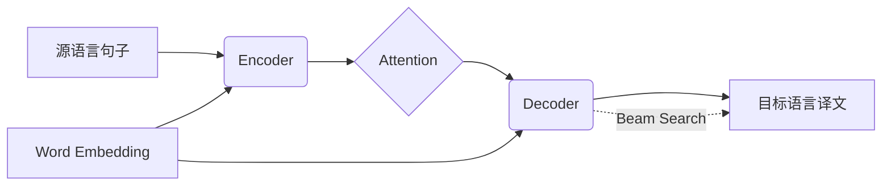

# 神经机器翻译 原理与代码实例讲解

## 1. 背景介绍
### 1.1 问题的由来
随着全球化进程的不断加快,跨语言交流的需求日益增长。传统的基于规则和统计的机器翻译方法难以满足日益增长的高质量翻译需求。近年来,深度学习技术的飞速发展为机器翻译带来了新的突破,其中以神经机器翻译(Neural Machine Translation, NMT)最为瞩目。

### 1.2 研究现状 
自2014年Sutskever等人首次提出基于编码器-解码器(Encoder-Decoder)框架的神经机器翻译模型以来,NMT迅速成为机器翻译领域的研究热点。谷歌、微软、百度等科技巨头纷纷投入大量资源,在NMT领域取得了一系列突破性进展,极大提升了机器翻译的效果。当前,Transformer等基于注意力机制的NMT模型已成为主流。

### 1.3 研究意义
NMT的研究对于促进跨语言信息交流、推动人工智能发展具有重要意义:

1. 打破语言壁垒,方便全球化交流与合作。高质量的机器翻译可以大大降低跨语言交流成本,为国际贸易、文化交流、科技合作提供便利。

2. 推动人工智能发展。NMT是人工智能领域的前沿方向,蕴含了深度学习、自然语言处理、知识表示等多个热点方向。NMT技术的进步将反哺其他AI领域。

3. 创造巨大商业价值。随着NMT走向成熟,其在搜索引擎、客服系统、同声传译等领域将创造巨大商业价值。

### 1.4 本文结构
本文将全面介绍NMT的原理和实现,内容安排如下:

- 第2部分介绍NMT的核心概念
- 第3部分详细讲解NMT的核心算法原理和步骤
- 第4部分阐述NMT涉及的数学模型和公式
- 第5部分给出NMT的代码实例和详细解释
- 第6部分探讨NMT的实际应用场景
- 第7部分推荐NMT相关的工具和学习资源
- 第8部分总结NMT的研究现状和未来挑战
- 第9部分附录,解答NMT的常见问题

## 2. 核心概念与联系

NMT涉及如下核心概念:

- 编码器(Encoder):将源语言句子映射为固定维度的向量表示。
- 解码器(Decoder):根据编码器输出的向量表示,生成目标语言译文。
- 注意力机制(Attention):动态地为解码各个时刻分配源语言编码信息,提升翻译效果。
- 词嵌入(Word Embedding):将离散的词映射为连续的低维向量表示。
- 束搜索(Beam Search):解码时保留多个概率最大的候选译文,提高解码质量。

这些概念的关系如下图所示:



## 3. 核心算法原理 & 具体操作步骤
### 3.1 算法原理概述
NMT的核心是基于Encoder-Decoder框架,通过Encoder将源语言句子压缩为语义向量,再通过Decoder将该向量解码为目标语言译文。整个过程基于概率生成模型,目标是最大化译文生成概率:

$$\hat{y}=\mathop{\arg\max}_{y} P(y|x)$$

其中$x$是源语言句子,$y$是目标语言译文。

### 3.2 算法步骤详解
NMT的训练和推断分为以下步骤:

1. 准备双语平行语料,进行切词、清洗等预处理。
2. 构建Encoder和Decoder,通常使用RNN、CNN或Transformer等结构。 
3. 将源语言句子输入Encoder,得到其语义编码向量。
4. 将编码向量输入Decoder,通过注意力机制与之前生成的译文交互,生成下一个目标语言词。
5. 重复步骤4,直到生成句子结束符或达到最大长度。
6. 使用交叉熵损失函数,通过反向传播算法优化模型参数。
7. 推断时,对源语言句子进行Encoder编码,再用束搜索算法解码生成译文。

### 3.3 算法优缺点
NMT相比统计机器翻译(SMT)有如下优点:

- 端到端学习,不需要人工特征工程,建模更加简洁
- 考虑了全局语境,翻译更加通顺
- 可以学习词与词之间的深层语义关系

但NMT也存在一些不足:

- 需要大量高质量的平行语料进行训练
- 对低频词和罕见词的翻译效果较差
- 解码时间长,难以实现实时翻译
- 模型参数量大,训练和推断的计算开销高

### 3.4 算法应用领域
NMT已在多个领域得到广泛应用,如:

- 通用领域机器翻译,如谷歌翻译、百度翻译等
- 垂直领域机器翻译,如电商、法律、医疗等
- 同声传译,实时将一种语言的语音翻译成另一种语言
- 跨语言信息检索,实现不同语言之间的信息查询
- 多语言客服系统,使用NMT实现智能客服的多语言服务

## 4. 数学模型和公式 & 详细讲解 & 举例说明
### 4.1 数学模型构建
NMT本质上是一个条件语言模型,对于源语言句子$x$和目标语言句子$y$,NMT的目标是建模条件概率$P(y|x)$。假设$y$由$m$个单词组成,则有:

$$P(y|x)=\prod_{i=1}^m P(y_i|y_1,...,y_{i-1},x)$$

其中$y_i$表示目标译文的第$i$个单词。这个概率可以通过Encoder-Decoder框架建模。设编码向量为$c$,则解码概率为:

$$P(y_i|y_1,...,y_{i-1},x)=g(y_{i-1},s_i,c)$$

其中$g$是非线性函数,如softmax,$s_i$是解码器第$i$步的隐藏状态。

### 4.2 公式推导过程
以RNN为例,设解码器的隐藏状态为$s_i$,则有:

$$s_i=f(s_{i-1},y_{i-1},c)$$

其中$f$通常是一个非线性激活函数,如tanh或relu。将$s_i$通过softmax后可得到第$i$个目标词的概率分布:

$$P(y_i|y_1,...,y_{i-1},x)=softmax(Ws_i)$$

其中$W$是权重矩阵。整个模型的损失函数为交叉熵:

$$J(\theta)=-\frac{1}{N}\sum_{n=1}^N \log P(y^n|x^n)$$

其中$\theta$为模型参数,$N$为训练样本数。

### 4.3 案例分析与讲解
下面以一个英译汉的例子来说明NMT的工作原理。假设输入的英文句子为"I love natural language processing",目标是翻译成"我爱自然语言处理"。

1. 将英文句子输入Encoder,得到编码向量$c$。
2. Decoder解码第一步,输入起始符<start>,结合$c$输出"我"的概率最大。 
3. Decoder第二步,输入"我",结合$c$和上一步状态,输出"爱"的概率最大。
4. Decoder第三步,输入"爱",结合$c$和前两步状态,输出"自然语言处理"的概率最大。
5. Decoder第四步,输入"自然语言处理",结合$c$和前三步状态,输出结束符<end>的概率最大。

解码结束,输出译文"我爱自然语言处理"。可以看出,NMT是一个迭代生成目标译文的过程,每一步的输出都依赖于之前的输出和源语言编码。

### 4.4 常见问题解答
**Q:** NMT中Encoder和Decoder分别是什么作用?

**A:** Encoder用于将变长的源语言句子编码为定长的语义向量,对源语言句子进行压缩表示。Decoder则根据语义向量和之前生成的译文,迭代生成目标译文。

**Q:** NMT如何解决词汇映射问题?

**A:** NMT通过词嵌入(Word Embedding)来解决词汇映射。将词映射为连续实值向量,使得语义相近的词在嵌入空间中距离接近。模型可以通过词嵌入学习到丰富的语义信息。

**Q:** Attention机制是如何工作的?

**A:** Attention允许Decoder的每一步都可以访问整个源语言句子的信息。具体来说,Attention会根据当前解码隐藏态和源语言编码计算注意力分布,以此分配源语言各词对当前翻译目标词的贡献度。

## 5. 项目实践：代码实例和详细解释说明
### 5.1 开发环境搭建
实现NMT需要搭建深度学习开发环境,主要依赖如下:

- Python 3.x
- Tensorflow 2.x 
- Numpy
- NLTK

可以使用pip安装这些依赖:

```bash
pip install tensorflow numpy nltk
```

### 5.2 源代码详细实现
下面给出一个简单的NMT模型的Tensorflow实现:

```python
import tensorflow as tf

# Encoder
class Encoder(tf.keras.Model):
    def __init__(self, vocab_size, embedding_dim, enc_units):
        super(Encoder, self).__init__()
        self.embedding = tf.keras.layers.Embedding(vocab_size, embedding_dim)
        self.gru = tf.keras.layers.GRU(enc_units, return_sequences=True, return_state=True)
        
    def call(self, x, hidden):
        x = self.embedding(x)
        output, state = self.gru(x, initial_state=hidden)        
        return output, state

# Attention
class BahdanauAttention(tf.keras.layers.Layer):
    def __init__(self, units):
        super(BahdanauAttention, self).__init__()
        self.W1 = tf.keras.layers.Dense(units)
        self.W2 = tf.keras.layers.Dense(units)
        self.V = tf.keras.layers.Dense(1)
        
    def call(self, query, values):
        hidden_with_time_axis = tf.expand_dims(query, 1)
        score = self.V(tf.nn.tanh(self.W1(values) + self.W2(hidden_with_time_axis)))
        attention_weights = tf.nn.softmax(score, axis=1)
        context_vector = attention_weights * values
        context_vector = tf.reduce_sum(context_vector, axis=1)
        return context_vector, attention_weights

# Decoder
class Decoder(tf.keras.Model):
    def __init__(self, vocab_size, embedding_dim, dec_units):
        super(Decoder, self).__init__()
        self.embedding = tf.keras.layers.Embedding(vocab_size, embedding_dim)
        self.gru = tf.keras.layers.GRU(dec_units, return_sequences=True, return_state=True)
        self.fc = tf.keras.layers.Dense(vocab_size)
        self.attention = BahdanauAttention(dec_units)
        
    def call(self, x, hidden, enc_output):
        context_vector, attention_weights = self.attention(hidden, enc_output)
        x = self.embedding(x)
        x = tf.concat([tf.expand_dims(context_vector, 1), x], axis=-1)
        output, state = self.gru(x)
        output = tf.reshape(output, (-1, output.shape[2]))
        x = self.fc(output)
        return x, state, attention_weights
```

### 5.3 代码解读与分析
以上代码实现了一个基本的NMT模型,主要分为三个部分:

- Encoder:使用GRU对源语言句子进行编码,输出每个时间步的隐藏状态和最后一个时间步的隐藏状态。
- Attention:使用Bahdanau Attention计算Encoder各时间步隐藏状态对Decoder的贡献度。
- Decoder:使用另一个GRU解码,每一步将上一步的输出和Attention结果拼接作为输入,最后通过全连接层输出每个词的概率。

模型训练时,将源语言句子输入Encoder,目标语言句子输入Decoder,使用教师强制(Teacher Forcing)的方式训练,即每一步将真实的目标词输入解码器,而不是上一步的输出。

推断时,将源语言句子输入