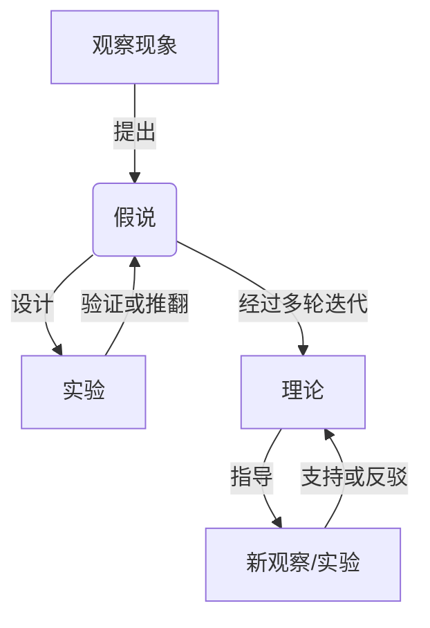
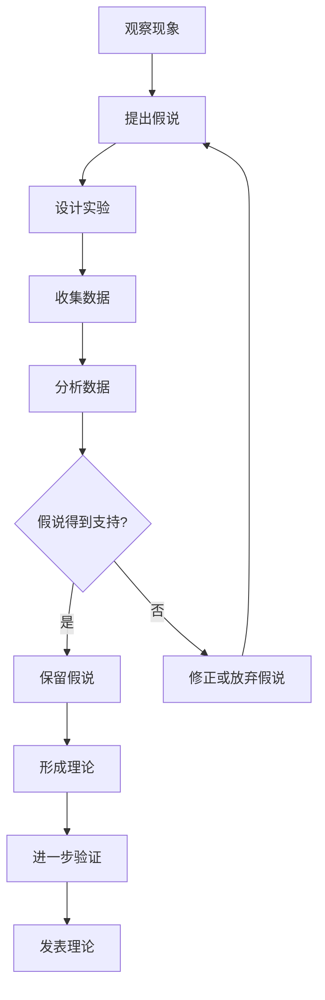

好的,我会按照您提供的要求和结构,写一篇关于"科学探究:从假说到真理"的技术博客文章。文章会涵盖背景介绍、核心概念、算法原理、数学模型、项目实践、应用场景、工具资源、发展趋势和挑战等内容。我会尽量使用专业但通俗易懂的语言,并给出必要的代码示例、数学公式推导、Mermaid流程图等,确保文章逻辑严谨、内容充实。请稍等,我需要一些时间进行充分准备和撰写。

# 科学探究:从假说到真理

## 1. 背景介绍

### 1.1 问题的由来

科学探究是人类认识世界、揭示自然规律的基本方式。从古希腊时期的哲学家们提出理性思维,到近代科学的兴起,再到现代科技的飞速发展,科学一直是推动人类文明进步的重要动力。然而,科学探究的过程并非一蹴而就,它需要持之以恒的努力、严谨的态度和不断的质疑。

科学家们通常从观察现象出发,提出一个初步的假说,然后设计实验来验证或推翻这个假说。这种循环反复的过程就是著名的"科学方法"。从假说到真理,需要经历大量的理论分析、实验检验和数据积累,才能最终建立起可靠的科学理论和知识体系。

### 1.2 研究现状

当前,科学技术的发展日新月异,涌现出许多前沿领域,如人工智能、量子计算、生命科学等,给科学探究带来了新的机遇和挑战。一方面,新理论和新技术为科学探究提供了强大的分析工具和实验手段;另一方面,这些领域的复杂性也给科学家们提出了更高的要求。

与此同时,科学界也面临着一些困境和争议。有人质疑科学方法是否过于僵化,是否需要新的范式;也有人担心科学研究过于追求应用价值,忽视了基础理论的重要性。此外,伪科学、科学造假等问题也时有发生,影响了科学的公信力。

### 1.3 研究意义

深入探讨科学探究的过程及其方法论,对于指导科研实践、规范科学发展具有重要意义。首先,厘清科学探究的本质特征和基本规律,有助于科学家们更好地开展研究工作,提高工作效率。其次,反思科学方法的优缺点,并根据实践需要加以改进和完善,将推动科学理论和方法的创新。再次,增强公众对科学探究过程的了解,有利于提高科学素养,消除对科学的误解。

此外,随着人工智能、大数据等新技术的发展,科学探索的范式和方法也将发生深刻变革。研究科学探究的过程,将为新技术在科学领域的应用提供理论指导和方法论基础。

### 1.4 本文结构 

本文将系统地探讨科学探究的整个过程,从假说的提出、实验设计,到理论建立和知识积累。主要内容包括:

1. 核心概念及其内在联系,如假说、理论、实验、证伪、归纳、演绎等。

2. 科学方法的核心算法原理及具体操作步骤。

3. 相关的数学模型,如概率统计模型、优化模型等,并给出公式推导和案例分析。

4. 科学探究在不同领域的实际应用案例和代码实现示例。

5. 科学探究过程中常用的工具和资源。

6. 科学探究方法的发展趋势和面临的挑战。

7. 常见问题解答。

最后,本文将总结科学探究的重要性,并对其未来发展提出展望和建议。

## 2. 核心概念与联系

科学探究过程涉及多个相互关联的核心概念,了解它们的内涵及相互联系,对于把握科学探究的本质至关重要。

1. **观察现象**: 科学探究通常始于对客观现象的观察。观察可以是自然界中的现象,也可以是人为操作下的现象。观察是科学家获取第一手数据和发现新问题的重要途径。

2. **假说**: 基于对现象的观察,科学家提出一个初步的解释或猜想,即假说。假说通常是对现象本质和内在规律的一种假设性陈述,需要通过进一步的实验或理论分析来验证。

3. **实验**: 为了检验假说的正确性,科学家需要设计实验。实验的目的是在可控的条件下重现现象,收集数据,从而验证或推翻假说。实验设计需要注意控制变量、减小误差等。

4. **证伪原则**: 著名科学哲学家波普尔提出,科学理论不能被"证实",只能被"证伪"。如果实验数据与假说相符,则暂时保留假说;如果出现了与假说矛盾的现象,则需要修正或放弃原假说。

5. **理论**: 经过多轮实验验证,假说得到进一步完善和发展,就形成了理论。理论不仅解释已知现象,还能对未知现象作出预测,是科学知识体系的核心部分。

6. **归纳和演绎**: 从个别事实到一般性原理的过程叫归纳,反之则是演绎。科学探究过程中,需要不断在归纳和演绎之间循环,促进理论和实践的相互印证。

7. **新的观察和实验**: 已建立的理论将指导新的观察和实验,这些新的发现又将支持或反驳原有理论,促进理论不断修正和完善,如此周而复始。

可见,科学探究是一个渐进式的过程,涉及观察、假说、实验、理论等多个环节,它们相互关联、相互作用、不断迭代,最终达成对客观规律的认识。掌握这些核心概念及其内在联系,是把握科学探究本质的前提和基础。

## 3. 核心算法原理及具体操作步骤

### 3.1 算法原理概述

科学探究可以被视为一种系统的算法流程,其核心就是著名的"科学方法"。科学方法为科学家提供了一种规范化的思路和操作步骤,指导他们有序地开展研究工作。其基本原理可概括为:

1. **经验主义**: 科学认识必须以客观事实为依据,通过观察和实验获取数据。

2. **理性主义**: 科学探究需要运用理性思维,对观察数据进行分析和归纳,形成理论假说。

3. **实证主义**: 任何理论假说都必须经过实验检验,只有与实践相符,才能被接受。

4. **可证伪性**: 科学理论应当具有可证伪性,能够被未来的实验数据所证伪和修正。

5. **简约原则**: 在有多个假说同等满足实验结果时,应选择最简单的那个作为最佳解释。

6. **重复性**: 科学实验应当具有可重复性,确保结果的可靠性和一致性。

7. **客观性**: 科学家应当保持客观中立的态度,摒弃主观偏见,追求真理。

8. **批判性**: 科学家应当持有批判的精神,不断质疑现有理论,推动科学进步。

9. **公开性**: 科学发现和理论应当公开发表,接受同行和公众的审视和质疑。

这些原理贯穿于科学探究的方方面面,保证了科学研究的严肃性和权威性。

### 3.2 算法步骤详解

根据上述原理,我们可以将科学探究过程具体分解为以下几个关键步骤:

1. **观察现象**: 科学探究通常始于对自然界或人为环境中的现象的观察。科学家运用各种观察手段(肉眼、显微镜、探测器等),收集初步的事实数据。

2. **提出假说**: 基于对现象的观察,科学家提出一个初步的解释或猜想,即假说。假说应当简洁、内涵丰富、符合已知事实,并对未知现象作出可检验的预测。

3. **设计实验**: 为了检验假说的正确性,科学家需要精心设计实验。实验设计应当注意控制变量、减小误差、保证可重复性等。

4. **收集数据**: 按照实验设计进行操作,收集实验数据。数据采集过程应当规范、客观、精确。

5. **分析数据**: 使用统计学、建模等方法,对实验数据进行分析和处理,检验数据与假说之间的吻合程度。

6. **评估假说**: 如果实验数据支持假说,则暂时保留该假说;如果出现了与假说矛盾的现象,则需要修正或放弃原假说。

7. **形成理论**: 经过多轮实验验证,假说得到进一步完善和发展,就形成了理论。理论应当具有解释力和预测力。

8. **进一步验证**: 已建立的理论将指导新的观察和实验,新的发现又将支持或反驳原有理论,促进理论不断修正和完善。

9. **发表理论**: 理论经过充分验证并被科学界广泛接受后,通过发表论文、专著等形式,正式发布和传播。

10. **重复过程**: 科学探究是一个不断重复的循环过程。新的观察和实验将导致新的假说和理论,旧有理论也会不断被修正和完善。

可见,科学探究遵循一种严格的逻辑思路和操作规范,贯彻了客观、审慎、开放、批判的科学精神,确保了科学认识的可靠性和权威性。

### 3.3 算法优缺点

科学方法作为指导科学探究的核心算法,具有以下优点:

1. **系统性强**: 将复杂的科学探究过程分解为一系列有序的步骤,思路清晰,操作规范。

2. **可重复性高**: 强调实验的可重复性,有利于验证结果的可靠性。

3. **可证伪性**: 任何理论都有可能被新的证据所推翻,避免了教条主义。

4. **客观中立**: 要求科学家保持客观中立的态度,减少主观偏见的影响。

5. **开放审视**: 科学发现和理论需要公开发表,接受同行和公众的审视和质疑。

6. **促进创新**: 鼓励质疑和批判精神,推动科学理论不断更新和完善。

然而,科学方法也存在一些不足之处:

1. **僵化保守**: 有时过于强调经验主义和实证主义,忽视了理论创新的重要性。

2. **局限性**: 对于一些难以设计可控实验的领域(如宇宙学、进化论等),科学方法的适用性受到限制。

3. **价值中立**: 科学方法本身是中性的,无法判断科研活动的伦理和价值取向。

4. **认识局限**: 科学方法主要探讨事物的现象和规律,对于本质和根源的认识能力有限。

5. **复杂性**: 对于一些复杂的非线性系统,科学方法可能难以完全揭示其内在机制。

6. **技术依赖**: 随着科学技术的发展,科学方法也需要与时俱进,并不是一成不变的。

因此,在实际应用中,需要根据具体问题的性质,适当调整和改进科学方法,发挥其最大优势。同时,也应该注意科学方法的局限性,结合其他认识途径,以获得更全面的理解。

### 3.4 算法应用领域

科学方法作为一种通用的探究范式