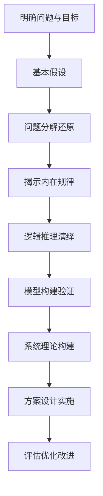

# 第一性原理：从基础到复杂的科学方法

## 1. 背景介绍

### 1.1 问题的由来

在科学研究和技术创新领域,我们经常面临各种复杂的问题和挑战。这些问题往往涉及多个学科领域,需要综合运用多种知识和方法。面对如此复杂的问题,传统的思维方式和解决方案往往难以奏效。因此,我们需要一种全新的思维方式和方法论,来应对这些复杂问题的挑战。

### 1.2 研究现状

目前,在科学研究和技术创新领域,已经出现了许多新的思维方式和方法论,如系统思维、跨界思维、设计思维等。这些方法在一定程度上帮助我们突破了传统思维的局限,开拓了新的研究视角和解决方案。然而,这些方法往往侧重于宏观层面的分析和设计,对于如何深入到问题的本质,揭示事物的内在规律和机理,还缺乏系统性的指导。

### 1.3 研究意义

第一性原理思维作为一种从基础到复杂的科学方法,为我们提供了一个全新的视角和路径。它强调从事物的本质出发,通过分解复杂问题,揭示其内在的基本规律和机理,进而构建起系统性的认知框架和解决方案。这种思维方式不仅有助于我们深入理解复杂问题的本质,也为技术创新和科学突破提供了重要的方法论指导。

### 1.4 本文结构

本文将围绕第一性原理思维这一主题,系统阐述其核心概念、基本原理和应用实践。全文分为以下几个部分：

第一部分,介绍第一性原理思维的背景和意义,阐明研究现状和研究目标。

第二部分,系统阐述第一性原理思维的核心概念和基本原理,揭示其思维逻辑和方法论特征。 

第三部分,详细讲解第一性原理思维的核心算法原理和操作步骤,并结合实例进行案例分析。

第四部分,构建第一性原理思维的数学模型,推导其基本公式,并进行详细讲解和举例说明。

第五部分,介绍第一性原理思维在实际项目中的应用实践,给出代码实例和详细的解释说明。

第六部分,探讨第一性原理思维在不同领域的应用场景,分析其应用价值和未来趋势。

第七部分,推荐第一性原理思维的学习资源、开发工具和相关文献,为读者提供进一步研究的参考。

第八部分,总结第一性原理思维的研究成果和未来发展趋势,展望其面临的机遇和挑战。

第九部分,列举第一性原理思维在应用过程中的常见问题,并给出相应的解答和建议。

## 2. 核心概念与联系

第一性原理思维的核心是将复杂问题分解为基本的组成部分,并且从最基本的事实和假设出发,通过逻辑推理得出结论。它强调要抛开先入为主的观念和习惯性思维,回归事物的本质,从根本上思考问题。

具体来说,第一性原理思维包含以下几个核心概念:

- 基本假设:指对事物本质的最基本认知和判断,是进行逻辑推理的出发点。
- 还原论:将复杂事物分解为基本组成部分,研究部分与部分、部分与整体之间的关系。  
- 因果论:探究事物内在的因果规律和相互作用机制,揭示复杂现象背后的本质原理。
- 逻辑推理:运用演绎、归纳等逻辑方法,从基本假设出发,推导出系统性的理论和结论。
- 系统构建:在对事物的基本规律有了清晰认识的基础上,构建系统性的理论框架和解决方案。

这些核心概念之间相互联系、相互支撑,构成了第一性原理思维的完整逻辑体系。基本假设是逻辑推理的起点,还原论和因果论揭示事物的内在规律,逻辑推理则是得出结论的基本方法,系统构建最终形成理论成果和应用方案。

总之,第一性原理思维以"基本假设-还原论-因果论-逻辑推理-系统构建"为主线,形成了一套从基础到复杂、从本质到现象的系统性思维方法。下面我们将通过一个流程图来直观展示其基本原理和操作步骤。



## 3. 核心算法原理 & 具体操作步骤

### 3.1 算法原理概述

第一性原理思维的核心算法可以概括为"分解-演绎-构建"三个基本步骤。即首先将复杂问题分解为基本组成部分,然后运用逻辑推理方法对各个部分进行分析演绎,最后再将推导出的规律和结论进行系统性的理论构建。

### 3.2 算法步骤详解

1. 明确问题与目标:清晰界定所要解决的问题,确定研究的目标和范围。
2. 基本假设:对研究对象的基本属性作出合理假设,为逻辑推理提供出发点。
3. 问题分解还原:将复杂问题分解为若干基本组成部分,揭示各部分的内在联系。
4. 揭示内在规律:分析各组成部分的属性特征,总结其内在的规律性和因果机制。 
5. 逻辑推理演绎:运用演绎、归纳等逻辑方法,推导形成系统性的理论和结论。
6. 模型构建验证:构建数学或逻辑模型,并通过实例验证模型的合理性和有效性。
7. 系统理论构建:在模型验证的基础上,构建系统性的理论框架,形成理论成果。
8. 方案设计实施:根据理论成果,设计切实可行的解决方案,并付诸实施。
9. 评估优化改进:评估方案实施效果,并根据反馈对模型和方案进行优化改进。

### 3.3 算法优缺点

优点:
- 强调从基本原理出发,有利于揭示事物的本质规律。
- 采用严密的逻辑推理,保证了推导结论的科学性和严谨性。
- 通过系统构建,形成了完整的理论框架和解决方案。

缺点:
- 对问题的分解和假设的合理性要求较高,不恰当的分解和假设会影响推理结果。
- 算法实施周期较长,需要经过理论构建和方案设计等多个环节。
- 对于极其复杂的开放性问题,该算法的适用性有一定局限。

### 3.4 算法应用领域

第一性原理思维广泛应用于科学研究、工程设计、商业决策等领域。比如在物理学研究中,牛顿力学就是典型的第一性原理思维的应用。在工程设计领域,SpaceX公司采用第一性原理方法研制可回收火箭,大幅降低了航天发射成本。在商业领域,零售巨头亚马逊也善于运用第一性原理,不断推陈出新,开拓新的商业模式。

## 4. 数学模型和公式 & 详细讲解 & 举例说明

### 4.1 数学模型构建

我们可以用一个函数模型来刻画第一性原理思维的基本原理:

$$y = f(x_1, x_2, ..., x_n)$$

其中,$y$表示问题的解或者创新的结果,$x_1, x_2, ..., x_n$表示问题的基本组成要素。$f$表示通过对基本要素的分解、抽象、演绎而建立起来的函数关系。

### 4.2 公式推导过程

具体来说,我们对问题$y$进行分解,得到:

$$y = y_1 + y_2 + ... + y_m$$

其中,$y_1, y_2, ..., y_m$为问题$y$的$m$个子问题。

对于每个子问题$y_i$,我们可以进一步分解为基本要素$x_1, x_2, ..., x_n$的函数:

$$y_i = f_i(x_1, x_2, ..., x_n)$$

然后,我们对$f_i$进行抽象和逻辑演绎,建立$y_i$与$x_1, x_2, ..., x_n$之间的函数关系$f_i$。

最后,我们将所有子问题的函数关系进行组合,得到原问题$y$的解:

$$y = \sum_{i=1}^{m} f_i(x_1, x_2, ..., x_n)$$

这就是第一性原理思维的基本数学模型。

### 4.3 案例分析与讲解

举一个简单的例子,比如我们要设计一款新型的智能手机。

首先,我们将手机$y$分解为硬件$y_1$、软件$y_2$、外观$y_3$、售价$y_4$等几个基本要素。

$$y = y_1 + y_2 + y_3 + y_4$$

然后,我们对每个要素进行深入分析。以硬件$y_1$为例,可以分解为CPU、内存、电池等基本组件:

$$y_1 = f_1(cpu, ram, battery, ...)$$

接着我们对$f_1$进行抽象,发现硬件性能与cpu频率、内存大小、电池容量等参数存在函数关系。

同理,我们对软件、外观、售价等要素进行类似的分析和建模,得到:

$$
\begin{aligned}
y_2 &= f_2(os, app, ui, ...)\\
y_3 &= f_3(size, material, color, ...)\\  
y_4 &= f_4(cost, profit, ...)
\end{aligned}
$$

最后,我们将各个要素的函数模型进行组合,得到手机设计的解决方案:

$$y = f_1(cpu, ram, battery, ...) + f_2(os, app, ui, ...) + f_3(size, material, color, ...) + f_4(cost, profit, ...)$$

这就是应用第一性原理思维设计新型智能手机的基本思路。当然,实际设计过程要复杂得多,但基本原理是相通的。

### 4.4 常见问题解答

Q: 第一性原理思维对问题分解的粒度有什么要求?

A: 问题分解的粒度要适度,过于粗放会遗漏重要因素,过于细致则会陷入复杂的细节而无法抽象出规律。通常我们将问题分解到可以建立函数关系的基本要素层次即可。

Q: 如何判断分解出的基本要素是否合理?

A: 可以从两个角度判断:一是基本要素之间是否相对独立,没有重复;二是基本要素的组合是否完整,能够表征原问题的全貌。如果不满足这两点,就需要调整分解的思路。

Q: 建立函数关系时有哪些常见的方法?

A: 常见的方法包括归纳、类比、演绎等。归纳法是从个别到一般的推理,类比法是从相似性出发进行推理,演绎法是从一般到个别的推理。根据问题的特点,灵活选择适当的推理方法。

Q: 如何验证第一性原理建立的模型是否正确?

A: 可以通过实例验证和逻辑验证两种方式。实例验证就是用实际案例来测试模型的预测是否准确,逻辑验证就是检查模型的推导过程是否严谨,有无逻辑漏洞。只有经过全面验证的模型才能应用于实践。

## 5. 项目实践：代码实例和详细解释说明

下面我们用一个简单的Python代码实例来展示如何应用第一性原理思维进行编程设计。

### 5.1 开发环境搭建

我们使用Python 3作为开发语言,需要安装以下库:

- NumPy:用于科学计算和数组操作。
- Matplotlib:用于绘图和数据可视化。
- Pandas:用于数据分析和处理。

可以使用pip命令安装这些库:

```bash
pip install numpy matplotlib pandas
```