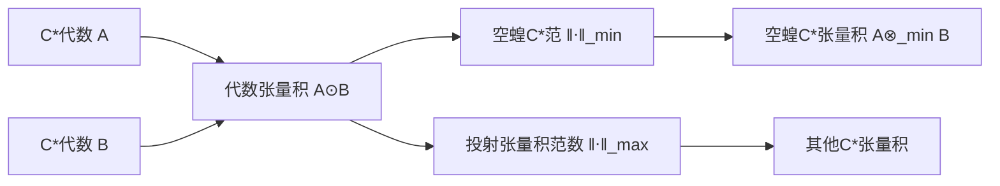

# 算子代数：C*代数的张量积与空蝗C*范

关键词：C*代数、张量积、空蝗C*范、Hilbert空间、有界线性算子

## 1. 背景介绍
### 1.1  问题的由来
C*代数作为一种重要的算子代数结构,在量子力学、非交换几何以及算子理论等领域有着广泛的应用。特别地,C*代数的张量积理论为研究复合量子系统的代数结构提供了重要工具。然而,对于一般的C*代数,其张量积并不唯一,从而导致了空蝗C*范这一重要概念的引入。

### 1.2  研究现状
目前,关于C*代数张量积和空蝗C*范的研究已经取得了诸多进展。Takesaki、Kirchberg、Pisier等学者在C*代数的张量积理论和分类问题上做出了开创性的贡献。特别地,Kirchberg关于C*代数张量积的著名定理揭示了空蝗C*范与张量积之间的内在联系。近年来,随着算子空间理论的发展,C*代数的空蝗张量积得到了进一步的推广和应用。

### 1.3  研究意义
深入研究C*代数的张量积理论和空蝗C*范,对于揭示量子系统的代数结构、发展非交换几何以及丰富算子理论都具有重要意义。同时,这一领域的研究也为泛函分析、表示论等数学分支提供了新的思路和方法。因此,系统总结和探讨C*代数张量积与空蝗C*范的理论框架和前沿进展,对于推动算子代数乃至数学物理的发展都是十分必要的。

### 1.4  本文结构
本文将围绕C*代数的张量积和空蝗C*范这一主题,系统阐述其基本概念、核心理论和前沿进展。第2部分将介绍C*代数和张量积的基本定义和性质。第3部分重点讨论空蝗C*范的定义、构造和分类。第4部分将给出C*代数张量积的数学刻画,并揭示其与空蝗C*范之间的内在联系。第5部分通过具体的代码实例,展示C*代数和张量积在计算机中的实现。第6部分讨论C*代数张量积和空蝗C*范在量子信息、非交换几何等领域的应用。第7部分推荐C*代数和张量积的学习资源和相关工具。第8部分对全文进行总结,并对C*代数张量积理论的发展前景进行展望。

## 2. 核心概念与联系

在具体阐述C*代数张量积和空蝗C*范之前,我们首先回顾一下C*代数的定义和基本性质。

**定义1(C*代数)** 称复Banach代数 $\mathfrak{A}$ 为C*代数,如果其上存在对合反线性映射 $*:\mathfrak{A}\to\mathfrak{A}$ 满足:
(1) $(x^*)^*=x$;
(2) $(xy)^*=y^*x^*$;
(3) $\|x^*x\|=\|x\|^2$。
其中 $x,y\in \mathfrak{A}$。

C*代数的经典例子包括复数域 $\mathbb{C}$ 上的全体有界线性算子构成的代数 $B(H)$,其中 $H$ 为Hilbert空间。特别地,当 $H$ 为有限维时,我们就得到了矩阵代数 $M_n(\mathbb{C})$。

对于两个C*代数 $\mathfrak{A}$ 和 $\mathfrak{B}$,我们可以定义其代数张量积 $\mathfrak{A}\odot\mathfrak{B}$,其上的乘法和*-运算由下式给出:

$$(a_1\otimes b_1)(a_2\otimes b_2)=a_1a_2\otimes b_1b_2$$

$$(a\otimes b)^*=a^*\otimes b^*$$

其中 $a,a_1,a_2\in\mathfrak{A},b,b_1,b_2\in\mathfrak{B}$。

然而,对于一般的C*代数,代数张量积 $\mathfrak{A}\odot\mathfrak{B}$ 上不一定存在C*范数,从而未必能完备化为C*代数。为了解决这一问题,我们需要引入空蝗C*范的概念。

**定义2(空蝗C*范)** 设 $\|\cdot\|_\alpha$ 是 $\mathfrak{A}\odot\mathfrak{B}$ 上的一个C*半范,称 $\|\cdot\|_\alpha$ 为空蝗的,如果对于任意的 $\mathfrak{A}$ 上态 $\phi$ 和 $\mathfrak{B}$ 上态 $\psi$,有

$$\|\phi\otimes\psi\|=\|\phi\|\|\psi\|$$

直观上,空蝗C*范体现了张量积在态空间上的作用是将两个态"独立地"组合在一起。Kirchberg证明了,对于任意的C*代数 $\mathfrak{A}$ 和 $\mathfrak{B}$,其代数张量积 $\mathfrak{A}\odot\mathfrak{B}$ 上存在唯一的空蝗C*范,记为 $\|\cdot\|_{\min}$。我们把 $\mathfrak{A}\odot\mathfrak{B}$ 在 $\|\cdot\|_{\min}$ 下的完备化记为 $\mathfrak{A}\otimes_{\min}\mathfrak{B}$,称为 $\mathfrak{A}$ 和 $\mathfrak{B}$ 的空蝗张量积。

除了空蝗C*范,我们还可以定义C*代数上的其他张量积范数,如投射张量积范数 $\|\cdot\|_{\max}$ 等。不同的张量积范数对应着C*代数在不同的意义下的组合方式。C*代数张量积范数的研究和分类是算子代数的一个核心问题。

下面的Mermaid流程图直观地展示了C*代数张量积和空蝗C*范之间的逻辑联系:

## 3. 核心算法原理 & 具体操作步骤
### 3.1  算法原理概述
由于C*代数的张量积涉及到无穷维空间上的拓扑结构,其计算通常需要借助泛函分析的方法。下面我们以有限维C*代数 $M_n(\mathbb{C})$ 的张量积为例,介绍其计算的基本原理和步骤。

我们知道,有限维C*代数 $M_n(\mathbb{C})$ 可以等同于 $\mathbb{C}^n$ 上的全体线性算子构成的空间,其上的C*范数就是算子范数。因此,两个有限维C*代数 $M_n(\mathbb{C})$ 和 $M_m(\mathbb{C})$ 的空蝗张量积可以表示为

$$M_n(\mathbb{C})\otimes_{\min}M_m(\mathbb{C})\cong M_{nm}(\mathbb{C})$$

其中 $M_{nm}(\mathbb{C})$ 表示 $nm$ 阶复矩阵代数。

### 3.2  算法步骤详解
具体地,对于 $A=(a_{ij})\in M_n(\mathbb{C})$ 和 $B=(b_{kl})\in M_m(\mathbb{C})$,它们的克罗内克张量积 $A\otimes B\in M_{nm}(\mathbb{C})$ 定义为

$$(A\otimes B)_{(i-1)m+k,(j-1)m+l}=a_{ij}b_{kl}$$

其中 $1\leq i,j\leq n,1\leq k,l\leq m$。

直观上,克罗内克张量积将两个矩阵的元素"对应相乘",从而得到一个新的矩阵。容易验证,克罗内克张量积满足双线性性、结合律以及与*-运算的相容性,因此它确实给出了 $M_n(\mathbb{C})$ 和 $M_m(\mathbb{C})$ 的一个C*代数结构。

此外,克罗内克张量积还满足下面的性质:

(1) $(A\otimes B)(C\otimes D)=AC\otimes BD$;
(2) $(A\otimes B)^*=A^*\otimes B^*$;
(3) $\|A\otimes B\|=\|A\|\|B\|$。

其中 $A,C\in M_n(\mathbb{C}),B,D\in M_m(\mathbb{C})$。性质(3)表明克罗内克张量积确实给出了 $M_n(\mathbb{C})$ 和 $M_m(\mathbb{C})$ 的空蝗张量积。

### 3.3  算法优缺点
克罗内克张量积给出了有限维C*代数张量积的一个简洁而直观的刻画,便于理解和计算。同时,它也是C*代数表示论和量子信息论的重要工具。

然而,对于一般的无穷维C*代数,其张量积的计算通常需要借助泛函分析的方法,涉及到对偶空间、投射极限等较为抽象的概念,计算难度较大。

### 3.4  算法应用领域
C*代数的张量积在量子力学、量子信息、算子空间论等领域有着广泛的应用。例如,量子力学中的复合系统可以用张量积来描述,而量子信道则对应着完全正映射。C*代数的张量积也是构造更一般的算子空间结构的基础。

## 4. 数学模型和公式 & 详细讲解 & 举例说明
### 4.1  数学模型构建
为了刻画C*代数张量积的一般理论,我们需要在C*代数上引入态的概念。

**定义3(态)** 设 $\mathfrak{A}$ 是C*代数,称映射 $\phi:\mathfrak{A}\to\mathbb{C}$ 为 $\mathfrak{A}$ 上的态,如果它满足:
(1) $\phi$ 是线性的;
(2) $\phi$ 是正的,即对任意 $a\in\mathfrak{A}$,有 $\phi(a^*a)\geq0$;
(3) $\phi$ 是规范的,即 $\|\phi\|=1$。

直观上,态可以看作是C*代数上的"概率测度",它为C*代数的元素赋予了一定的"权重"。C*代数上的态全体构成了其对偶空间的一个凸子集,在C*代数的表示理论和张量积理论中起着核心作用。

特别地,我们可以用态来刻画C*代数之间的映射。称映射 $\Phi:\mathfrak{A}\to\mathfrak{B}$ 是正的,如果对任意的 $\mathfrak{A}$ 上态 $\phi$,复合 $\phi\circ\Phi$ 都是 $\mathfrak{B}$ 上的态。进一步,称 $\Phi$ 是完全正的,如果对任意的 $n\in\mathbb{N}$,映射 $\Phi\otimes id_n:M_n(\mathfrak{A})\to M_n(\mathfrak{B})$ 都是正的。

利用态和正映射的概念,我们可以给出C*代数张量积的一般定义:

**定义4(C*代数张量积)** 设 $\mathfrak{A}$ 和 $\mathfrak{B}$ 是C*代数,称C*代数 $\mathfrak{C}$ 是 $\mathfrak{A}$ 和 $\mathfrak{B}$ 的一个张量积,如果存在 $\mathfrak{A}$ 和 $\mathfrak{B}$ 到 $\mathfrak{C}$ 的单射 *-同态 $\sigma_A$ 和 $\sigma_B$,满足:
(1) $\sigma_A(\mathfrak{A})$ 和 $\sigma_B(\mathfrak{B})$ 在 $\mathfrak{C}$ 中交换;
(2) $\mathfrak{C}$ 由元素 $\sigma_A(a)\sigma_B(b)(a\in\mathfrak{A},b\in\mathfrak{B})$ 生成;
(3) 对任意的 $\mathfrak{A}$ 上态 $\phi$ 和 $\mathfrak{B}$ 上态 $\psi$,存在 $\mathfrak{C}$ 上态 $\theta$,使得对任意 $a\in\mathfrak{A},b\