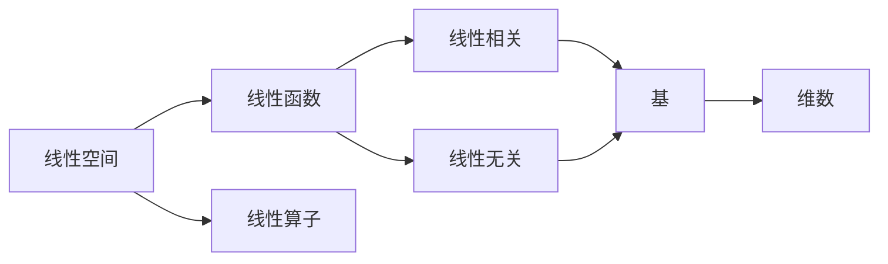

# 线性代数导引：三元实线性函数与实线性算子

关键词：线性代数，线性函数，线性算子，线性空间，向量空间，线性变换，线性相关，线性无关，基，维数，矩阵，行列式，特征值，特征向量

## 1. 背景介绍
### 1.1  问题的由来
线性代数是数学的一个重要分支，它研究线性方程组、矩阵、向量空间、线性变换等概念和相关性质。线性代数在现代科学和工程中有着广泛的应用，尤其是在计算机科学、人工智能、机器学习、图形学、计算物理等领域。

### 1.2  研究现状
目前，线性代数已经发展成为一门成熟的数学学科，其理论体系日趋完善。同时，随着计算机技术的发展，线性代数的应用领域不断扩大，如大数据分析、图像处理、自然语言处理等。许多高效的线性代数算法也被开发出来，如矩阵分解算法、迭代算法等。

### 1.3  研究意义
深入理解和掌握线性代数的基本概念和方法，对于学习和应用计算机科学、人工智能等相关领域具有重要意义。通过学习线性代数，可以培养抽象思维和逻辑推理能力，提高问题分析和建模的能力。

### 1.4  本文结构
本文将围绕三元实线性函数和实线性算子这两个核心概念展开讨论。首先介绍相关的基本概念，然后给出核心算法原理和具体步骤。接着通过数学模型和公式进行详细讲解和举例说明。最后结合实际编程项目，给出代码实例和详细解释。

## 2. 核心概念与联系
- 线性空间：定义在数域 $\mathbb{F}$ 上的一个非空集合 $V$，若 $V$ 对于数域 $\mathbb{F}$ 上的加法和数乘运算封闭，则称 $V$ 是数域 $\mathbb{F}$ 上的一个线性空间（或向量空间）。
- 线性函数：设 $V$ 是数域 $\mathbb{F}$ 上的线性空间，$f$ 是 $V$ 到 $\mathbb{F}$ 的一个函数，若对任意 $\alpha,\beta\in\mathbb{F}$ 和 $x,y\in V$，都有 $f(\alpha x+\beta y)=\alpha f(x)+\beta f(y)$，则称 $f$ 是 $V$ 上的一个线性函数。
- 线性算子：设 $V,W$ 是数域 $\mathbb{F}$ 上的线性空间，$\mathcal{L}$ 是 $V$ 到 $W$ 的一个映射，若对任意 $\alpha,\beta\in\mathbb{F}$ 和 $x,y\in V$，都有 $\mathcal{L}(\alpha x+\beta y)=\alpha \mathcal{L}(x)+\beta \mathcal{L}(y)$，则称 $\mathcal{L}$ 是从 $V$ 到 $W$ 的一个线性算子。
- 线性相关：若向量组 $\{\alpha_1,\alpha_2,\cdots,\alpha_n\}$ 中存在不全为零的数 $k_1,k_2,\cdots,k_n$，使得 $k_1\alpha_1+k_2\alpha_2+\cdots+k_n\alpha_n=0$，则称向量组 $\{\alpha_1,\alpha_2,\cdots,\alpha_n\}$ 线性相关。
- 线性无关：若向量组 $\{\alpha_1,\alpha_2,\cdots,\alpha_n\}$ 中 $k_1\alpha_1+k_2\alpha_2+\cdots+k_n\alpha_n=0$ 成立当且仅当 $k_1=k_2=\cdots=k_n=0$ 时，则称向量组 $\{\alpha_1,\alpha_2,\cdots,\alpha_n\}$ 线性无关。
- 基：向量空间 $V$ 的一个线性无关向量组，如果它的极大线性无关组，就称为 $V$ 的一个基。
- 维数：向量空间 $V$ 的一个基中所含向量的个数称为 $V$ 的维数，记为 $\mathrm{dim}V$。有限维向量空间的维数是有限的，无限维向量空间的维数是无限的。

下面是这些核心概念之间的联系的 Mermaid 流程图：

## 3. 核心算法原理 & 具体操作步骤
### 3.1  算法原理概述
三元实线性函数和实线性算子的核心算法原理是基于线性代数的基本定理和性质。通过构造合适的基，利用线性变换和矩阵的性质，可以将复杂的线性问题转化为简单的矩阵运算问题。

### 3.2  算法步骤详解
1. 确定线性空间 $V$ 和 $W$，明确其上的运算规则。
2. 构造线性空间 $V$ 和 $W$ 的一组基 $\{\alpha_1,\alpha_2,\cdots,\alpha_n\}$ 和 $\{\beta_1,\beta_2,\cdots,\beta_m\}$。
3. 对于三元实线性函数 $f:V\rightarrow\mathbb{R}$，可以将其表示为 $f(x)=a_1f(\alpha_1)+a_2f(\alpha_2)+\cdots+a_nf(\alpha_n)$，其中 $a_1,a_2,\cdots,a_n$ 是实数。
4. 对于实线性算子 $\mathcal{L}:V\rightarrow W$，可以将其表示为矩阵 $A=(a_{ij})_{m\times n}$，其中 $a_{ij}=f_j(\mathcal{L}(\alpha_i))$，$f_j$ 是 $W$ 上的线性函数，满足 $f_j(\beta_k)=\delta_{jk}$（$\delta_{jk}$ 为克罗内克函数）。
5. 利用矩阵的运算性质，如加法、数乘、乘法、转置、行列式、特征值、特征向量等，对线性函数和线性算子进行分析和计算。
6. 根据计算结果，得到线性函数和线性算子的性质，如值域、核空间、不变子空间、特征值、特征向量等。

### 3.3  算法优缺点
优点：
- 通过线性代数的理论和方法，可以将复杂的线性问题转化为简单的矩阵运算问题，便于理解和计算。
- 线性代数的算法成熟，有许多高效的数值计算方法，如矩阵分解、迭代算法等。
- 线性代数的理论体系完善，有许多重要的定理和性质，如基本定理、维数定理、特征值定理等，为算法提供了坚实的理论基础。

缺点：
- 线性代数的理论和方法相对抽象，需要一定的数学基础和抽象思维能力。
- 在实际应用中，许多问题是非线性的，需要进行线性化处理，可能会引入误差。
- 对于大规模的线性问题，矩阵运算的计算量较大，需要高性能的计算机和算法优化。

### 3.4  算法应用领域
三元实线性函数和实线性算子的算法在许多领域有着广泛的应用，如：
- 计算机图形学：如三维空间的坐标变换、投影变换等。
- 计算物理：如量子力学中的线性算符、薛定谔方程等。
- 信号处理：如傅里叶变换、小波变换等。
- 数值分析：如线性方程组的求解、特征值问题等。
- 机器学习：如主成分分析、支持向量机等。

## 4. 数学模型和公式 & 详细讲解 & 举例说明
### 4.1  数学模型构建
考虑三元实线性函数 $f:\mathbb{R}^3\rightarrow\mathbb{R}$，其数学模型可以表示为：

$$
f(x,y,z)=ax+by+cz
$$

其中，$a,b,c$ 是实数，$(x,y,z)\in\mathbb{R}^3$。

考虑实线性算子 $\mathcal{L}:\mathbb{R}^n\rightarrow\mathbb{R}^m$，其数学模型可以表示为：

$$
\mathcal{L}(x)=Ax
$$

其中，$A$ 是一个 $m\times n$ 的实矩阵，$x\in\mathbb{R}^n$。

### 4.2  公式推导过程
对于三元实线性函数 $f(x,y,z)=ax+by+cz$，可以利用线性函数的性质进行推导：

$$
\begin{aligned}
f(x_1+x_2,y_1+y_2,z_1+z_2)&=a(x_1+x_2)+b(y_1+y_2)+c(z_1+z_2)\\
&=ax_1+ax_2+by_1+by_2+cz_1+cz_2\\
&=f(x_1,y_1,z_1)+f(x_2,y_2,z_2)
\end{aligned}
$$

$$
\begin{aligned}
f(kx,ky,kz)&=a(kx)+b(ky)+c(kz)\\
&=k(ax+by+cz)\\
&=kf(x,y,z)
\end{aligned}
$$

对于实线性算子 $\mathcal{L}(x)=Ax$，可以利用矩阵乘法的性质进行推导：

$$
\begin{aligned}
\mathcal{L}(x+y)&=A(x+y)\\
&=Ax+Ay\\
&=\mathcal{L}(x)+\mathcal{L}(y)
\end{aligned}
$$

$$
\begin{aligned}
\mathcal{L}(kx)&=A(kx)\\
&=k(Ax)\\
&=k\mathcal{L}(x)
\end{aligned}
$$

### 4.3  案例分析与讲解
考虑三元实线性函数 $f(x,y,z)=2x-3y+z$，求 $f(1,2,3)$ 的值。

解：将 $(1,2,3)$ 代入函数表达式，得到：

$$
f(1,2,3)=2\times1-3\times2+3=2-6+3=-1
$$

因此，$f(1,2,3)=-1$。

考虑实线性算子 $\mathcal{L}:\mathbb{R}^2\rightarrow\mathbb{R}^3$，其矩阵表示为：

$$
A=\begin{pmatrix}
1 & 2\\
-1 & 1\\
0 & 1
\end{pmatrix}
$$

求 $\mathcal{L}(1,2)$ 的值。

解：将 $(1,2)$ 代入矩阵乘法，得到：

$$
\mathcal{L}(1,2)=A\begin{pmatrix}
1\\
2
\end{pmatrix}=\begin{pmatrix}
1 & 2\\
-1 & 1\\
0 & 1
\end{pmatrix}\begin{pmatrix}
1\\
2
\end{pmatrix}=\begin{pmatrix}
5\\
1\\
2
\end{pmatrix}
$$

因此，$\mathcal{L}(1,2)=(5,1,2)$。

### 4.4  常见问题解答
问题1：三元实线性函数和实线性算子有什么区别？

答：三元实线性函数是定义在三维实向量空间上的线性函数，其值域是实数域；而实线性算子是定义在任意有限维实向量空间上的线性映射，其值域是另一个实向量空间。从数学模型上看，三元实线性函数可以用一个三元一次多项式表示，而实线性算子可以用一个矩阵表示。

问题2：线性函数和线性算子的线性性质有哪些？

答：线性函数和线性算子都满足加法和数乘的线性性质，即：
- 对于任意向量 $x,y$，有 $f(x+y)=f(x)+f(y)$，$\mathcal{L}(x+y)=\mathcal{L}(x)+\mathcal{L}(y)$。
- 对于任意向量 $x$ 和标量 $k$，有 $f(kx)=kf(x)$，$\mathcal{L}(kx)=k\mathcal{L}(x)$。

这两个性质保证了线性函数和线性算子在向量的线性组合运算下是封闭的，即向量的线性组合的像仍然是向量的线性组合。

## 5