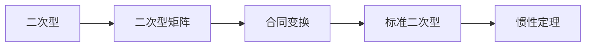

# 线性代数导引：二次型标准化方法

关键词：线性代数、二次型、标准化、配方法、正交变换法、初等变换法

## 1. 背景介绍
### 1.1 问题的由来
在线性代数中，二次型是一个非常重要的概念，它在几何学、物理学、统计学等领域都有广泛的应用。二次型的标准化问题一直是线性代数研究的热点问题之一，如何将一个一般的二次型化为标准形，是线性代数中的一个基本问题。

### 1.2 研究现状
目前，关于二次型标准化的方法主要有配方法、正交变换法和初等变换法等。其中配方法是最常用的一种方法，它利用二次型矩阵的特征值和特征向量来对二次型进行标准化。正交变换法是利用正交变换来对二次型进行标准化。而初等变换法则是通过初等行变换和初等列变换来实现标准化。

### 1.3 研究意义
二次型标准化在理论和应用上都有重要意义。通过标准化，可以简化二次型的形式，揭示二次型的本质特征，为进一步的分析和计算提供便利。同时，标准化后的二次型在几何上有明确的意义，如椭圆、双曲线、抛物线等。因此，深入研究二次型标准化方法具有重要的理论价值和实践意义。

### 1.4 本文结构
本文将重点介绍二次型标准化的三种主要方法：配方法、正交变换法和初等变换法。首先给出二次型及其标准形的定义，然后详细讲解三种方法的原理和步骤，并通过具体的例子来加以说明。同时，探讨不同方法的优缺点和适用范围。最后，总结全文并展望二次型标准化研究的发展趋势和面临的挑战。

## 2. 核心概念与联系
- 二次型：$n$个变量$x_1,x_2,\cdots,x_n$的二次齐次多项式称为$n$元二次型，一般形式为：

$$f(x_1,x_2,\cdots,x_n)=\sum_{i=1}^n\sum_{j=1}^na_{ij}x_ix_j$$

其中$a_{ij}$是常数，$a_{ij}=a_{ji}$。

- 二次型矩阵：由二次型的系数$a_{ij}$组成的矩阵$A=(a_{ij})_{n\times n}$称为二次型矩阵，显然$A$是一个对称矩阵。

- 标准二次型：形如$f=x_1^2+x_2^2+\cdots+x_p^2-x_{p+1}^2-\cdots-x_{p+q}^2$的二次型称为标准二次型，其中$p$为正惯性指数，$q$为负惯性指数，$r=n-p-q$为零惯性指数。

- 合同：设$A,B$是两个$n$级实对称矩阵，如果存在一个可逆矩阵$P$，使得$P^TAP=B$，则称矩阵$A$与$B$合同，记为$A\sim B$。

- 正定二次型：如果对任意不全为零的列向量$\alpha$，都有$\alpha^TA\alpha>0$，则称二次型$f$（或其矩阵$A$）正定。

二次型与其矩阵之间有着密切的联系，对二次型进行标准化的实质就是对其矩阵进行合同变换。下图给出了二次型、二次型矩阵以及标准化之间的逻辑关系：

## 3. 核心算法原理 & 具体操作步骤
### 3.1 算法原理概述
对二次型进行标准化的核心思想是通过坐标变换，将一般的二次型化为标准形。常用的方法有配方法、正交变换法和初等变换法。其中：
- 配方法利用二次型矩阵的特征值和特征向量来对角化矩阵，从而得到标准形。
- 正交变换法通过正交变换将二次型矩阵变为对角矩阵，进而得到标准形。
- 初等变换法则是利用初等行、列变换来化简二次型，最终得到标准形。

### 3.2 算法步骤详解
下面以配方法为例，详细介绍二次型标准化的步骤。

设$n$元二次型$f=\mathbf{x}^TA\mathbf{x}$，其中$A$为实对称矩阵，则可以通过以下步骤将其化为标准形：

Step1. 求矩阵$A$的特征值$\lambda_1,\lambda_2,\cdots,\lambda_n$和相应的特征向量$\alpha_1,\alpha_2,\cdots,\alpha_n$。

Step2. 将特征向量$\alpha_1,\alpha_2,\cdots,\alpha_n$按列排成矩阵$P$，则$P$为正交矩阵，满足$P^{-1}=P^T$。

Step3. 令$\mathbf{y}=P^T\mathbf{x}$，则原二次型$f=\mathbf{x}^TA\mathbf{x}$可以变换为
$$\begin{aligned}
f&=\mathbf{x}^TA\mathbf{x}\\
&=(P\mathbf{y})^TA(P\mathbf{y})\\
&=\mathbf{y}^T(P^TAP)\mathbf{y}\\
&=\mathbf{y}^T\text{diag}(\lambda_1,\lambda_2,\cdots,\lambda_n)\mathbf{y}\\
&=\lambda_1y_1^2+\lambda_2y_2^2+\cdots+\lambda_ny_n^2
\end{aligned}$$

这就得到了标准二次型。

Step4. 将标准二次型中的系数按照正、负、零的顺序排列，就得到了标准二次型的规范形式：

$$f=z_1^2+z_2^2+\cdots+z_p^2-z_{p+1}^2-\cdots-z_{p+q}^2$$

其中$p$为正惯性指数，$q$为负惯性指数，$r=n-p-q$为零惯性指数。

### 3.3 算法优缺点
配方法的优点是思路清晰，计算简单，且能够直接得到标准形的规范形式。但是其缺点是需要计算矩阵的特征值和特征向量，当矩阵的阶数较高时，计算量会比较大。

正交变换法的优点是计算量相对较小，且能够保持矩阵的正交性。但缺点是不能直接得到规范形式，需要进一步调整。

初等变换法的优点是计算简单，容易理解和操作。但缺点是不能直接得到规范形式，且可能会破坏矩阵的对称性，需要进一步处理。

### 3.4 算法应用领域
二次型标准化在许多领域都有重要应用，如：
- 在解析几何中，二次曲线和二次曲面的标准方程都可以通过二次型的标准化得到。
- 在最优化理论中，凸二次规划问题常常需要通过二次型标准化来化简目标函数和约束条件。
- 在统计学中，主成分分析、因子分析等都涉及到二次型的标准化问题。
- 在力学中，惯性矩、应变能等物理量的计算也需要用到二次型标准化的方法。

## 4. 数学模型和公式 & 详细讲解 & 举例说明
### 4.1 数学模型构建
考虑一个$n$元二次型$f=\mathbf{x}^TA\mathbf{x}$，其中$\mathbf{x}=(x_1,x_2,\cdots,x_n)^T$是$n$维列向量，$A$是$n$阶实对称矩阵。我们的目标是找到一个线性变换$\mathbf{x}=P\mathbf{y}$，使得二次型$f$在新的坐标系$\mathbf{y}$下化为标准形：

$$\begin{aligned}
f&=\mathbf{y}^T(P^TAP)\mathbf{y}\\
&=\lambda_1y_1^2+\lambda_2y_2^2+\cdots+\lambda_ny_n^2
\end{aligned}$$

其中$\lambda_1,\lambda_2,\cdots,\lambda_n$为矩阵$A$的特征值，$P$为由$A$的特征向量构成的正交矩阵。

### 4.2 公式推导过程
为了得到标准形，我们需要对矩阵$A$进行对角化。由于$A$是实对称矩阵，因此它一定正交相似于一个对角矩阵，即存在正交矩阵$P$使得

$$P^TAP=\text{diag}(\lambda_1,\lambda_2,\cdots,\lambda_n)$$

其中$\lambda_1,\lambda_2,\cdots,\lambda_n$为$A$的特征值。

设$\alpha_1,\alpha_2,\cdots,\alpha_n$是矩阵$A$的特征向量，满足

$$A\alpha_i=\lambda_i\alpha_i,\quad i=1,2,\cdots,n$$

将特征向量$\alpha_1,\alpha_2,\cdots,\alpha_n$按列排成矩阵$P=(\alpha_1,\alpha_2,\cdots,\alpha_n)$，则$P$为正交矩阵，满足$P^{-1}=P^T$。

作线性变换$\mathbf{x}=P\mathbf{y}$，则原二次型$f=\mathbf{x}^TA\mathbf{x}$可以化为

$$\begin{aligned}
f&=\mathbf{x}^TA\mathbf{x}\\
&=(P\mathbf{y})^TA(P\mathbf{y})\\
&=\mathbf{y}^T(P^TAP)\mathbf{y}\\
&=\mathbf{y}^T\text{diag}(\lambda_1,\lambda_2,\cdots,\lambda_n)\mathbf{y}\\
&=\lambda_1y_1^2+\lambda_2y_2^2+\cdots+\lambda_ny_n^2
\end{aligned}$$

这就得到了标准形。

### 4.3 案例分析与讲解
下面我们通过一个具体的例子来说明二次型标准化的过程。

考虑二次型$f=2x_1^2+2x_2^2-2x_3^2+4x_1x_2-8x_2x_3$，试将其化为标准形。

解：首先写出二次型矩阵

$$A=\begin{pmatrix}
2 & 2 & 0\\ 
2 & 2 & -4\\
0 & -4 & -2
\end{pmatrix}$$

求矩阵$A$的特征值和特征向量，得到

$$\lambda_1=6,\quad \lambda_2=2,\quad \lambda_3=-4$$

$$\alpha_1=\begin{pmatrix}
1\\ 
1\\
1
\end{pmatrix},\quad 
\alpha_2=\begin{pmatrix}
1\\ 
1\\
-2
\end{pmatrix},\quad
\alpha_3=\begin{pmatrix}
1\\ 
-1\\
0
\end{pmatrix}$$

构造正交矩阵

$$P=\frac{1}{\sqrt{3}}\begin{pmatrix}
1 & 1 & 1\\ 
1 & 1 & -1\\
1 & -2 & 0
\end{pmatrix}$$

作变换$\mathbf{y}=P^T\mathbf{x}$，得到

$$\begin{aligned}
f&=\mathbf{x}^TA\mathbf{x}\\
&=(P\mathbf{y})^TA(P\mathbf{y})\\
&=\mathbf{y}^T(P^TAP)\mathbf{y}\\
&=\mathbf{y}^T\text{diag}(6,2,-4)\mathbf{y}\\
&=6y_1^2+2y_2^2-4y_3^2
\end{aligned}$$

令$z_1=\sqrt{6}y_1,z_2=\sqrt{2}y_2,z_3=\sqrt{4}y_3$，得到标准二次型的规范形式

$$f=z_1^2+z_2^2-z_3^2$$

因此，原二次型的正惯性指数为2，负惯性指数为1，零惯性指数为0。

### 4.4 常见问题解答
Q: 对于任意的二次型，是否都可以化为标准形？
A: 是的，任何实二次型都可以通过配方法、正交变换法或初等变换法化为标准形。这是因为实对称矩阵都正交相似于对角矩阵。

Q: 标准二次型的惯