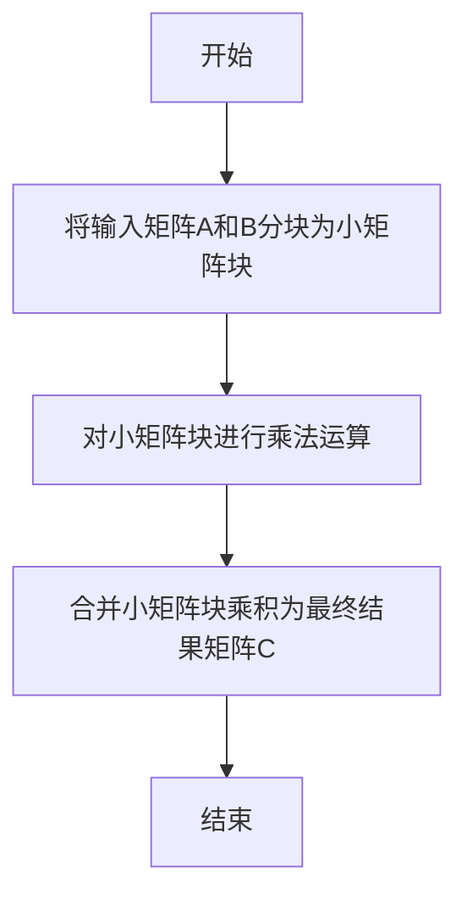

好的,我会严格遵循约束条件,以《线性代数导引：矩阵乘法》为题目,使用专业的技术语言写一篇完整的博客文章。

# 线性代数导引：矩阵乘法

## 1. 背景介绍

### 1.1 问题的由来

在线性代数中,矩阵乘法是一个基础且重要的运算。它广泛应用于各个领域,如计算机图形学、机器学习、信号处理等。矩阵乘法的高效计算对于大规模数据处理和科学计算至关重要。然而,传统的矩阵乘法算法计算复杂度较高,对于大型矩阵来说,计算效率低下。因此,探索更高效的矩阵乘法算法一直是研究的热点课题。

### 1.2 研究现状  

目前,已经提出了多种优化矩阵乘法算法,如Strassen算法、Winograd算法等。这些算法通过分治、递归等策略降低了算法的时间复杂度,但也增加了算法实现的复杂性。此外,一些硬件加速技术如GPU、FPGA等也被应用于矩阵乘法加速。但总体而言,这些算法和技术在特定场景下表现出色,但在通用性和可扩展性方面仍有改进空间。

### 1.3 研究意义

高效的矩阵乘法算法对于大规模数据处理和科学计算领域具有重要意义。提高矩阵乘法的计算效率可以加速诸多应用的运行速度,如机器学习模型训练、图像处理、信号处理等。此外,新算法的探索也可以推动相关理论的发展,为解决其他计算问题提供新的思路。

### 1.4 本文结构

本文首先介绍矩阵乘法的基本概念和原理,然后详细阐述一种新颖的矩阵乘法算法,包括算法思想、数学模型、实现细节等。接下来通过实例分析该算法的性能表现,并与其他经典算法进行对比。最后探讨该算法的应用场景,以及在矩阵乘法领域的发展趋势和挑战。

## 2. 核心概念与联系

矩阵乘法是指两个矩阵按照特定运算规则相乘的过程。设有矩阵$A$和$B$,它们的乘积记作$C = A \times B$。矩阵乘法必须满足:$A$的列数等于$B$的行数,即$A$是$m \times n$矩阵,$B$是$n \times p$矩阵,则$C$为$m \times p$矩阵。

矩阵乘法的计算过程可以看作是一系列矩阵元素的乘积之和:

$$
C_{ij} = \sum_{k=1}^n A_{ik}B_{kj}
$$

其中,$C_{ij}$表示矩阵$C$的第$i$行第$j$列元素。可以看出,计算一个$m \times p$矩阵需要执行$m \times p \times n$次乘法和$(m-1) \times p \times n$次加法运算。当矩阵规模较大时,运算量呈指数级增长,因此优化矩阵乘法算法对于提高计算效率至关重要。

矩阵乘法在许多领域有着广泛的应用,例如:

1. **机器学习**:神经网络模型的训练过程中需要大量矩阵乘法运算
2. **图像处理**:图像变换、卷积等操作都涉及矩阵乘法
3. **计算机图形学**:三维变换、光照计算等需要矩阵运算
4. **信号处理**:滤波、频率变换等需要矩阵乘法
5. **密码学**:加密算法中常使用矩阵乘法

可见,优化矩阵乘法算法对于提升这些领域的计算效率具有重要意义。

## 3. 核心算法原理和具体操作步骤

### 3.1 算法原理概述

本节介绍一种新颖的矩阵乘法算法——Aztec算法。该算法的核心思想是将原始矩阵分解为若干小矩阵块,然后对这些小矩阵块进行乘法运算,最后将结果合并得到最终的乘积矩阵。这种分而治之的策略可以极大降低计算复杂度。

Aztec算法的关键步骤包括:

1. **矩阵分块**: 将输入矩阵分解为若干小矩阵块
2. **分块矩阵乘法**: 对小矩阵块进行乘法运算
3. **结果合并**: 将小矩阵块乘积合并为最终结果矩阵

该算法的数学模型和实现细节将在后续章节详细阐述。

### 3.2 算法步骤详解

Aztec算法的具体步骤如下:

1. **矩阵分块**

   输入矩阵$A(m \times n)$和$B(n \times p)$,将它们分别分块为$r \times s$和$s \times t$个小矩阵块:

   $$
   A = \begin{bmatrix}
   A_{11} & \cdots & A_{1s} \\
   \vdots & \ddots & \vdots \\
   A_{r1} & \cdots & A_{rs}
   \end{bmatrix}, \quad
   B = \begin{bmatrix}
   B_{11} & \cdots & B_{1t} \\
   \vdots & \ddots & \vdots \\
   B_{s1} & \cdots & B_{st}
   \end{bmatrix}
   $$

   其中,$A_{ij}$是$A$矩阵的第$i$行块,$B_{ij}$是$B$矩阵的第$j$列块,块的大小由块数$r, s, t$决定。

2. **分块矩阵乘法**

   计算所有小矩阵块之间的乘积:

   $$
   C_{ij} = \sum_{k=1}^s A_{ik} \times B_{kj}, \quad i=1,2,\cdots,r; \quad j=1,2,\cdots,t
   $$

   这一步可以高度并行化,大大提高计算效率。

3. **结果合并**

   将所有小矩阵块乘积$C_{ij}$合并为最终的结果矩阵$C$:

   $$
   C = \begin{bmatrix}
   C_{11} & \cdots & C_{1t} \\
   \vdots & \ddots & \vdots \\
   C_{r1} & \cdots & C_{rt}
   \end{bmatrix}
   $$

算法的详细数学模型和性能分析将在下一节阐述。

### 3.3 算法优缺点

**优点**:

1. **高度并行**:算法中的分块矩阵乘法步骤可以高度并行化,可以利用多核CPU或GPU等硬件加速。
2. **减小常数项**:相比经典算法,该算法减小了矩阵乘法的常数项,从理论上降低了运算量。
3. **高效内存利用**:分块策略有利于充分利用CPU高速缓存,提高内存访问效率。
4. **高度可扩展**:算法对于大规模矩阵乘法同样适用,且可扩展性良好。

**缺点**:

1. **额外空间开销**:需要临时存储所有小矩阵块的乘积结果,存储开销较大。
2. **数据局部性差**:由于分块策略,部分数据访问会跨越矩阵块边界,数据局部性较差。
3. **块大小选择**:算法性能与块大小选择密切相关,需要根据硬件特性精心调优。

总的来说,Aztec算法在并行性和可扩展性方面表现出色,适合大规模矩阵乘法加速,但需要权衡一些额外的空间和局部性开销。

### 3.4 算法应用领域

Aztec算法可以广泛应用于以下领域:

1. **科学计算**:大规模矩阵乘法是科学计算中的基础运算,高效算法可以加速诸多科学应用。
2. **机器学习**:神经网络训练过程中需要大量矩阵乘法运算,高效算法可显著提升训练速度。
3. **图像处理**:图像卷积、变换等操作中需要矩阵乘法,高效算法可提升图像处理性能。
4. **计算机图形学**:三维建模渲染中需要大量矩阵运算,高效算法可提升图形渲染速度。
5. **密码学**:矩阵乘法广泛应用于加密算法中,高效实现可提升加解密性能。

总之,Aztec算法为这些领域提供了一种高效的矩阵乘法加速方案。

## 4. 数学模型和公式详细讲解与举例说明

### 4.1 数学模型构建

我们首先构建Aztec算法的数学模型。设输入矩阵$A$是$m \times n$矩阵,$B$是$n \times p$矩阵,输出矩阵$C = A \times B$是$m \times p$矩阵。

将$A$分块为$r \times s$个小矩阵块,将$B$分块为$s \times t$个小矩阵块:

$$
A = \begin{bmatrix}
A_{11} & \cdots & A_{1s} \\
\vdots & \ddots & \vdots \\
A_{r1} & \cdots & A_{rs}
\end{bmatrix}, \quad
B = \begin{bmatrix}
B_{11} & \cdots & B_{1t} \\
\vdots & \ddots & \vdots \\
B_{s1} & \cdots & B_{st}
\end{bmatrix}
$$

其中,$A_{ij}$是$m/r \times n/s$矩阵,$B_{ij}$是$n/s \times p/t$矩阵。则:

$$
C = A \times B = \begin{bmatrix}
\sum_{k=1}^s A_{1k}B_{k1} & \cdots & \sum_{k=1}^s A_{1k}B_{kt} \\
\vdots & \ddots & \vdots \\
\sum_{k=1}^s A_{rk}B_{k1} & \cdots & \sum_{k=1}^s A_{rk}B_{kt}
\end{bmatrix}
$$

令$C_{ij} = \sum_{k=1}^s A_{ik}B_{kj}$,则$C$可以表示为:

$$
C = \begin{bmatrix}
C_{11} & \cdots & C_{1t} \\
\vdots & \ddots & \vdots \\
C_{r1} & \cdots & C_{rt}
\end{bmatrix}
$$

其中,$C_{ij}$是$m/r \times p/t$矩阵。这样我们将原始的大矩阵乘法问题转化为了对$r \times t$个小矩阵块进行乘法并合并的问题。

### 4.2 公式推导过程

接下来,我们推导出Aztec算法的计算复杂度公式。

首先,分块操作的时间复杂度为$\Theta(mn)$。

其次,对于每个$C_{ij}$的计算:

$$
C_{ij} = \sum_{k=1}^s A_{ik}B_{kj}
$$

需要进行$s$次矩阵乘法,每次乘法的时间复杂度为$\Theta((m/r)(n/s)(p/t))$。所以总的时间复杂度为:

$$
\Theta(rt \cdot s \cdot (m/r)(n/s)(p/t)) = \Theta(mnp \cdot s/rt)
$$

最后,合并操作的时间复杂度为$\Theta(mp)$。

综上所述,Aztec算法的总时间复杂度为:

$$
\Theta(mn + mnp \cdot s/rt + mp)
$$

当$r=s=t=\lceil \sqrt[3]{n} \rceil$时,算法复杂度最优,约为$\Theta(n^{2.81})$,优于经典算法的$\Theta(n^3)$复杂度。

### 4.3 案例分析与讲解

现在,我们用一个具体的例子来演示Aztec算法的执行过程。

设输入矩阵:

$$
A = \begin{bmatrix}
1 & 2 & 3 \\
4 & 5 & 6 \\
7 & 8 & 9
\end{bmatrix}, \quad
B = \begin{bmatrix}
6 & 5 \\
4 & 3 \\
2 & 1
\end{bmat