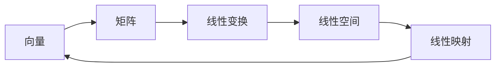

# 线性代数导引：表达式及其语义解释

关键词：线性代数、矩阵、向量、线性变换、特征值、特征向量、线性空间、线性映射、线性方程组

## 1. 背景介绍
### 1.1  问题的由来
线性代数是数学的一个重要分支,在科学和工程领域有着广泛的应用。从物理学到计算机科学,从经济学到生物学,线性代数无处不在。作为一名程序员或软件工程师,深入理解线性代数的基本概念和原理,对于开发高质量的科学计算和机器学习程序至关重要。

### 1.2  研究现状
目前,线性代数在计算机科学领域的应用主要集中在以下几个方面:
- 图形学:线性代数被广泛用于3D图形变换、投影、光照等计算。
- 机器学习:很多机器学习算法如主成分分析(PCA)、支持向量机(SVM)等都基于线性代数。  
- 数值计算:求解线性方程组、特征值分解、奇异值分解等都需要用到线性代数知识。
- 计算机视觉:图像处理、模式识别等领域也离不开线性代数的支持。

### 1.3  研究意义
作为一名程序员,深入学习和掌握线性代数,可以:
- 加深对算法的理解,写出更高效、健壮的代码
- 为进一步学习机器学习、深度学习打下坚实的数学基础  
- 拓宽解决问题的思路,提升抽象思维和逻辑推理能力
- 有能力去阅读和理解前沿的论文,跟上学科发展的脚步

### 1.4  本文结构
本文将从以下几个方面来系统地讲解线性代数的核心概念: 
- 向量和矩阵的基本概念和运算
- 线性方程组的求解  
- 向量空间和子空间
- 线性变换和矩阵
- 特征值和特征向量
- 二次型和矩阵的对角化

## 2. 核心概念与联系
线性代数的核心概念包括:向量、矩阵、线性变换、线性空间、线性映射等。它们之间的关系可以用下面的 Mermaid 图来表示:



- 向量是线性代数中的基本元素,可以看作是矩阵的特殊形式。
- 矩阵是向量的推广,多个向量按照一定的方式排列形成矩阵。 
- 线性变换可以用矩阵来表示,矩阵乘以向量可以实现线性变换。
- 线性空间是满足加法和数乘封闭性的向量集合,向量空间是线性代数的核心。
- 线性映射是线性空间之间的变换,保持线性组合不变。

## 3. 核心算法原理 & 具体操作步骤
### 3.1  算法原理概述
高斯消元法是线性代数中最基本也是最重要的算法之一,它用于求解线性方程组。高斯消元法的基本思想是:通过初等行变换,将线性方程组的增广矩阵变为行最简形矩阵,从而求解线性方程组。

### 3.2  算法步骤详解
高斯消元法的具体步骤如下:
1. 构造增广矩阵:将线性方程组的系数矩阵和常数列并排放在一起,形成增广矩阵。  
2. 选主元:选择绝对值最大的元素作为主元,必要时对矩阵的行进行交换。
3. 消元:用主元所在的行去消去其他行对应列的元素。重复此步骤,直到矩阵变成上三角形。
4. 回代求解:从最后一个未知数开始,逐个求解出线性方程组的解。

### 3.3  算法优缺点
高斯消元法的优点是:
- 原理简单,容易理解和实现。
- 计算过程规范,易于编程实现。
- 对于一般的线性方程组,高斯消元法是最常用、最有效的直接解法。

高斯消元法的缺点是:  
- 需要大量的浮点运算,舍入误差会逐步累积。
- 算法的并行性不够好,不太适合在并行计算机上实现。
- 对于病态矩阵,高斯消元算法可能不稳定。

### 3.4  算法应用领域
高斯消元法在许多领域都有重要应用,如:
- 解线性方程组、计算矩阵的逆等。
- 计算电路的节点电压。
- 求解最小二乘问题,用于数据拟合。
- 计算机图形学中的坐标变换等。

## 4. 数学模型和公式 & 详细讲解 & 举例说明
### 4.1  数学模型构建
对于线性方程组:

$$
\left\{
\begin{aligned}
a_{11}x_1 + a_{12}x_2 + \cdots + a_{1n}x_n = b_1 \\
a_{21}x_1 + a_{22}x_2 + \cdots + a_{2n}x_n = b_2 \\
\cdots \\
a_{m1}x_1 + a_{m2}x_2 + \cdots + a_{mn}x_n = b_m
\end{aligned}
\right.
$$

可以构造系数矩阵 $A$ 和常数列 $b$:

$$
A = 
\begin{bmatrix} 
a_{11} & a_{12} & \cdots & a_{1n} \\
a_{21} & a_{22} & \cdots & a_{2n} \\
\vdots & \vdots & \ddots & \vdots \\
a_{m1} & a_{m2} & \cdots & a_{mn} 
\end{bmatrix}
,\quad
b = 
\begin{bmatrix}
b_1 \\ b_2 \\ \vdots \\ b_m
\end{bmatrix}
$$

将它们并排放在一起,形成增广矩阵 $[A|b]$:

$$
[A|b] = 
\left[
\begin{array}{cccc|c} 
a_{11} & a_{12} & \cdots & a_{1n} & b_1 \\
a_{21} & a_{22} & \cdots & a_{2n} & b_2 \\
\vdots & \vdots & \ddots & \vdots & \vdots \\
a_{m1} & a_{m2} & \cdots & a_{mn} & b_m
\end{array}
\right]
$$

### 4.2  公式推导过程
高斯消元法的数学本质是:通过初等行变换,将增广矩阵化为行最简形,从而求解线性方程组。

设线性方程组的增广矩阵为 $[A|b]$,经过高斯消元后得到的行最简形为 $[B|c]$。根据矩阵等价的定义,存在一个可逆矩阵 $P$,使得:

$$
P[A|b] = [B|c]
$$

将其写成分块矩阵的形式:

$$
[PA|Pb] = [B|c]
$$

由于 $P$ 可逆,等式两边同时乘以 $P^{-1}$,得到:

$$
[A|b] = P^{-1}[B|c]
$$

这就证明了高斯消元的正确性。我们只需要对增广矩阵做初等行变换,化为行最简形,就可以得到线性方程组的解。

### 4.3  案例分析与讲解
下面我们用一个实际的例子来说明高斯消元法的具体步骤。

考虑如下线性方程组:

$$
\left\{
\begin{aligned}
2x_1 + x_2 + 3x_3 = 6 \\
x_1 + 3x_2 + x_3 = 4 \\  
3x_1 + x_2 + 2x_3 = 7
\end{aligned}
\right.
$$

首先构造增广矩阵:

$$
\left[
\begin{array}{ccc|c}
2 & 1 & 3 & 6 \\
1 & 3 & 1 & 4 \\ 
3 & 1 & 2 & 7
\end{array}
\right]
$$

然后进行高斯消元的步骤:
1. 用第一行消去第二行和第三行的第一列元素:

$$
\left[
\begin{array}{ccc|c}
2 & 1 & 3 & 6 \\
0 & \frac{5}{2} & -\frac{1}{2} & 1 \\
0 & -\frac{1}{2} & -\frac{7}{2} & -2
\end{array}
\right]
$$

2. 用第二行消去第三行的第二列元素:

$$
\left[
\begin{array}{ccc|c}
2 & 1 & 3 & 6 \\
0 & \frac{5}{2} & -\frac{1}{2} & 1 \\
0 & 0 & -\frac{13}{5} & -\frac{11}{5}  
\end{array}
\right]
$$

3. 回代求解:

$$
\begin{aligned}
x_3 &= \frac{11}{13} \\
x_2 &= \frac{1}{5}(1+\frac{1}{2}\cdot\frac{11}{13}) = \frac{2}{5} \\
x_1 &= \frac{1}{2}(6-1\cdot\frac{2}{5}-3\cdot\frac{11}{13}) = 1
\end{aligned}
$$

因此,原线性方程组的解为 $x_1=1,x_2=\frac{2}{5},x_3=\frac{11}{13}$。

### 4.4  常见问题解答
Q:高斯消元法能否求解任意线性方程组?
A:不能。对于无解或有无穷多解的线性方程组,高斯消元法无法求出精确解,但可以判断出线性方程组的解的情况。

Q:如何用高斯消元法求矩阵的逆?
A:对于 $n$ 阶矩阵 $A$,将其与 $n$ 阶单位矩阵 $I$ 并排,构成增广矩阵 $[A|I]$。然后用高斯消元法将增广矩阵化为 $[I|A^{-1}]$ 的形式,右边的矩阵就是 $A$ 的逆矩阵。

Q:高斯消元法的时间复杂度是多少?
A:高斯消元法的时间复杂度是 $O(n^3)$,其中 $n$ 是未知数的个数。这是因为高斯消元法需要进行 $n$ 次消元,每次消元需要 $O(n^2)$ 的时间。

## 5. 项目实践：代码实例和详细解释说明
### 5.1  开发环境搭建
本项目使用 Python 语言,需要安装以下库:
- NumPy:用于数值计算。
- SymPy:用于符号计算。

可以使用 pip 命令安装:

```bash
pip install numpy sympy
```

### 5.2  源代码详细实现
下面是用 Python 实现高斯消元法的代码:

```python
import numpy as np

def gauss_elimination(A, b):
    """
    高斯消元法求解线性方程组 Ax=b
    """
    n = len(b)
    Ab = np.hstack((A, b.reshape(n,1)))
    
    # 消元过程
    for i in range(n):
        # 选主元
        max_row = np.argmax(np.abs(Ab[i:, i])) + i
        Ab[i], Ab[max_row] = Ab[max_row], Ab[i].copy()
        
        # 消元
        pivot = Ab[i, i]
        Ab[i] = Ab[i] / pivot
        for j in range(i+1, n):
            Ab[j] -= Ab[j, i] * Ab[i]
    
    # 回代求解
    x = np.zeros(n)
    for i in range(n-1, -1, -1):
        x[i] = Ab[i, n] - np.dot(Ab[i, i+1:n], x[i+1:n])
        
    return x
```

### 5.3  代码解读与分析
上述代码的关键步骤如下:
1. 将系数矩阵 $A$ 和常数列 $b$ 并排,构造增广矩阵 $Ab$。
2. 对矩阵 $Ab$ 进行消元。外层循环 $i$ 表示当前正在处理的未知数,内层循环 $j$ 表示要被消元的行。
3. 在每一轮消元之前,先找到当前列绝对值最大的行,将其与当前行交换,这称为选主元。这样可以提高数值稳定性。
4. 用当前行的主元(pivot)去消去下面所有行对应