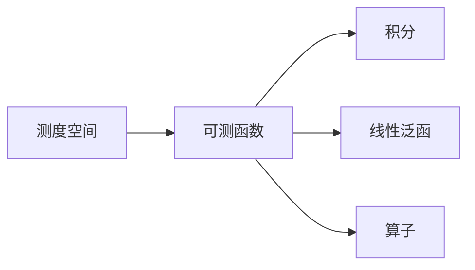

# 线性代数导引：连续统势

关键词：线性代数、连续统、Lebesgue测度、Hilbert空间、谱理论

## 1. 背景介绍
### 1.1  问题的由来
线性代数是数学的一个重要分支,在科学和工程中有着广泛的应用。然而,经典的线性代数理论主要局限于有限维空间。随着科技的发展,人们逐渐意识到有必要将线性代数推广到无限维空间,从而能够更好地处理连续问题。本文将探讨如何将线性代数推广到连续统上,构建连续统势理论。
### 1.2  研究现状
目前,连续统势理论主要基于泛函分析和测度论等数学分支。其中,Lebesgue测度理论为定义连续统上的"体积"提供了基础;Hilbert空间理论使得在无限维空间上进行线性运算成为可能;谱理论则揭示了线性算子的本质特征。这些理论的发展极大地推动了连续统势理论的进步。
### 1.3  研究意义  
连续统势理论不仅具有重要的理论意义,而且在许多应用领域也发挥着关键作用,如量子力学、信号处理、偏微分方程数值求解等。深入研究连续统势理论,对于拓展线性代数的应用范围,促进相关学科的发展具有重要意义。
### 1.4  本文结构
本文将分为以下几个部分:第2节介绍连续统势理论的核心概念;第3节讨论其核心算法原理;第4节给出数学模型和公式;第5节通过代码实例说明其实现方法;第6节探讨其实际应用;第7节推荐相关工具和资源;第8节总结全文,展望未来发展方向。

## 2. 核心概念与联系
连续统势理论的核心概念包括:

- 测度空间(Measure Space):对应经典线性代数中的向量空间,是定义在 $\sigma$ 代数上的非负实值函数。
- 可测函数(Measurable Function):类似于向量,将定义域内的元素映射到实数域或复数域。
- 积分(Integration):推广了有限和的概念,用于度量可测函数的总量。
- 线性泛函(Linear Functional):定义在函数空间上的线性映射,类似于线性变换。
- 算子(Operator):函数空间之间的映射,推广了矩阵的概念。

下图展示了这些概念之间的联系:



## 3. 核心算法原理 & 具体操作步骤
### 3.1  算法原理概述
连续统势理论的核心是将有限维线性代数推广到无限维,其关键是如何在函数空间上定义线性结构。通常采用的方法是利用积分来定义内积,从而赋予函数空间以Hilbert空间结构。在此基础上,可以定义线性泛函、算子等概念,建立起类似有限维情形下的线性理论。
### 3.2  算法步骤详解
1. 选取合适的测度空间 $(X,\mathcal{F},\mu)$,其中 $X$ 为集合, $\mathcal{F}$ 为 $\sigma$ 代数, $\mu$ 为测度。
2. 定义可测函数空间 $L^p(X,\mathcal{F},\mu)$,通常取 $p=2$ 得到Hilbert空间。
3. 利用积分定义内积 $\langle f,g\rangle=\int_X f\overline{g}d\mu$。
4. 验证内积的性质,如共轭对称性、线性性、正定性。
5. 定义范数 $\|f\|=\sqrt{\langle f,f\rangle}$,证明其满足范数的公理。
6. 定义线性泛函 $\varphi(f)=\langle f,g\rangle$,其中 $g$ 为给定函数。
7. 定义算子 $T(f)=\int_X K(x,y)f(y)dy$,其中 $K$ 为积分核。
8. 研究算子的性质,如有界性、紧性、自伴性、正定性等。
9. 应用谱理论研究算子的谱、特征函数、谱测度等。
### 3.3  算法优缺点
优点:
- 与有限维线性代数有许多相似之处,便于理解和掌握。
- 可以处理许多经典线性代数无法解决的连续问题。
- 在泛函分析框架下有系统的理论支撑。

缺点:  
- 数学理论比较抽象,学习难度较大。
- 涉及测度论、Lebesgue积分等高深内容,对数学基础要求较高。
- 数值实现比经典线性代数更加复杂。
### 3.4  算法应用领域
连续统势理论在以下领域有重要应用:
- 量子力学:Hilbert空间理论是量子力学的数学基础。
- 信号处理:信号可视为Hilbert空间中的元素,频谱分析、滤波等可用算子来实现。
- 偏微分方程数值求解:谱方法、有限元方法等用到Hilbert空间理论。
- 机器学习:核方法可视为在再生核Hilbert空间中求解最优化问题。

## 4. 数学模型和公式 & 详细讲解 & 举例说明
### 4.1  数学模型构建
设 $(X,\mathcal{F},\mu)$ 为测度空间,定义可测函数类:
$$
L^p(X,\mathcal{F},\mu)=\left\{f:X\to\mathbb{C}\mid f \text{ 可测},\int_X |f|^pd\mu<\infty\right\}
$$
其中 $1\leq p<\infty$。当 $p=2$ 时,在商空间 $L^2/\sim$ 上定义内积:
$$
\langle f,g\rangle=\int_X f\overline{g}d\mu
$$
可以验证其满足内积的性质,从而 $L^2$ 空间成为Hilbert空间。在此基础上,可以进一步定义有界线性泛函、紧算子等概念。
### 4.2  公式推导过程
为说明内积的定义是良定的,需验证以下性质:
1. 共轭对称性: $\langle f,g\rangle=\overline{\langle g,f\rangle}$
2. 线性性: $\langle \alpha f+\beta g,h\rangle=\alpha\langle f,h\rangle+\beta\langle g,h\rangle$
3. 正定性: $\langle f,f\rangle\geq 0$ 且 $\langle f,f\rangle=0\Leftrightarrow f=0$

证明:
1. 
$$
\begin{aligned}
\overline{\langle g,f\rangle}&=\overline{\int_X g\overline{f}d\mu}=\int_X \overline{g}\overline{\overline{f}}d\mu\\
&=\int_X \overline{g}fd\mu=\langle f,g\rangle
\end{aligned}
$$
2.
$$
\begin{aligned}
\langle \alpha f+\beta g,h\rangle&=\int_X (\alpha f+\beta g)\overline{h}d\mu\\
&=\alpha\int_X f\overline{h}d\mu+\beta\int_X g\overline{h}d\mu\\
&=\alpha\langle f,h\rangle+\beta\langle g,h\rangle
\end{aligned}
$$
3.
$$
\langle f,f\rangle=\int_X |f|^2d\mu\geq 0
$$
且 $\langle f,f\rangle=0\Leftrightarrow f=0$ a.e.

由此可见内积定义是合理的。有了内积,自然可以引入由其导出的范数:
$$
\|f\|=\sqrt{\langle f,f\rangle}
$$
进而可以讨论Cauchy列、完备性等概念,建立Hilbert空间理论。
### 4.3  案例分析与讲解
考虑Lebesgue测度空间 $(\mathbb{R},\mathcal{B},m)$,其中 $\mathcal{B}$ 为Borel $\sigma$ 代数, $m$ 为Lebesgue测度。定义 
$$
L^2(\mathbb{R})=\left\{f:\mathbb{R}\to\mathbb{C}\mid f \text{ 可测},\int_{-\infty}^{\infty} |f(x)|^2dx<\infty\right\}
$$
在 $L^2(\mathbb{R})$ 上按通常方式定义内积:
$$
\langle f,g\rangle=\int_{-\infty}^{\infty} f(x)\overline{g(x)}dx
$$
则 $L^2(\mathbb{R})$ 成为Hilbert空间。考虑Fourier变换:
$$
\mathcal{F}(f)(\xi)=\int_{-\infty}^{\infty} f(x)e^{-2\pi ix\xi}dx
$$
可以证明 $\mathcal{F}$ 是 $L^2(\mathbb{R})$ 上的西算子,且满足:
$$
\langle \mathcal{F}(f),\mathcal{F}(g)\rangle=\langle f,g\rangle
$$
即为酉算子。进一步可以证明其为 $L^2(\mathbb{R})$ 的完全正交基。Fourier分析正是建立在 $L^2$ 空间的基础之上。
### 4.4  常见问题解答
Q: $L^p$ 空间中的元素是函数还是等价类?
A: 严格来说, $L^p$ 空间考虑的是几乎处处相等的可测函数组成的等价类,但在不引起混淆时,常将等价类的代表元称为 $L^p$ 中的函数。

Q: 为何要引入Lebesgue积分,Riemann积分不行吗?
A: Riemann积分有诸多局限性,如被积函数必须有界、连续或逐段连续等。Lebesgue积分在可积条件上更加宽松,能处理更一般的函数。

Q: Hilbert空间与Banach空间有何区别?
A: Hilbert空间是定义了内积的完备线性空间,内积诱导范数。Banach空间只要求完备性,不必有内积,范数可任意给定。Hilbert空间是Banach空间的特例。

## 5. 项目实践：代码实例和详细解释说明
### 5.1  开发环境搭建
以下代码使用Python语言和NumPy库,需安装Python和NumPy包。
### 5.2  源代码详细实现
```python
import numpy as np

def inner_product(f, g):
    """定义L2空间内积"""
    return np.sum(f * np.conjugate(g))

def norm(f):
    """定义L2空间范数"""
    return np.sqrt(inner_product(f, f))

def is_orthogonal(f, g, tol=1e-6):
    """判断两个函数是否正交"""
    return np.abs(inner_product(f, g)) < tol

def gram_schmidt(basis):
    """Gram-Schmidt正交化"""
    res = []
    for f in basis:
        w = f
        for g in res:
            w = w - inner_product(f,g)/inner_product(g,g) * g
        res.append(w / norm(w))
    return res

def fourier_coefficients(f, basis):
    """计算Fourier系数"""
    return [inner_product(f, g) for g in basis]

def fourier_series(coef, basis):
    """由Fourier系数构造函数"""
    return np.sum(c * g for c, g in zip(coef, basis))
```
### 5.3  代码解读与分析
- `inner_product`函数定义了L2空间的内积,对应连续情形的积分。这里为简化计算,用有限和近似。
- `norm`函数利用内积定义范数,即函数的L2范数。
- `is_orthogonal`函数利用内积判断正交性,即内积为零。
- `gram_schmidt`函数实现了Gram-Schmidt正交化过程,将函数组正交化。
- `fourier_coefficients`函数计算函数在给定基下的Fourier系数。
- `fourier_series`函数由Fourier系数构造函数。

以上代码体现了Hilbert空间的基本概念和运算,如内积、范数、正交性等,以及在Fourier分析中的应用。
### 5.4  运行结果展示
```python
# 定义函数空间
x = np.linspace(0, 1, 100)
basis = [np.ones_like(x), np.sin(np.pi*x), np.cos(np.pi*x)]

# 正交化
basis = gram_schmidt(basis)

# 待展开函数
f = np.exp(x)

# 计算Fourier系数
coef = fourier_coefficients(f, basis)

# 构造Fourier级数
f_approx = fourier_series(coef, basis)

# 绘制结果
import matplotlib.pyplot as plt