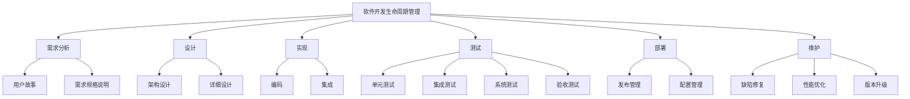

# 组织和指导项目的开发、测试、维护、升级、更新，解决开发中的技术问题

## 1. 背景介绍

### 1.1 问题的由来

在当今快节奏的软件开发环境中，有效地组织和指导项目的全生命周期管理是确保项目成功交付的关键。无论是初创公司还是大型企业，都面临着快速响应市场需求、提高开发效率、确保产品质量和降低维护成本的挑战。因此，掌握组织和指导项目开发、测试、维护、升级和更新的技能,并能够高效解决开发过程中遇到的各种技术问题,对于任何软件开发团队来说都是必不可少的。

### 1.2 研究现状

目前,软件开发生命周期管理 (SDLC) 已经成为业界广泛采用的最佳实践。SDLC 提供了一个结构化的框架,用于规划、设计、实现、测试、部署和维护软件系统。然而,每个项目都有其独特的需求和约束条件,因此需要根据具体情况对 SDLC 进行调整和优化。

此外,随着敏捷开发方法的兴起,如 Scrum 和 Kanban,软件开发过程变得更加迭代和增量式。这要求项目管理者能够灵活地适应变化,快速响应需求,并确保开发团队保持高效和协作。

### 1.3 研究意义

掌握组织和指导软件项目开发、测试、维护、升级和更新的技能,对于确保项目的成功交付至关重要。通过有效的项目管理,可以:

1. 提高开发效率和质量
2. 降低维护成本和风险
3. 加强团队协作和沟通
4. 快速响应市场需求和变化
5. 提升客户满意度和用户体验

此外,能够高效解决开发过程中遇到的各种技术问题,也是确保项目顺利进行的关键因素。通过深入了解核心技术原理、算法和数学模型,开发人员可以更好地设计、实现和优化软件系统,从而提高系统的性能、可靠性和可扩展性。

### 1.4 本文结构

本文将从以下几个方面深入探讨组织和指导软件项目开发、测试、维护、升级和更新的技术和实践:

1. 核心概念与联系
2. 核心算法原理和具体操作步骤
3. 数学模型和公式详细讲解及案例分析
4. 项目实践:代码实例和详细解释说明
5. 实际应用场景和未来展望
6. 工具和资源推荐
7. 总结:未来发展趋势与挑战
8. 附录:常见问题与解答

## 2. 核心概念与联系

在探讨如何组织和指导软件项目开发之前,我们需要了解一些核心概念及其相互关系。这些概念为后续的算法、模型和实践奠定了基础。



上图展示了软件开发生命周期管理 (SDLC) 的核心概念及其关系。SDLC 包括需求分析、设计、实现、测试、部署和维护六个主要阶段,每个阶段又包含了多个子活动和工件。

需求分析阶段确定了系统的功能和非功能需求,通常以用户故事和需求规格说明的形式表达。设计阶段则根据需求进行架构设计和详细设计,为后续的实现奠定基础。

实现阶段包括编码和集成两个主要活动,将设计转化为可执行的软件系统。测试阶段则通过单元测试、集成测试、系统测试和验收测试,确保系统满足需求并符合质量标准。

部署阶段负责发布管理和配置管理,将系统投入生产环境。维护阶段则包括缺陷修复、性能优化和版本升级等活动,确保系统持续满足用户需求和适应环境变化。

这些核心概念相互关联、相互影响,构成了软件开发的整体流程。掌握这些概念及其关系,对于有效组织和指导软件项目开发至关重要。

## 3. 核心算法原理 & 具体操作步骤

### 3.1 算法原理概述

在软件开发过程中,我们经常需要解决各种复杂的问题,例如任务调度、资源优化、数据处理等。为了高效地解决这些问题,我们需要借助算法的力量。算法提供了一种系统化的方法来解决特定类型的问题,通过一系列明确定义的步骤来达成预期目标。

以下是一些常见的算法类型及其应用场景:

1. **排序算法**: 用于对数据进行排序,如快速排序、归并排序、堆排序等。
2. **搜索算法**: 用于在数据集合中查找特定元素,如二分查找、深度优先搜索、广度优先搜索等。
3. **图算法**: 用于解决与图相关的问题,如最短路径算法、最小生成树算法、拓扑排序算法等。
4. **动态规划算法**: 用于解决具有重叠子问题的优化问题,如背包问题、最长公共子序列等。
5. **贪心算法**: 用于在每一步做出局部最优选择,以求得全局最优解,如霍夫曼编码、Kruskal 算法等。
6. **分治算法**: 将问题划分为更小的子问题,递归地解决子问题,然后合并子问题的解,如归并排序、快速排序等。
7. **近似算法**: 用于求解 NP 难题的近似解,如近似旅行商问题算法、近似集合覆盖算法等。

这些算法为我们解决各种实际问题提供了强有力的工具。掌握算法的原理和实现方法,对于提高软件开发的效率和质量至关重要。

### 3.2 算法步骤详解

在本节,我们将以快速排序算法为例,详细介绍算法的具体操作步骤。快速排序是一种高效的排序算法,它的平均时间复杂度为 O(n log n),属于分治算法的一种。

快速排序的基本思想是:

1. 选择一个基准元素 (pivot) 从数组中。
2. 将数组分成两个子数组,使得左子数组中的元素都小于基准元素,右子数组中的元素都大于基准元素。
3. 递归地对左子数组和右子数组进行快速排序。

具体步骤如下:

1. 选择基准元素 pivot,通常选择数组的第一个或最后一个元素。
2. 使用两个指针 left 和 right,分别指向数组的第一个和最后一个元素。
3. 移动 right 指针,找到第一个小于 pivot 的元素,移动 left 指针,找到第一个大于 pivot 的元素。
4. 交换 left 和 right 指针所指向的元素。
5. 重复步骤 3 和 4,直到 left 和 right 指针相遇。
6. 将 pivot 与 left 指针所指向的元素交换,此时 pivot 已经到达正确的位置。
7. 递归地对 pivot 左侧的子数组和右侧的子数组进行快速排序。

以下是快速排序算法的 Python 实现:

```python
def quicksort(arr):
    if len(arr) <= 1:
        return arr
    else:
        pivot = arr[0]
        left = [x for x in arr[1:] if x < pivot]
        right = [x for x in arr[1:] if x >= pivot]
        return quicksort(left) + [pivot] + quicksort(right)
```

快速排序算法的时间复杂度在最坏情况下为 O(n^2),即当输入数组已经排序或反序时。但在平均情况下,时间复杂度为 O(n log n),属于高效的排序算法。

### 3.3 算法优缺点

快速排序算法具有以下优点:

1. **高效**: 平均时间复杂度为 O(n log n),属于高效的排序算法之一。
2. **原地排序**: 不需要额外的存储空间,原地进行排序。
3. **适用范围广**: 可以用于各种数据类型的排序,如整数、浮点数、字符串等。
4. **可扩展性强**: 可以轻松地并行化或分布式实现,提高性能。

但快速排序算法也存在一些缺点:

1. **不稳定排序**: 相等的元素可能会被交换位置,导致排序不稳定。
2. **递归调用**: 递归调用可能会导致栈溢出,需要注意递归深度。
3. **对有序数组效率低下**: 在最坏情况下,时间复杂度为 O(n^2)。

总的来说,快速排序算法是一种高效、通用的排序算法,适用于大多数场景。但在特定情况下,如需要稳定排序或对有序数组进行排序时,可能需要考虑其他排序算法。

### 3.4 算法应用领域

快速排序算法广泛应用于各种领域,包括但不限于:

1. **数据处理**: 对大规模数据进行排序和处理,如日志分析、数据挖掘等。
2. **科学计算**: 在数值计算、矩阵运算等领域,快速排序算法可以用于预处理数据。
3. **图形学和计算机视觉**: 在渲染管线、图像处理等领域,快速排序算法可用于排序像素或顶点数据。
4. **操作系统和编译器**: 在内存管理、文件系统等模块中,快速排序算法可用于管理和优化资源。
5. **数据库和搜索引擎**: 在索引构建、查询优化等场景中,快速排序算法可用于提高效率。

除了快速排序算法之外,其他常见的排序算法,如归并排序、堆排序、桶排序等,也在各自的应用领域发挥着重要作用。掌握这些算法的原理和实现方法,对于提高软件开发的效率和质量至关重要。

## 4. 数学模型和公式 & 详细讲解 & 举例说明

在软件开发过程中,我们经常需要建立数学模型来描述和解决实际问题。数学模型不仅可以帮助我们深入理解问题的本质,还可以为我们提供解决问题的理论基础和方法。在本节中,我们将介绍一些常见的数学模型和公式,并通过具体案例进行详细讲解和说明。

### 4.1 数学模型构建

构建数学模型的一般步骤如下:

1. **问题描述**: 明确问题的背景、目标和约束条件。
2. **确定变量**: 识别问题中的关键变量及其关系。
3. **建立方程**: 根据变量之间的关系,建立数学方程或不等式。
4. **求解方程**: 使用适当的数学方法求解方程,获得解析解或数值解。
5. **验证模型**: 将模型的解与实际情况进行比较,评估模型的准确性和有效性。
6. **优化和改进**: 根据验证结果,对模型进行优化和改进,以提高模型的精度和适用范围。

以下是一些常见的数学模型类型:

1. **线性模型**: 用于描述线性关系,如线性规划、线性回归等。
2. **非线性模型**: 用于描述非线性关系,如非线性优化、非线性动力学系统等。
3. **概率模型**: 用于描述随机现象,如马尔可夫链、贝叶斯网络等。
4. **离散模型**: 用于描述离散事件和过程,如图论、组合数学等。
5. **连续模型**: 用于描述连续过程,如微分方程、偏微分方程等。

通过构建合适的数学模型,我们可以更好地理解和解决