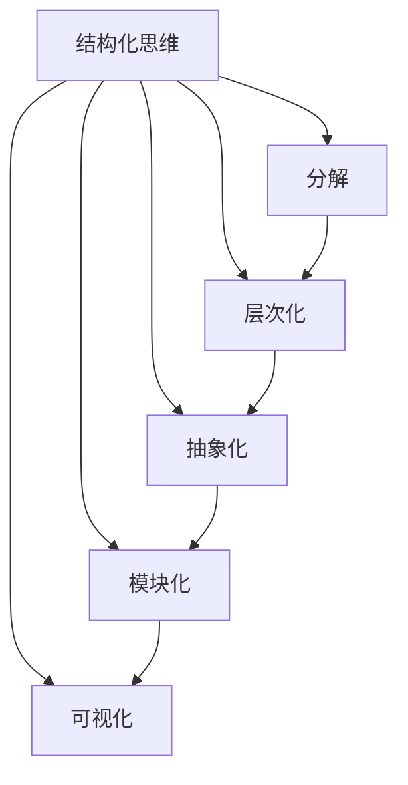

# 结构化思维：从混沌到清晰

## 1. 背景介绍

### 1.1 问题的由来

在当今信息爆炸的时代,我们每天都会遇到大量的信息和任务。无论是工作、学习还是生活,都需要处理各种复杂的问题。然而,面对纷繁杂乱的信息和任务,很多人会感到无从下手,思维混乱,难以有效地解决问题。这种混乱状态不仅影响我们的效率和生产力,也会给我们带来巨大的压力和焦虑。

### 1.2 研究现状

为了应对这一挑战,研究人员提出了"结构化思维"的概念。结构化思维是一种有序、有组织的思维方式,它可以帮助我们将混乱的信息和任务分解成易于管理的部分,从而更好地理解和解决问题。

许多研究表明,结构化思维可以提高我们的工作效率、决策质量和创新能力。然而,结构化思维并非一蹴而就,它需要特定的技能和训练。目前,已有一些方法和工具被开发出来,旨在培养和提高人们的结构化思维能力。

### 1.3 研究意义

结构化思维对于个人和组织都有重大意义。对个人而言,结构化思维可以帮助我们更好地管理时间、资源和任务,提高工作效率和生活质量。对组织而言,结构化思维可以促进团队协作、提高决策质量,从而增强组织的竞争力。

此外,结构化思维还有助于培养创新思维。通过将复杂的问题分解成易于管理的部分,我们可以更好地发现问题的本质,从而产生创新的解决方案。

### 1.4 本文结构

本文将全面探讨结构化思维的概念、方法和应用。我们将首先介绍结构化思维的核心概念和原理,然后详细阐述结构化思维的算法和数学模型。接下来,我们将通过实际案例和代码示例,展示如何在实践中应用结构化思维。最后,我们将探讨结构化思维在不同领域的应用场景,并总结其未来发展趋势和挑战。

## 2. 核心概念与联系

结构化思维是一种系统化的思维方式,它包括以下几个核心概念:

1. **分解 (Decomposition)**: 将复杂的问题或任务分解成更小、更易于管理的部分。这有助于我们更好地理解问题的本质,并逐步解决问题。

2. **层次化 (Hierarchy)**: 将分解后的部分按照一定的层次结构进行组织和管理。这有助于我们清晰地看到各个部分之间的关系和依赖性。

3. **抽象化 (Abstraction)**: 抓住问题的本质,忽略不相关的细节。这有助于我们专注于核心问题,避免被无关的细节分散注意力。

4. **模块化 (Modularity)**: 将问题或任务划分为相对独立的模块,每个模块负责特定的功能或任务。这有助于我们更好地管理和维护代码或系统。

5. **可视化 (Visualization)**: 使用图表、图形或其他可视化工具来表示问题或解决方案。这有助于我们更直观地理解复杂的概念和关系。

这些核心概念相互关联,共同构成了结构化思维的基础。例如,我们可以先将问题分解成更小的部分,然后将这些部分按照层次结构组织起来,并抽象出每个部分的核心功能,形成独立的模块。最后,我们可以使用可视化工具来表示整个系统的结构和流程。

通过应用这些核心概念,我们可以将混乱的问题或任务转化为有序、有组织的结构,从而更好地理解和解决问题。

## 3. 核心算法原理 & 具体操作步骤

### 3.1 算法原理概述

结构化思维的核心算法原理是将复杂的问题或任务分解成更小、更易于管理的部分,然后按照一定的层次结构进行组织和管理。这个过程可以递归地进行,直到每个部分都足够简单,可以直接解决或实现。

该算法的基本思想是:

1. 识别问题或任务的主要组成部分。
2. 将每个组成部分进一步分解成更小的子部分。
3. 对每个子部分进行抽象,确定其核心功能和接口。
4. 将这些子部分组织成模块,每个模块负责特定的功能或任务。
5. 确定模块之间的依赖关系和交互方式。
6. 可视化整个系统的结构和流程。
7. 针对每个模块或子部分,重复上述步骤,直到足够简单。

通过这种分而治之的方式,我们可以将原本复杂的问题或任务转化为一系列相对简单的子问题或子任务,从而更容易理解和解决。

### 3.2 算法步骤详解

下面是结构化思维算法的具体步骤:

1. **识别主要组成部分**

   首先,我们需要识别出问题或任务的主要组成部分。这可以通过头脑风暴、列表或其他技术来实现。

2. **分解每个组成部分**

   对于每个主要组成部分,我们需要将其进一步分解成更小的子部分。这个过程可以递归地进行,直到每个子部分足够简单。

3. **抽象每个子部分**

   对于每个子部分,我们需要抽象出其核心功能和接口。这有助于我们忽略不相关的细节,专注于核心问题。

4. **组织模块**

   将这些子部分组织成模块,每个模块负责特定的功能或任务。模块之间应该相对独立,但也可能存在依赖关系和交互。

5. **确定依赖关系和交互方式**

   确定模块之间的依赖关系和交互方式。这有助于我们更好地理解整个系统的工作流程和数据流。

6. **可视化系统结构和流程**

   使用图表、图形或其他可视化工具来表示整个系统的结构和流程。这有助于我们更直观地理解复杂的概念和关系。

7. **递归处理每个模块或子部分**

   对于每个模块或子部分,重复上述步骤,直到足够简单,可以直接解决或实现。

通过这种分而治之的方式,我们可以将原本复杂的问题或任务转化为一系列相对简单的子问题或子任务,从而更容易理解和解决。

### 3.3 算法优缺点

结构化思维算法的优点包括:

1. **简化复杂性**: 通过分解和抽象,我们可以将复杂的问题或任务简化为易于管理的部分。
2. **提高可维护性**: 模块化设计使得系统或解决方案更易于维护和扩展。
3. **促进协作**: 明确的模块划分和接口定义有助于团队协作和任务分工。
4. **提高可重用性**: 模块化设计使得各个模块可以在不同的项目或场景中重复使用。
5. **可视化思维过程**: 使用可视化工具可以更直观地表示和理解复杂的概念和关系。

然而,结构化思维算法也存在一些缺点:

1. **过度简化**: 在分解和抽象的过程中,可能会忽略一些重要的细节或边缘情况。
2. **局部最优**: 每个模块或子部分可能会达到局部最优,但整体解决方案可能不是全局最优。
3. **耗时耗力**: 对于一些简单的问题或任务,结构化思维可能会带来不必要的开销。
4. **需要经验**: 有效地应用结构化思维需要一定的经验和训练。

因此,在实际应用中,我们需要权衡利弊,根据具体情况选择是否使用结构化思维,以及如何正确地应用它。

### 3.4 算法应用领域

结构化思维算法可以应用于各种领域,包括但不限于:

1. **软件开发**: 在软件开发过程中,结构化思维可以帮助我们设计模块化的系统架构,提高代码的可维护性和可重用性。
2. **项目管理**: 结构化思维可以帮助我们将复杂的项目分解为易于管理的任务和里程碑,从而更好地规划和执行项目。
3. **问题解决**: 结构化思维可以帮助我们将复杂的问题分解成更小的子问题,从而更容易找到解决方案。
4. **决策分析**: 结构化思维可以帮助我们将决策过程分解为多个步骤,并考虑各种因素和影响,从而做出更明智的决策。
5. **知识管理**: 结构化思维可以帮助我们将知识和信息组织成有层次的结构,从而更容易获取和应用相关知识。
6. **创新思维**: 结构化思维可以帮助我们从不同的角度看待问题,发现新的机会和解决方案。

总的来说,结构化思维是一种通用的思维方式,可以应用于各种领域,帮助我们更好地理解和解决复杂的问题。

## 4. 数学模型和公式 & 详细讲解 & 举例说明

### 4.1 数学模型构建

为了更好地理解和应用结构化思维,我们可以构建一个数学模型来描述和分析它。在这个模型中,我们将问题或任务表示为一个有向无环图 (DAG, Directed Acyclic Graph)。

在这个有向无环图中,每个节点代表一个子任务或模块,边表示子任务或模块之间的依赖关系。如果存在一条从节点 A 到节点 B 的有向边,则表示子任务或模块 B 依赖于子任务或模块 A。

我们可以使用以下符号来表示这个数学模型:

- $G = (V, E)$ 表示有向无环图,其中 $V$ 是节点集合,表示所有子任务或模块;$E$ 是边集合,表示子任务或模块之间的依赖关系。
- $n = |V|$ 表示节点或子任务/模块的数量。
- $m = |E|$ 表示边或依赖关系的数量。
- $w(v)$ 表示节点 $v$ 的权重,可以用来表示该子任务或模块的复杂度或工作量。
- $d^+(v)$ 表示节点 $v$ 的出度,即依赖于该节点的子任务或模块的数量。
- $d^-(v)$ 表示节点 $v$ 的入度,即该节点依赖的子任务或模块的数量。

基于这个数学模型,我们可以定义一些指标来衡量结构化思维的效果:

1. **复杂度**: 整个问题或任务的复杂度可以定义为所有节点权重的总和,即 $\sum_{v \in V} w(v)$。通过结构化思维,我们希望将复杂度分解为多个较小的子任务或模块,从而降低整体复杂度。

2. **依赖性**: 依赖性可以定义为边的数量 $m$。通过结构化思维,我们希望减少模块之间的依赖关系,从而提高模块的独立性和可重用性。

3. **临界路径长度**: 临界路径长度是指从入度为 0 的节点到出度为 0 的节点的最长路径长度。这个指标可以反映问题或任务的总体复杂度和工作量。通过结构化思维,我们希望缩短临界路径长度,从而加快问题解决或任务完成的速度。

4. **并行度**: 并行度可以定义为在给定时间点可以同时执行的节点或子任务/模块的数量。通过结构化思维,我们希望提高并行度,从而加快问题解决或任务完成的速度。

通过构建这个数学模型,我们可以更好地理解和分析结构化思维的原理和效果,并针对不同的场景和目标进行优化和调整。

### 4.2 公式推导过程

在上一节中,我们定义了一些指标来衡量结构化思维的效果。现在,我们将推导这些指标的具体计算公式。