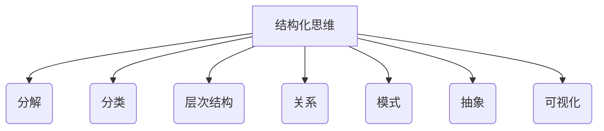
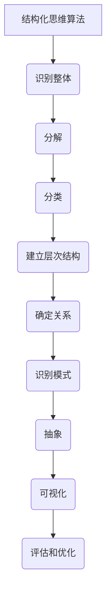

# 结构化思维：理解世界的钥匙

## 1. 背景介绍

### 1.1 问题的由来

在这个信息时代,我们每天都会接收大量的信息。然而,很多时候,这些信息显得杂乱无章、难以理解和掌握。我们如何才能有效地处理这些信息,并从中获取有价值的见解呢?这就需要我们具备结构化思维的能力。

结构化思维是一种思考方式,它强调将复杂的问题或概念分解成易于理解和管理的组成部分。通过将信息有序地组织和分类,我们可以更好地理解它们之间的关系和层次结构,从而提高我们的理解和决策能力。

### 1.2 研究现状

结构化思维已经成为许多领域的关键技能,包括管理、工程、科学和教育等。许多著名的思想家和学者都强调了结构化思维的重要性,如爱德华·德博诺、巴拉·明茨和约翰·梅德克斯等。他们的著作探讨了结构化思维的原理和应用,为我们提供了宝贵的见解和指导。

然而,尽管结构化思维的概念已经存在了很长时间,但在实践中,很多人仍然缺乏这种能力。这可能是由于缺乏系统的训练,或者是由于习惯性地采用非结构化的思维方式。因此,如何有效地培养和提高结构化思维能力仍然是一个值得探讨的话题。

### 1.3 研究意义

掌握结构化思维能力对于个人和组织都有重大意义。对个人而言,结构化思维可以帮助我们更好地理解和解决复杂的问题,提高决策质量,并提高工作效率。对组织而言,结构化思维可以促进团队协作,提高项目管理水平,并有助于制定更加明智的战略决策。

此外,在当前的数字化时代,结构化思维也是处理大量数据和信息的关键能力。随着人工智能和大数据技术的不断发展,结构化思维将成为理解和利用这些新兴技术的基础。

### 1.4 本文结构

本文将从以下几个方面探讨结构化思维:

1. 核心概念与联系
2. 核心算法原理与具体操作步骤
3. 数学模型和公式详细讲解与举例说明
4. 项目实践:代码实例和详细解释说明
5. 实际应用场景
6. 工具和资源推荐
7. 总结:未来发展趋势与挑战
8. 附录:常见问题与解答

通过对这些方面的深入探讨,本文旨在为读者提供全面的理解和实践结构化思维的指导。

## 2. 核心概念与联系

结构化思维是一种系统性的思考方式,它将复杂的问题或概念分解成易于管理的组成部分,并探索它们之间的关系和层次结构。它包含以下几个核心概念:

1. **分解 (Decomposition)**: 将复杂的整体分解成更小、更易于理解的组成部分。这是结构化思维的基础,有助于简化问题并提高可管理性。

2. **分类 (Classification)**: 根据某些标准或特征将相似的事物归类,有助于组织和理解信息。

3. **层次结构 (Hierarchy)**: 将组成部分按照一定的等级或重要性排列,形成一种自上而下或自下而上的结构。这有助于明确各部分之间的关系和依赖性。

4. **关系 (Relationships)**: 探索组成部分之间的联系和相互作用,包括因果关系、逻辑关系等。这有助于深入理解整体的运作机制。

5. **模式 (Patterns)**: 识别和利用重复出现的规律或模式,有助于简化复杂性并提高可预测性。

6. **抽象 (Abstraction)**: 忽略不相关的细节,专注于核心概念和原理。这有助于提高思维的效率和灵活性。

7. **可视化 (Visualization)**: 使用图表、图形或其他视觉表示形式来呈现信息和结构,有助于直观理解和交流。

这些核心概念相互关联,共同构成了结构化思维的基础框架。掌握这些概念及其联系,是培养和提高结构化思维能力的关键。

## 3. 核心算法原理与具体操作步骤

### 3.1 算法原理概述

结构化思维的核心算法原理是将复杂的问题或概念分解成易于管理的组成部分,并探索它们之间的关系和层次结构。这个过程可以概括为以下几个步骤:

1. **识别整体**: 首先,需要明确要处理的问题或概念的整体范围和边界。

2. **分解**: 将整体分解成更小、更易于理解的组成部分。这可以通过识别不同的特征、功能或子任务来实现。

3. **分类**: 根据某些标准或特征将相似的组成部分归类,形成不同的类别或组。

4. **建立层次结构**: 将组成部分按照一定的等级或重要性排列,形成一种自上而下或自下而上的结构。

5. **确定关系**: 探索组成部分之间的联系和相互作用,包括因果关系、逻辑关系等。

6. **识别模式**: 寻找重复出现的规律或模式,以简化复杂性并提高可预测性。

7. **抽象**: 忽略不相关的细节,专注于核心概念和原理。

8. **可视化**: 使用图表、图形或其他视觉表示形式来呈现信息和结构,以促进理解和交流。

9. **评估和优化**: 评估当前的结构是否满足需求,并根据需要进行优化和调整。

这个算法原理强调了分解、组织和探索的过程,旨在帮助我们更好地理解和管理复杂的问题或概念。

### 3.2 算法步骤详解

下面将详细解释结构化思维算法的每个步骤:

1. **识别整体**

   在开始结构化思维过程之前,首先需要明确要处理的问题或概念的整体范围和边界。这包括确定目标、范围、背景信息等。明确整体有助于确保我们专注于正确的领域,并避免过度扩散或偏离主题。

2. **分解**

   分解是结构化思维的核心步骤。它涉及将整体分解成更小、更易于理解的组成部分。可以根据不同的标准进行分解,如功能、特征、子任务等。分解的目的是简化复杂性,使问题或概念更易于管理。

3. **分类**

   分类是将相似的组成部分归类到不同的类别或组中。这可以根据某些标准或特征来实现,如性质、用途、属性等。分类有助于组织和理解信息,并为后续的层次结构建立奠定基础。

4. **建立层次结构**

   层次结构是将组成部分按照一定的等级或重要性排列,形成一种自上而下或自下而上的结构。这有助于明确各部分之间的关系和依赖性,并提供一种逻辑顺序来处理信息。

5. **确定关系**

   探索组成部分之间的联系和相互作用是结构化思维的关键环节。这包括识别因果关系、逻辑关系、时序关系等。理解这些关系有助于我们深入理解整体的运作机制和内在逻辑。

6. **识别模式**

   模式是指重复出现的规律或特征。通过识别模式,我们可以简化复杂性,提高可预测性,并发现潜在的机会或风险。模式可以存在于数据、过程、行为或其他领域中。

7. **抽象**

   抽象是忽略不相关的细节,专注于核心概念和原理。它有助于提高思维的效率和灵活性,并使我们能够更好地关注重点和本质。抽象需要判断力,以确定哪些细节是相关的,哪些是可以忽略的。

8. **可视化**

   可视化是使用图表、图形或其他视觉表示形式来呈现信息和结构。它有助于直观理解和交流,特别是在处理复杂的数据或关系时。可视化工具包括思维导图、流程图、网络图等。

9. **评估和优化**

   最后一步是评估当前的结构是否满足需求,并根据需要进行优化和调整。这可能涉及重新分解、重新分类或调整层次结构等。评估和优化有助于确保结构化思维过程达到预期目标,并不断改进和完善。

通过遵循这些步骤,我们可以系统地应用结构化思维来理解和管理复杂的问题或概念。每个步骤都是相互关联和依赖的,缺少任何一个步骤都可能影响整个过程的有效性。

### 3.3 算法优缺点

结构化思维算法具有以下优点:

1. **简化复杂性**: 通过分解和分类,算法有助于将复杂的问题或概念分解成更易于理解和管理的组成部分。

2. **提高可管理性**: 建立层次结构和确定关系有助于明确各部分之间的依赖性和逻辑顺序,从而提高问题的可管理性。

3. **发现模式和规律**: 算法强调识别模式和规律,这有助于简化复杂性并提高可预测性。

4. **促进理解和交流**: 可视化和抽象有助于直观理解和有效交流,特别是在处理复杂的数据或关系时。

5. **提高决策质量**: 通过全面理解问题的结构和关系,算法有助于做出更加明智和有根据的决策。

6. **适用于多个领域**: 结构化思维算法是一种通用的思维方法,可以应用于各种领域,如管理、工程、科学和教育等。

然而,结构化思维算法也存在一些潜在的缺点:

1. **过度简化**: 在分解和抽象过程中,可能会过度简化或忽略一些重要的细节或复杂性。

2. **局限性**: 算法主要关注静态的结构和关系,可能无法很好地处理动态变化或不确定性。

3. **主观性**: 分解、分类和确定关系等步骤可能会受到个人主观判断的影响,从而导致偏差或错误。

4. **时间和资源消耗**: 应用结构化思维算法可能需要大量的时间和资源,特别是在处理非常复杂的问题时。

5. **灵活性不足**: 一旦建立了结构,可能会难以调整或改变,从而限制了思维的灵活性。

6. **缺乏创新性**: 过度依赖结构化思维可能会阻碍创新思维和非线性思考。

因此,在实践中,需要权衡算法的优缺点,并根据具体情况选择合适的方法。结合其他思维技巧和工具也是非常重要的,以弥补结构化思维算法的不足。

### 3.4 算法应用领域

结构化思维算法可以应用于各种领域,以帮助理解和管理复杂的问题或概念。以下是一些典型的应用领域:

1. **项目管理**: 在项目管理中,结构化思维算法可用于分解项目目标、任务和资源,建立工作分解结构 (WBS)、甘特图等,以及确定任务之间的依赖关系和关键路径。

2. **产品设计**: 在产品设计中,算法可用于分解产品功能和需求,建立产品结构树,确定组件之间的关系,并识别设计模式和最佳实践。

3. **系统分析和设计**: 在系统分析和设计中,算法可用于分解系统需求、功能和架构,建立层次结构和关系模型,并确定系统组件之间的交互和数据流。

4