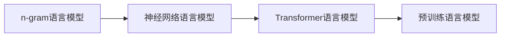

# 统计语言模型的发展历程

关键词：统计语言模型、n-gram、神经网络语言模型、Transformer、GPT、BERT

## 1. 背景介绍

### 1.1 问题的由来
自然语言处理(NLP)是人工智能领域的一个重要分支,其目标是让计算机能够理解、生成和处理人类语言。而语言模型是NLP的基础,它能够捕捉语言中的统计规律和语义信息,是实现机器翻译、对话系统、文本生成等应用的关键。

### 1.2 研究现状
统计语言模型经历了从基于词频的n-gram模型到神经网络语言模型再到预训练语言模型的发展历程。当前最先进的语言模型如GPT-3、PaLM等都基于Transformer结构,在多个NLP任务上取得了超越人类的性能。

### 1.3 研究意义
了解统计语言模型的发展历程有助于我们理解NLP技术的演进脉络,洞察当前最新的语言模型是如何一步步发展而来的。同时对语言模型核心原理的掌握也是进一步改进模型、探索新的应用场景的基础。

### 1.4 本文结构
本文将首先介绍语言模型的核心概念,然后回顾n-gram、神经网络语言模型以及预训练语言模型等里程碑式的工作,并重点剖析Transformer结构的原理。同时给出语言模型的数学定义和案例讲解,以及在机器翻译、对话、文本生成等任务中的应用实践。最后总结语言模型技术的发展趋势与面临的挑战。

## 2. 核心概念与联系

语言模型的目标是学习语言的概率分布。给定一个词序列 $S=(w_1,w_2,...,w_T)$,语言模型的任务就是估计该序列的概率 $P(S)$。根据概率论的链式法则,序列概率可以分解为:

$$P(S)=P(w_1,w_2,...,w_T)=\prod_{t=1}^{T}P(w_t|w_1,...,w_{t-1})$$

其中 $P(w_t|w_1,...,w_{t-1})$ 表示在给定前面词的条件下当前词 $w_t$ 的条件概率。语言模型的核心就是估计这个条件概率分布。

早期的n-gram语言模型基于马尔可夫假设,认为一个词的出现只与前面n-1个词相关:

$$P(w_t|w_1,...,w_{t-1}) \approx P(w_t|w_{t-n+1},...,w_{t-1})$$

随着深度学习的发展,研究者开始使用神经网络来建模语言中的长距离依赖。以RNN为代表的神经网络语言模型可以编码任意长度的上下文信息:

$$P(w_t|w_1,...,w_{t-1}) = \text{softmax}(h_t W)$$

其中 $h_t=f(x_t,h_{t-1})$ 是RNN的隐状态,$f$ 为非线性函数如LSTM/GRU等。

Transformer语言模型使用自注意力机制代替RNN,自注意力可以一步捕获词之间的长距离依赖,计算效率也更高:

$$h_t = \text{Attention}(Q,K,V)$$

其中 $Q,K,V$ 分别是词向量序列线性变换得到的查询、键、值向量。

预训练语言模型如BERT进一步引入了掩码语言模型(MLM)和句子连贯性判别(NSP)等预训练任务,使得模型能够学习到更加通用和鲁棒的语言表示。

下图总结了统计语言模型各种范式之间的演进关系:



## 3. 核心算法原理 & 具体操作步骤

### 3.1 算法原理概述
本节重点介绍Transformer语言模型的原理,它是当前最先进的语言模型的核心架构。Transformer的特点是抛弃了RNN这种顺序结构,完全依赖自注意力机制来学习序列表示。

### 3.2 算法步骤详解

Transformer编码器由N个相同的层堆叠而成,每一层包含两个子层:多头自注意力层和前馈神经网络层。

- 第一步:将输入词向量序列 $X=(x_1,x_2,...,x_n)$ 通过三个线性变换得到 $Q,K,V$ 矩阵。

$$Q=XW^Q, K=XW^K, V=XW^V$$

- 第二步:计算自注意力。将 $Q,K,V$ 划分为 $h$ 个头,每个头分别计算注意力,然后拼接:

$$\text{head}_i = \text{Attention}(QW_i^Q,KW_i^K,VW_i^V)$$

$$\text{MultiHead}(Q,K,V) = \text{Concat}(\text{head}_1,...,\text{head}_h)W^O$$

其中注意力函数为:

$$\text{Attention}(Q,K,V) = \text{softmax}(\frac{QK^T}{\sqrt{d_k}})V$$

- 第三步:前馈神经网络。使用两层带ReLU激活的全连接网络,对每个位置的向量分别进行变换:

$$\text{FFN}(x)=\max(0, xW_1 + b_1)W_2 + b_2$$

- 第四步:层归一化和残差连接。对每个子层的输出进行归一化,并与输入进行残差连接,有助于稳定训练:

$$x + \text{SubLayer}(\text{LayerNorm}(x))$$

以上就是Transformer编码器的核心步骤。解码器与编码器结构类似,只是在第二步插入了一个"编码-解码注意力"层,用于关注编码器的输出。此外还使用掩码来防止解码器看到未来的信息。

### 3.3 算法优缺点
Transformer的优点是:
1. 并行计算效率高,不像RNN那样受限于顺序结构
2. 可以一步捕获长距离依赖,对长文本建模更有优势
3. 可以通过叠加更多层来增加模型容量

缺点是:
1. 计算和内存开销大,难以处理很长的序列
2. 缺乏RNN那样的顺序归纳偏置,有时反而不利于建模一些强顺序依赖的模式
3. 解释性差,注意力矩阵难以解读

### 3.4 算法应用领域
Transformer已成为NLP主流模型的标配,在机器翻译、阅读理解、文本分类、命名实体识别、语法分析等各种任务中广泛应用。同时它也被扩展到语音、图像、视频等领域,显示出很好的通用性。

## 4. 数学模型和公式 & 详细讲解 & 举例说明

### 4.1 数学模型构建
从数学角度看,语言模型就是对一个离散随机变量的概率分布进行建模。设词表大小为 $K$,语言模型的输出就是一个 $K$ 维概率向量 $p=(p_1,...,p_K)$,其中 $p_i$ 表示第 $i$ 个词的概率,且满足 $\sum_{i=1}^K p_i=1$。

对于n-gram语言模型,概率向量可以通过极大似然估计得到:

$$p(w_i|w_{i-n+1}^{i-1})=\frac{\text{count}(w_{i-n+1}^i)}{\text{count}(w_{i-n+1}^{i-1})}$$

其中 $\text{count}(\cdot)$ 表示词序列在训练语料中出现的次数。

对于神经网络语言模型,概率向量通过模型输出的logits进行softmax归一化得到:

$$p(w_i|w_1^{i-1})=\text{softmax}(h_i^TW+b)$$

其中 $h_i$ 是模型最后一层对应位置 $i$ 的隐状态,$W,b$ 是softmax层的参数。

### 4.2 公式推导过程
以Transformer为例,我们详细推导其自注意力的计算公式。

首先将输入向量 $x_1,...,x_n$ 通过线性变换得到 $Q,K,V$ 矩阵:

$$Q=XW^Q, K=XW^K, V=XW^V \in \mathbb{R}^{n \times d}$$

然后计算 $Q,K$ 的点积注意力分数:

$$\text{scores} = QK^T \in \mathbb{R}^{n \times n}$$

接着对分数矩阵的每一行进行softmax归一化,得到注意力权重矩阵:

$$\text{weights} = \text{softmax}(\frac{\text{scores}}{\sqrt{d}}) \in \mathbb{R}^{n \times n}$$

最后将权重矩阵与值矩阵 $V$ 相乘,得到注意力输出:

$$\text{Attention}(Q,K,V) = \text{weights} \cdot V \in \mathbb{R}^{n \times d}$$

多头注意力就是将 $Q,K,V$ 划分为多个头,分别计算注意力,然后拼接:

$$\text{head}_i = \text{Attention}(QW_i^Q,KW_i^K,VW_i^V)$$

$$\text{MultiHead}(Q,K,V) = \text{Concat}(\text{head}_1,...,\text{head}_h)W^O$$

### 4.3 案例分析与讲解
下面我们以一个简单的例子来说明语言模型的工作原理。假设我们有以下训练语料:

```
the cat sat on the mat
the dog lay on the rug
```

对于bigram语言模型,我们可以统计每个词在给定前一个词时出现的频率:

```
p(the|<start>) = 2/2
p(cat|the) = 1/2
p(dog|the) = 1/2
p(sat|cat) = 1/1
p(lay|dog) = 1/1
p(on|sat) = 1/1
p(on|lay) = 1/1
p(mat|the) = 1/2
p(rug|the) = 1/2
```

现在给定一个测试句子"the cat lay on the rug",我们可以用bigram模型估计其概率:

$$\begin{aligned}
P(&\text{the cat lay on the rug}) \\
&= P(\text{the}|\text{<start>}) \times P(\text{cat}|\text{the}) \times P(\text{lay}|\text{cat}) \\
&\quad \times P(\text{on}|\text{lay}) \times P(\text{the}|\text{on}) \times P(\text{rug}|\text{the}) \\
&= 1 \times 0.5 \times 0 \times 1 \times 0 \times 0.5 \\
&= 0
\end{aligned}$$

可以看到,bigram模型对这个句子估计的概率为0,原因是在训练语料中没有出现"cat lay"这个bigram。这凸显了n-gram模型的局限性:没有看到的n-gram会被估计为0概率,导致数据稀疏问题。而神经网络语言模型通过词嵌入和非线性变换,可以很好地缓解这一问题。

### 4.4 常见问题解答

**Q:** n-gram语言模型的平滑方法有哪些?

**A:** 常见的平滑方法包括加法平滑(Laplace smoothing)、折扣平滑(Good-Turing)、回退平滑(Katz backoff)和插值平滑(interpolation)等。其中比较常用的是Kneser-Ney平滑,它考虑了n-gram前缀的多样性,对低频n-gram进行智能折扣。

**Q:** 如何处理神经语言模型中的OOV问题?

**A:** 主要有两种方法:一是在词表中添加一个特殊的UNK标记,代表所有未登录词;二是使用字符级别的语言模型,将OOV分解为字符序列来建模。此外还可以使用字节对编码(BPE)等词块化方法平衡词汇量和OOV率。

**Q:** Transformer中的位置编码是什么?有什么作用?

**A:** 由于Transformer不包含RNN这种天然的位置信息,因此需要显式地将位置信息编码到词向量中。位置编码通常使用不同频率的三角函数来表示,让词向量携带绝对位置的信息。这有助于模型学习词序关系。

## 5. 项目实践：代码实例和详细解释说明

### 5.1 开发环境搭建
本节我们将使用PyTorch实现一个基于Transformer的语言模型。首先安装必要的依赖:

```bash
pip install torch numpy matplotlib tqdm 
```

### 