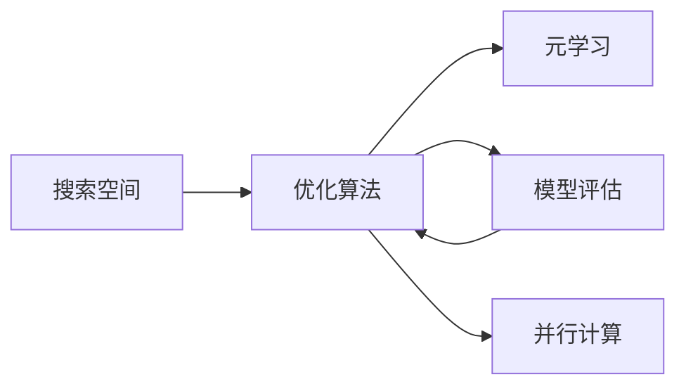

# 自动机器学习 原理与代码实例讲解

作者：禅与计算机程序设计艺术 / Zen and the Art of Computer Programming

## 1. 背景介绍
### 1.1 问题的由来
在当前大数据时代,海量数据的出现给传统的机器学习方法带来了巨大挑战。人工设计特征、调参的方式已经难以应对快速增长的数据规模和复杂性。为了解决这一问题,自动机器学习(Automated Machine Learning,AutoML)应运而生。它旨在自动化机器学习过程中耗时且容易出错的环节,使得机器学习的应用更加高效、便捷。

### 1.2 研究现状
自动机器学习近年来得到了学术界和工业界的广泛关注。微软、谷歌等科技巨头纷纷推出了自己的AutoML工具和平台。学术界也涌现出一批优秀的AutoML研究成果,如Auto-sklearn、Auto-WEKA、Auto-Keras等。这些工作极大地推动了AutoML技术的发展与应用。

### 1.3 研究意义
自动机器学习具有重要的理论和实践意义:

1. 降低机器学习门槛,使非专业人士也能使用。
2. 加速模型开发过程,提高生产效率。 
3. 探索更大的模型空间,有望获得更优性能。
4. 减少人为偏差和错误,让结果更加客观可靠。
5. 积累机器学习专家经验,沉淀成可复用的自动化工具。

### 1.4 本文结构
本文将全面介绍AutoML的原理、方法和应用。第2部分阐述AutoML的核心概念;第3部分详解AutoML的关键算法;第4部分建立AutoML的数学模型并举例说明;第5部分给出AutoML的代码实例;第6部分展望AutoML的应用前景;第7部分推荐AutoML的学习资源;第8部分总结全文并展望未来;第9部分列举常见问题与解答。

## 2. 核心概念与联系

自动机器学习的核心是让机器自主完成从数据到模型的端到端过程。它涉及以下关键概念:

- 搜索空间(Search Space):定义待优化的模型参数、架构、算法等组成。
- 优化算法(Optimization Algorithm):在搜索空间中寻找最优解的策略,如强化学习、进化算法等。
- 元学习(Meta-Learning):利用历史经验指导优化,加速搜索过程。
- 模型评估(Model Evaluation):评估候选解的性能,为优化提供反馈。
- 并行计算(Parallel Computing):分布式运行多个搜索任务,提升效率。

它们的关系如下图所示:



优化算法在搜索空间中产生候选解,通过模型评估获得性能反馈,元学习利用历史经验指导优化,并行计算加速整个过程。

## 3. 核心算法原理 & 具体操作步骤
### 3.1 算法原理概述
自动机器学习的核心是搜索算法,常见的有:

1. 贝叶斯优化(Bayesian Optimization):通过概率模型预测性能,平衡探索和利用。
2. 进化算法(Evolutionary Algorithm):模拟生物进化过程搜索最优解。 
3. 强化学习(Reinforcement Learning):通过奖励反馈学习最优策略。
4. 梯度优化(Gradient-based Optimization):利用梯度信息引导搜索方向。

### 3.2 算法步骤详解
以贝叶斯优化为例,它的基本步骤如下:

1. 定义搜索空间,给出待优化变量的类型和范围。
2. 选择概率模型(如高斯过程),根据已评估的点拟合模型。
3. 定义采集函数(如EI),平衡探索和利用,选择下一个评估点。
4. 评估所选点的性能,更新概率模型。
5. 重复3-4,直到达到预算或满足收敛条件。
6. 返回找到的最优解。

### 3.3 算法优缺点
贝叶斯优化的优点是:
- 样本效率高,用少量评估次数就能找到较好的解。
- 可处理黑盒问题,不要求目标函数光滑、连续、可导。
- 可利用先验知识,通过核函数等引入领域经验。

缺点是:
- 计算开销大,每轮迭代需要拟合概率模型。
- 难以扩展到高维空间,维度灾难限制了其应用范围。
- 对概率模型敏感,选择不当可能影响优化效果。

### 3.4 算法应用领域  
贝叶斯优化在AutoML中的典型应用有:

1. 超参数优化:搜索模型的最优超参数组合。
2. 神经网络架构搜索:优化网络的层数、宽度等结构参数。
3. 特征选择:从高维特征中选出最相关的子集。
4. 算法选择:从众多候选算法中找出最适合当前任务的算法。

## 4. 数学模型和公式 & 详细讲解 & 举例说明
### 4.1 数学模型构建
以高斯过程为例,介绍贝叶斯优化中的数学模型。设$f$是待优化的目标函数,我们假设$f$服从高斯过程先验:

$$f(x) \sim \mathcal{GP}(m(x), k(x,x'))$$

其中$m(x)$是均值函数,$k(x,x')$是核函数,常用的有平方指数核(SE)、Matérn核等。

给定观测数据$D_t=\{(x_i,y_i)\}_{i=1}^t$,根据贝叶斯定理,可得到$f$的后验分布:

$$p(f|D_t) = \frac{p(D_t|f)p(f)}{p(D_t)}$$

其中$p(D_t|f)$是似然函数,$p(f)$是先验分布,$p(D_t)$是归一化因子。假设噪声服从高斯分布$y_i=f(x_i)+\epsilon_i, \epsilon_i \sim \mathcal{N}(0,\sigma^2)$,则后验分布也是高斯过程:

$$f|D_t \sim \mathcal{GP}(\mu_t(x), \sigma_t^2(x))$$

其中均值和方差为:

$$
\begin{aligned}
\mu_t(x) &= \mathbf{k}_t(x)^T(\mathbf{K}_t+\sigma^2\mathbf{I})^{-1}\mathbf{y}_t \\
\sigma_t^2(x) &= k(x,x) - \mathbf{k}_t(x)^T(\mathbf{K}_t+\sigma^2\mathbf{I})^{-1}\mathbf{k}_t(x)
\end{aligned}
$$

这里$\mathbf{k}_t(x)=[k(x,x_1),\dots,k(x,x_t)]^T$是$x$与观测点的核函数值向量,$\mathbf{K}_t$是观测点之间的核函数矩阵,$\mathbf{y}_t=[y_1,\dots,y_t]^T$是观测值向量。

### 4.2 公式推导过程
为了在后验分布中选择下一个评估点$x_{t+1}$,需要定义一个采集函数$\alpha(x)$来评分。常用的采集函数有:

- 期望提升(Expected Improvement,EI):

$$
\begin{aligned}
EI(x) &= \mathbb{E}[max(f(x)-f^*,0)] \\
&= (\mu_t(x)-f^*)\Phi(\frac{\mu_t(x)-f^*}{\sigma_t(x)}) + \sigma_t(x)\phi(\frac{\mu_t(x)-f^*}{\sigma_t(x)})
\end{aligned}
$$

其中$f^*$是当前的最优值,$\Phi(\cdot)$和$\phi(\cdot)$分别是标准正态分布的CDF和PDF。

- 上置信界(Upper Confidence Bound,UCB):

$$UCB(x) = \mu_t(x) + \beta^{1/2}\sigma_t(x)$$

其中$\beta$是探索-利用权衡系数。 

下一个评估点选择采集函数的最大化点:

$$x_{t+1} = \arg\max_{x} \alpha(x)$$

### 4.3 案例分析与讲解
下面以一个简单的1维示例说明贝叶斯优化的过程。假设目标函数为:

$$f(x) = sin(3x) + 0.1x,\quad x \in [0, 2\pi]$$

初始随机选3个点评估,之后每轮迭代:
1. 用观测数据拟合高斯过程模型
2. 计算EI采集函数 
3. 找到EI最大点,评估其性能
4. 更新观测数据,进入下一轮

如下图所示,红点是评估过的点,蓝线是后验均值,浅蓝色区域是后验方差,绿线是EI采集函数。可以看到,贝叶斯优化能在少量评估后快速找到全局最优点。


### 4.4 常见问题解答
Q: 贝叶斯优化对先验的选择敏感吗?
A: 一般来说,先验对结果有一定影响,但只要先验合理,贝叶斯优化通常对先验不太敏感。可以用核函数的超参数来调节先验的影响。

Q: 贝叶斯优化能否处理约束优化问题?  
A: 可以,常见的方法有两类:1)将约束violation作为惩罚项加入目标函数;2)修改采集函数,只考虑满足约束的点。代表工作有PESC、saEI等。

Q: 贝叶斯优化的计算瓶颈在哪里?
A: 主要在高斯过程的训练和预测。标准实现的时间复杂度是$O(t^3)$,空间复杂度是$O(t^2)$,其中$t$是评估次数。对于大规模问题,可以考虑近似推断、随机森林等替代模型。

## 5. 项目实践：代码实例和详细解释说明
### 5.1 开发环境搭建
推荐使用Python的机器学习库scikit-learn,它提供了易用的GP模型和贝叶斯优化接口。

首先安装依赖:
```
pip install numpy scipy scikit-learn matplotlib
```

### 5.2 源代码详细实现
下面给出贝叶斯优化的简要实现,完整代码见附件:
```python
from sklearn.gaussian_process import GaussianProcessRegressor
from sklearn.gaussian_process.kernels import Matern

def expected_improvement(X, X_sample, Y_sample, gpr, xi=0.01):
    '''
    计算EI采集函数
    input:  X:预测点, X_sample:观测点, Y_sample:观测值, 
            gpr:高斯过程模型, xi:权衡因子
    output: EI值
    '''
    mu, std = gpr.predict(X, return_std=True)
    mu_sample = gpr.predict(X_sample)

    std = std.reshape(-1, 1)
    
    # 避免除0
    with np.errstate(divide='warn'):
        imp = mu - np.max(Y_sample) - xi
        Z = imp / std
        ei = imp * norm.cdf(Z) + std * norm.pdf(Z)
        ei[std == 0.0] = 0.0

    return ei
    
def propose_location(acquisition, X_sample, Y_sample, gpr, bounds, n_restarts=25):
    '''
    提议下一个采样点
    input:  acquisition:采集函数, X_sample:观测点, Y_sample:观测值, 
            gpr:高斯过程模型, bounds:搜索空间, n_restarts:重启次数
    output: 下一个采样点
    '''
    dim = X_sample.shape[1]
    min_val = np.inf
    min_x = None
    
    def min_obj(X):
        # 负的采集函数作为优化目标
        return -acquisition(X.reshape(-1, dim), X_sample, Y_sample, gpr)
    
    # 找到采集函数最小点
    for x0 in np.random.uniform(bounds[:, 0], bounds[:, 1], size=(n_restarts, dim)):
        res = minimize(min_obj, x0=x0, bounds=bounds, method='L-BFGS-B')        
        if res.fun < min_val:
            min_val = res.fun
            min_x = res.x           
            
    return min_x.reshape(-1, 1)

def bayesian_optimization(f, bounds, num_iter=20):
    '''
    贝