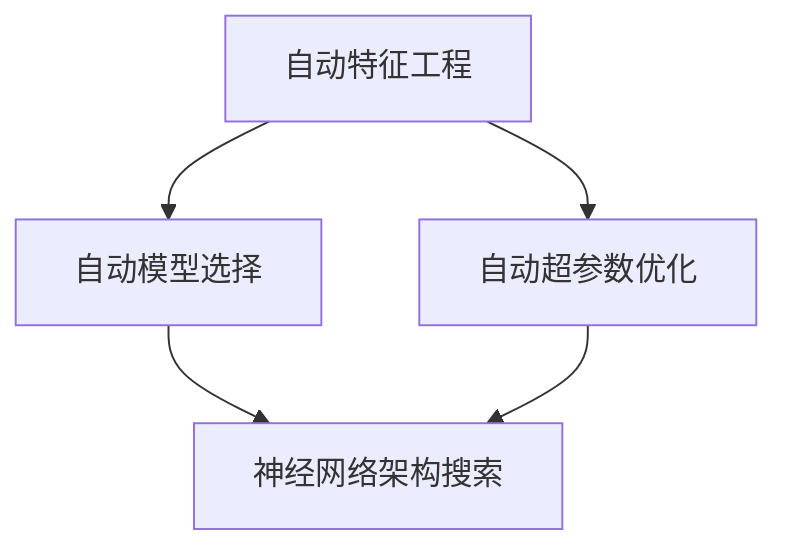
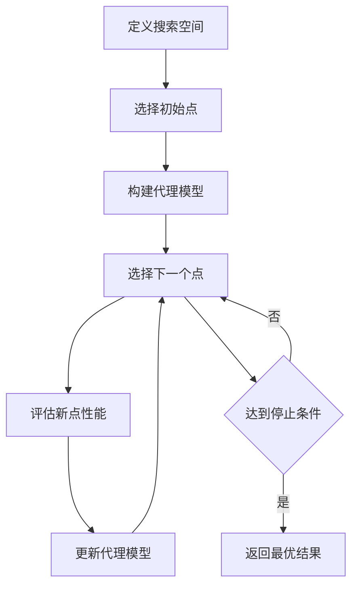

# 自动机器学习(AutoML)原理与代码实战案例讲解

## 1. 背景介绍
### 1.1 问题的由来
机器学习技术的快速发展，使得越来越多的领域开始应用机器学习来解决实际问题。然而，构建一个高质量的机器学习系统需要大量的人力、时间和专业知识。这使得许多企业和个人难以充分利用机器学习的优势。为了降低机器学习的门槛，自动机器学习(AutoML)应运而生。

AutoML旨在自动化机器学习过程中的关键步骤，如特征工程、模型选择、超参数优化等，使得非专业人士也能轻松构建高质量的机器学习模型。这极大地推动了机器学习技术的普及和应用。

### 1.2 研究现状
目前，AutoML已经成为机器学习领域的研究热点。谷歌、微软、亚马逊等科技巨头都推出了自己的AutoML平台，如Google Cloud AutoML、Microsoft Azure AutoML等。学术界也提出了许多AutoML算法和框架，如Auto-sklearn、AutoKeras、TPOT等。

这些AutoML工具和算法在图像分类、语音识别、自然语言处理等任务上取得了与人工调参相媲美的结果，证明了AutoML的有效性和实用性。但是，AutoML仍然面临着计算效率、泛化能力等挑战，需要进一步的研究和改进。

### 1.3 研究意义
AutoML的研究意义主要体现在以下几个方面：

1. 降低机器学习门槛，使更多人能够使用机器学习技术解决实际问题。
2. 提高机器学习模型开发的效率，缩短开发周期，节省人力成本。
3. 探索机器学习自动化的可能性，为实现通用人工智能(AGI)奠定基础。
4. 推动机器学习技术在各个领域的应用，促进人工智能产业的发展。

### 1.4 本文结构
本文将全面介绍AutoML的原理和实践。首先，我们将介绍AutoML的核心概念和关键技术。然后，我们将详细讲解几种主流的AutoML算法，并给出数学模型和代码实例。接着，我们将讨论AutoML在实际应用中的场景和案例。最后，我们将总结AutoML的发展趋势和面临的挑战，并给出未来的研究方向。

## 2. 核心概念与联系
AutoML的核心概念包括：

- 自动特征工程(Automated Feature Engineering)：自动从原始数据中提取和构建有效的特征。
- 自动模型选择(Automated Model Selection)：自动选择适合当前任务的机器学习模型。
- 自动超参数优化(Automated Hyperparameter Optimization)：自动搜索模型的最优超参数组合。
- 神经网络架构搜索(Neural Architecture Search)：自动设计神经网络的架构和连接方式。

这些概念之间存在着紧密的联系。自动特征工程为模型选择和超参数优化提供了良好的数据基础。模型选择和超参数优化则决定了最终模型的性能。神经网络架构搜索可看作是模型选择和超参数优化在深度学习领域的延伸。它们共同构成了AutoML的核心内容。

下图展示了AutoML的核心概念与联系：

## 3. 核心算法原理 & 具体操作步骤
### 3.1 算法原理概述
AutoML的核心算法可分为以下几类：

- 基于启发式搜索的算法：如网格搜索、随机搜索、贝叶斯优化等。
- 基于强化学习的算法：将AutoML建模为一个序列决策问题，通过强化学习来学习最优策略。
- 基于进化算法的算法：通过模拟生物进化过程来优化模型和超参数。
- 基于梯度的算法：利用梯度信息来指导神经网络架构的搜索。

这些算法各有优劣，适用于不同的场景。在实践中，往往需要根据具体问题选择合适的算法。

### 3.2 算法步骤详解
以贝叶斯优化算法为例，其具体步骤如下：

1. 定义搜索空间：确定需要优化的超参数及其取值范围。
2. 选择初始点：随机选择几个超参数组合作为初始点。
3. 构建代理模型：根据已评估的超参数组合及其性能，构建一个概率模型(通常是高斯过程)来拟合目标函数。
4. 选择下一个点：根据代理模型，选择一个最有可能改进当前最优值的超参数组合作为下一个评估点。
5. 更新代理模型：将新的评估结果加入到数据集中，更新代理模型。
6. 重复步骤4-5，直到达到预设的评估次数或时间限制。
7. 返回找到的最优超参数组合。

下图展示了贝叶斯优化的流程：

### 3.3 算法优缺点
贝叶斯优化的优点包括：

- 样本效率高，需要的评估次数少。
- 可以处理非凸、非平滑的目标函数。
- 可以加入先验知识，引导搜索过程。

其缺点包括：

- 计算复杂度高，难以应用于高维搜索空间。
- 对先验假设敏感，若先验不准确，会影响搜索效果。
- 难以处理含约束条件的优化问题。

### 3.4 算法应用领域
AutoML算法已经在多个领域得到应用，如：

- 计算机视觉：如图像分类、目标检测、语义分割等。
- 自然语言处理：如文本分类、命名实体识别、机器翻译等。
- 语音识别：如声学模型、语言模型的自动优化。
- 推荐系统：如自动特征组合、模型集成等。

此外，AutoML也被用于解决一些传统的机器学习问题，如回归、聚类、异常检测等。

## 4. 数学模型和公式 & 详细讲解 & 举例说明
### 4.1 数学模型构建
以贝叶斯优化为例，其数学模型可描述如下：

设超参数搜索空间为$\mathcal{X}$，目标函数为$f:\mathcal{X} \rightarrow \mathbb{R}$。贝叶斯优化的目标是找到$f$的全局最大值点$\mathbf{x}^*$：

$$\mathbf{x}^* = \arg\max_{\mathbf{x} \in \mathcal{X}} f(\mathbf{x})$$

由于$f$的形式未知，我们用一个概率模型$p(f)$来拟合$f$。给定一组观测数据$\mathcal{D}_t = \{(\mathbf{x}_i, y_i)\}_{i=1}^t$，其中$y_i = f(\mathbf{x}_i)$，我们可以计算后验分布$p(f|\mathcal{D}_t)$。

贝叶斯优化通过最大化一个采集函数(acquisition function)$a:\mathcal{X} \rightarrow \mathbb{R}$来选择下一个评估点：

$$\mathbf{x}_{t+1} = \arg\max_{\mathbf{x} \in \mathcal{X}} a(\mathbf{x}; p(f|\mathcal{D}_t))$$

常用的采集函数包括：

- 期望提升(Expected Improvement, EI)：$\text{EI}(\mathbf{x}) = \mathbb{E}[\max(f(\mathbf{x}) - f^*_t, 0)]$
- 上置信界(Upper Confidence Bound, UCB)：$\text{UCB}(\mathbf{x}) = \mu(\mathbf{x}) + \kappa \sigma(\mathbf{x})$
- 概率提升(Probability of Improvement, PI)：$\text{PI}(\mathbf{x}) = P(f(\mathbf{x}) > f^*_t)$

其中，$f^*_t$是当前的最优值，$\mu(\mathbf{x})$和$\sigma(\mathbf{x})$分别是后验均值和标准差。

### 4.2 公式推导过程
以EI为例，其推导过程如下：

设$f^*_t$是当前的最优值，$\Delta = f(\mathbf{x}) - f^*_t$表示改进量。EI的定义为：

$$\text{EI}(\mathbf{x}) = \mathbb{E}[\max(\Delta, 0)] = \int_{-\infty}^{\infty} \max(\delta, 0) p(\delta) d\delta$$

其中，$p(\delta)$是$\Delta$的概率密度函数。假设后验分布$p(f|\mathcal{D}_t)$是高斯分布，即$f(\mathbf{x}) \sim \mathcal{N}(\mu(\mathbf{x}), \sigma^2(\mathbf{x}))$，则$\Delta \sim \mathcal{N}(\mu(\mathbf{x}) - f^*_t, \sigma^2(\mathbf{x}))$。令$Z = \frac{\Delta}{\sigma(\mathbf{x})}$，则$Z \sim \mathcal{N}(\frac{\mu(\mathbf{x}) - f^*_t}{\sigma(\mathbf{x})}, 1)$。

将变量替换为$Z$，得到：

$$\text{EI}(\mathbf{x}) = \int_{-\infty}^{\infty} \max(\sigma(\mathbf{x})z, 0) \phi(z) dz = \sigma(\mathbf{x}) \int_{-\frac{\mu(\mathbf{x}) - f^*_t}{\sigma(\mathbf{x})}}^{\infty} z \phi(z) dz$$

其中，$\phi(z)$是标准正态分布的概率密度函数。令$u = \frac{\mu(\mathbf{x}) - f^*_t}{\sigma(\mathbf{x})}$，利用标准正态分布的性质，得到：

$$\text{EI}(\mathbf{x}) = \sigma(\mathbf{x}) [u \Phi(u) + \phi(u)]$$

其中，$\Phi(u)$是标准正态分布的累积分布函数。

### 4.3 案例分析与讲解
下面我们以一个简单的例子来说明贝叶斯优化的过程。

假设我们要优化一个只有一个超参数$x$的模型，其目标函数为$f(x) = -(x-1)^2 + 2$。我们用高斯过程来拟合$f$，并用EI作为采集函数。

初始时，我们随机选择3个点$x_1=0, x_2=1, x_3=2$，得到相应的函数值$y_1=1, y_2=2, y_3=-1$。根据这3个观测点，我们可以得到$f$的后验分布，如下图所示：

图中，黑点表示观测点，黑线表示后验均值，阴影区域表示后验方差。我们可以看到，在观测点附近，后验方差较小，而在远离观测点的地方，后验方差较大，表示不确定性高。

根据后验分布，我们可以计算EI，如下图所示：

图中，绿线表示EI。我们可以看到，EI在$x=1$附近取得最大值，这是因为该处的后验均值高，而且后验方差也较大，有较大的提升潜力。贝叶斯优化会选择$x=1.1$作为下一个评估点。

重复上述过程，不断更新后验分布和EI，直到达到停止条件。下图展示了迭代5次后的结果：

此时，后验分布已经较好地拟合了目标函数，并且找到了全局最大值点$x=1$。

### 4.4 常见问题解答
1. 问：贝叶斯优化适用于哪些类型的问题？
   答：贝叶斯优化适用于目标函数昂贵、黑盒、非凸的优化问题。它通过构建目标函数的概率模型，用较少的评估次数来找到全