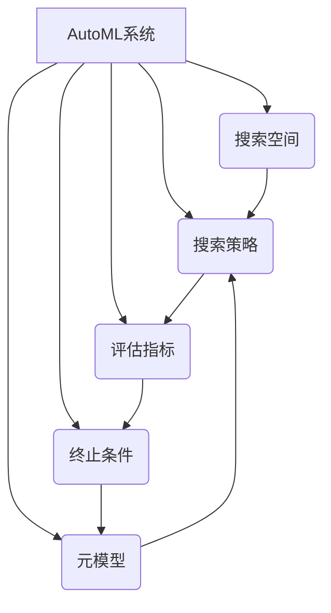
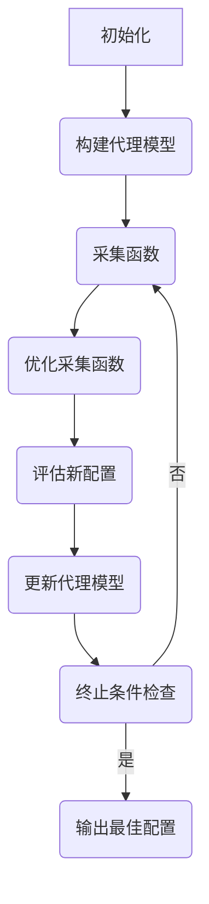

以下是标题为《自动机器学习AutoML原理与代码实战案例讲解》的技术博客文章正文内容：

# 自动机器学习AutoML原理与代码实战案例讲解

## 1. 背景介绍

### 1.1 问题的由来

在当今大数据时代,数据的爆炸式增长带来了巨大的机遇和挑战。传统的机器学习方法需要大量的人工参与,包括特征工程、模型选择、超参数调优等,这些步骤往往费时费力且需要专业知识。为了解决这一问题,自动机器学习(AutoML)应运而生。

### 1.2 研究现状 

自动机器学习的目标是使机器学习过程自动化,减少人工干预。近年来,AutoML受到了广泛关注,涌现出多种AutoML框架和算法,如谷歌的Cloud AutoML、微软的AutoML等。但目前大多数AutoML系统仍存在一些局限性,如搜索空间有限、自动化程度不够、可解释性差等。

### 1.3 研究意义

AutoML的发展有助于降低机器学习的门槛,使非专业人员也能快速构建有效的机器学习模型。同时,AutoML也可以提高机器学习工作流程的效率,加快模型的迭代优化。此外,AutoML还有望推动人工智能的民主化,使更多领域受益于机器学习技术。

### 1.4 本文结构

本文将全面介绍AutoML的核心概念、算法原理、数学模型,并通过代码实例讲解AutoML的实现细节。最后,本文还将探讨AutoML的应用场景、发展趋势和面临的挑战。

## 2. 核心概念与联系

AutoML的核心思想是将机器学习的各个环节(如数据预处理、特征工程、模型选择、超参数优化等)自动化,从而减少人工干预。AutoML框架通常包含以下几个关键组件:

1. **搜索空间(Search Space)**:定义了可供AutoML系统搜索的各种算法、模型、预处理方法和超参数的集合。

2. **搜索策略(Search Strategy)**:指导AutoML系统在搜索空间中高效探索的算法,如贝叶斯优化、进化算法、强化学习等。

3. **评估指标(Evaluation Metric)**:用于评估模型性能的指标,如准确率、F1分数、AUC等。

4. **终止条件(Termination Condition)**:确定AutoML过程何时应当停止的条件,如达到预期性能、耗尽计算资源等。

5. **元模型(Meta-Model)**:基于历史搜索结果构建的模型,用于预测新配置的潜在性能,加速搜索过程。

这些组件相互关联、互为依赖,共同构建了完整的AutoML系统。下面将对AutoML的核心算法原理和数学模型进行详细阐述。

## 3. 核心算法原理 & 具体操作步骤

### 3.1 算法原理概述

AutoML算法的核心思想是通过有效的搜索策略,在给定的搜索空间中找到性能最优的机器学习管道(包括数据预处理、特征工程、模型选择和超参数配置)。常见的AutoML算法包括:

1. **贝叶斯优化(Bayesian Optimization,BO)**:利用高效的代理模型(如高斯过程)对目标函数进行建模和优化。

2. **进化算法(Evolutionary Algorithms,EA)**:模拟生物进化过程,通过变异、交叉等操作优化解决方案。

3. **强化学习(Reinforcement Learning,RL)**:将AutoML过程建模为马尔可夫决策过程,利用强化学习算法学习优化策略。

4. **多武装行家算法(Multi-Armed Bandit,MAB)**:在探索(exploration)和利用(exploitation)之间寻求平衡,有效分配计算资源。

5. **迁移学习(Transfer Learning)**:利用先验知识(如元数据、历史结果等)加速AutoML过程。

6. **组合优化(Combinatorial Optimization)**:将AutoML问题建模为组合优化问题,并使用相应的求解算法。

这些算法各有特点,可根据具体场景和需求进行选择和组合。下面将以贝叶斯优化为例,详细阐述AutoML算法的具体操作步骤。

### 3.2 算法步骤详解

贝叶斯优化是AutoML中最常用的算法之一,其核心思想是利用代理模型(如高斯过程)对目标函数(如模型性能)进行有效建模和优化。贝叶斯优化的主要步骤如下:

1. **初始化**:从搜索空间中随机采样一些初始配置,并评估它们的性能作为先验知识。

2. **构建代理模型**:基于已观测的配置及其性能,使用高斯过程或其他代理模型对目标函数进行建模。

3. **采集函数(Acquisition Function)**:设计一个采集函数,用于权衡探索(exploration)和利用(exploitation)之间的平衡,指导下一步的搜索方向。常用的采集函数包括期望提升(Expected Improvement)、上确信bound(Upper Confidence Bound)等。

4. **优化采集函数**:通过优化采集函数,找到下一个最有希望提升性能的配置。

5. **评估新配置**:在真实环境中评估新配置的性能。

6. **更新代理模型**:将新配置及其性能纳入代理模型,重新构建代理模型。

7. **终止条件检查**:检查是否满足终止条件(如达到预期性能、耗尽计算资源等),如果满足则终止搜索,否则返回步骤3继续搜索。

8. **输出最佳配置**:输出搜索过程中找到的性能最优配置作为AutoML的最终结果。

上述算法步骤通过有效的探索和利用策略,在有限的计算资源下逐步优化机器学习管道,从而实现自动化的机器学习过程。

### 3.3 算法优缺点

贝叶斯优化算法具有以下优点:

1. **高效性**:通过有效的代理模型和采集函数,能够在较少的迭代次数内找到近似最优解。

2. **鲁棒性**:对目标函数的形式没有严格假设,适用于各种复杂的优化问题。

3. **可解释性**:代理模型能够对目标函数的形式进行建模和解释。

4. **并行化**:贝叶斯优化过程可以很好地并行化,提高计算效率。

但贝叶斯优化也存在一些缺点:

1. **冷启动问题**:初始阶段缺乏先验知识,代理模型的预测精度较低。

2. **高维问题**:在高维搜索空间中,代理模型的建模和优化会变得更加困难。

3. **局部最优陷阱**:存在落入局部最优解的风险,需要合理设计采集函数。

4. **超参数敏感性**:算法的性能受到核函数、噪声处理等超参数的影响较大。

### 3.4 算法应用领域

贝叶斯优化及其变体广泛应用于AutoML领域,包括:

1. **超参数优化**:自动搜索机器学习算法的超参数配置。

2. **神经网络架构搜索**:自动设计神经网络的拓扑结构和层次。 

3. **特征选择**:自动选择最优特征子集用于模型训练。

4. **数据预处理**:自动确定数据清洗、标准化等预处理方法。

5. **模型选择**:从多种机器学习算法中自动选择最佳模型。

6. **集成学习**:自动构建多模型集成系统,如随机森林、boosting等。

除AutoML外,贝叶斯优化也广泛应用于黑盒优化、实验设计、多目标优化等领域。

## 4. 数学模型和公式 & 详细讲解 & 举例说明

### 4.1 数学模型构建

在贝叶斯优化中,通常使用**高斯过程(Gaussian Process,GP)**作为代理模型对目标函数进行建模。高斯过程是一种非参数核方法,能够对任意连续函数进行概率建模。

给定一个观测数据集 $\mathcal{D} = \{(\mathbf{x}_i, y_i)\}_{i=1}^n$,其中 $\mathbf{x}_i \in \mathcal{X}$ 是输入向量, $y_i \in \mathbb{R}$ 是相应的目标函数值。高斯过程定义了在任意输入点 $\mathbf{x}^*$ 处的目标函数值 $y^*$ 的概率分布:

$$
y^* \sim \mathcal{GP}(m(\mathbf{x}^*), k(\mathbf{x}^*, \mathbf{x}^*))
$$

其中 $m(\mathbf{x}^*)$ 是均值函数,通常设为0; $k(\mathbf{x}^*, \mathbf{x}^*)$ 是协方差函数,也称为核函数(kernel function),用于描述输入之间的相似性。

常用的核函数包括:

- **径向基函数(Radial Basis Function,RBF)核**:

$$
k(\mathbf{x}, \mathbf{x}') = \sigma_f^2 \exp\left(-\frac{1}{2\ell^2} \|\mathbf{x} - \mathbf{x}'\|^2\right)
$$

- **马氏核(Matérn Kernel)**:

$$
k(\mathbf{x}, \mathbf{x}') = \sigma_f^2 \frac{1}{\Gamma(\nu)2^{\nu-1}}\left(\sqrt{2\nu}\frac{\|\mathbf{x} - \mathbf{x}'\|}{\ell}\right)^\nu K_\nu\left(\sqrt{2\nu}\frac{\|\mathbf{x} - \mathbf{x}'\|}{\ell}\right)
$$

其中 $\sigma_f^2$ 是信号方差, $\ell$ 是长度尺度参数, $\nu$ 是平滑度参数, $K_\nu$ 是修正的第二类贝塞尔函数。

给定观测数据 $\mathcal{D}$ 和新的输入点 $\mathbf{x}^*$,高斯过程能够预测 $y^*$ 的后验分布:

$$
y^* | \mathbf{x}^*, \mathcal{D} \sim \mathcal{N}(\mu(\mathbf{x}^*), \sigma^2(\mathbf{x}^*))
$$

其中均值和方差由以下公式给出:

$$
\begin{aligned}
\mu(\mathbf{x}^*) &= \mathbf{k}^{\top}(\mathbf{x}^*, \mathbf{X})(K + \sigma_n^2I)^{-1}\mathbf{y} \\
\sigma^2(\mathbf{x}^*) &= k(\mathbf{x}^*, \mathbf{x}^*) - \mathbf{k}^{\top}(\mathbf{x}^*, \mathbf{X})(K + \sigma_n^2I)^{-1}\mathbf{k}(\mathbf{x}^*, \mathbf{X})
\end{aligned}
$$

这里 $\mathbf{X} = [\mathbf{x}_1, \mathbf{x}_2, \dots, \mathbf{x}_n]^{\top}$ 是观测输入的矩阵, $\mathbf{y} = [y_1, y_2, \dots, y_n]^{\top}$ 是观测输出的向量, $K$ 是核矩阵,其元素为 $K_{ij} = k(\mathbf{x}_i, \mathbf{x}_j)$, $\sigma_n^2$ 是观测噪声的方差。

通过高斯过程模型,我们可以对目标函数进行概率建模,并在新的输入点处获得目标函数值的预测均值和不确定性。这为贝叶斯优化的探索和利用策略提供了理论基础。

### 4.2 公式推导过程

下面我们将推导出上述高斯过程模型的预测均值和方差的公式。

首先,根据高斯过程的定义,联合分布 $\