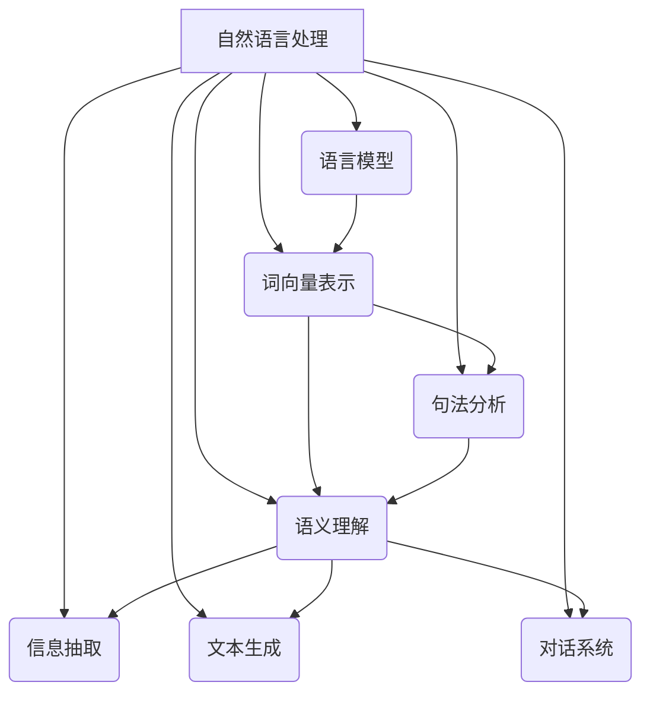

好的,我明白了您的要求。以下是题为《自然语言处理原理与代码实战案例讲解》的技术博客文章正文:

# 自然语言处理原理与代码实战案例讲解

## 1. 背景介绍

### 1.1 问题的由来

在人类与机器之间进行自然交互一直是人工智能领域的一个重要目标。自然语言处理(Natural Language Processing, NLP)作为连接人与机器的桥梁,旨在使计算机能够理解和生成人类可理解的自然语言。

随着大数据时代的到来,海量的自然语言数据如新闻、社交媒体、论坛等为NLP提供了广阔的应用空间。如何高效地从这些非结构化数据中提取有价值的信息,并将其转化为机器可以理解和处理的形式,成为NLP面临的一个关键挑战。

### 1.2 研究现状  

早期的NLP系统主要基于规则和统计模型,需要大量的人工特征工程。随着深度学习的兴起,NLP领域取得了长足的进步。诸如Word Embedding、递归神经网络、注意力机制、Transformer等技术极大地提高了NLP模型的性能。

当前,预训练语言模型(Pre-trained Language Model, PLM)如BERT、GPT等成为NLP领域的主流方法,在多项任务上取得了令人瞩目的成绩。但这些模型存在训练数据量大、推理速度慢等问题,仍有待进一步优化和改进。

### 1.3 研究意义

自然语言处理技术在信息检索、机器翻译、问答系统、智能写作辅助等领域具有广泛的应用前景。提高NLP模型的性能不仅可以增强人机交互的自然性和流畅性,还可以为企业带来更高的工作效率和商业价值。

本文将系统地介绍NLP的核心原理、关键技术和主流模型,并结合实战案例对算法细节和代码实现进行深入剖析,为读者提供NLP技术的全景式解读。

### 1.4 本文结构

本文共分为9个章节,首先介绍NLP的背景和研究现状,然后系统讲解NLP的核心概念、算法原理、数学模型和公式推导,接着通过实战案例讲解代码细节,最后分析NLP的应用场景、发展趋势和面临的挑战。

## 2. 核心概念与联系

自然语言处理是一个复杂的系统工程,涉及多个研究领域和技术模块,其核心概念之间存在着密切的联系。下面将对NLP的核心概念及其内在联系进行概述:

1. **语言模型(Language Model)**: 用于捕捉语言的统计规律,是NLP的基础模块。语言模型可分为统计语言模型和神经网络语言模型。

2. **词向量表示(Word Embedding)**: 将词映射为连续的向量表示,是深度学习在NLP中的关键技术。词向量表示能够很好地捕捉词与词之间的语义关系。

3. **句法分析(Syntactic Analysis)**: 包括词性标注、命名实体识别、依存分析等,旨在理解句子的语法结构。

4. **语义理解(Semantic Understanding)**: 包括词义消歧、语义角色标注、情感分析等,旨在捕捉自然语言的深层次语义信息。

5. **信息抽取(Information Extraction)**: 从非结构化文本中提取出结构化的知识,如实体、关系、事件等。

6. **文本生成(Text Generation)**: 根据给定的条件或上下文自动生成自然语言文本,包括机器翻译、文本摘要、对话生成等。

7. **对话系统(Dialogue System)**: 旨在实现人机自然语言交互,需要综合运用上述多个模块。

上述核心概念相互关联、相辅相成,共同构建了自然语言处理的完整技术体系。接下来将对这些概念的理论基础和实现细节进行深入探讨。

## 3. 核心算法原理与具体操作步骤

### 3.1 算法原理概述

自然语言处理中的核心算法主要包括:

1. **N-gram语言模型**: 基于n-1个历史词来预测当前词的概率模型。

2. **神经网络语言模型**: 使用神经网络来建模语言的联合概率分布,包括前馈神经网络、循环神经网络、注意力机制等。

3. **Word2Vec**: 通过神经网络模型将词映射为低维连续向量表示,包括CBOW和Skip-gram两种模型。

4. **序列标注算法**: 用于句法分析和语义理解任务,包括HMM、MEMM、CRF等。

5. **注意力机制**: 能够自适应地为序列中不同位置的词赋予不同的权重,在Seq2Seq等模型中发挥关键作用。

6. **Transformer**: 全新的基于注意力机制的序列到序列模型,是目前最先进的NLP预训练模型的核心。

7. **BERT**: 基于Transformer的双向预训练语言模型,在多项NLP任务上取得了卓越的表现。

这些算法原理贯穿了NLP的方方面面,是NLP系统的理论基石。下面将对其中最为关键的算法原理和具体实现步骤进行详细阐述。

### 3.2 算法步骤详解

#### 3.2.1 Word2Vec 

Word2Vec是一种高效的词向量表示学习方法,包含两种模型:CBOW(Continuous Bag-of-Words)和Skip-gram。

**CBOW模型步骤**:

1) 对于给定的词窗口大小,使用词袋模型获取输入词窗口中除了当前词以外的上下文词。
2) 将上下文词的词向量求和,作为输入层。
3) 使用单层前馈神经网络,将输入层映射到投影层。
4) 在投影层使用softmax计算当前词的概率分布。
5) 使用负采样或者层序softmax进行模型优化。

**Skip-gram模型步骤**:

1) 对于给定的词窗口大小,使用滑动窗口获取当前词的上下文。
2) 将当前词的词向量作为输入层。
3) 使用单层前馈神经网络,将输入层映射到投影层。
4) 在投影层使用softmax计算上下文词的概率分布。
5) 使用负采样或者层序softmax进行模型优化。

两种模型通过最大化目标函数,学习出词向量表示。CBOW模型更加高效,而Skip-gram模型则能获得更加准确的词向量表示。

#### 3.2.2 注意力机制

注意力机制能够捕捉输入序列中不同位置词对应的重要程度,对序列到序列的生成任务非常有帮助。以机器翻译任务为例,注意力机制的具体步骤如下:

1) 将源语言句子 $X=(x_1,x_2,...,x_n)$ 输入编码器,获得隐藏状态序列 $\boldsymbol{H}=(\boldsymbol{h}_1,\boldsymbol{h}_2,...,\boldsymbol{h}_n)$。
2) 在时间步 $t$,解码器获得上一时间步的输出 $y_{t-1}$ 和隐藏状态 $\boldsymbol{s}_{t-1}$,计算注意力权重:

$$\alpha_{t,i}=\frac{\exp(\operatorname{score}(\boldsymbol{s}_{t-1}, \boldsymbol{h}_i))}{\sum_{j=1}^n \exp(\operatorname{score}(\boldsymbol{s}_{t-1}, \boldsymbol{h}_j))}$$

其中, $\operatorname{score}$ 是注意力打分函数,可以是加权矩阵乘法、点积、多层感知机等。

3) 计算注意力向量作为解码器的输入:

$$\boldsymbol{c}_t=\sum_{i=1}^n \alpha_{t,i}\boldsymbol{h}_i$$

4) 解码器利用 $\boldsymbol{c}_t, y_{t-1}, \boldsymbol{s}_{t-1}$ 生成当前时间步的输出 $y_t$。
5) 重复步骤2-4,直至生成完整的目标序列。

注意力机制赋予了模型可解释性,同时大大提高了序列到序列生成任务的性能。

#### 3.2.3 Transformer

Transformer是一种全新的基于注意力机制的序列到序列模型,不再使用RNN或CNN,而是完全基于注意力机制来捕捉输入和输出序列之间的依赖关系。Transformer的编码器和解码器都由多个相同的层组成,每一层的核心组件包括:

**多头注意力(Multi-Head Attention)**

1) 对输入进行线性投影,得到查询(Query)、键(Key)和值(Value)向量。
2) 将查询与所有键计算点积注意力权重,并与值向量相乘,得到注意力输出。
3) 对多个注意力输出进行拼接,形成最终的多头注意力输出。

**前馈全连接网络(Feed-Forward Network)**

1) 对上一步的多头注意力输出进行线性变换。
2) 对线性变换的结果执行ReLU激活函数。
3) 再次执行线性变换,得到前馈网络的输出。

编码器中使用的是自注意力(Self-Attention),而解码器则使用了编码器-解码器注意力和遮掩自注意力。Transformer通过堆叠多个相同的编码器/解码器层,实现了高效的并行计算。

Transformer模型的创新之处在于完全抛弃了RNN/CNN,只依赖注意力机制来建模序列,避免了梯度消失/爆炸问题,并具有更好的并行性。这种全新的架构极大地提高了模型的性能,成为当前最先进的NLP预训练模型的核心。

### 3.3 算法优缺点

上述三种核心算法各有优缺点:

**Word2Vec**:
- 优点:训练速度快,词向量质量高,能很好地捕捉词与词之间的语义关系。
- 缺点:无法处理词序信息,对于同样上下文的不同词序会生成相同的词向量。

**注意力机制**:
- 优点:能够自适应地为序列中不同位置的词赋予不同的权重,增强了模型的表达能力。
- 缺点:注意力权重的计算成本较高,需要对每个位置的词进行打分。

**Transformer**:
- 优点:避免了RNN/CNN的梯度问题,具有更好的并行性,在长序列任务上表现优异。
- 缺点:参数量较大,对GPU资源要求高,训练代价较大。

这些算法在不同的场景下有着各自的优缺点权衡,需要根据具体任务的特点进行选择和组合。

### 3.4 算法应用领域

上述核心算法在自然语言处理的多个领域都有广泛的应用:

1. **语言模型**: N-gram模型、神经网络语言模型广泛应用于语音识别、机器翻译、文本生成等任务。
2. **词向量表示**: Word2Vec是学习词向量表示的基础技术,几乎所有的NLP深度学习模型都会使用预训练的词向量作为输入。
3. **句法分析**: 序列标注算法如HMM、CRF被广泛应用于词性标注、命名实体识别等任务。
4. **语义理解**: 注意力机制和Transformer模型在机器阅读理解、语义角色标注等语义理解任务中发挥重要作用。
5. **文本生成**: Seq2Seq模型及其变体被广泛应用于机器翻译、文本摘要、对话生成等生成式任务。
6. **预训练语言模型**: BERT等基于Transformer的预训练模型在多项NLP任务上取得了优异的表现。

总的来说,这些核心算法贯穿了NLP的方方面面,为NLP系统的构建提供了理论基础和技术支撑。

## 4. 数学模型和公式详细讲解与举例说明

### 4.1 数学模型构建

自然语言处理中常用的数学模型包括:

1. **N-gram语言模型**