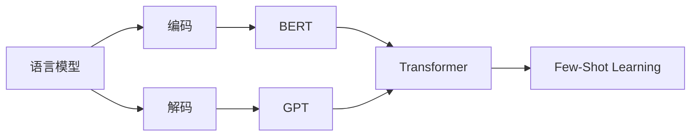

# 自然语言的解码详细过程

关键词：自然语言处理、语言模型、编码解码、Transformer、BERT、GPT、Few-Shot Learning

## 1. 背景介绍
### 1.1 问题的由来
自然语言处理(Natural Language Processing, NLP)是人工智能领域的一个重要分支,旨在让计算机能够理解、生成和处理人类语言。然而,自然语言本身具有高度的复杂性、歧义性和多样性,对计算机而言是一个巨大的挑战。如何让机器像人一样理解和运用自然语言,是NLP领域长期以来孜孜以求的目标。

### 1.2 研究现状
近年来,随着深度学习技术的蓬勃发展,尤其是Transformer架构和预训练语言模型(如BERT、GPT系列)的出现,NLP领域取得了突破性的进展。这些先进的语言模型能够从海量文本数据中学习语言的统计规律和语义信息,在许多NLP任务上取得了接近甚至超越人类的性能。

### 1.3 研究意义
揭示自然语言的解码过程,对于理解人类语言认知机制、优化NLP模型结构、提升NLP系统性能都具有重要意义。通过探索语言解码的内在机理,我们可以设计出更加高效、鲁棒的NLP算法,使计算机能够更好地理解人类语言,并应用于机器翻译、智能问答、情感分析等诸多场景,造福人类社会。

### 1.4 本文结构
本文将系统阐述自然语言的解码过程。首先介绍相关的核心概念,然后详细讲解语言解码的核心算法原理和数学模型。接着通过代码实例和应用场景加深理解。最后总结全文,并展望语言解码技术的未来发展方向。

## 2. 核心概念与联系
要理解自然语言的解码过程,首先需要了解以下几个核心概念:

- **语言模型(Language Model)**: 用于计算一个句子或词序列出现概率的概率模型。常见的语言模型有N-gram、RNN、Transformer等。
- **编码(Encoding)**: 将离散的词语映射为连续的稠密向量表示的过程,即将词语嵌入到一个高维语义空间中。
- **解码(Decoding)**: 根据编码向量生成目标语言序列的过程。通常使用基于Beam Search的启发式搜索算法。
- **注意力机制(Attention Mechanism)**: 一种动态地聚焦输入序列不同部分的技术,使模型能够更好地捕捉长距离依赖关系。
- **Transformer**: 一种基于自注意力机制的序列建模架构,摒弃了传统的RNN/CNN结构,大幅提升了并行计算效率。
- **BERT**: 基于Transformer的双向语言表征模型,通过Masked Language Model和Next Sentence Prediction两个预训练任务,学习深层的上下文语义信息。
- **GPT**: 基于Transformer Decoder的单向语言生成模型,通过自回归的生成式预训练,学习强大的语言生成能力。
- **Few-Shot Learning**: 只需要少量训练样本就能快速适应新任务的学习范式,通过预训练语言模型实现零样本/少样本学习。

这些概念之间环环相扣,共同构建了现代NLP技术的核心框架。语言模型是实现编码和解码的基础,Transformer架构是构建先进语言模型的关键,BERT和GPT则是当前最强大的两类预训练语言模型范式,Few-Shot Learning代表了语言模型应用的新范式。



## 3. 核心算法原理 & 具体操作步骤
### 3.1 算法原理概述
自然语言解码的核心是语言模型。给定源语言序列$x=(x_1,x_2,...,x_n)$,语言模型的目标是生成目标语言序列$y=(y_1,y_2,...,y_m)$,最大化条件概率$P(y|x)$:

$$\hat{y} = \mathop{\arg\max}_y P(y|x) = \mathop{\arg\max}_y \prod_{t=1}^m P(y_t|y_{<t},x)$$

其中$y_{<t}$表示$y_t$之前的所有目标词。这个公式体现了自回归生成的思想,即每个目标词的生成都依赖于之前生成的所有目标词和整个源语言序列。

### 3.2 算法步骤详解
自然语言解码通常分为以下几个步骤:

1. **编码**: 将源语言序列$x$通过编码器(如Transformer Encoder)映射为一组上下文向量$H=(h_1,h_2,...,h_n)$。

2. **解码**: 根据当前已生成的目标词$y_{<t}$和源语言编码向量$H$,通过解码器(如Transformer Decoder)生成下一个目标词$y_t$。
   
   (1) 目标词嵌入: 将$y_{<t}$映射为词嵌入向量$E=(e_1,e_2,...,e_{t-1})$。
   
   (2) 自注意力: $E$通过自注意力机制得到上下文表示$S=(s_1,s_2,...,s_{t-1})$。
   
   (3) 交叉注意力: $S$与$H$通过交叉注意力机制得到源语言上下文表示$C=(c_1,c_2,...,c_{t-1})$。
   
   (4) 前馈神经网络: $C$通过前馈神经网络得到最终的解码状态$O=(o_1,o_2,...,o_{t-1})$。
   
   (5) 输出分布: $o_{t-1}$通过Softmax层得到目标词$y_t$的概率分布$P(y_t|y_{<t},x)$。
   
3. **搜索**: 根据解码得到的概率分布序列,搜索出概率最大的目标语言序列$\hat{y}$。常用的搜索算法有Greedy Search、Beam Search等。

### 3.3 算法优缺点
基于Transformer的编码解码框架具有以下优点:

- 并行计算效率高,训练速度快。
- 通过自注意力机制,能够捕捉长距离依赖关系。
- 可以通过预训练语言模型学习通用语言知识,实现迁移学习。

但也存在一些缺点:

- 解码是一个自回归的顺序过程,难以并行化,推理速度慢。
- 搜索算法通常是贪心或启发式的,无法保证全局最优解。
- 容易受到曝光偏差(Exposure Bias)的影响,导致训练和推理性能不一致。

### 3.4 算法应用领域
基于编码解码框架的自然语言生成技术广泛应用于以下领域:

- 机器翻译: 将一种语言的文本翻译成另一种语言,如Google Translate。
- 文本摘要: 将长文本压缩成简短的摘要,提炼核心内容,如新闻摘要。
- 对话系统: 根据上下文生成恰当的对话回复,如智能客服、聊天机器人等。
- 问答系统: 根据问题生成相应的答案,如知识问答、阅读理解等。
- 写作辅助: 协助人类撰写文章、创作故事等,如GPT-3的文本续写功能。

## 4. 数学模型和公式 & 详细讲解 & 举例说明
### 4.1 数学模型构建
Transformer的编码解码过程可以用数学公式表示如下:

编码器:
$$H = \text{Encoder}(x) = \text{FFN}(\text{MultiHead}(\text{SelfAttention}(x)))$$

解码器:
$$O = \text{Decoder}(y_{<t},H) = \text{FFN}(\text{MultiHead}(\text{CrossAttention}(S,H)))$$
$$S = \text{MultiHead}(\text{SelfAttention}(E))$$
$$E = \text{Embedding}(y_{<t})$$

其中,$\text{SelfAttention}$、$\text{MultiHead}$、$\text{FFN}$分别表示自注意力、多头注意力、前馈神经网络。

### 4.2 公式推导过程
以自注意力为例,详细推导其计算公式:

$$\text{SelfAttention}(x) = \text{softmax}(\frac{QK^T}{\sqrt{d_k}})V$$

其中,$Q=xW_Q, K=xW_K, V=xW_V$分别为查询矩阵、键矩阵、值矩阵,$W_Q,W_K,W_V$为可学习的参数矩阵,$d_k$为键向量的维度。

Softmax函数用于将注意力分数归一化为概率分布:

$$\text{softmax}(z_i) = \frac{e^{z_i}}{\sum_j e^{z_j}}$$

多头注意力则是将自注意力计算多次,然后拼接:

$$\text{MultiHead}(x) = \text{Concat}(\text{head}_1,...,\text{head}_h)W_O$$
$$\text{head}_i = \text{SelfAttention}(x)$$

其中$h$为注意力头数,$W_O$为可学习的输出矩阵。

### 4.3 案例分析与讲解
下面以一个英译汉的机器翻译任务为例,说明编码解码的过程:

源语言序列: "I love natural language processing"

目标语言序列: "我 爱 自然语言 处理"

编码阶段:
1. 将源语言序列转化为词嵌入向量。
2. 通过多层Transformer Encoder块,得到最终的编码向量$H$。

解码阶段:
1. 初始目标语言序列为"<start>"。
2. 将当前目标语言序列通过词嵌入和位置编码,得到$E$。
3. $E$经过Transformer Decoder的自注意力层,得到$S$。
4. $S$与$H$通过交叉注意力层,得到源语言上下文表示$C$。
5. $C$经过前馈神经网络,得到当前解码状态$o_t$。
6. 将$o_t$通过Softmax层,得到下一个目标词的概率分布。
7. 选择概率最大的词作为生成结果,加入目标语言序列。
8. 重复步骤2-7,直到生成"<end>"符号或达到最大长度。

最终得到完整的目标语言序列: "我 爱 自然语言 处理 <end>"

### 4.4 常见问题解答
Q: Transformer为什么能够捕捉长距离依赖?

A: 传统的RNN/LSTM模型通过隐状态来传递历史信息,但是由于梯度消失的问题,难以建模长距离的依赖关系。而Transformer通过自注意力机制直接计算任意两个位置之间的相关性,无论它们的距离有多远,都能够高效地捕捉到相关信息。

Q: Beam Search和Greedy Search有什么区别?

A: Greedy Search每次都选择概率最大的单词,容易陷入局部最优。而Beam Search则同时保留Top-K个最优候选路径,最后从中选择概率最大的序列作为最终结果。因此Beam Search能够在一定程度上缓解Greedy Search的问题,得到更优的生成结果,但是计算开销也更大。

## 5. 项目实践：代码实例和详细解释说明
### 5.1 开发环境搭建
本项目使用PyTorch实现Transformer模型,需要安装以下依赖库:
- python 3.x
- pytorch 1.x
- numpy
- nltk

可以通过以下命令安装:
```bash
pip install torch numpy nltk
```

### 5.2 源代码详细实现
下面是Transformer编码器的PyTorch实现:

```python
import torch
import torch.nn as nn

class TransformerEncoder(nn.Module):
    def __init__(self, d_model, nhead, num_layers, dim_feedforward, dropout=0.1):
        super(TransformerEncoder, self).__init__()
        encoder_layer = nn.TransformerEncoderLayer(d_model, nhead, dim_feedforward, dropout)
        self.encoder = nn.TransformerEncoder(encoder_layer, num_layers)
        
    def forward(self, src):
        src = src.permute(1, 0, 2)  # (N,S,E) -> (S,N,E)
        memory = self.encoder(src)
        memory = memory.permute(1, 0, 2)  # (S,N,E) -> (N,S,E)
        return memory
```

解码器的实现:

```python
class TransformerDecoder(nn.Module):
    def __init__(self, d_model, nhead, num_layers, dim_feedforwar