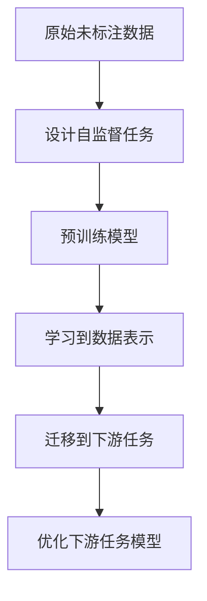

以下是根据您的要求撰写的技术博客文章《自监督学习原理与代码实战案例讲解》:

# 自监督学习原理与代码实战案例讲解

## 1. 背景介绍

### 1.1 问题的由来

在过去几年中,深度学习取得了令人瞩目的成就,但其发展仍然面临着一些挑战。其中一个主要挑战是需要大量高质量的标注数据集来有效训练深度神经网络模型。然而,为大规模数据集人工标注是一项昂贵且耗时的过程,这在很大程度上限制了深度学习在某些领域的应用。

### 1.2 研究现状  

为了解决这一问题,研究人员提出了自监督学习(Self-Supervised Learning)范式。自监督学习旨在利用原始未标注数据本身的信息,通过设计合理的自监督任务,使神经网络能够从中学习到有价值的表示,进而将这些表示迁移到下游任务中,提高模型的性能。与监督学习和非监督学习相比,自监督学习不需要人工标注的数据,也不需要对数据做任何假设,因此具有更强的通用性和可扩展性。

### 1.3 研究意义

自监督学习为深度学习模型提供了一种新的训练范式,可以充分利用大量未标注数据的潜力,减轻了对人工标注数据的依赖。这不仅可以降低数据标注的成本,而且还能扩大深度学习在各个领域的应用范围。此外,自监督学习还能够捕捉数据中更加丰富和通用的表示,为下游任务提供更好的迁移学习能力。

### 1.4 本文结构

本文将全面介绍自监督学习的原理、核心算法、数学模型、代码实现和应用场景。首先,我们将探讨自监督学习的核心概念和基本思想。接着,详细阐述自监督学习的主要算法原理和具体操作步骤。然后,我们将构建数学模型并推导相关公式,辅以案例分析加深理解。此外,还将提供完整的代码实现以及运行结果展示。最后,我们将讨论自监督学习在实际应用中的场景,并分享学习资源和开发工具,总结未来发展趋势和面临的挑战。

## 2. 核心概念与联系

自监督学习的核心思想是利用原始未标注数据本身的某些属性或结构,设计合理的自监督任务,使神经网络能够从中学习到有价值的表示。这些表示可以作为初始化权重,用于辅助下游任务的训练,提高模型的性能。

自监督学习的基本流程如下所示:

其中,设计自监督任务是自监督学习的关键。常见的自监督任务包括:

1. **重建任务**: 通过重建原始输入数据或其一部分,使模型学习到输入数据的有效表示。
2. **对比学习任务**: 通过判断两个样本是否来自同一个数据实例,使模型学习到区分相似和不相似样本的能力。
3. **表示学习任务**: 直接学习数据的潜在表示,而不需要重建或对比。

自监督学习与监督学习和非监督学习之间存在密切联系。监督学习依赖人工标注的数据进行训练,而自监督学习则利用未标注数据自动生成监督信号。非监督学习则完全不需要任何监督信号,仅从数据本身学习模式和结构。自监督学习可以看作是介于监督学习和非监督学习之间的一种半监督学习范式。

## 3. 核心算法原理 & 具体操作步骤

### 3.1 算法原理概述

自监督学习的核心算法原理是通过设计合理的自监督任务,使神经网络能够从原始未标注数据中学习到有价值的表示。这些表示可以作为初始化权重,用于辅助下游任务的训练,提高模型的性能。

常见的自监督学习算法包括:

1. **自编码器(AutoEncoder)**: 通过重建输入数据,使模型学习到输入数据的有效表示。
2. **对比学习(Contrastive Learning)**: 通过判断两个样本是否来自同一个数据实例,使模型学习到区分相似和不相似样本的能力。
3. **掩码语言模型(Masked Language Model)**: 通过预测被掩码的单词或token,使模型学习到上下文语义表示。

这些算法都遵循自监督学习的基本思想,但具体实现方式有所不同。下面将详细介绍其中一种常用的自监督学习算法:对比学习。

### 3.2 算法步骤详解

对比学习算法的主要思想是通过判断两个样本是否来自同一个数据实例,使模型学习到区分相似和不相似样本的能力。具体步骤如下:

1. **数据增强**: 对原始数据进行一系列随机增强操作(如裁剪、旋转、噪声添加等),生成两个不同的增强视图。
2. **编码器**: 将增强后的视图输入到编码器(通常是神经网络)中,得到对应的表示向量。
3. **对比损失计算**: 计算两个表示向量之间的相似度,与一个动态生成的对比样本集合中其他样本的表示向量进行对比,构建对比损失函数。
4. **模型优化**: 使用对比损失函数对编码器模型进行优化,使得来自同一个实例的两个增强视图的表示向量相似度更高,而来自不同实例的表示向量相似度更低。

通过上述步骤,编码器模型可以学习到能够区分相似和不相似样本的有效表示,这些表示可以用于辅助下游任务的训练。

### 3.3 算法优缺点

对比学习算法的优点包括:

1. 无需人工标注的数据,可以充分利用大量未标注数据的潜力。
2. 学习到的表示具有很强的泛化能力,可以迁移到各种下游任务中。
3. 算法思路简单直观,易于理解和实现。

但同时也存在一些缺点:

1. 对比损失函数的计算复杂度较高,需要与大量负样本进行对比。
2. 对于高维数据(如图像),增强操作的设计可能会影响表示的质量。
3. 算法的性能依赖于对比样本集合的构建质量。

### 3.4 算法应用领域

对比学习算法可以应用于各种类型的数据,如图像、文本、音频等。目前,它在计算机视觉领域的应用最为广泛,如图像分类、目标检测、语义分割等任务。此外,对比学习也被成功应用于自然语言处理、语音识别等领域。

## 4. 数学模型和公式 & 详细讲解 & 举例说明

### 4.1 数学模型构建

对比学习算法的核心是通过最大化正样本对的相似度,最小化正样本与负样本之间的相似度,从而学习到能够区分相似和不相似样本的表示。为了实现这一目标,我们需要构建一个合适的数学模型和损失函数。

假设我们有一个编码器模型 $f_\theta$,它将输入样本 $x$ 映射到表示向量 $z=f_\theta(x)$。我们的目标是使得来自同一个实例的两个增强视图 $x_i$ 和 $x_j$ 的表示向量 $z_i$ 和 $z_j$ 尽可能相似,而来自不同实例的表示向量则尽可能不相似。

为了量化这一目标,我们定义相似度函数 $\text{sim}(z_i, z_j)$,它可以是向量点积、余弦相似度等。我们希望最大化正样本对的相似度,最小化正样本与负样本之间的相似度差异。具体来说,我们构建如下对比损失函数:

$$\mathcal{L}_i = -\log \frac{\exp(\text{sim}(z_i, z_j) / \tau)}{\sum_{k=1}^{2N} \mathbb{1}_{[k \neq i]} \exp(\text{sim}(z_i, z_k) / \tau)}$$

其中 $\tau$ 是一个温度超参数,用于调节相似度的尺度;$N$ 是批量大小;$\mathbb{1}_{[k \neq i]}$ 是指示函数,用于排除对自身的比较。

损失函数的分子项表示正样本对的相似度得分,分母项是所有其他样本(包括正样本和负样本)的相似度得分之和。通过最小化这个损失函数,我们可以使得正样本对的相似度得分相对于其他样本更大,从而达到我们的目标。

### 4.2 公式推导过程

对比损失函数的推导过程如下:

首先,我们定义一个相似度分数 $s_{i,j}$,它表示样本 $i$ 和样本 $j$ 之间的相似度:

$$s_{i,j} = \exp(\text{sim}(z_i, z_j) / \tau)$$

其中 $\tau$ 是温度超参数,用于调节相似度的尺度。

我们的目标是最大化正样本对的相似度分数,相对于所有其他样本对(包括正样本和负样本)的相似度分数之和。具体来说,对于样本 $i$,我们希望最大化如下比值:

$$\frac{s_{i,j}}{\sum_{k=1}^{2N} s_{i,k}}$$

其中分子项 $s_{i,j}$ 是正样本对的相似度分数,分母项是所有样本对的相似度分数之和。注意,我们排除了 $s_{i,i}$,因为它没有实际意义。

为了方便优化,我们对上式取对数,得到:

$$\log \frac{s_{i,j}}{\sum_{k=1}^{2N} s_{i,k}} = \log s_{i,j} - \log \sum_{k=1}^{2N} s_{i,k}$$

进一步展开,我们得到:

$$\log \frac{s_{i,j}}{\sum_{k=1}^{2N} s_{i,k}} = \frac{\text{sim}(z_i, z_j)}{\tau} - \log \sum_{k=1}^{2N} \exp(\text{sim}(z_i, z_k) / \tau)$$

我们希望最大化这个比值,等价于最小化它的相反数,因此我们构建如下对比损失函数:

$$\mathcal{L}_i = -\log \frac{s_{i,j}}{\sum_{k=1}^{2N} s_{i,k}} = -\frac{\text{sim}(z_i, z_j)}{\tau} + \log \sum_{k=1}^{2N} \exp(\text{sim}(z_i, z_k) / \tau)$$

通过最小化这个损失函数,我们可以使得正样本对的相似度得分相对于其他样本更大,从而达到我们的目标。

### 4.3 案例分析与讲解

为了更好地理解对比学习算法,我们来分析一个具体的案例。假设我们有一个图像数据集,其中包含不同类别的图像,如狗、猫、汽车等。我们的目标是使用对比学习算法,从这些图像中学习到能够区分不同类别的表示。

首先,我们对原始图像进行数据增强,生成两个不同的增强视图。例如,我们可以对图像进行随机裁剪、旋转、噪声添加等操作。然后,我们将这两个增强视图输入到编码器模型中,得到对应的表示向量 $z_i$ 和 $z_j$。

接下来,我们计算这两个表示向量之间的相似度 $\text{sim}(z_i, z_j)$,并将其与一个动态生成的对比样本集合中其他样本的表示向量进行对比,构建对比损失函数。对比样本集合可以包含来自同一类别和不同类别的其他图像样本。

通过最小化对比损失函数,我们可以使得来自同一个实例(即同一类别图像)的两个增强视图的表示向量相似度更高,而来自不同实例(不同类别图像)的表示向量相似度更低。这样,编码器模型就能够学习到能够区分不同类别图像的有效表示。

例如,如果我